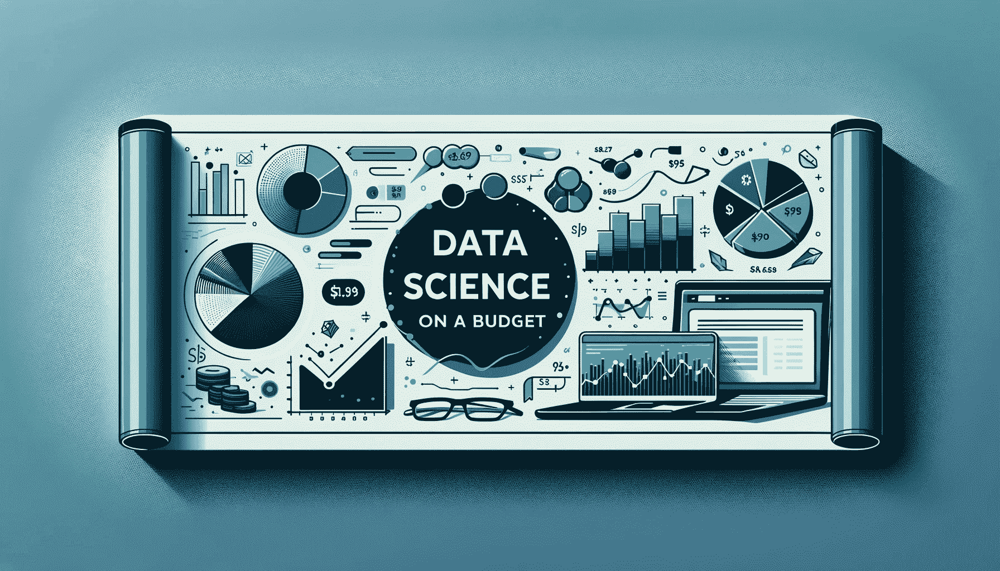

# 预算内学习数据科学

> 原文：[`www.kdnuggets.com/learn-data-science-on-a-budget`](https://www.kdnuggets.com/learn-data-science-on-a-budget)

图片由 DALLE 提供

找到合适的平台或课程从来不是一件容易的事。这需要很多试错，最糟糕的是当你为这些课程付费时。你会觉得自己一直在寻找最佳课程来提升职业生涯，但最后却回到起点 - 你的钱包也受到了伤害（有时一点，有时很多）。

* * *

## 我们的前三大课程推荐

 1\. [谷歌网络安全证书](https://www.kdnuggets.com/google-cybersecurity) - 快速进入网络安全职业生涯。

 2\. [谷歌数据分析专业证书](https://www.kdnuggets.com/google-data-analytics) - 提升你的数据分析技能

 3\. [谷歌 IT 支持专业证书](https://www.kdnuggets.com/google-itsupport) - 支持你组织的 IT 工作

* * *

这就是为什么我决定撰写这篇文章，让你可以从我的错误中学习，并以预算内的方式获得所有的数据科学知识！

# 理解数据科学

链接：[理解数据科学](https://www.datacamp.com/courses/understanding-data-science)

让我们从 DataCamp 开始 - 这是一个提供各种课程的在线学习平台。他们的《理解数据科学》课程专为希望涉足数据科学世界的初学者设计。而且你也不用担心是否有编程经验 - 因为不需要！

这是一个 2 小时的课程，包括 15 个学习视频和 48 个练习题！分为 4 个部分，第一部分“数据科学简介”是免费的，其余 3 个部分需要你获取[会员资格](https://www.datacamp.com/pricing?period=yearly)。会员价格合理，通过它你可以访问 DataCamp 的完整内容库，方便你在学习额外课程时使用。

# 从零开始的数据科学

链接：[从零开始的数据科学](https://oreillymedia.pxf.io/4PjRn3)

这是针对那些喜欢用书本作为学习方法的书虫们。在《从零开始的数据科学》这本书中，你将学习数据科学的学科内容，例如库、框架、模块和工具包。还会了解算法的工作原理以及如何从头开始实现它们。

如果你正在寻找 Python 的速成课程，想要学习数据科学的基础，深入了解机器学习的基本原理，并进一步探索 - 这本书就是为你准备的。

# 概率论简介

链接：[概率论简介](https://pll.harvard.edu/course/introduction-probability-edx)

一门为期 10 周的免费课程来自哈佛！虽然有很多在线训练营课程，但概率有时会被忽略。然而，它对于理解数据科学基础至关重要。学习概率可以让你从‘良好的’数据科学家成长为‘专家’数据科学家。

在这门课程中，你将学习不确定性和随机性、做出准确预测、常见概率分布等内容。课程是免费的，但你可以为 209 美元添加一个认证证书。

# Python in a Nutshell

链接：[Python in a Nutshell](https://oreillymedia.pxf.io/c/359203/1814910/15173)

Python 已经被评为最受欢迎的编程语言之一——这有其原因。它简单的语法使得人们能够轻松过渡到数据科学的世界。对数据专业人士的需求很大，Python 语言无疑开辟了道路。

这本第四版《Python in a Nutshell》书包含了 26 章内容，可以带你从 Python 完全新手成为绝对专家！从在 Python 中表示数据到调试——这本书应有尽有！

# 数据分析与 Python

链接：[数据分析与 Python](https://www.freecodecamp.org/learn/data-analysis-with-python/)

Freecodecamp.org 最初是一个希望让学习对每个人都可及的组织——这就是它名字的由来。如果你在寻找一门全面的课程，那么这门数据分析与 Python 课程强烈推荐。数据科学世界发生了很多变化，尤其是 Python、SQL 等等。

在这门课程中，你将学习成为数据科学家的绝对基础，从读取自己的数据到使用库分析数据和创建数据可视化。

# 总结

通过这 5 门课程/平台，你将能够从对数据科学一无所知到完善简历，申请你的第一份数据科学职位。数据科学仍然是一个非常受欢迎的角色，现在开始再好不过了！

****[Nisha Arya](https://www.linkedin.com/in/nisha-arya-ahmed/)**** 是一名数据科学家、自由撰稿人、编辑及 KDnuggets 的社区经理。她特别关注提供数据科学职业建议、教程以及基于理论的数据科学知识。Nisha 涵盖了广泛的话题，并希望探索人工智能如何能促进人类寿命的不同方式。作为一个热衷学习者，Nisha 旨在拓宽自己的技术知识和写作技能，同时帮助他人。

### 更多相关主题

+   [如何在预算内设置你的数据科学工具栈](https://www.kdnuggets.com/2022/01/data-science-stack-budget.html)

+   [停止学习数据科学，寻找目的，然后再…](https://www.kdnuggets.com/2021/12/stop-learning-data-science-find-purpose.html)

+   [5 个数据科学项目来学习 5 项关键的数据科学技能](https://www.kdnuggets.com/2022/03/5-data-science-projects-learn-5-critical-data-science-skills.html)

+   [KDnuggets 新闻，5 月 4 日：9 门免费哈佛课程学习数据…](https://www.kdnuggets.com/2022/n18.html)

+   [最佳数据科学资源、训练营和课程](https://www.kdnuggets.com/2023/12/springboard-best-data-science-resources-bootcamp-courses-learn-data-science-new-year)

+   [学习数据分析和数据科学的最佳免费资源](https://www.kdnuggets.com/2024/03/365datascience-best-free-resources-learn-data-analysis-data-science)
