# 学习如何免费使用 ChatGPT Next Web (NextChat)

> 原文：[`www.kdnuggets.com/learn-how-to-use-chatgpt-next-web-nextchat-for-free`](https://www.kdnuggets.com/learn-how-to-use-chatgpt-next-web-nextchat-for-free)

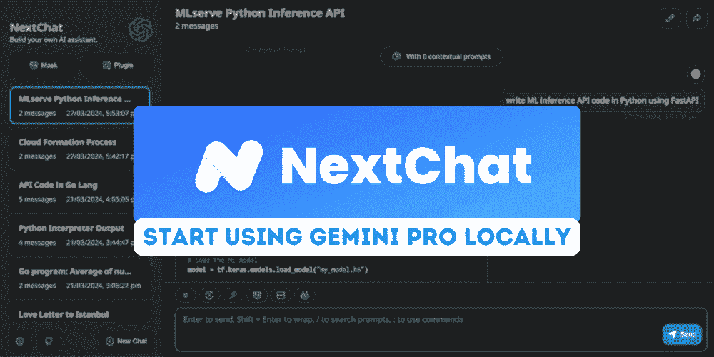

作者提供的图片

ChatGPT Next Web，现在称为 NextChat，是一个聊天机器人应用，允许用户访问来自 OpenAI 和 Google AI 的先进 AI 模型。该应用程序轻量且功能丰富，提升了用户体验。

* * *

## 我们的前 3 个课程推荐

 1\. [Google 网络安全证书](https://www.kdnuggets.com/google-cybersecurity) - 快速开启网络安全职业生涯。

 2\. [Google 数据分析专业证书](https://www.kdnuggets.com/google-data-analytics) - 提升您的数据分析技能

 3\. [Google IT 支持专业证书](https://www.kdnuggets.com/google-itsupport) - 支持您的组织 IT 工作

* * *

在本教程中，我们将学习如何免费获取 Google AI API，并使用 ChatGPT Next Web 生成响应。此外，我们还将学习如何在 Windows 11 上本地使用它。最后，我们将在不到一分钟的时间内将自己的网页应用部署到 Vercel。

# 1\. 获取免费的 Google AI API

要获取 Google AI API 密钥，我们需要访问 [`ai.google.dev/`](https://www.google.com/url?q=https://ai.google.dev/&sa=D&source=editors&ust=1711739031984064&usg=AOvVaw2AAf3PGuhltqw4s8O3o5Rz) 然后点击蓝色按钮“获取 API 密钥 Google AI Studio”。

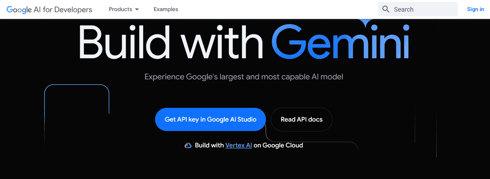

如果您已登录 Google 帐户，将会被引导至 Google AI Studio。在那里，点击左侧面板上的“获取 API 密钥”按钮，然后选择“创建 API 密钥”以生成 API 密钥。

此密钥将用于在官方网页应用、本地以及我们部署的应用中生成响应。

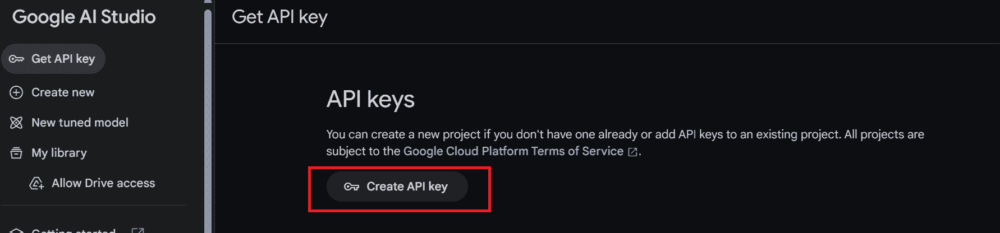

# 2\. 官方网页应用

要访问官方 ChatGPT Next Web，请访问 [`app.nextchat.dev/`](https://www.google.com/url?q=https://app.nextchat.dev/&sa=D&source=editors&ust=1711739031984712&usg=AOvVaw0QFzvmqH2m040VZ7Qzz6_a)。它会要求我们提供 API 密钥，通过访问身份验证页面完成。

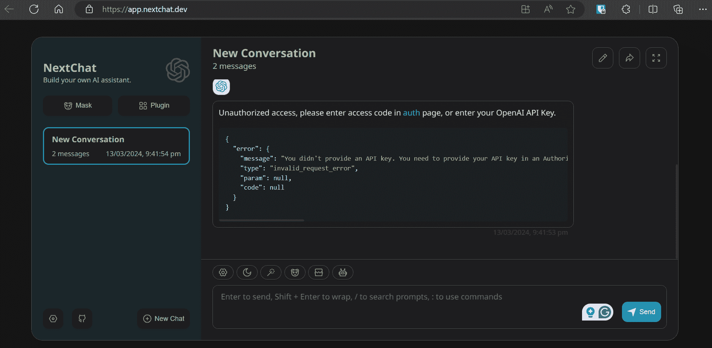

访问身份验证页面，地址为 [`app.nextchat.dev/#/auth`](https://www.google.com/url?q=https://app.nextchat.dev/%23/auth&sa=D&source=editors&ust=1711739031985057&usg=AOvVaw00GCpa52u3gR40puhzGMHx)，在第三个文本框中输入新创建的 Google AI API 密钥，然后点击“确认”按钮。

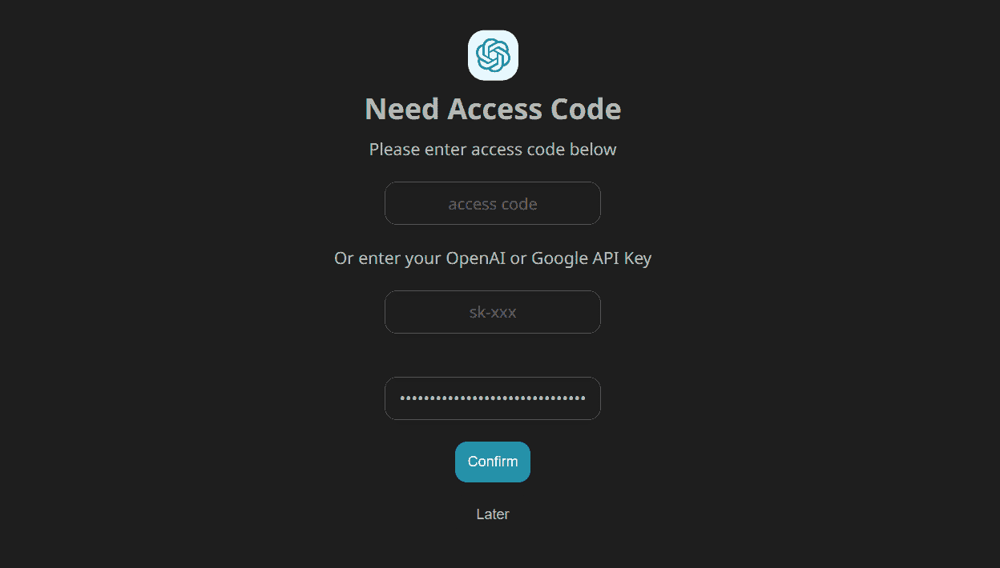

点击消息框上方的机器人（🤖），选择“gemini-pro”模型。

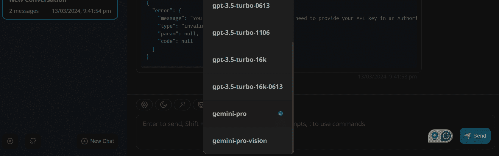

在消息框中输入提示，几秒钟内它将开始生成响应。使用起来既快速又有趣。

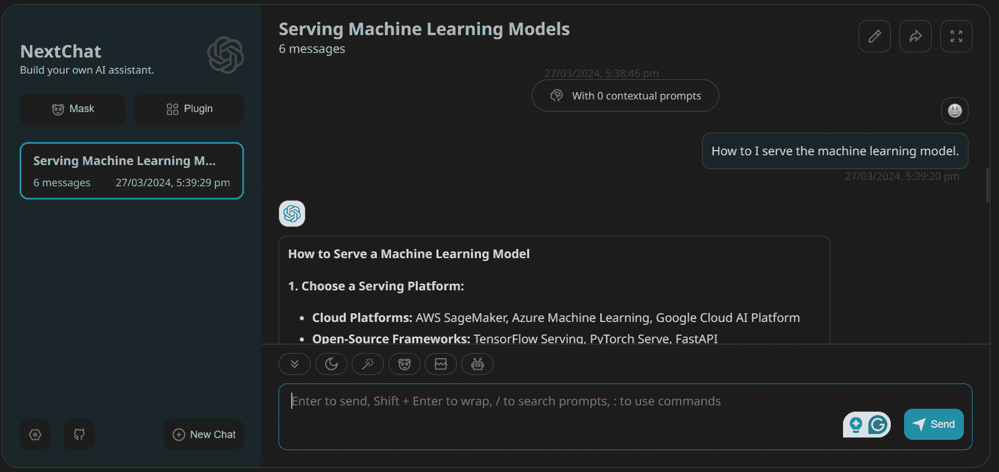

# 3\. 本地 Windows 应用程序

让我们继续在你的笔记本电脑上安装 ChatGPT Next Web。这款应用程序兼容 Linux、Windows 和 MacOS。

在我们的例子中，我们将访问以下链接：[`github.com/ChatGPTNextWeb/ChatGPT-Next-Web/releases`](https://www.google.com/url?q=https://github.com/ChatGPTNextWeb/ChatGPT-Next-Web/releases&sa=D&source=editors&ust=1711739031985689&usg=AOvVaw3fyR-Xg_SOPpE_W0KCE2rc)，点击 `.exe` 文件。这将下载应用程序安装文件。下载完成后，使用默认设置安装应用程序并启动它。

Windows 应用程序没有身份验证页面。因此，要设置 Google AI API，我们需要进入设置并向下滚动找到“模型提供者”部分。从那里，我们应该选择正确的模型提供者并提供 API 密钥，如下所示。

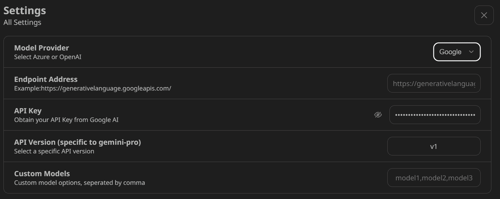

之后，选择“gemini-pro”模型并开始使用应用程序。

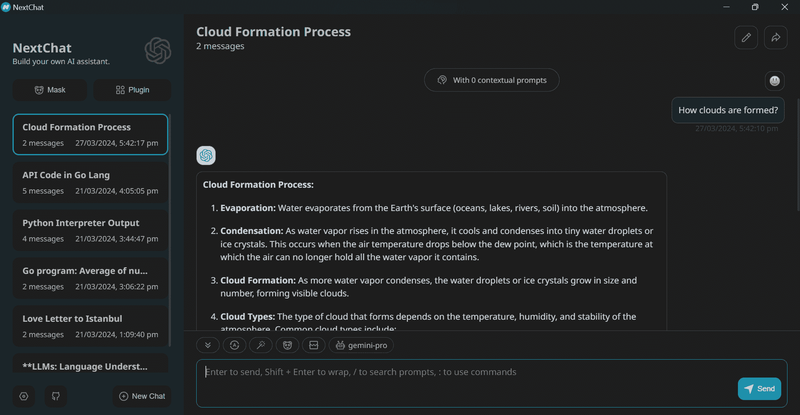

# 4\. 一键部署你的网页应用程序

在最后一部分，我们将学习如何在 Vercel 上部署我们自己的网页应用程序。为此，我们需要访问官方 GitHub 仓库，[ChatGPTNextWeb/ChatGPT-Next-Web](https://www.google.com/url?q=https://github.com/ChatGPTNextWeb/ChatGPT-Next-Web?tab%3Dreadme-ov-file&sa=D&source=editors&ust=1711739031986439&usg=AOvVaw0h0NhjybPQbIoHc3E5Q7Q3)，并点击“部署”按钮。

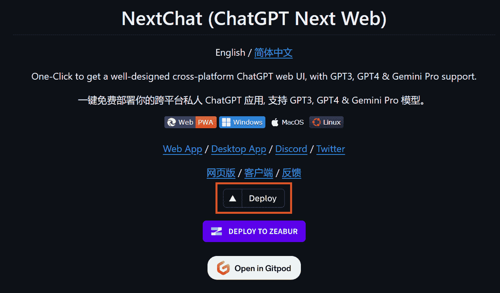

点击链接后，你将被导向一个新标签页。在这里，你需要注册 Vercel 并登录你的 GitHub 账户以创建一个新的仓库。按照简单的指示操作，点击部署按钮，然后等待过程完成。

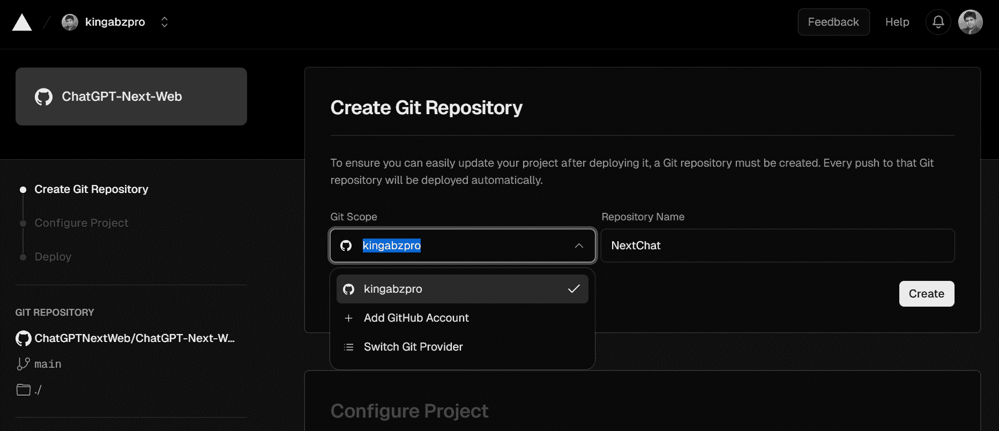

几分钟后，部署将完成，你将收到你网页应用程序的 URL。

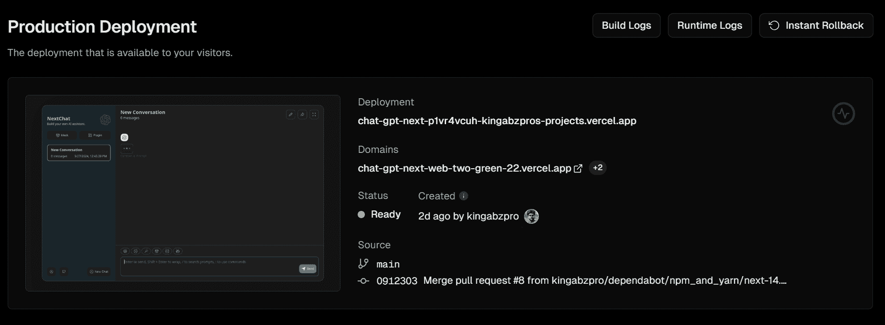

要访问 Vercel 部署的网络应用程序，请访问 [`chat-gpt-next-web-two-green-22.vercel.app/`](https://www.google.com/url?q=https://chat-gpt-next-web-two-green-22.vercel.app/&sa=D&source=editors&ust=1711739031987002&usg=AOvVaw36iEEren8XsHawgbJSQTJN)。我发现 NextChat 比 Bard 或 ChatGPT 更加流畅。

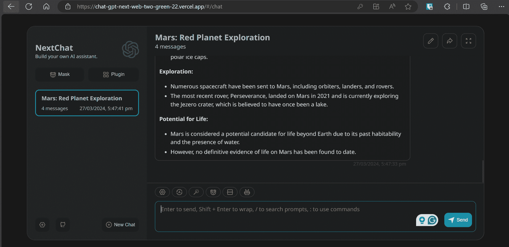

# 最终想法

我已经使用 ChatGPT Next Web 一段时间了，配有 OpenAI API 密钥。虽然这是一个付费 API，但我的月使用费用仅为约 $0.3。与其花 $20 购买 ChatGPT Pro，我可以以更低的成本访问顶级模型，并且用户界面更好。如果你使用 Gemini Pro，效果更佳，因为它对所有人都是免费的。

如果你仍然对使用这个应用程序感到不确定，跟随我的指南，使用一周时间探索其各种功能。我相信你会像我一样改变看法。

****[Abid Ali Awan](https://www.polywork.com/kingabzpro)**** ([@1abidaliawan](https://www.linkedin.com/in/1abidaliawan)) 是一位认证的数据科学专业人士，热衷于构建机器学习模型。目前，他专注于内容创作，撰写关于机器学习和数据科学技术的技术博客。Abid 拥有技术管理硕士学位和电信工程学士学位。他的愿景是利用图神经网络为面临心理问题的学生构建一款 AI 产品。

### 主题更多内容

+   [认识 MetaGPT：将文本转换为…的 ChatGPT 驱动的 AI 助手](https://www.kdnuggets.com/meet-metagpt-the-chatgptpowered-ai-assistant-that-turns-text-into-web-apps)

+   [学习如何使用 ChatGPT 学习 Python（或其他任何东西）](https://www.kdnuggets.com/2023/02/learn-python-chatgpt.html)

+   [免费 ChatGPT 课程：使用 OpenAI API 编写 5 个项目](https://www.kdnuggets.com/2023/05/free-chatgpt-course-openai-api-code-5-projects.html)

+   [学习 ChatGPT 的顶级免费资源](https://www.kdnuggets.com/2023/02/top-free-resources-learn-chatgpt.html)

+   [Visual ChatGPT：微软将 ChatGPT 和 VFM 结合起来](https://www.kdnuggets.com/2023/03/visual-chatgpt-microsoft-combine-chatgpt-vfms.html)

+   [ChatGPT CLI：将你的命令行界面转变为 ChatGPT](https://www.kdnuggets.com/2023/07/chatgpt-cli-transform-commandline-interface-chatgpt.html)
