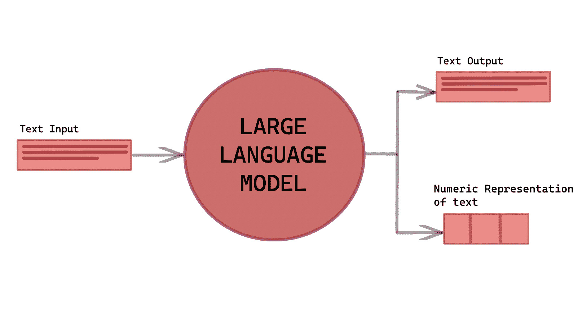

# 了解大型语言模型

> 原文：[`www.kdnuggets.com/2023/03/learn-large-language-models.html`](https://www.kdnuggets.com/2023/03/learn-large-language-models.html)

作者提供的图片

随着 ChatGPT 和 Google Bard 的发布，越来越多的人开始谈论大型语言模型。这是新的趋势，大家都想了解更多。

* * *

## 我们的前 3 名课程推荐

 1\. [谷歌网络安全证书](https://www.kdnuggets.com/google-cybersecurity) - 快速进入网络安全职业。

 2\. [谷歌数据分析专业证书](https://www.kdnuggets.com/google-data-analytics) - 提升你的数据分析技能

 3\. [谷歌 IT 支持专业证书](https://www.kdnuggets.com/google-itsupport) - 支持你的组织进行 IT 管理

* * *

语言是我们日常生活中的重要元素。它是我们学习世界、成功职业、塑造未来的方式。它存在于新闻、网页、法律、消息服务等各个方面。它是我们与人连接和沟通的方式。

现在，随着技术的快速发展，越来越多的公司正在寻找新的方法来提升计算机学习和处理语言的能力。这得益于人工智能（AI）在语言处理技术方面的最新突破。

这些语言处理技术使公司能够构建对语言有更好理解的智能系统。这些技术基于大型预训练的 Transformer 语言模型或大型语言模型——它们具有更广泛的能力和对语言的理解，以及这些模型处理文本的需求。

# 什么是大型语言模型？

查看 AI 应用程序，如 ChatGPT 和 Google Bard——它们能够总结文章、帮助你写故事/漫画，并进行长时间类似人类的对话。它们能够做很多事情，这都归功于内嵌的大型语言模型。

大型语言模型（LLM）是一种深度学习算法，能够读取、识别、总结、翻译、预测以及生成文本。它们的预测未来单词和构造句子的能力使它们能够学习人类的说话和写作方式，并进行对话——就像人类一样！

大型语言模型是 Transformer 模型的一种，它们是目前 Transformer 模型最成功的应用之一。

## **Transformer 模型**

Transformer 模型是神经网络，能够学习上下文并追踪序列数据中的关系，例如句子中的单词。Transformer 模型使用称为注意力或自注意力的数学技术。这些技术用于检测

Transformer 模型使用称为注意力或自注意力的数学技术。注意力是当 Transformer 模型关注另一序列的不同部分，而自注意力是当 Transformer 模型关注同一输入序列的不同部分。

Transformer 模型能够实时翻译文本和语音，并适应由不同群体组成的会议，包括听障参与者。

# 大型语言模型如何工作？

要创建一个表现良好的 LLM，你需要大量的数据。从其名称中的“Large”可以看出这一点。

以 ChatGPT 为例，该模型需要足够的数据来理解你所询问的一切。它会收集互联网上的所有数据和文本，经过长时间的积累，使其能够为用户生成准确和有效的输出。

该算法使用无监督学习，模型在未标记的数据上学习，通过推断隐藏结构来生成准确可靠的输出。通过这种机器学习技术，LLM 学习词汇、句子的构造以及词与词之间的关系。这有助于 LLM 更好地了解语言、上下文、语法和语言的语调。

通过这种方式，LLM 可以利用这些知识来预测和生成内容。

其他技术可以应用于 LLM，以用于特定任务。例如，模型可以针对英国历史进行微调，将重点放在英国历史的少量数据上，并为特定应用进行训练。

# 大型语言模型被应用在哪些领域？

我们最近见证了 LLM 在 AI 应用中的成功，如 GPT。越来越多的人将寻求发掘新机会，并在代码生成、医疗保健、机器人技术等领域与 LLM 创新。

当前 LLM 的一些应用包括：

+   客户服务：例如韩国最受欢迎的 AI 语音助手 GiGA Genie

+   金融：例如 Applica 使用虚拟助手

+   搜索引擎：例如 Google AI Bard

+   生命科学研究：例如 NVIDIA BioNeMo

# 总结

我知道你们中的许多人已经听说、看到，甚至使用过 ChatGPT 或 Google Bard。了解这些 AI 应用如何执行这些任务是很有意义的。我希望这能为你提供一个关于大型语言模型（LLMs）的良好介绍。

如果你想了解更多关于 ChatGPT 的信息，可以阅读这些：

+   ChatGPT: 你需要知道的一切

+   ChatGPT 入门

+   ChatGPT 作为 Python 编程助手

+   ChatGPT 快速参考表

+   学习 ChatGPT 的顶级免费资源

**[Nisha Arya](https://www.linkedin.com/in/nisha-arya-ahmed/)** 是一位数据科学家、自由技术作家以及 KDnuggets 的社区经理。她特别关注提供数据科学职业建议或教程，以及有关数据科学的理论知识。她还希望探索人工智能如何或能够促进人类寿命的不同方式。她是一个热衷学习者，寻求扩展自己的技术知识和写作技能，同时帮助指导他人。

### 更多相关话题

+   [顶级开源大型语言模型](https://www.kdnuggets.com/2022/09/john-snow-top-open-source-large-language-models.html)

+   [介绍 John Snow Labs 的医疗特定大型语言模型](https://www.kdnuggets.com/2023/04/john-snow-introducing-healthcare-specific-large-language-models-john-snow-labs.html)

+   [大型语言模型是什么，它们如何运作？](https://www.kdnuggets.com/2023/05/large-language-models-work.html)

+   [人工智能：大型语言与视觉模型](https://www.kdnuggets.com/2023/06/ai-large-language-visual-models.html)

+   [更多关于大型语言模型的免费课程](https://www.kdnuggets.com/2023/06/free-courses-large-language-models.html)

+   [介绍 TPU v4：谷歌前沿超级计算机用于大型…](https://www.kdnuggets.com/2023/04/introducing-tpu-v4-googles-cutting-edge-supercomputer-large-language-models.html)
