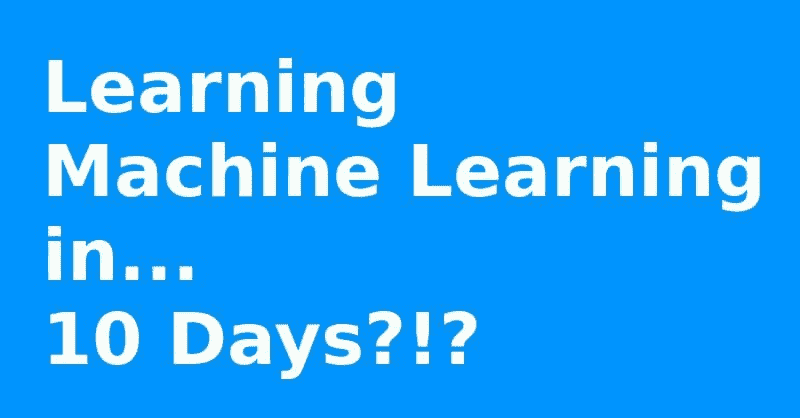

# 如何在 10 天内学习机器学习

> 原文：[`www.kdnuggets.com/2017/05/learn-machine-learning-10-days.html`](https://www.kdnuggets.com/2017/05/learn-machine-learning-10-days.html)
> 
> **编辑注：** 这个突出的回答来自于作者 Sebastian Raschka 在 [2016 年 10 月的 Quora 会话](https://www.quora.com/session/Sebastian-Raschka-1/1) 中提出的问题。如果你还没有完整查看这个会话，我建议你考虑去看看。

10 天？嗯，这确实是一个具有挑战性的任务 :)。不过，我认为 10 天也是一个可以对机器学习领域有一个相当不错的概览的时间框架，也许可以开始将一些技术应用到你的问题中。

在阅读了 3 个不同子领域的介绍（监督学习、无监督学习和强化学习）后，我可能会花时间研究这些领域中具有代表性的简单（但有用的）算法（也许将强化学习留到后面）。例如，用于回归分析的简单线性回归和岭回归，用于分类的逻辑回归和 k 最近邻，以及用于聚类任务的 k-means 和层次聚类。一旦你理解了每种算法的目标及其解决特定问题的方法，增加更多算法和方法到你的技能库中是相对容易的。

然而，除了算法之外，了解如何准备数据（特征选择、转换和压缩）以及如何评估模型也很重要。作为入门者，你可以查看我们在 SciPy 2016 上的《scikit-learn 机器学习教程》。它大约需要 6 小时，并总结了大部分基础知识，同时介绍了 scikit-learn 库，这对于实现和进一步学习非常有用：

如果你有兴趣了解算法背后的数学原理，Andrew Ng 的 Coursera 课程 [机器学习 - 斯坦福大学 | Coursera](https://www.coursera.org/learn/machine-learning)（以及 [我的书](https://www.amazon.com/Python-Machine-Learning-Sebastian-Raschka/dp/1783555130)）提供了温和的介绍，但我意识到这可能超出了 10 天的范围 :).

[原始来源](https://www.quora.com/How-do-I-learn-Machine-Learning-in-10-days)。经许可转载。

**相关内容：**

+   应对初学者机器学习/数据科学家压力的技巧

+   掌握 Python 机器学习的 7 个步骤

+   掌握 Python 机器学习的 7 个步骤

* * *

## 我们的三大课程推荐

 1\. [谷歌网络安全证书](https://www.kdnuggets.com/google-cybersecurity) - 快速进入网络安全职业道路。

 2\. [谷歌数据分析专业证书](https://www.kdnuggets.com/google-data-analytics) - 提升你的数据分析技能

 3\. [谷歌 IT 支持专业证书](https://www.kdnuggets.com/google-itsupport) - 支持你所在的组织的 IT

* * *

### 更多相关内容

+   [停止学习数据科学以寻找目标，并找到目标以…](https://www.kdnuggets.com/2021/12/stop-learning-data-science-find-purpose.html)

+   [学习数据科学统计的顶级资源](https://www.kdnuggets.com/2021/12/springboard-top-resources-learn-data-science-statistics.html)

+   [9 亿美元的 AI 失败，详细分析](https://www.kdnuggets.com/2021/12/9b-ai-failure-examined.html)

+   [建立一个稳固的数据团队](https://www.kdnuggets.com/2021/12/build-solid-data-team.html)

+   [使用管道编写干净的 Python 代码](https://www.kdnuggets.com/2021/12/write-clean-python-code-pipes.html)

+   [成功数据科学家的 5 个特征](https://www.kdnuggets.com/2021/12/5-characteristics-successful-data-scientist.html)
