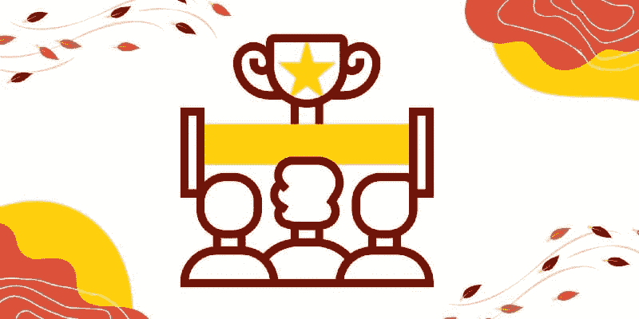
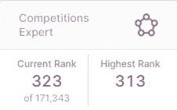
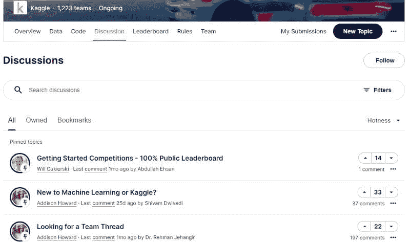
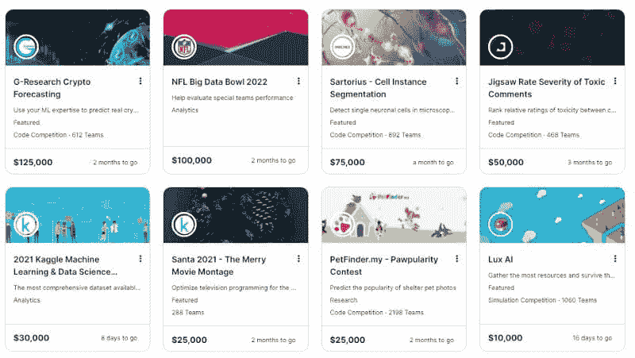
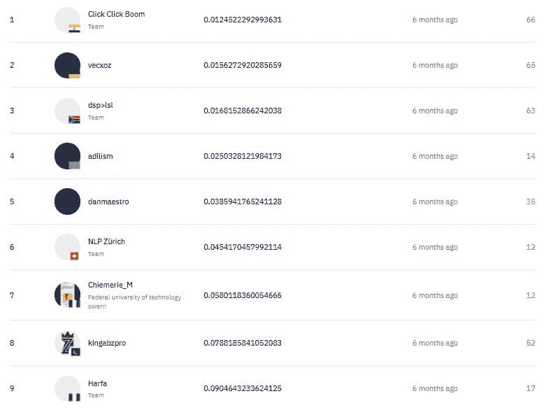
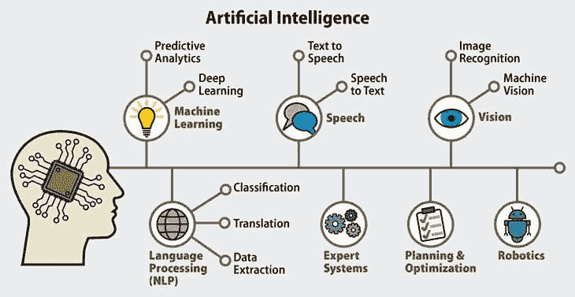

# 通过参与比赛，使机器学习速度提高 4 倍

> 原文：[`www.kdnuggets.com/2022/01/learn-machine-learning-4x-faster-participating-competitions.html`](https://www.kdnuggets.com/2022/01/learn-machine-learning-4x-faster-participating-competitions.html)

图片由作者提供

## 介绍

你陷入了学习新工具、新编程语言和数学的循环中。简而言之，你的职业进展停滞不前。这是学习机器学习（ML）最慢的方式，我们需要参加多个课程，学习数学，做样本项目，最终申请工作。这将花费你超过一年时间，最终你会失去兴趣。

* * *

## 我们的前三大课程推荐

 1\. [Google 网络安全证书](https://www.kdnuggets.com/google-cybersecurity) - 快速进入网络安全职业生涯。

 2\. [Google 数据分析专业证书](https://www.kdnuggets.com/google-data-analytics) - 提升你的数据分析技能

 3\. [Google IT 支持专业证书](https://www.kdnuggets.com/google-itsupport) - 支持你的组织的 IT

* * *

有一种更好的学习机器学习（ML）的方法，就是理解基础知识后立即投入解决机器学习挑战。在这篇博客中，我将向你展示如何通过参与比赛来学习机器学习中的多个领域（NLP、计算机视觉、ASR、RL、GAN）。

图片由作者提供 | [Kaggle](https://www.kaggle.com/kingabzpro)

## 竞争平台

在学习了基础知识之后，我参与了 DrivenData 的 [Reboot: Box-Plots for Education](https://www.drivendata.org/competitions/46/box-plots-for-education-reboot/) 挑战，这让我学会了数据处理、使用逻辑回归以及如何创建 SKlearn 管道。提交我的第一个解决方案花了我 12 天时间，此后我将所有精力投入到提高模型性能指标中，这帮助我在全球排名第 7。我的第二个比赛是在 [Natural Language Processing with Disaster Tweets | Kaggle](https://www.kaggle.com/c/nlp-getting-started) 上，信任我，我在文本分类方面做得很差，但我投入了时间和精力学习不同的技术。在第二次比赛之后，我为能够学习多个领域而欣喜若狂，因此我开始参与 [Zindi](https://zindi.africa/) 和其他竞争平台。

**高度声誉的平台**

+   [Kaggle](https://kaggle.com/)

+   [DrivenData](https://www.drivendata.org/)

+   [AIcrowd](https://aicrowd.com/)

+   [Zindi](https://zindi.africa/)

**即将推出的平台**

+   [Analytics Vidhya](https://datahack.analyticsvidhya.com/contest/all/)

+   [DataCamp](https://app.datacamp.com/learn/competitions)

**如果你还不确定从哪里开始，可以看看** [**ML Contests**](https://mlcontests.com/)**。**

## 协作学习

所有的竞争平台都有讨论区，参与者可以在这里分享问题并一起寻找解决方案。这也意味着有 3000+个团队参与解决同一个问题。协作学习还帮助你理解哪些方法对特定问题有效。你还能够跟上新趋势，并且最终，这将为你未来作为机器学习工程师的工作做好准备。

图片来源：[Kaggle](https://www.kaggle.com/c/nlp-getting-started/discussion)

你也可以作为一个四人团队参与并分担工作量。团队合作还为你准备了真实场景中的工作，其中任务将在数据团队成员之间分配。大多数人会问为什么不能通过谷歌解决方案，但在我看来，与队友讨论并找到解决方案是一种有效的解决问题的方法。

作为团队参与也有助于你培养良好的沟通技巧，这在远程项目工作中至关重要。如果你对机器学习不熟悉，你的队友也可以帮助你学习新工具和技能。

## 排行榜和奖品

排行榜、排名、奖牌和奖金是你参与的完美激励因素。这种竞争环境也帮助你突破界限，激励你努力工作以进入前十。当我开始在[AI4D Baamtu Datamation — WOLOF 语音识别 — Zindi](https://zindi.africa/competitions/ai4d-baamtu-datamation-automatic-speech-recognition-in-wolof)上工作时，我完全不知道如何处理音频或如何在 GPU 上训练模型，但经过 2 个月通过博客、YouTube 和 GitHub 项目学习，我成功达到了第一名。这让我意识到我可以学习任何东西。在此之后，我获得了足够的自信去尝试新事物并学习更多工具。如果我跟随[ASR](https://maelfabien.github.io/machinelearning/speech_reco/)的在线课程，可能需要四个月的时间来学习，再加上四个月才能熟练掌握。

说实话，你只需多一点努力就能赢得几千美元，那么为什么不在学习新的机器学习领域时赚些钱呢？为了激励你，我分享了 Kaggle 竞赛的奖金池。

[Kaggle 竞赛](https://www.kaggle.com/competitions)

我的建议是从小做起，持续努力以达到顶级。达到顶级将教会你课程或教程中学不到的重要经验。

图片来自 [Zindi](https://zindi.africa/competitions/ai4d-baamtu-datamation-automatic-speech-recognition-in-wolof/leaderboard)

## 多个领域

从在线课程学习或获得大学学位不会教你有关各种机器学习问题的知识，有时你甚至没有处理非结构化数据（如音频、视频或文本）的技能。你可以通过参加多个专业化课程来学习，这可能需要一年以上的时间，或者你可以参与不同领域的各种竞赛。

参与挑战帮助我理解了之前从未知道的问题以及如何避免模型偏差。这也激励我追求在生产环境中从事机器学习的职业，这与基于研究的项目有所不同。

**机器学习包括：**

+   [计算机视觉](https://www.ibm.com/topics/computer-vision)

+   [音频](https://towardsdatascience.com/how-to-apply-machine-learning-and-deep-learning-methods-to-audio-analysis-615e286fcbbc?gi=6e76aecfa621)

+   [自然语言处理](https://www.ibm.com/cloud/learn/natural-language-processing)

+   [强化学习](https://en.wikipedia.org/wiki/Reinforcement_learning)

+   [时间序列](https://medium.com/analytics-vidhya/time-series-prediction-with-machine-learning-getting-started-8763eda1127f)

+   [表格数据（回归 / 分类）](https://towardsdatascience.com/introduction-to-machine-learning-algorithms-linear-regression-14c4e325882a)

+   [生成学习](https://machinelearningmastery.com/what-are-generative-adversarial-networks-gans/)

图片来源 [magora-systems](https://magora-systems.com/artificial-intelligence-vs-machine-learning-vs-deep-learning/)

这些领域有许多子领域，想要了解关于 AI 和各种技术的所有知识是很困难的，所以最好参与那些解决组织或公司当前问题的竞赛。你将有机会处理生产级数据，并学习各种数据处理技术。

如果你想要更聪明的学习子领域的方法，那么可以同时参与多个竞赛，不要仅限于 Kaggle，探索你最喜欢的其他平台上的竞赛。

## 结论

通过参与竞赛，我们将学会如何在机器学习项目中进行合作，掌握解决未知问题的最先进技术，并了解 ML 领域中的各种领域。除了学习，你还可以获得认可、荣誉和奖金。

参与竞赛不需要计算能力、数据集、IDE（环境）或知识。Kaggle 提供了一切，我们可以通过查看其他人的解决方案或在论坛上提问来学习未知领域。唯一阻止你更快学习的因素是你的舒适区和缺乏意识。我见过许多初学者在 Kaggle 上开始，现在他们在 NVIDIA、阿里巴巴、H2O 和亚马逊等大公司工作。

在这篇博客中，我们讨论了通过竞赛学习的重要性以及它如何为你准备职业生涯。希望你喜欢这篇文章。

> **“曾经有一段时间，我在多个平台上参与了 10 个竞赛，那段时间是我一生中最快乐的日子，因为我是一名终身学习者。”**

**[Abid Ali Awan](https://www.polywork.com/kingabzpro)** ([@1abidaliawan](https://twitter.com/1abidaliawan)) 是一位认证的数据科学专业人士，热衷于构建机器学习模型。目前，他专注于内容创作和撰写关于机器学习和数据科学技术的技术博客。Abid 拥有技术管理硕士学位和电信工程学士学位。他的愿景是利用图神经网络为挣扎于心理疾病的学生构建一个 AI 产品。

### 更多相关话题

+   [Kaggle 竞赛对现实世界问题有用吗？](https://www.kdnuggets.com/are-kaggle-competitions-useful-for-real-world-problems)

+   [5 个适合有抱负的数据科学家的免费竞赛](https://www.kdnuggets.com/5-free-competitions-for-aspiring-data-scientists)

+   [使用 AI 和分析引擎更快地准备时间序列数据](https://www.kdnuggets.com/2021/12/piexchange-faster-way-prepare-timeseries-data-ai-analytics-engine.html)

+   [oBERT：复合稀疏化提供更快、更准确的 NLP 模型](https://www.kdnuggets.com/2022/05/obert-compound-sparsification-delivers-faster-accurate-models-nlp.html)

+   [通过 DataCamp 的分析师接管更快地实现数据驱动](https://www.kdnuggets.com/2022/10/datacamp-data-driven-faster-analyst-takeover.html)

+   [如何优化 SQL 查询以加快数据检索速度](https://www.kdnuggets.com/2023/06/optimize-sql-queries-faster-data-retrieval.html)
