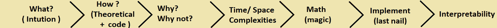

# 有效学习机器学习算法的诀窍

> 原文：[`www.kdnuggets.com/2020/11/learn-machine-learning-algorithms-effectively.html`](https://www.kdnuggets.com/2020/11/learn-machine-learning-algorithms-effectively.html)

评论

**[Shareef Shaik](https://www.linkedin.com/in/shareef-shaik-22738310b?lipi=urn%3Ali%3Apage%3Amessaging_thread%3Baa9EdXg7SzOQFeTKwXAnYw%3D%3D)，有志数据科学家**

照片由 [Doran Erickson](https://unsplash.com/@doran_erickson?utm_source=medium&utm_medium=referral) 提供，来源于 [Unsplash](https://unsplash.com/?utm_source=medium&utm_medium=referral)

### 背景：

**几**天前，我的一个朋友笑着对我说：“**你学习机器学习怎么这么慢？不过是几个模型，我一周就学会了**。”这就是他的话。我只是对他微笑，询问他学到了什么。他告诉我了一些[机器学习算法](https://www.kdnuggets.com/2016/08/10-algorithms-machine-learning-engineers.html)的名字。我问他具体学到了什么，他给出的明显回答是使用 Sklearn 的拟合和预测方法，以及对算法如何工作的简要概述。

带着邪魅的笑容，我问他，他会怎么做才能得到最佳参数？模型如何学习最佳权重？当我们有低延迟要求时，我们该怎么办？虽然这些问题并不复杂，但他只是静静地坐在那里看着我的脸，我笑到了最后。

> 从这个故事中得到的启示是，机器学习远远超出了简单的拟合和预测方法。

我们中的大多数人只是看了几个 YouTube 视频，就声称自己懂机器学习，却很快意识到自己的错误。对于所有自学的人，**记住，有成千上万像你我一样学习机器学习/数据科学的人**。要记住，我们将与那些拥有数据科学相关领域硕士/博士学位的人竞争。为了与他们竞争，我们需要在基础知识上**真正扎实**。

> 随着机器学习的热潮，新的课程每天不断涌现，目前的课程数量多于实际的工作岗位。面对如此庞大的资源，选择合适的课程成为了一个难题。

说实话，大多数这些课程都是平庸的，没有深入涵盖。虽然有一些好的课程，但每个课程提供的课程内容都不同。一些课程深入讲解数学部分，一些则在编码部分表现出色等等。因此，今天我不会特别提到任何课程。我将分享我遵循的方法，并建议给故事中的那位朋友。我相信这也会对你的数据科学之旅有所帮助。

### 介绍：

在我们深入了解算法部分之前，让我告诉你我们在机器学习项目中具体使用算法的位置。完成一个机器学习项目涉及多个阶段，每个阶段都同样重要。

机器学习项目的关键阶段

**建模**是机器学习算法发挥作用的阶段，它只是 ML 生命周期中的一个重要阶段。

好的，我们来深入探讨机器学习算法的主题。

> 对于每种算法，我们需要了解一些重要的事项。

学习 ML 算法的流程

### 1\. 算法背后的直观理解

起初，我学习一种算法后，过一段时间就会忘记，每次复习时都会觉得难以理解。我逐渐意识到，人们如果仅通过理论学习东西是很难记住的，而通过可视化学习则更容易长期记住。这就是几何帮助我们以最简单的方式可视化算法核心的地方。如果我们能找到一些有趣的现实生活中的例子，我们对算法的理解会更深入。

> 一旦你从任何你选择的课程中学习完一种算法，打开一个新标签页，开始搜索该算法的直观解释。相信我，互联网上有很多很酷的解释。初学者可以从 Quora 和 Medium 开始。

### 2\. 算法是如何工作的？

一旦你对算法有了直观认识，就可以动手尝试，观察算法是如何实际工作的。你还需要检查算法在不同类型数据（如文本、分类数据、数值）上的表现。

在这一阶段，尝试多个因素，观察算法的表现，你可以参考 Scikit-Learn 中现成的算法。检查算法的参数，尝试调整它们，看看这些调整对模型性能的影响。

### 3\. 算法的应用场景 / 不适用的场景

这是大多数人常常忽视的最重要因素，他们通常更多关注算法的“什么”和“怎么做”。理解算法的“为什么有效”或“为什么无效”对于深入了解算法至关重要。

> 尝试在大数据集、高维数据上实验并理解算法的表现。如果算法容易受到异常值或不平衡数据集的影响。

在面试中，最难回答的问题不是“什么”和“怎么做”，而是**为什么**。假设明天你在学习算法后做了一个个人项目，并且使用了某个特定的 X 算法来解决它，面试官很可能会问**为什么选择 X 算法而不是 Y 算法？** 假如你以准确度作为理由，那么接下来最难的问题就是**你为什么认为它比其他算法更有效。**

> **哦，天哪！这就是为什么你应该了解它在哪里有效，在哪里无效。**

例如，你需要给出这样的回答：由于我们的数据是高维的且具有非线性特征，算法 X 在处理非线性数据时往往比算法 Y 表现更好，原因如下。

### 4\. 为什么算法的可解释性很重要

这是一个关键步骤，之所以重要，是因为作为数据科学家，你可能需要向完全没有技术知识的客户展示模型。在此过程中，你可能需要说服他们相信你的模型能够预测正确的结果，并提供一些充分的理由说明他们应该采用它。你不能仅仅抛出准确率。如果你的算法是可解释的，那么你可以向他们展示模型预测结果的原因。可解释性意味着算法的特征重要性。

例如：如果你正在做一个医疗保健项目，其中你的模型预测一个人的疾病是阳性还是阴性。这是一个非常敏感的问题，他们无法承受错误，这时可解释性就显得非常重要。如果你的模型展示了预测结果的原因（例如某个特征（身体中的某些水平）大于 x 值），这将使得解释变得更容易，更有意义。

### 5\. 为什么要了解算法的时间/空间复杂度？

当我们在实时工作时，可能需要处理大量数据，如果有低延迟的需求，这时时间和空间复杂度可以帮助你选择合适的算法。

如果你的模型占用更多内存，那么实时运行它可能会非常昂贵，特别是如果你使用的是云基础设施来运行模型。有时候，一些业务问题需要低延迟，而一些算法虽然提供了良好的准确性，但由于时间/空间复杂度的限制，无法满足这一需求。

维基百科是获取每个算法相关信息的绝佳资源。

### 6\. 为什么我们需要理解算法背后的数学原理？

数学？是的，我明白。我们可以通过从 Scikit Learn 中导入算法而无需理解数学原理，但我告诉你，这在长期来看并不推荐。无论我们是否接受这一点，我们确实需要数学来更好地理解背后的实际情况。这可能会让一些人失望，但好消息是，我们无法避免数学，但可以简化它，避免复杂的数学。

> 简单来说，大多数机器学习算法的工作是最小化实际输出和预测输出之间的差异（损失）。
> 
> algorithm=最小化（损失）+ 正则化项

例如，我们应该为逻辑回归最小化对数损失，为 SVM 最小化铰链损失等。

> 注意：这并非适用于每一个机器学习算法，这只对一些算法有效。

为了最小化这种损失，这些算法内部使用了优化技术，如梯度下降及其其他变种，这涉及一些数学知识。所以如果你对数学不太擅长，可以尝试理解每个算法的损失函数及其梯度下降，这样你可以避免其他复杂的数学问题，保持目标不变。一旦你对这些内容感到舒适，就可以深入学习更多的数学知识。

### 7\. 为什么从零实现它（可选）：

如果你在学习吉他，你会先从基础开始，然后慢慢尝试复制他人已经创作的音乐。在这个过程中，如果你理解了他们如何创作音乐和调音，那么下一步就是创作自己的音乐，对吧？

同样地，我们可以通过从头实现现有算法来更清楚地理解它们。你将学到一些重要的要点，这可以帮助你将来构建更好的模型。只要记住，由于一些问题，我们可能无法在项目中始终使用 Scikit-learn 的算法版本。在这种情况下，你需要准备好优化或修改算法以满足你的需求。

这比说起来容易，达到这一点需要花费大量时间，这也是我将其标记为可选的原因。至少尝试实现一个算法以了解它是如何工作的。如果你发现编码困难，将算法分解成几个部分，先写伪代码，然后再尝试转换成实际代码。

**《Python 机器学习》**由**塞巴斯蒂安·拉施卡**编写，是一本非常好的书，可以指导你从零开始开发算法。

### 结论：

不要急于求成，花时间以最好的方式学习，而不是半途而废，每次都回来参考。记住，目标不是完美，而是扎实的基础，相信我，我们永远无法做到完美，目标始终是每天进步。如果你能理解算法的要点，并了解算法如何运作，那么从长远来看你一定会感谢自己。

在这个过程中，如果你不理解某些内容或遇到困难，把它搁置一旁，继续学习其他主题。不要只是固守不放，浪费宝贵的时间。稍后带着清新的思维再回来检查，相信我，你会感到惊讶。如果你仍然无法理解某些内容，可以寻找其他解释得更简单的资源。

> 最后一部，应用你所有的学习到多个不同数据类型和大小的数据集上，以获得真正的学习，实践是关键。你将通过实践学到比单纯阅读更多的东西，所以要准备好动手操作。

如果你读到这里，你肯定有学习机器学习的热情，这是学习任何技能最重要的因素。继续学习，不要放弃。

如果你有任何建议或疑问，可以在评论中告诉我，或者通过我的 [Linkedin](https://www.linkedin.com/in/shareef-shaik-22738310b/) 联系我。

快乐编码！下次见！！

**简介: [Shareef Shaik](https://www.linkedin.com/in/shareef-shaik-22738310b?lipi=urn%3Ali%3Apage%3Amessaging_thread%3Baa9EdXg7SzOQFeTKwXAnYw%3D%3D)** (**[Medium](https://medium.com/@shareefshaik1375)**) 是一名有志的数据科学家，热衷于利用 AI 解决实际问题。

[原始](https://towardsdatascience.com/know-how-to-learn-machine-learning-algorithms-effectively-81766fe442e0)。经许可转载。

**相关内容:**

+   如何在面试中解释关键的机器学习算法

+   了解雇主对 2020 年数据科学家角色的期望

+   如何获得最受欢迎的数据科学技能

* * *

## 我们的前 3 个课程推荐

 1\. [谷歌网络安全证书](https://www.kdnuggets.com/google-cybersecurity) - 快速进入网络安全职业轨道。

 2\. [谷歌数据分析专业证书](https://www.kdnuggets.com/google-data-analytics) - 提升你的数据分析技能

 3\. [谷歌 IT 支持专业证书](https://www.kdnuggets.com/google-itsupport) - 支持你所在的组织的 IT

* * *

### 更多相关话题

+   [如何有效使用 Pandas GroupBy](https://www.kdnuggets.com/2023/01/effectively-pandas-groupby.html)

+   [数据分析：四种数据分析方法及如何…](https://www.kdnuggets.com/2023/04/data-analytics-four-approaches-analyzing-data-effectively.html)

+   [数据可视化：有效呈现复杂信息](https://www.kdnuggets.com/data-visualization-presenting-complex-information-effectively)

+   [如何有效使用 Docker 标签来管理镜像版本](https://www.kdnuggets.com/how-to-use-docker-tags-to-manage-image-versions-effectively)

+   [机器学习中使用的主要监督学习算法](https://www.kdnuggets.com/2022/06/primary-supervised-learning-algorithms-used-machine-learning.html)

+   [KDnuggets 新闻，6 月 22 日：主要监督学习算法…](https://www.kdnuggets.com/2022/n25.html)
