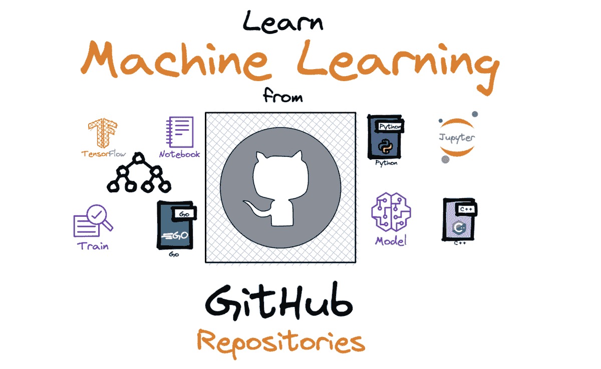

# 从这些 GitHub 仓库中学习机器学习

> 原文：[`www.kdnuggets.com/2023/01/learn-machine-learning-github-repositories.html`](https://www.kdnuggets.com/2023/01/learn-machine-learning-github-repositories.html)

作者提供的图片

如果你还没有机会查看从这些 GitHub 仓库中学习数据科学，请查阅一下。你可能会发现一些提到的 GitHub 仓库对你的机器学习之旅很有用。

* * *

## 我们的三大课程推荐

 1\. [谷歌网络安全证书](https://www.kdnuggets.com/google-cybersecurity) - 快速进入网络安全职业生涯。

 2\. [谷歌数据分析专业证书](https://www.kdnuggets.com/google-data-analytics) - 提升你的数据分析技能

 3\. [谷歌 IT 支持专业证书](https://www.kdnuggets.com/google-itsupport) - 支持你的组织的 IT 工作

* * *

深入了解数据科学将有助于你的机器学习职业发展。当你在新的一年中努力实现机器学习目标时，可能会被不断出现的在线课程和训练营所吸引。选择正确的课程可能很困难，而且当你不断选择错误的课程时，成本也会很高。

另一个选择是使用 GitHub 仓库，它提供有价值的资源，且几乎没有成本。GitHub 使用简单，支持公开和私人仓库，主要优点是小规模项目可以免费使用。

以下是可以帮助你在机器学习之旅中的 GitHub 仓库列表。

# GitHub 社区

仓库链接：[GitHub 社区](https://github.com/community/community)

我将从 GitHub 社区开始。它旨在支持 GitHub 用户的教育旅程。我们都知道，学习新技能时，你会遇到需要解决的问题和难题。

数据科学家和机器学习工程师经常使用 GitHub，因此了解它的操作是很有价值的。这个 GitHub 社区将为你提供有价值的资源，向其他用户学习，提出问题，并成为一个鼓舞人心的社区的一部分。

# **超棒的机器学习**

仓库链接：[超棒的机器学习](https://github.com/josephmisiti/awesome-machine-learning)

一份精心策划的机器学习框架、库和软件的列表，帮助你启动机器学习职业。这个仓库的好处是按语言划分，使得更容易找到所需的编程语言资源。

这是最受欢迎的学习资源之一，因为它深入探讨了机器学习的技术细节。

# **Machine Learning Tutorials**

仓库链接：[Machine Learning Tutorials](https://github.com/ujjwalkarn/Machine-Learning-Tutorials)

如果你是那种需要教程来帮助你有效学习的人——这个 GitHub 仓库适合你。这个仓库提供了按主题划分的教程列表。主题包括面试资源、人工智能、统计学、分类、深度学习、计算机视觉、随机森林等。

如果你需要复习一些数据科学的主题，他们还提供了使用 [R](https://github.com/ujjwalkarn/DataScienceR) 和 [Python](https://github.com/ujjwalkarn/DataSciencePython) 的数据科学教程合集。

# **Best of ML with Python**

仓库链接：[Best of ML with Python](https://github.com/ml-tooling/best-of-ml-python)

我在 Learn Data Science From These GitHub Repositories 中提到过这个仓库，因为它对数据科学学习非常有价值。

**Best of ML with Python** GitHub 仓库包含 910 个开源项目，这些项目被分为 34 个类别。项目按照项目质量评分进行排名，方便你轻松找到受欢迎的项目。你可以选择各种项目进行实践，检验你的技能，了解你的优势，并关注你的弱点。

# **TensorFlow Examples**

仓库链接：[TensorFlow Examples](https://github.com/aymericdamien/TensorFlow-Examples)

如果你打算进入机器学习领域，你会听到很多关于 TensorFlow 的信息，并且你将会使用它。TensorFlow 是最受欢迎的机器学习框架之一，并且对你作为机器学习工程师的技能至关重要。

有一个前提条件部分，以帮助你入门，然后有 6 个部分：介绍、基础模型、神经网络、工具、数据管理和硬件。

# **Projects**

将你的技能应用于项目将测试你在机器学习旅程中的进展。项目对你的个人学习成长至关重要，同时在求职/面试阶段也非常关键。招聘人员和雇主希望看到你在实际项目中应用技能，以评估你是否适合他们的公司。

这里有两个 GitHub 仓库提供了与机器学习相关的项目列表：

+   [`github.com/lukas/ml-class`](https://github.com/lukas/ml-class)

+   [`github.com/rhiever/Data-Analysis-and-Machine-Learning-Projects`](https://github.com/rhiever/Data-Analysis-and-Machine-Learning-Projects)

# **Machine Learning Interview**

仓库链接：[Machine Learning Interview](https://github.com/khangich/machine-learning-interview)

当你对自己的机器学习技能感到自信，并且已经将其应用于各种项目时，下一步就是准备面试。这个 GitHub 仓库是机器学习面试的学习计划。

了解面试中可能出现的主题是一种更好的准备方式，而不是反复重复面试问题直到记住它们。这有助于你理解背景，并为围绕该主题的任何问题做好准备。

# 结论

这些提到的 GitHub 仓库将为你提供成为机器学习工程师所需的资源。

如果你需要一些指导和结构来规划你的学习路线，可以阅读这个：

完整的机器学习学习路线图。

如果你是一个书虫，并且喜欢以这种方式学习，可以阅读这个：15 本免费机器学习和深度学习书籍

**[尼莎·阿里亚](https://www.linkedin.com/in/nisha-arya-ahmed/)** 是一名数据科学家和自由职业技术作家。她特别关注提供数据科学职业建议或教程以及有关数据科学的理论知识。她还希望探索人工智能在促进人类寿命方面的不同方式。作为一名热心学习者，她寻求扩展自己的技术知识和写作技能，同时帮助指导他人。

### 更多相关主题

+   [从这些 GitHub 仓库学习数据科学](https://www.kdnuggets.com/2022/12/learn-data-science-github-repositories.html)

+   [从这些 GitHub 仓库学习数据工程](https://www.kdnuggets.com/2023/02/learn-data-engineering-github-repositories.html)

+   [从这些 GitHub 仓库学习 MLOps](https://www.kdnuggets.com/2023/02/learn-mlops-github-repositories.html)

+   [掌握机器学习的 10 个 GitHub 仓库](https://www.kdnuggets.com/10-github-repositories-to-master-machine-learning)

+   [掌握计算机科学的 10 个 GitHub 仓库](https://www.kdnuggets.com/10-github-repositories-to-master-computer-science)

+   [掌握数据工程的 10 个 GitHub 仓库](https://www.kdnuggets.com/10-github-repositories-to-master-data-engineering)
