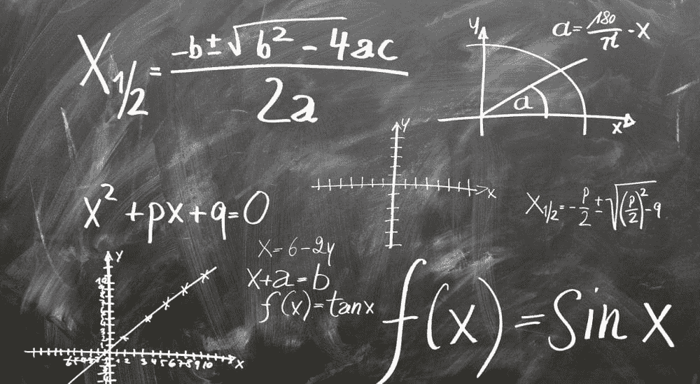
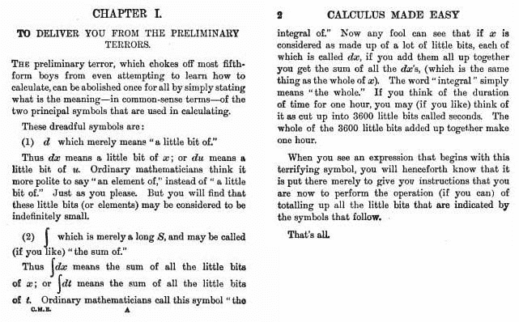

# 如何为机器学习学习数学

> 原文：[`www.kdnuggets.com/2022/02/learn-math-machine-learning.html`](https://www.kdnuggets.com/2022/02/learn-math-machine-learning.html)

图片由 [geralt 在 Pixabay](https://pixabay.com/users/geralt-9301/) 提供

数据科学求职者最常见的问题之一是“**我需要了解多少数学才能进行机器学习？**”希望进入机器学习领域的学生常常认为数学是一个巨大的障碍。

* * *

## 我们的前三个课程推荐

 1\. [谷歌网络安全证书](https://www.kdnuggets.com/google-cybersecurity) - 快速进入网络安全领域的职业生涯。

 2\. [谷歌数据分析专业证书](https://www.kdnuggets.com/google-data-analytics) - 提升你的数据分析技能

 3\. [谷歌 IT 支持专业证书](https://www.kdnuggets.com/google-itsupport) - 支持组织的 IT

* * *

行业中的把关者对此问题并不提供帮助，通常将学生标记为不合格，除非他们拥有硕士学位或博士学位。

那么，进入数据科学行业你需要了解多少数学呢？

答案是：**没有你想的那么多**。

大多数公司通过数据解决非常相似的用例。他们要求数据科学家构建可以预测客户流失、进行细分和预测销售的机器学习模型。

解决这些问题的方法类似，任务变得相当重复。没有必要重新发明轮子，它们使用现成的机器学习算法。

即使出现需要构建自定义机器学习模型的情况，对特定主题的直观理解就足够了。你不需要深入了解，也不需要成为数学专家才能成为数据科学家。

例如，我们知道梯度下降用于在线性回归中找到最佳拟合线。你无需学习如何解微分方程，只需理解微积分的原理，就能对这一过程有所了解。

类似地，如果你要用 Tensorflow 构建神经网络，你需要进行大量的矩阵操作，但这会在计算机程序的帮助下完成。因此，你无需返回去练习代数方程的解法，只需理解它们的工作原理即可。

在这篇文章中，我将向你推荐一些资源，帮助你开始学习数据科学所需的数学。我将重点介绍三个领域——线性代数、微积分和统计学。

### 线性代数

[线性代数 — 基础到前沿](https://www.edx.org/course/linear-algebra-foundations-to-frontiers)：这门 edX 上的课程将教你本科水平的线性代数。它从较慢的速度开始，只要你具备高中水平的数学知识，就可以参加这门课程。

这门课程的最佳部分是，它通过 Matlab 中的实际例子教授线性代数，这让你通过算法和编程的视角来看待这个学科。如果你的目标是为机器学习学习线性代数，这种学习方法尤其有用。

这个课程可以免费旁听。如果你想获得结业证书，可以申请经济援助。

[3Blue1Brown — 线性代数精髓](https://www.youtube.com/watch?v=fNk_zzaMoSs&list=PLZHQObOWTQDPD3MizzM2xVFitgF8hE_ab)：我以前没有参加过这个课程，但在我寻找数学学习资源的过程中多次遇到过它。

许多机器学习爱好者都推荐这门课程，因为它为学习者提供了线性代数的概念性理解。你将获得线性代数如何运作的直观认识，而不是学习任意的公式或机械推导它们。如果你的终极目标是将这些概念应用于机器学习模型，这将非常有帮助。

### 微积分

我推荐两个学习机器学习所需微积分的课程。[微积分精髓](https://www.youtube.com/watch?v=WUvTyaaNkzM)是 3Blue1Brown 提供的很棒的微积分入门课程。这也将为你提供微积分概念的直观理解，并深入解释公式背后的意义，而不仅仅是让你记住它们。

接下来，你可以参加 3Blue1Brown 的[神经网络](https://www.youtube.com/watch?v=aircAruvnKk&list=PLZHQObOWTQDNU6R1_67000Dx_ZCJB-3pi)系列。如果你知道如何使用 Keras 等库实现神经网络，但不太了解这些模型的工作原理，你应该参加这个课程。它提供了梯度下降算法的全面解释，以及其背后的微积分概念。

《简易微积分》（第二版，1914 年，第一章）（由文章作者编辑以删除非包容性语言）。

### 统计学

**[概率与统计：要 p 还是不要 p？— Coursera](https://www.coursera.org/learn/probability-statistics)**

这是我曾经参加过的最好的入门统计学课程之一，由伦敦大学提供。该课程针对的是主修非数学学科的学生，如商业和金融。

因此，统计概念的解释简单易懂，并有许多现实世界的例子。

通过学习此课程，你将了解描述性统计和推断性统计、不同的抽样分布、抽样技术、置信区间，以及如何计算 p 值。

所有这些概念在实际数据分析中都有直接应用。

**[统计学习 — edX](https://www.edx.org/course/statistical-learning)**

这是另一个优秀的课程，帮助你学习机器学习模型背后的直觉。

和这份清单中的其他资源一样，这个课程较少关注数学公式，而是以概念性的方式解释机器学习模型。

然而，为了参加这个课程，建议你具备一定的微积分知识，因为讲师们使用的符号可能会让你感到困惑。

你将学习诸如线性回归和逻辑回归等概念，及其正则化技术，如岭回归和套索回归以及使用时机。还有一整节讲座专门讲解了用于减轻过拟合的技术，并解释了这些技术背后的数学直觉。

这是我上过的最有帮助的课程之一，因为它帮助我不再把机器学习模型视为黑箱。我理解了不同类型的模型应该在何时使用，何时应应用降维技术，以及何时进行不同种类的特征选择技术。

我花了很多时间去回顾和学习本科阶段的微积分和线性代数。然而，尽管花费了大量时间学习公式和解决微分方程，我的知识仍然存在断层，因为我从未真正理解这些概念如何与机器学习算法相关联。

上述资源是突破障碍的绝佳方式，因为它们提供了机器学习背后的数学概念理解，而不是让你陷入复杂的公式和定理之中。

**[Natassha Selvaraj](https://www.natasshaselvaraj.com/)** 是一位自学成才的数据科学家，热爱写作。你可以在 [LinkedIn](https://www.linkedin.com/in/natassha-selvaraj-33430717a/) 上与她联系。

### 更多相关内容

+   [如何克服数学恐惧并学习数据科学中的数学](https://www.kdnuggets.com/2021/03/overcome-fear-learn-math-data-science.html)

+   [KDnuggets™ 新闻 22:n07，2 月 16 日：如何学习机器学习数学…](https://www.kdnuggets.com/2022/n07.html)

+   [5 门免费 MIT 课程，学习数据科学数学](https://www.kdnuggets.com/5-free-mit-courses-to-learn-math-for-data-science)

+   [数据科学必备数学：奇异值分解的可视化介绍](https://www.kdnuggets.com/2022/06/essential-math-data-science-visual-introduction-singular-value-decomposition.html)

+   [数据科学必备数学：特征向量及其在 PCA 中的应用](https://www.kdnuggets.com/2022/06/essential-math-data-science-eigenvectors-application-pca.html)

+   [数据科学中需要多少数学？](https://www.kdnuggets.com/2020/06/math-data-science.html)
