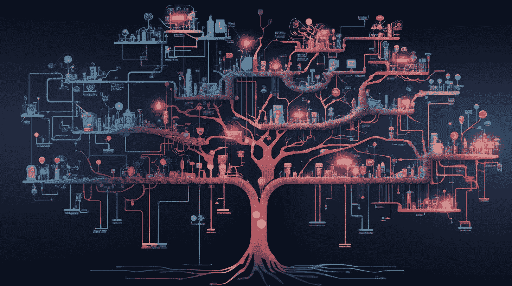
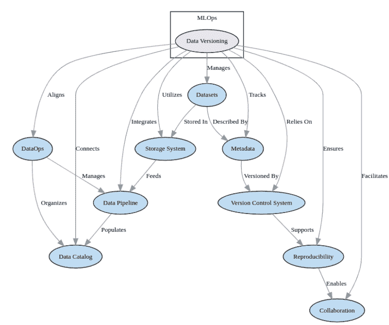

# 使用这本免费的电子书学习 MLOps 基础知识

> 原文：[`www.kdnuggets.com/2023/08/learn-mlops-basics-free-ebook.html`](https://www.kdnuggets.com/2023/08/learn-mlops-basics-free-ebook.html)

MLOps，即机器学习运营，是一个关键学科，适用于那些希望有效构建、部署和管理机器学习模型的组织。通过将 DevOps 原则应用于机器学习工作流程，MLOps 旨在促进数据科学家与工程师之间的无缝协作，并优化端到端的机器学习生命周期。

* * *

## 我们的前三个课程推荐

 1\. [Google 网络安全证书](https://www.kdnuggets.com/google-cybersecurity) - 快速进入网络安全职业轨道

 2\. [Google 数据分析专业证书](https://www.kdnuggets.com/google-data-analytics) - 提升您的数据分析能力

 3\. [Google IT 支持专业证书](https://www.kdnuggets.com/google-itsupport) - 支持您的组织进行 IT 管理

* * *

> MLOps 将 DevOps 的原则和最佳实践应用于数据科学和机器学习的特定需求，促进数据科学家、工程师和运营团队之间的无缝协作。

这本免费的电子书，**[Essential MLOps: 你需要知道的成功实施要点](https://datasciencehorizons.com/ebook-essential-mlops-successful-implementation/)**，来自 Data Science Horizons，提供了 MLOps 的全面介绍。您将学习帮助组织简化在生产环境中构建、部署和管理机器学习模型的基本知识。

Essential MLOps 涵盖了该主题的重要性、关键组件、必要的 MLOps 技能、工具和技术，以及真实世界的案例研究。它旨在为读者提供对 MLOps 概念、技术和工具的深入理解，以便在其组织中实施 MLOps。正如电子书所述：

> 通过采用 MLOps 实践并利用合适的工具和技术，组织可以简化其机器学习工作流程，优化模型性能，并推动有意义的结果。

涵盖的关键主题包括数据管理和版本控制、模型训练和评估、持续集成和持续部署（CI/CD）、监控和性能管理，以及来自电子商务、金融、医疗保健和制造业等行业的案例研究。电子书强调了 MLOps 的好处，如改善协作、加快部署、更好的模型性能，以及提高机器学习系统的可扩展性和可维护性。

图片来自 [Essential MLOps: What You Need to Know for Successful Implementation](https://datasciencehorizons.com/ebook-essential-mlops-successful-implementation/)

总体而言，**[Essential MLOps: What You Need to Know for Successful Implementation](https://datasciencehorizons.com/ebook-essential-mlops-successful-implementation/)** 来自 Data Science Horizons 为任何希望在组织内成功实施 MLOps 的人提供了宝贵的见解。这些实用的指导使其成为数据科学家、工程师、团队领导以及其他希望优化机器学习工作流程的专业人士的有用资源。

**[Matthew Mayo](https://www.linkedin.com/in/mattmayo13/)** ([**@mattmayo13**](https://twitter.com/mattmayo13)) 是 KDnuggets 的数据科学家和主编，该网站是开创性的在线数据科学和机器学习资源。他的兴趣包括自然语言处理、算法设计与优化、无监督学习、神经网络和自动化机器学习方法。Matthew 拥有计算机科学硕士学位和数据挖掘研究生文凭。他可以通过 editor1 at kdnuggets[dot]com 联系。

### 更多相关主题

+   [Essential MLOps: 一本免费电子书](https://www.kdnuggets.com/2023/06/essential-mlops-free-ebook.html)

+   [MLOps 的绝对基础](https://www.kdnuggets.com/2022/09/absolute-basics-mlops.html)

+   [通过这本免费电子书学习数据清理和预处理](https://www.kdnuggets.com/2023/08/learn-data-cleaning-preprocessing-data-science-free-ebook.html)

+   [通过这门免费课程学习 MLOps](https://www.kdnuggets.com/2022/06/learn-mlops-free-course.html)

+   [收集的免费课程，学习数据科学、数据工程等](https://www.kdnuggets.com/collection-of-free-courses-to-learn-data-science-data-engineering-machine-learning-mlops-and-llmops)

+   [如何通过 ChatGPT 学习 Python 基础](https://www.kdnuggets.com/how-to-learn-python-basics-with-chatgpt)
