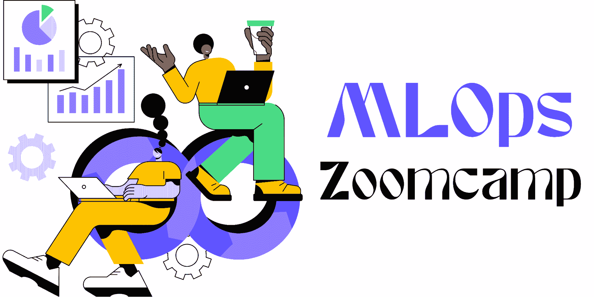

# 通过这个免费课程学习 MLOps

> 原文：[`www.kdnuggets.com/2022/06/learn-mlops-free-course.html`](https://www.kdnuggets.com/2022/06/learn-mlops-free-course.html)

作者提供的图片 | Canva Pro

## 目录

1.  什么是 MLOps？

1.  我们为什么需要 MLOps？

1.  MLOps Zoomcamp

1.  最后的想法

1.  常见问题解答

* * *

## 我们的三大课程推荐

 1\. [Google 网络安全证书](https://www.kdnuggets.com/google-cybersecurity) - 快速进入网络安全职业生涯。

 2\. [Google 数据分析专业证书](https://www.kdnuggets.com/google-data-analytics) - 提升你的数据分析技能

 3\. [Google IT 支持专业证书](https://www.kdnuggets.com/google-itsupport) - 支持你的组织 IT

* * *

# 什么是 MLOps？

MLOps 代表机器学习运维。MLOps 这个术语源于 DevOps（开发运维）。它用于简化从开发到部署的机器学习过程。MLOps 包括训练机器学习模型、实验跟踪、模型优化、创建 ML 流水线、保存和服务模型以及监控和维护生产中的模型。

简而言之，你正在自动化从开发到部署的所有过程，并且你会不断监控日志、指标和性能。

# 我们为什么需要 MLOps？

部署机器学习模型到生产环境是复杂且具有挑战性的。典型的机器学习生命周期包括数据摄取、数据增强、建模、训练、优化、实验跟踪和结果解释。这需要整个数据团队的协作，从数据工程师到数据科学家。MLOps 使这些过程自动化，以便你可以持续监控和改进生产中的模型。

MLOps 允许你减少模型部署时间并交付更高质量的机器学习模型。它提供了巨大的扩展性和管理成千上万的机器学习模型。你可以控制、管理和监控持续集成、持续交付和持续部署 - [Databricks](https://databricks.com/glossary/mlops)。

# MLOps Zoomcamp

[MLOps Zoomcamp](https://github.com/DataTalksClub/mlops-zoomcamp) 教授你模型部署和监控的实际方面。这个课程不适合初学者，需要你掌握 Python、Docker、命令行、对机器学习模型有深入理解，以及至少 1 年的编程经验。如果你是完全的初学者，我建议你在学习 MLOps 之前，先参加免费的 [机器学习 Zoomcamp](https://github.com/DataTalksClub/mlops-zoomcamp)。

课程包括七个模块和一个项目。你可以在[这里](https://airtable.com/shrCb8y6eTbPKwSTL)注册课程。

## 模块 1: 介绍

我们将学习 MLOps 的基础知识、课程概述和模型成熟度。我们还将学习加载纽约出租车旅行数据集的 parquet 文件并训练一个行程时长模型。

## 模块 2: 实验跟踪

我们将学习 MLflow 和实验跟踪的最佳实践。我们还将学习使用 MLflow 保存和加载模型，并了解模型注册表。

## 模块 3: 编排和机器学习流水线

我们将了解机器学习流水线，并使用 Prefect 来编排机器学习项目。我们将把 Jupyter notebooks 转换为 ML 流水线，并学习流行的工具 KubeFlow pipelines。

## 模块 4: 模型部署

我们将学习批处理与在线部署以及网络服务与流媒体。我们将以批处理模式提供模型，学习网络服务，并使用 Kinesis/SQS + AWS Lambda 创建流媒体。

## 模块 5: 模型监控

我们将学习 ML 监控与软件监控、数据质量监控、数据漂移与概念漂移、批处理与实时监控的区别。我们将学习使用 Evidently、Prometheus 和 Grafana 监控生产中的模型。

## 模块 6: 最佳实践

我们将采纳 DevOps 中的最佳实践应用于机器学习工作流程：

+   虚拟环境和 Docker

+   Python 日志记录和代码检查

+   单元测试、集成测试和回归测试

+   CI/CD（GitHub Actions）

+   基础设施即代码（Terraform，CloudFormation）

+   Cookiecutter

+   Makefiles

## 模块 7: 流程

我们将学习 MLOps 过程和规划，使用 CRISP-DM、CRISP-ML、ML Canvas、数据景观画布和 ML 项目的文档实践（模型卡工具包）。

## 项目

最后，我们将把学到的工具和实践整合到一个端到端的项目中。我们将使用纽约出租车旅行数据集构建一个 MLOps 系统，以预测行程时长或司机是否会收到小费。

每周你将参加 DataTalksClub [YouTube](https://www.youtube.com/c/DataTalksClub) 频道上的直播课程，了解每个模块。你也可以在 [这里](https://www.youtube.com/playlist?list=PL3MmuxUbc_hIUISrluw_A7wDSmfOhErJK) 查看完整的播放列表。在每个模块结束时，你将获得作业，以便你能在下一周的模块中保留知识。

# 最终思考

我是 DataTalks.Club 免费课程的忠实粉丝，因为它们提供了关于机器学习、数据工程和 MLOps 的实用知识。如果你在寻找最好的免费数据工程或 MLOps 课程，你会发现没有。DataTalks.Club 正在使机器学习民主化，让每个人都可以免费学习机器学习操作。

如果你是一个机器学习爱好者，尝试学习 MLOps 以在职业生涯中出类拔萃，并理解数据生态系统。从数据摄取到生产。

**你还可以查看 DataTalks.Club 的课程：**

+   [机器学习 Zoomcamp - 免费的 4 个月 ML 工程课程](https://github.com/alexeygrigorev/mlbookcamp-code/tree/master/course-zoomcamp)

+   [数据工程 Zoomcamp - 免费的 9 周数据工程课程](https://github.com/DataTalksClub/data-engineering-zoomcamp/)

# 常见问题

## 什么是 MLOps 工具？

1.  对于追踪 ML 实验，有**MLflow**和**Comet**。

1.  对于数据和模型版本管理，有**DVC**、**DAGsHub**和**Pachyderm**。

1.  对于优化实验，有**Optuna**和**Sigopt**。

1.  对于工作流管道和编排，有**Kubeflow**和**Apache Airflow**。

1.  对于模型保存和服务，有**BentoML**和**Cortex**。

1.  对于生产中的模型监控，有**Evidently**和**NewRelic**。

## MLOps 与 DevOps 有什么不同？

+   **DevOps** 是一套通过持续集成和交付高质量开发产品来改进软件开发过程的实践。

+   **MLOps** 是自动化机器学习应用程序的部署和监控生产性能的过程。

## 为什么 MLOps 很重要？

部署机器学习模型是昂贵的，而且它们并不会产生持续支持业务的价值。MLOps 使公司能够轻松地部署、监控和更新生产中的模型。

## 最好的免费 MLOps 课程是什么？

[MLOps Zoomcamp](https://github.com/DataTalksClub/mlops-zoomcamp) 是最好的且对所有人免费。除此之外，你在网上找不到免费的完整 MLOps 课程。

## 如何获得 MLOps 认证？

目前没有 MLOps 认证。大多数组织会接受 [AWS 认证 DevOps 工程师 - 专业认证](https://aws.amazon.com/certification/certified-devops-engineer-professional/?ch=tile&tile=getstarted) 作为 MLOps 工程职位的认证。

**[Abid Ali Awan](https://www.polywork.com/kingabzpro)** ([@1abidaliawan](https://twitter.com/1abidaliawan)) 是一位认证的数据科学专业人士，喜欢构建机器学习模型。目前，他专注于内容创作和撰写有关机器学习和数据科学技术的技术博客。Abid 拥有技术管理硕士学位和电信工程学士学位。他的愿景是利用图神经网络构建一个人工智能产品，帮助那些面临心理健康问题的学生。

### 相关话题

+   [针对初学者的免费 MLOps 速成课程](https://www.kdnuggets.com/2022/08/free-mlops-crash-course.html)

+   [成为 MLOps 工程师所需的唯一免费课程](https://www.kdnuggets.com/the-only-free-course-you-need-to-become-a-mlops-engineer)

+   [通过这本免费电子书学习 MLOps 基础](https://www.kdnuggets.com/2023/08/learn-mlops-basics-free-ebook.html)

+   [学习数据科学、数据工程等的免费课程汇总](https://www.kdnuggets.com/collection-of-free-courses-to-learn-data-science-data-engineering-machine-learning-mlops-and-llmops)

+   [从这些 GitHub 仓库学习 MLOps](https://www.kdnuggets.com/2023/02/learn-mlops-github-repositories.html)

+   [在 ODSC East 2022 上你可以免费访问的 15 个热门 MLOps 讲座](https://www.kdnuggets.com/2022/04/odsc-15-trending-mlops-talks-access-free-odsc-east-2022.html)
