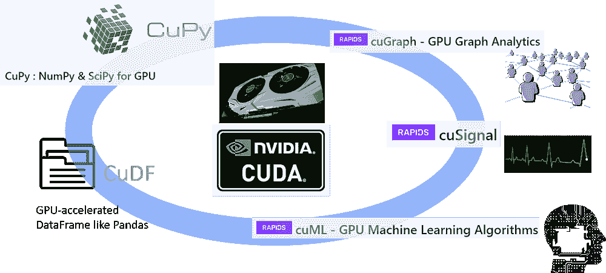
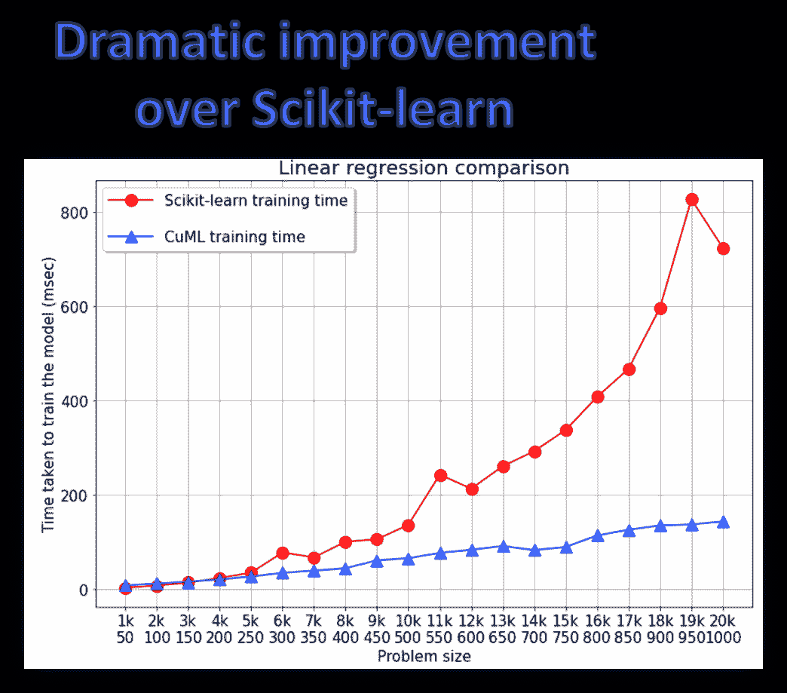
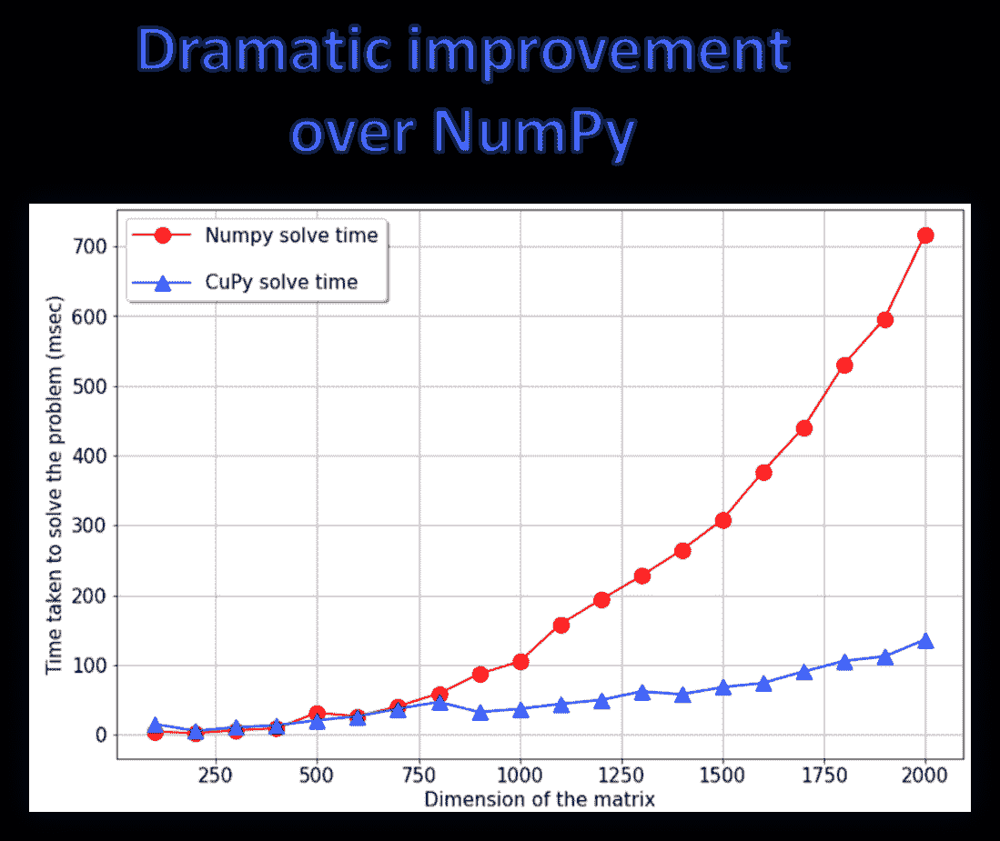
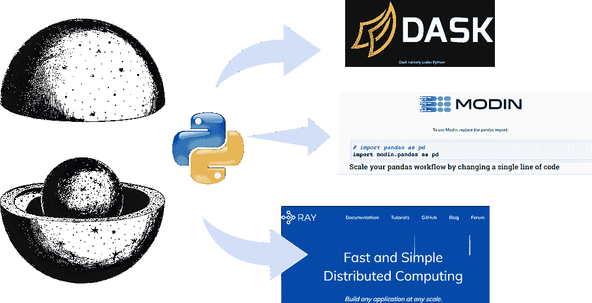

# 你为什么以及如何学习“高效的数据科学”？

> 原文：[`www.kdnuggets.com/2021/07/learn-productive-data-science.html`](https://www.kdnuggets.com/2021/07/learn-productive-data-science.html)

评论

**图片来源**：[Pixabay](https://pixabay.com/illustrations/productivity-work-businessman-1995786/)（免费图片）

### 数据科学工作流的效率

数据科学和机器学习可以以不同的效率和生产力进行实践。不论应用领域或专业如何，一名数据科学家——无论是初学者还是资深专家——都应努力**提升其效率**，在所有典型的数据科学任务中，

+   统计分析，

+   可视化，

+   模型选择，特征工程，

+   代码质量测试，模块化，

+   并行处理，

+   轻松的 web 应用部署

**图片来源**：[Pixabay](https://pixabay.com/photos/time-businessman-tablet-gears-2676366/)（免费图片）

这意味着执行所有这些任务，

+   以更高的速度

+   更快的调试

+   以同步的方式

+   通过充分利用所有可用的硬件资源

### 在这个过程中，你应该期待学习到什么？

让我们假设有人在教授一个“*高效的数据科学*”课程或编写一本相关书籍——使用 Python 作为语言框架。那么，针对这样一个课程或书籍，通常应该有什么期望？

**图片来源**：[Pixabay](https://pixabay.com/vectors/books-education-female-girl-1297707/)（免费图片）

课程/书籍应该面向那些希望**超越标准方式**进行数据科学和机器学习任务，并利用 Python 数据科学生态系统的全貌以提高生产力的人。

读者应该学习如何发现标准过程中的低效和瓶颈，以及如何跳出框框思考。

**自动化重复的数据科学任务**是读者将从阅读本书中培养的一种关键思维方式。在许多情况下，他们还将学习如何扩展现有的编码实践，以便在 Python 生态系统中使用已有的高级软件工具，处理更大数据集并提高效率，但这些工具在标准数据科学中并未教授。

这不应该是一本普通的 Python 食谱书，教授标准库如 Numpy 或 Pandas。

相反，它应该专注于有用的技术，比如如何**测量 ML 模型的内存占用和执行速度**，**质量测试**数据科学流程，**模块化**数据科学流程以进行应用开发等。它还应涵盖一些在**自动化**和**加速**数据科学家日常任务中非常有用的 Python 库。

此外，还应涉及帮助数据科学家**处理大型和复杂数据集**的工具和包，以比遵循标准 Python 数据科学技术智慧更优的方式

### 一些需要掌握的具体技能

**图片来源**: [Pixabay](https://pixabay.com/illustrations/training-businessman-suit-manager-2874597/) (免费图片)

具体来说，让我们总结一些学习和实践*高效数据科学*的具体技能。我还尝试提供一些代表性文章的链接作为参考

1.  如何[为数据科学](https://medium.com/productive-data-science/speed-up-your-numpy-and-pandas-with-numexpr-package-25bd1ab0836b)/机器学习编写快速且高效的代码，并且如何测量其速度和效率（[**请参见这篇文章**](https://towardsdatascience.com/how-much-memory-is-your-ml-code-consuming-98df64074c8f)）

1.  如何构建模块化且富有表现力的数据科学管道以提高生产力（[**请参见这篇文章**](https://towardsdatascience.com/object-oriented-programming-for-data-scientists-build-your-ml-estimator-7da416751f64)）

1.  如何为数据科学和机器学习模型编写测试模块（[**请参见这篇文章**](https://towardsdatascience.com/pytest-for-machine-learning-a-simple-example-based-tutorial-a3df3c58cf8)）

1.  如何高效处理大型和复杂的数据集（这在传统数据科学工具下会很困难）

1.  如何充分利用 GPU 和多核处理器进行各种数据科学和分析任务，而不仅仅是专门的深度学习建模（[**请参见这篇文章**](https://medium.com/dataseries/gpu-powered-data-science-not-deep-learning-with-rapids-29f9ed8d51f3)）

1.  如何快速制作 GUI 应用程序以演示数据科学/机器学习想法或模型调优（[**请参见这篇文章**](https://towardsdatascience.com/building-data-science-gui-apps-with-pysimplegui-179db54a9a15)），或如何轻松（且快速）地在应用级别部署机器学习模型和数据分析代码（[**请参见这篇文章**](https://towardsdatascience.com/pywebio-write-interactive-web-app-in-script-way-using-python-14f50155af4e)）

### 关于这一主题的理想书籍将会……

**图片来源**: [Pixabay](https://pixabay.com/illustrations/fairy-tale-fantasy-dream-night-1077863/) (免费图片)

1.  教授如何识别标准数据科学代码中的**低效和瓶颈**，以及如何跳出思维框架解决这些问题

1.  教授如何编写模块化、高效的数据分析和机器学习代码，以提高在各种情况下的生产力——探索性数据分析、可视化、深度学习等

1.  涵盖了广泛的附加主题，如软件测试、模块开发、**GUI 编程**、**ML 模型部署**作为网络应用程序，这些都是新兴数据科学家必须掌握的宝贵技能，而这些技能在任何一本标准的数据科学书籍中都很难找到。

1.  涵盖并行计算（例如，**Dask, Ray**）、可扩展性（例如，**Vaex, Modin**）以及 GPU 驱动的数据科学栈（**RAPIDS**）的实际示例。

1.  向读者展示并指导一个更大且不断扩展的 Python 数据科学工具生态系统，这些工具与**软件工程**和生产级部署的更广泛方面相连接。

### 一个具体的例子：GPU 驱动和分布式数据科学

尽管学术界和商业圈广泛讨论了 GPU 和分布式计算在核心 AI/ML 任务中的应用，但它们在常规数据科学和数据工程任务中的实用性则覆盖较少。然而，使用 GPU 进行日常的统计分析或其他数据科学任务，能够大大提升成为*高效数据科学家*的能力。

例如，[**RAPIDS 软件库和 API 套件**](https://rapids.ai/)为你——一位普通的数据科学家（而不一定是深度学习从业者）——提供了完全在 GPU 上执行**端到端数据科学和分析管道**的选项和灵活性。

**图片来源**：作者创建的拼贴

即使使用中等规格的 GPU，这些库在速度上也显示出相对于其常规 Python 对应物的显著提升。自然地，我们应该在可能的情况下采纳这些，以实现*高效数据科学*工作流。

同样，也有出色的开源机会可以超越 Python 语言的单核限制，并采用并行计算范式，而无需改变数据科学家的核心身份。

**图片来源**：作者创建的拼贴

### 摘要

我们讨论了*高效数据科学*工作流的实用性和核心组件。我们设想了一个理想的课程或书籍应提供给读者的内容。我们触及了一些具体的例子，并说明了其好处。还提供了一些与掌握技能相关的资源。

你可以查看作者的[**GitHub**](https://github.com/tirthajyoti?tab=repositories)**库**，获取机器学习和数据科学中的代码、想法和资源。如果你和我一样，对 AI/机器学习/数据科学充满热情，请随时[在 LinkedIn 上添加我](https://www.linkedin.com/in/tirthajyoti-sarkar-2127aa7/)或[在 Twitter 上关注我](https://twitter.com/tirthajyotiS)。

[原始内容](https://medium.com/productive-data-science/why-and-how-should-you-learn-productive-data-science-53377b473f37)。经许可转载。

**相关内容：**

+   如何让自己从数百名其他数据科学候选人中脱颖而出？

+   你的机器学习代码消耗了多少内存？

+   一个错误如何浪费了我 3 年的数据科学之旅

### 更多相关主题

+   [每位初学者数据科学家应掌握的 6 种预测模型](https://www.kdnuggets.com/2021/12/6-predictive-models-every-beginner-data-scientist-master.html)

+   [成为出色数据科学家所需的 5 项关键技能](https://www.kdnuggets.com/2021/12/5-key-skills-needed-become-great-data-scientist.html)

+   [2021 年最佳 ETL 工具](https://www.kdnuggets.com/2021/12/mozart-best-etl-tools-2021.html)

+   [每位数据科学家都应了解的三个 R 库（即使你使用 Python）](https://www.kdnuggets.com/2021/12/three-r-libraries-every-data-scientist-know-even-python.html)

+   [停止学习数据科学以寻找目标，并通过目标来…](https://www.kdnuggets.com/2021/12/stop-learning-data-science-find-purpose.html)

+   [一个 90 亿美元的 AI 失败案例，详解](https://www.kdnuggets.com/2021/12/9b-ai-failure-examined.html)
