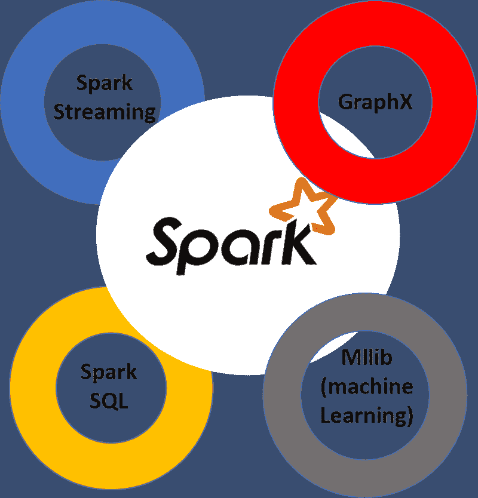
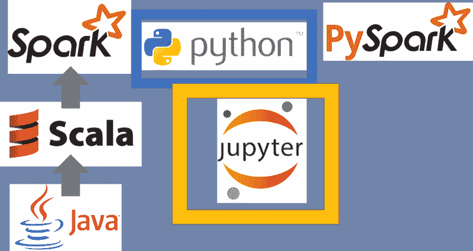
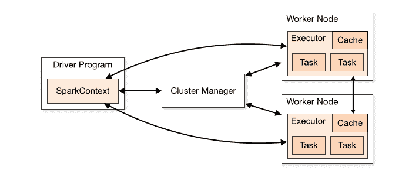
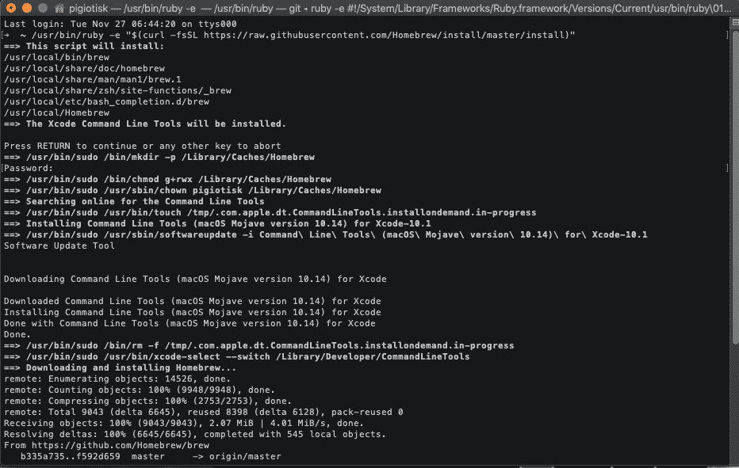
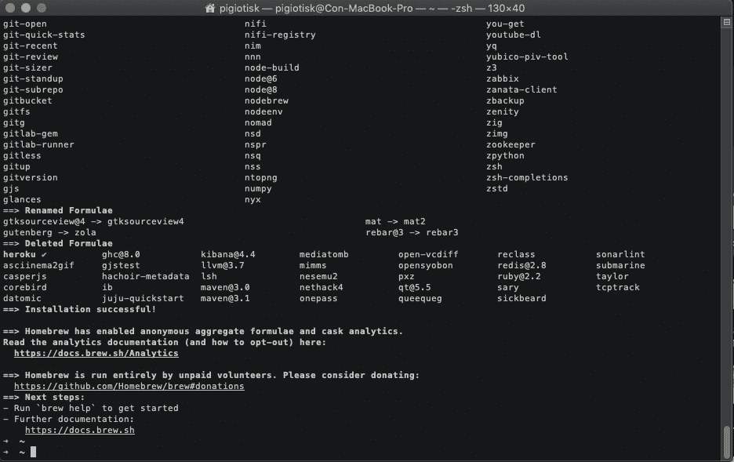
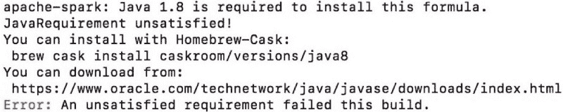
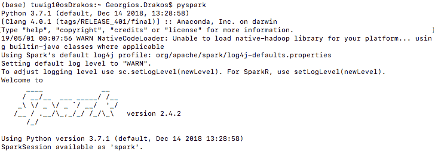
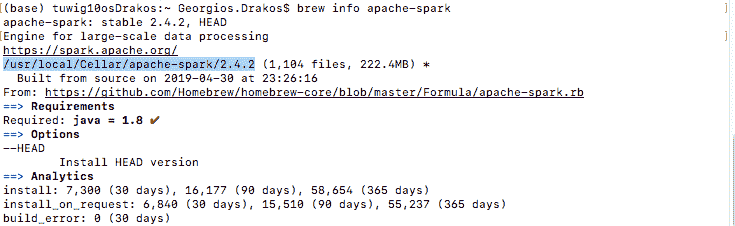
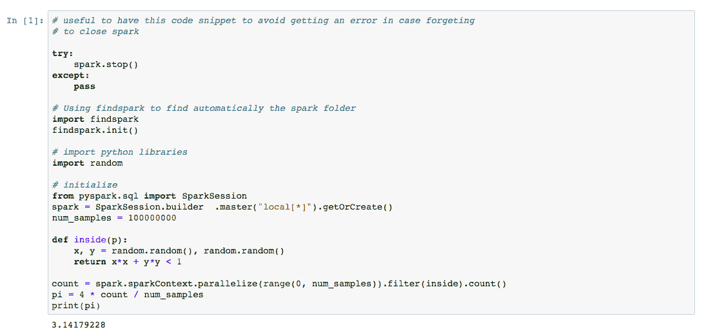

# 学习如何在 5 分钟内使用 PySpark（安装 + 教程）

> 原文：[`www.kdnuggets.com/2019/08/learn-pyspark-installation-tutorial.html`](https://www.kdnuggets.com/2019/08/learn-pyspark-installation-tutorial.html)

 评论

**由[乔治奥斯·德拉科斯](https://gdcoder.com/author/)，TUI 的数据显示科学家**

我发现对于大多数人来说，开始使用 Apache Spark（本教程将集中在 PySpark 上）并在本地计算机上安装它有点困难。通过这个简单的教程，你将能非常快速地完成这项工作！

* * *

## 我们的前三大课程推荐

 1. [谷歌网络安全证书](https://www.kdnuggets.com/google-cybersecurity) - 快速入门网络安全职业生涯

 2. [谷歌数据分析专业证书](https://www.kdnuggets.com/google-data-analytics) - 提升你的数据分析技能

 3. [谷歌 IT 支持专业证书](https://www.kdnuggets.com/google-itsupport) - 支持你所在组织的 IT

* * *

[**Apache Spark**](http://spark.apache.org/)**是大数据爱好者必备的工具**，它是一个快速、易于使用的通用大数据处理引擎，内置流处理、SQL、机器学习和图形处理模块。这项技术是数据工程师的热门技能，但数据科学家在进行探索性数据分析（EDA）、特征提取以及当然的机器学习时也能从学习 Spark 中受益。但请记住，Spark 只有在大量节点的集群上运行时才能真正发挥作用。

### 目录

+   介绍

+   Spark 定义

+   Spark 应用程序

+   在 Mac 上安装 PySpark

+   使用 PySpark 打开 Jupyter Notebook

+   启动 SparkSession

+   结论

+   参考文献



### 介绍

Apache Spark 是数据处理框架中最热门、最大的开源项目之一，拥有丰富的高级 API，支持 Scala、Python、Java 和 R 等编程语言。它实现了将大数据和机器学习结合在一起的潜力。这是因为：

+   由于内存操作，Spark 的速度很快（比传统的[Hadoop MapReduce](https://www.tutorialspoint.com/hadoop/hadoop_mapreduce.htm)快达 100 倍）。

+   它提供了强大、分布式、容错的数据对象（称为[RDDs](https://www.tutorialspoint.com/apache_spark/apache_spark_rdd.htm)）

+   它通过像[MLlib](https://spark.apache.org/mllib/)和[GraphX](https://spark.apache.org/graphx/)这样的附加包与机器学习和图形分析的世界完美集成。

Spark 实现于[Hadoop/HDFS](https://www.bernardmarr.com/default.asp?contentID=1080)，主要用[Scala](https://www.scala-lang.org/)编写，这是一种函数式编程语言。然而，对于大多数初学者来说，Scala 不是进入数据科学世界时学习的最佳第一语言。

幸运的是，Spark 提供了一个出色的 Python API，称为[PySpark](https://spark.apache.org/docs/latest/api/python/index.html)。这允许 Python 程序员与 Spark 框架进行接口——使你能够大规模操作数据，并在分布式文件系统上处理对象。因此，Spark 并不是一个你需要学习的新编程语言，而是一个在 HDFS 之上运行的框架。

这呈现了新概念，如节点、延迟评估以及转换-动作（或“映射和归约”）编程范式。事实上，Spark 足够灵活，可以与其他文件系统（如 Amazon S3 或 Databricks（DBFS））一起使用。

像 Netflix、Yahoo 和 eBay 这样的互联网巨头已经在大规模上部署了 Spark，共同处理多个 PB 的数据，集群节点超过 8000 个。

### Spark 定义

通常，当你想到计算机时，你会想到放在你家里或工作场所的那台机器。这台机器对于在小数据集上应用机器学习非常有效。然而，当你有大数据集（以 TB 或 GB 计）时，有些事情是你的计算机无法处理的。一个特别具有挑战性的领域是数据处理。单台计算机没有足够的能力和资源来处理大量信息（或者你可能需要等待计算完成）。



集群，即机器组，将许多机器的资源集中在一起，使我们可以像使用一个整体资源一样使用所有累计资源。现在，仅仅一组机器并不强大，你需要一个框架来协调它们之间的工作。**Spark 就是为此而设计的工具，用于管理和协调在计算机集群上执行的任务。**

### Spark 应用程序

一个 Spark 应用程序包括：

+   驱动程序

+   执行器（分布式工作进程的集合）

### 驱动程序

驱动程序运行我们应用程序的 main() 方法，承担以下职责：

+   在我们的集群中的一个节点上运行，或在客户端上运行，并与集群管理器调度作业执行

+   响应用户的程序或输入

+   分析、调度和分配工作到执行器

### 执行器

执行器是一个分布式进程，负责执行任务。每个 Spark 应用程序都有自己的一组执行器，这些执行器在单个 Spark 应用程序的生命周期内保持活跃。

+   执行器执行 Spark 作业的所有数据处理

+   将结果存储在内存中，只有在驱动程序明确指示时才会持久化到磁盘

+   一旦结果完成，会将其返回给驱动程序

+   每个节点可以有从每个节点 1 个执行器到每个核心 1 个执行器的配置

** 节点是单一实体的机器或服务器。



### Spark 的应用程序工作流程

当你向 Spark 提交作业进行处理时，后台会发生很多事情。

1.  我们的独立应用程序被启动，并初始化其 SparkContext。只有在拥有 SparkContext 之后，应用程序才可以被称为驱动程序

1.  我们的驱动程序程序向集群管理器请求资源以启动其执行器

1.  集群管理器启动执行器

1.  我们的驱动程序运行实际的 Spark 代码

1.  执行器运行任务并将结果发送回驱动程序

1.  SparkContext 被停止，所有执行器被关闭，资源返回到集群

### 在 Mac 上安装 Spark（本地）

***第一步：安装 Brew***

如果你已经安装了 brew，则可以跳过此步骤：

1\. 在 Mac 上打开终端。你可以去 Spotlight 搜索终端（或者你可以在/Applications/Utilities/中找到它）。

2\. 输入以下命令。

```py
$ /usr/bin/ruby -e "$(curl -fsSL https://raw.githubusercontent.com/Homebrew/install/master/install)"
```

3\. 按下回车键，脚本将运行。它会在终端输出将要安装的日志。按回车键继续或按其他键中止。

4\. 它可能会要求**sudo**权限。如果发生这种情况，你需要输入你的管理员密码并再次按下回车键。

**注意：** 命令行工具（Apple 的 XCode）将在本指南之后安装。

安装将如下图所示。

通过命令行安装 Homebrew

当安装成功完成时，它将显示如下图像。

caption

默认情况下，Homebrew 会发送匿名数据和分析。你可以在[这里](https://docs.brew.sh/Analytics)找到更多信息。你可以通过运行命令选择退出。

```py
$ brew analytics off
```

***第二步：安装 Anaconda***

在同一终端中简单地输入：`$ brew cask install anaconda`。如果在此步骤中遇到问题，请参见资源部分。

***第三步：安装 PySpark***

1\. 在终端中输入`$ brew install apache-spark`

2\. 如果你看到此错误消息，输入`$ brew cask install caskroom/versions/java8`来安装 Java8，如果你已经安装了它，就不会看到此错误。



3\. 通过在终端输入`$ pyspark`检查 pyspark 是否正确安装。如果你看到以下内容，说明它已正确安装：



### 使用 PySpark 准备好打开 Jupyter Notebook

本节假设 PySpark 已正确安装，并且在终端输入`$ pyspark`时没有出现错误。在此步骤中，我将介绍创建自动初始化 SparkContext 的 Jupyter Notebook 的步骤。

为了为你的终端会话创建一个全局配置文件，你需要创建或修改你的 .bash_profile 或 .bashrc 文件。在这里，我将使用 .bash_profile 作为我的示例

1\. 检查你的系统中是否有 .bash_profile ` $ ls -a`，如果没有，使用 `$ touch ~/.bash_profile` 创建一个

2\. 通过运行 `$ brew info apache-spark` 查找 Spark 路径



3\. 如果你已经有了 .bash_profile，请通过`$ vim ~/.bash_profile`打开它，按`I`以进入插入模式，然后在任何位置粘贴以下代码（**不要删除文件中的任何内容**）：

```py
export SPARK_PATH=(path found above by running brew info apache-spark)
export PYSPARK_DRIVER_PYTHON="jupyter"
export PYSPARK_DRIVER_PYTHON_OPTS="notebook"
#For python 3, You have to add the line below or you will get an error#
export PYSPARK_PYTHON=python3
alias snotebook='$SPARK_PATH/bin/pyspark --master local[2]'

```

4\. 按 `ESC` 退出插入模式，输入 `:wq` 退出 VIM。*你可以在这里找到更多 VIM 命令。*

5\. 通过 `$ source ~/.bash_profile` 刷新终端配置文件

我在 Jupyter Notebook 中使用 PySpark 的最喜欢的方法是通过安装 [findSpark](https://github.com/minrk/findspark) 包，这样我可以在代码中使用 Spark Context。

*findSpark 包并不特定于 Jupyter Notebook，你也可以在你喜欢的 IDE 中使用这个技巧。*

通过在终端中运行以下命令来安装 findspark

```py
$ pip install findspark
```

启动一个普通的 Jupyter Notebook 并运行以下命令：

```py
# useful to have this code snippet to avoid getting an error in case forgeting
# to close spark

try:
    spark.stop()
except:
    pass

# Using findspark to find automatically the spark folder
import findspark
findspark.init()

# import python libraries
import random

# initialize
from pyspark.sql import SparkSession
spark = SparkSession.builder.master("local[*]").getOrCreate()
num_samples = 100000000

def inside(p):
    x, y = random.random(), random.random()
    return x*x + y*y < 1

count = spark.sparkContext.parallelize(range(0, num_samples)).filter(inside).count()
pi = 4 * count / num_samples
print(pi)
```

输出应为：



请注意，使用 Spark 2.2 时，很多人推荐简单地运行 `pip install pyspark`。我尝试使用 `pip` 安装 `pyspark` 但无法让 `pyspark` 集群正常启动。阅读了 Stack Overflow 上的几个答案以及 [官方文档](https://pypi.org/project/pyspark/2.2.0/)，我发现了这一点：

> *Spark 的 Python 打包版本并不是为了取代所有其他用途。这个 Python 打包的 Spark 版本适合与现有集群（无论是 Spark 独立集群、YARN 还是 Mesos）进行交互——但不包含设置自己独立 Spark 集群所需的工具。你可以从 [Apache Spark 下载页面](http://spark.apache.org/downloads.html) 下载 Spark 的完整版本。*

因此，我建议按照我上面描述的步骤进行操作。

### 启动一个 SparkSession

好吧，这是 Spark 功能的主要入口点：它代表了与 Spark 集群的连接，你可以用它来创建 RDDs 和广播变量。当你使用 Spark 时，一切从这个 SparkSession 开始并以它结束。**注意**：SparkSession 是 Spark 2.0 的新特性，它减少了需要记住或构建的概念数量。（在 Spark 2.0.0 之前，主要的连接对象是 SparkContext、SqlContext 和 HiveContext）。

在交互环境中，SparkSession 已经为你创建了一个名为 spark 的变量。为了保持一致性，当你在自己的应用程序中创建一个时，应该使用这个名称。

您可以通过构建器模式创建一个新的 SparkSession，该模式使用“流畅接口”风格的编码，通过链式调用方法来构建一个新的对象。可以传递 Spark 属性，如下示例所示：

```py
from pyspark.sql import SparkSession
spark = SparkSession\
        .builder
        .master("local[*]")
        .config("spark.driver.cores", 1)
        .appName("understanding_sparksession")
        .getOrCreate()
```

在应用程序结束时，请记得调用`spark.stop()`以结束 SparkSession。让我们了解一下上面定义的各种设置：

+   `**master**`**:** 设置要连接的 Spark 主节点 URL，例如“local”以本地运行，“local[4]”以 4 个核心本地运行，或“spark://master:7077”以在 Spark 独立集群上运行。

+   `**config**`**:** 设置配置选项，通过指定（键，值）对来完成。

+   `**appName**`**:** 设置应用程序的名称，如果未设置名称，将使用随机生成的名称。

+   `**getOrCreate**`**:** 获取一个现有的[`**SparkSession**`](https://spark.apache.org/docs/latest/api/python/pyspark.sql.html?#pyspark.sql.SparkSession)，如果没有现有的，则根据在此构建器中设置的选项创建一个新的。如果返回现有的 SparkSession，将应用此构建器中指定的影响`SQLContext`配置的配置选项。由于`SparkContext`的配置不能在运行时修改（必须首先停止现有上下文），而`SQLContext`配置可以在运行时修改。

### 结论

Spark 在过去几年中经历了巨大的增长。数百名贡献者的共同努力使得 Spark 成为一项出色的技术，成为所有行业大数据处理和数据科学的事实标准。但请记住，在面对性能问题时，**巨大的数据集**应使用它进行操作，否则可能会产生相反的效果。对于小数据集（几 GB），建议改用[Pandas](https://pandas.pydata.org/)。

感谢阅读，期待听到您的问题 :)

*敬请关注，祝机器学习愉快。*

### 参考文献

+   [`medium.com/ayuth/install-anaconda-on-macos-with-homebrew-c94437d63a37`](https://medium.com/ayuth/install-anaconda-on-macos-with-homebrew-c94437d63a37)

+   [`picocoder.io/how-to-install-homebrew-on-mac/`](https://picocoder.io/how-to-install-homebrew-on-mac/)

+   [`stackoverflow.com/`](https://stackoverflow.com/questions/46387574/installing-pyspark-on-macbook)

+   [`www.oreilly.com/library/view/learning-spark/9781449359034/`](https://www.oreilly.com/library/view/learning-spark/9781449359034/)

**简介：[Georgios Drakos](https://gdcoder.com/author/)** 是一名数据科学家，拥有国家技术大学电气与计算机工程的学士和硕士学位，以及帝国理工学院的硕士学位，目前在 TUI 的旅行行业担任数据科学家。他专注于决策支持的计算智能、数据工程、复杂分析和技术创新管理。对基于云的技术、分布式计算、大数据以及数据科学和机器学习的商业应用非常感兴趣。

[原始文章](https://gdcoder.com/learn-how-to-use-pyspark-in-under-5-minutes/)。经许可转载。

**相关：**

+   Spark NLP：企业中最广泛使用的 NLP 库入门

+   使用 Pandas UDFs 的可扩展 Python 代码：数据科学应用

+   用 Spark、Optimus 和 Twint 在几分钟内分析推文

### 更多相关主题

+   [FastAPI 教程：用 Python 在几分钟内构建 APIs](https://www.kdnuggets.com/fastapi-tutorial-build-apis-with-python-in-minutes)

+   [PySpark 用于数据科学](https://www.kdnuggets.com/2023/02/pyspark-data-science.html)

+   [使用 Pandera 进行 PySpark 应用的数据验证](https://www.kdnuggets.com/2023/08/data-validation-pyspark-applications-pandera.html)

+   [3 分钟理解偏差-方差权衡](https://www.kdnuggets.com/2020/09/understanding-bias-variance-trade-off-3-minutes.html)

+   [5 分钟构建机器学习网页应用](https://www.kdnuggets.com/2022/03/build-machine-learning-web-app-5-minutes.html)

+   [5 分钟用 Python 构建网页抓取器](https://www.kdnuggets.com/2022/02/build-web-scraper-python-5-minutes.html)
