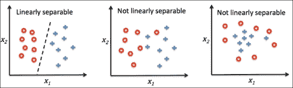

# 我在 Python 中从零实现分类器的收获

> 原文：[`www.kdnuggets.com/2017/02/learned-implementing-classifier-scratch-python.html`](https://www.kdnuggets.com/2017/02/learned-implementing-classifier-scratch-python.html)

**作者：让-尼古拉斯·侯德，[JeanNicholasHould.com](http://JeanNicholasHould.com/?utm_source=kdnugget)。**

> 本文是作者的[学习机器学习](http://www.jeannicholashould.com/learning-machine-learning.html)系列的一部分。它基于[Python 机器学习](https://www.amazon.com/gp/product/1783555130/ref=as_li_tl?ie=UTF8&camp=1789&creative=9325&creativeASIN=1783555130&linkCode=as2&tag=nickhould-20&linkId=79334fab95b99f2021c47f06697c40c3)的第一章和第二章。

* * *

## 我们的前三大课程推荐

 1\. [Google 网络安全证书](https://www.kdnuggets.com/google-cybersecurity) - 快速进入网络安全职业道路

 2\. [Google 数据分析专业证书](https://www.kdnuggets.com/google-data-analytics) - 提升你的数据分析技能

 3\. [Google IT 支持专业证书](https://www.kdnuggets.com/google-itsupport) - 支持你的组织的 IT 工作

* * *

对新手来说，机器学习可能会令人感到畏惧。机器学习的概念本身相当抽象。那么它在实际中是如何运作的呢？

为了揭开机器学习算法背后的神秘面纱，我决定从头开始实现一个简单的机器学习算法。我不会使用像*scikit-learn*这样的库，它已经实现了许多算法。相反，我将编写所有代码，以便拥有一个工作的二元分类器算法。这个练习的目标是理解其内部工作原理。

### 那么，什么是二元分类器呢？

分类器是一个机器学习算法，它根据一组特征确定输入元素的类别。例如，分类器可以用于根据啤酒的特征预测其类别。这些特征可能包括其酒精含量、香气、外观等。机器学习分类器可以用来预测一瓶 8%酒精含量、100 IBU、并带有强烈橙子香气的啤酒是印度淡色艾尔。

在机器学习中，主要有三种任务类型：无监督学习、监督学习和强化学习。分类器算法属于监督学习范畴。监督学习意味着我们事先知道正确答案。期望的输出是已知的。在啤酒的例子中，我们可以拥有描述啤酒及其类别的数据集。我们可以训练分类器算法，根据啤酒的特征来预测这些类别。

二分类器将元素分类为两组。零或一。真或假。IPA 或不是。

### 构建机器学习模型

构建和使用机器学习模型的步骤有四个。

1.  预处理

1.  学习

1.  评估

1.  预测


来源：Sebastian Raschka 的[《Python 机器学习》](https://www.amazon.com/gp/product/1783555130/ref=as_li_tl?ie=UTF8&camp=1789&creative=9325&creativeASIN=1783555130&linkCode=as2&tag=nickhould-20&linkId=79334fab95b99f2021c47f06697c40c3)。

### 预处理

预处理是构建机器学习模型的第一步。在这一步，你获取并准备数据以供未来使用。你清理数据、整理数据，并选择你想从数据中使用的特征。

以下任务可以被视为“预处理”的一部分：

+   从原始数据中提取特征

+   清理和格式化数据

+   删除多余的特征（或高度相关的特征）

+   减少特征数量以提高性能

+   标准化特征数据的范围（也称为[特征缩放](https://en.wikipedia.org/wiki/Feature_scaling)）

+   随机拆分数据集：训练数据集和测试数据集

### 学习或训练

一旦你准备好了数据集，第二步是选择一个算法来执行你想要的任务。在我们的案例中，我们选择的算法是一个称为感知机的二分类器。有许多算法被设计用来完成不同的任务，它们各自有优点和缺点。

在这一步，你可以测试一些算法，查看它们的表现并选择性能最好的一个。有多种指标可以用来衡量机器学习模型的性能。根据 Raschka 的说法，“一个常用的指标是分类准确率，它被定义为正确分类实例的比例”。在这一步，你将对机器学习算法的参数进行调整，这些参数被称为超参数。

在这篇文章中，我们将主要关注机器学习工作流的这一部分。我们将深入探讨算法的内部工作原理。如果你对机器学习工作流的其他部分感兴趣，应该感兴趣，我将在文章末尾链接到一个很棒的笔记本。

### 评估

当模型在数据集上“训练”完成后，可以在新的未见数据上进行评估。这里的目标是衡量[泛化误差](https://en.wikipedia.org/wiki/Generalization_error)。这个指标衡量的是“算法能够多准确地预测之前未见数据的结果值”。一旦你对结果感到满意，你可以使用你的机器学习模型进行预测。

### 介绍感知机

我们将重新实现的算法是[感知机](https://en.wikipedia.org/wiki/Perceptron)，它是最早的机器学习算法之一。

感知机算法简单但强大。给定一个训练数据集，算法自动学习“最佳权重系数，这些系数与输入特征相乘以决定神经元是否被激活”。

但是，算法是如何做到的呢？

### 算法

下面是算法的序列：

首先，我们初始化一个权重全为零的数组。数组的长度等于特征数量加一。这个额外的特征是“阈值”。值得注意的是，在感知机算法中，特征必须是数值型的。

```py
 self.w_ = np.zeros(1 + X.shape[1]) 
```

其次，我们开始一个与迭代次数`n_iter`相等的循环。这是一个由数据科学家定义的超参数。

```py
 for _ in range(self.n_iter): 
```

第三，我们对每一个训练数据点及其目标开始循环。目标是我们希望算法最终预测的期望输出。由于这是一个二分类器，目标值要么是`-1`，要么是`1`。它们是二进制值。

根据数据点的特征，算法将预测类别：`1` 或 `-1`。预测计算是特征与其适当权重的矩阵乘法。我们将阈值的值加到这个乘法结果中。如果结果大于 0，预测的类别是`1`。如果结果小于 0，预测的类别是`-1`。

在每次对数据点进行迭代时，如果预测不准确，算法将调整权重。在最初的几次迭代中，预测可能不准确，因为权重还没有调整很多次。它们还没有开始收敛。调整是根据目标值与预测值之间的差异按比例进行的。这个差异然后乘以学习率`eta`，这是一个数据科学家设置的在零和一之间的超参数。`eta`值越高，对权重的修正就越大。如果预测准确，算法将不会调整权重。

感知机只有在两个类别线性可分时才会收敛。简单来说，如果你能够绘制一条直线完全分隔这两个类别，算法就会收敛。否则，算法将继续迭代并重新调整权重，直到达到最大迭代次数`n_iter`。



来源: [Python 机器学习](https://www.amazon.com/gp/product/1783555130/ref=as_li_tl?ie=UTF8&camp=1789&creative=9325&creativeASIN=1783555130&linkCode=as2&tag=nickhould-20&linkId=79334fab95b99f2021c47f06697c40c3) by Sebastian Raschka.

### 完整代码

来源: [Python 机器学习](https://www.amazon.com/gp/product/1783555130/ref=as_li_tl?ie=UTF8&camp=1789&creative=9325&creativeASIN=1783555130&linkCode=as2&tag=nickhould-20&linkId=79334fab95b99f2021c47f06697c40c3) by Sebastian Raschka.

### 三个学习点

### 1\. 学习率、迭代次数与收敛

参数如`learning rate`（学习率）和`number of iteration`（迭代次数）如果直接跳到像`scikit-learn`这样的库中的算法，可能会显得非常抽象，很难理解它们真正的作用。通过实现算法，现在我清楚它们在感知机（Perceptron）中的含义。

**学习率**

学习率是当预测不准确时，用来修正权重的比率。该值需要在零和一之间。如下面的代码片段所示，`fit`函数将对每个观察值进行迭代，调用`predict`函数，然后根据目标值和预测值之间的差异调整权重，再乘以学习率。

较高的学习率意味着算法将更加积极地调整权重。在每次迭代中，如果预测值不准确，权重将会被调整。

**迭代次数**

迭代次数是算法在训练数据集上运行的次数。如果迭代次数设为一，那么算法只会循环一次数据集，并为每个数据点更新一次权重。结果模型可能会比具有更高迭代次数的模型更不准确。在大型数据集上，较高的迭代次数会带来一定的成本。

`learning rate`（学习率）和`number of iteration`（迭代次数）是密切相关的。它们需要一起调整。例如，如果你有一个非常低的`learning rate`（学习率），这意味着算法在每次迭代中仅会稍微调整权重，你可能需要更多的迭代次数。

### 2\. 线性代数

需要特别提到的是，感知机算法的能力归功于线性代数。整个算法可以通过线性代数公式来描述。如果你在大学时从未学习过线性代数，那么这些公式会显得很晦涩。像[Khan Academy](https://www.khanacademy.org/math/linear-algebra)这样的网站是一个很好的起点，如果你想熟悉线性代数，这是一个很好的资源，也适合复习相关知识。

对我而言，主要的学习是线性代数对这个机器学习算法的重要性。

### 3\. 输入一切

这种学习实际上是我在为这篇文章编写代码时重新学习的一个概念。它并不是特定于机器学习的，也与感知机无关。

2012 年，当我在学习 Ruby on Rails，一个 Web 应用开发框架时，我意识到将教程中的所有代码示例输入到计算机中真的有助于我记忆和理解概念。我花了几周时间在跟随教程的过程中编写代码。没有复制粘贴。我输入了所有代码。这听起来可能很傻，但这对掌握概念极其有帮助。在这个过程中，我不可避免地犯了错字，并花了一些时间找出问题所在。这些时刻是关键的，因为通常会在此时停下来思考。

如果你正在查看感知器代码，请不要从 [代码库](https://github.com/rasbt/python-machine-learning-book/blob/master/code/ch02/ch02.ipynb) 复制粘贴代码。请在你自己的 Jupyter Notebook 中逐行输入代码。逐行输入，不要被动阅读。积极参与，输入代码，你会更快地掌握概念。

### 下一步

在这篇文章中，我的目标是分享我对算法的理解以及在重新实现它时的学习经验。然而，你可以做的不仅仅是重新实现模型。你可以实际使用真实数据来进行一些简单的预测。在《Python 机器学习》中，Raschka 使用感知器来 [预测鸢尾花的类别](https://github.com/rasbt/python-machine-learning-book/blob/master/code/ch02/ch02.ipynb)，根据花朵的萼片和花瓣长度。使用真实数据后，你可以评估模型并对未见数据进行预测。

**简介：Jean-Nicholas Hould** 是来自 [加拿大蒙特利尔的数据科学家](http://jeannicholashould.com/?utm_source=kdnugget)。JeanNicholasHould.com 的作者。

[原文](http://www.jeannicholashould.com/what-i-learned-implementing-a-classifier-from-scratch.html)。已获得许可转载。

**相关内容：**

+   数据集策划中的网络爬虫，第一部分：收集精酿啤酒数据

+   在 Python 中整理数据

+   数据科学中的中心极限定理

### 更多相关主题

+   [从理论到实践：构建 k-近邻分类器](https://www.kdnuggets.com/2023/06/theory-practice-building-knearest-neighbors-classifier.html)

+   [我从使用 ChatGPT 进行数据科学中学到的](https://www.kdnuggets.com/what-i-learned-from-using-chatgpt-for-data-science)

+   [在 Python 中实现 DBSCAN](https://www.kdnuggets.com/2022/08/implementing-dbscan-python.html)

+   [KDnuggets 新闻，8 月 24 日：在 Python 中实现 DBSCAN • 如何…](https://www.kdnuggets.com/2022/n34.html)

+   [在 Python 中理解和实现遗传算法](https://www.kdnuggets.com/understanding-and-implementing-genetic-algorithms-in-python)

+   [从头开始的机器学习：决策树](https://www.kdnuggets.com/2022/11/machine-learning-scratch-decision-trees.html)
