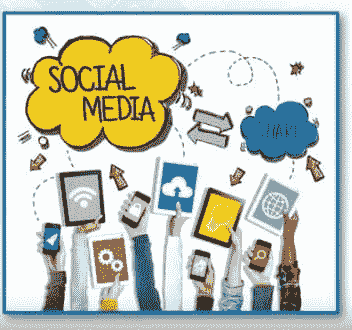
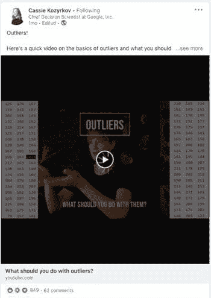
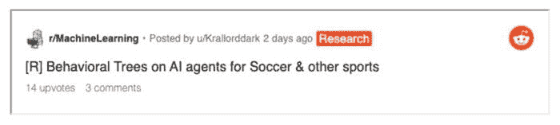
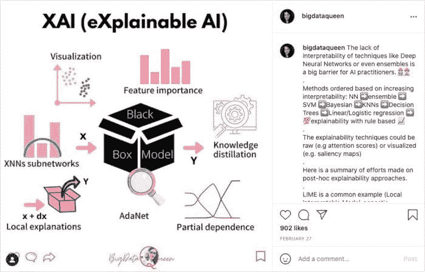
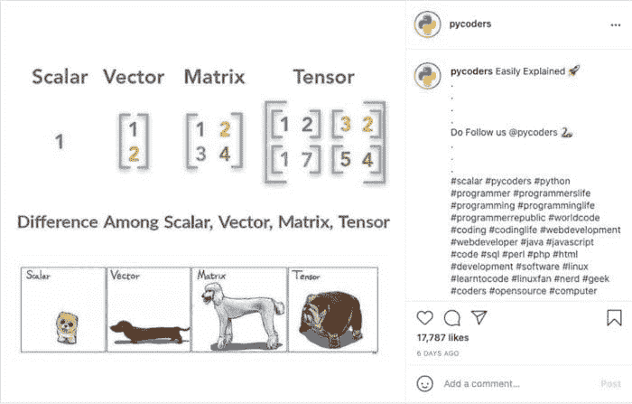
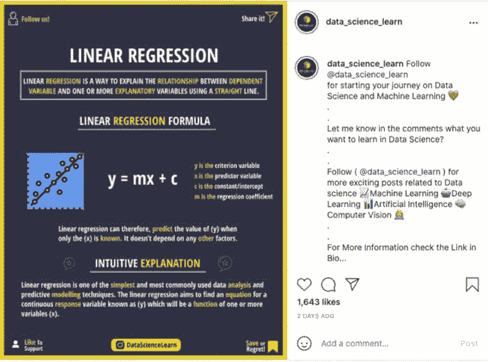
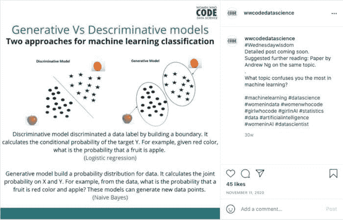

# 通过社交媒体学习数据科学

> 原文：[`www.kdnuggets.com/2021/07/learning-data-science-through-social-media.html`](https://www.kdnuggets.com/2021/07/learning-data-science-through-social-media.html)

comments

**由 [Susan Sivek](https://community.alteryx.com/t5/user/viewprofilepage/user-id/143008) 提供，她是 Alteryx 的数据科学记者**。

* * *

## 我们的前 3 个课程推荐

 1\. [Google 网络安全证书](https://www.kdnuggets.com/google-cybersecurity) - 快速进入网络安全职业道路。

 2\. [Google 数据分析专业证书](https://www.kdnuggets.com/google-data-analytics) - 提升你的数据分析技能

 3\. [Google IT 支持专业证书](https://www.kdnuggets.com/google-itsupport) - 支持你的组织进行 IT 支持

* * *

我的社交媒体动态主要由新闻头条、小狗、烘焙食品和朋友的假期照片组成。然而，我的动态中也撒了点数据科学的内容，恰到好处地刺激我的大脑，让我在无意识地滚动时偶尔清醒过来。

如果你想把社交媒体时间专注于娱乐，我尊重这一点——但如果你希望这些社交算法向你展示真正的算法，请继续阅读。我会分享一些账户和社区，供你轻松一瞥好主意和你可以实现的技巧。

### Twitter

在 Twitter 上，我关注了很多数据科学新闻来源，但我也欣赏那些经常在仅有 280 个字符内分享简单信息的账户，而不链接到更长的资源。

+   Data Science Fact ([@DataSciFact](https://twitter.com/datascifact?lang=en)) 发布关于各种数据科学概念的快速事实。

+   Daily Python Tip ([@python_tip](https://twitter.com/python_tip?lang=en)) 每天提供一个简洁总结的想法或工具建议。

+   One R Tip a Day ([@RLang Tip](https://twitter.com/rlangtip?lang=en)) 由微软的 R 社区团队运营，提供你猜的，每天一个 R 小贴士。

+   Probability Fact ([@ProbFact](https://twitter.com/probfact?lang=en)) 每天提供一个概率概念或见解。

### LinkedIn

除了从你网络中的人们分享的信息中学习外，还有其他方式可以从 LinkedIn 获取有用的数据科学信息。

+   [关注话题标签](https://www.linkedin.com/help/linkedin/answer/92930/use-hashtags-and-follow-topics-on-linkedin?lang=en)。通过关注 LinkedIn 上的特定话题标签（类似于在 Instagram 上关注话题标签），您可以获取更广泛的感兴趣话题的信息。例如， [#datascience](https://www.linkedin.com/feed/hashtag/datascience/) 在许多文章、视频和其他帖子中都有使用。LinkedIn 会将一些带有话题标签的内容插入您的主要动态中。

+   [加入小组](https://www.linkedin.com/help/linkedin/answer/186)。LinkedIn 上有许多与数据科学相关的小组，分享资源、提供网络联系，并主持讨论。查看 [Data Literacy Advocates](https://www.linkedin.com/groups/13653008/)、 [Women in Data Science](https://www.linkedin.com/groups/7049613/) 和 [Big Data and Analytics](https://www.linkedin.com/groups/4332669/)，或者寻找更多适合您兴趣的特定小组，例如 [Supply Chain Data Science](https://www.linkedin.com/groups/12261848/)。

### Reddit

每个与数据相关的子版块都有其自己的重点和氛围。这里列出了一些，当然还有许多其他值得探索的。

+   [r/datascience](https://www.reddit.com/r/datascience/): 这是一个充满活力的社区，拥有超过五十万成员。每周都有讨论学习数据科学和进入该领域的线程。对内容要求较严格，并且有积极的管理。

+   [r/MachineLearning](https://www.reddit.com/r/MachineLearning/): 这个子版块非常庞大（190 万成员），可以更具技术性，许多帖子专注于分享和讨论前沿的学术出版物。

+   [r/learnmachinelearning](https://www.reddit.com/r/learnmachinelearning/): 这个小组对刚刚开始接触机器学习的人更为友好，尽管讨论仍然可以深入。对初学者的问题比上面的两个小组更为包容。

+   [r/statistics](https://www.reddit.com/r/statistics/): 这个社区是“涉及统计理论、软件和应用的所有事物”的空间。您可以安全地探索统计学的最隐秘角落。

### Instagram

是的，在网红和#赞助帖之间，也有一些教育性的数据科学内容！

+   [@bigdataqueen](https://www.instagram.com/bigdataqueen/) 提供了数据科学和机器学习的新视角，您的动态中会出现精美设计的图形和详尽的、有益的说明文字。

+   [@pycoders](https://www.instagram.com/pycoders/) 发布备忘单和快速技巧，还有大量的幽默素材，让您可以从严肃的内容中休息一下（并找到分享给同事的有趣内容）。

+   [@data_science_learn](https://instagram.com/data_science_learn) 分享了一些关于统计学主题和各种数据科学工具的信息帖 —— 同时，也有大量的搞笑图片。

+   Women Who Code 在 Instagram 上有与数据科学和 Python 相关的专业账户。 [Python 账户](https://www.instagram.com/wwcodepython/) 每周会进行“Trivia Tuesday”活动，帮助你复习 Python 基础知识，而 [数据科学账户](https://www.instagram.com/wwcodepython/) 则提供视频片段和统计回顾帖。

[原创](https://community.alteryx.com/t5/Data-Science/Learning-Data-Science-Through-Social-Media/ba-p/771211)。经许可转载。

**个人简介：** 苏珊·库里·西维克（Susan Currie Sivek），博士，是 Alteryx 社区的高级数据科学记者，她与全球观众探讨数据科学概念。她还是 [数据科学混音秀](https://nam02.safelinks.protection.outlook.com/?url=https%3A%2F%2Fcommunity.alteryx.com%2Ft5%2FData-Science-Mixer-Podcast%2Fbg-p%2Fmixer%3Futm_content%3D733996%26utm_source%3Dkdn&data=04%7C01%7Csusan.sivek%40alteryx.com%7Cddeffc120ce04e9c3fbb08d8fcf6fb43%7C522f39d9303d488f9deba6d77f1eafd8%7C0%7C0%7C637537485008963805%7CUnknown%7CTWFpbGZsb3d8eyJWIjoiMC4wLjAwMDAiLCJQIjoiV2luMzIiLCJBTiI6Ik1haWwiLCJXVCI6Mn0%3D%7C1000&sdata=r9ry5awORVvTSc1XCVNR7ffPS3Z7K7GpS8bcpKoI4eE%3D&reserved=0) 播客的主持人。她在学术界和社会科学方面的背景为她调查数据和传达复杂思想的方式提供了丰富的经验，同时她在新闻学中的创意训练也为她的工作增添了独特的视角。

**相关内容：**

+   [你应该关注的十大数据科学领袖](https://www.kdnuggets.com/2019/07/top-10-data-science-leaders.html)

+   [社交媒体和机器学习如何变革自助数据准备](https://www.kdnuggets.com/2017/10/social-media-machine-learning-self-service-data-prep.html)

+   [初学者的十大数据科学项目](https://www.kdnuggets.com/2021/06/top-10-data-science-projects-beginners.html)

### 更多相关内容

+   [数据故事讲述 - 通过数据讲述故事的艺术](https://www.kdnuggets.com/2023/07/manning-data-storytelling-the-art-telling-stories-data.html)

+   [通过 Apache Gobblin 扩展数据管理](https://www.kdnuggets.com/2023/01/scaling-data-management-apache-gobblin.html)

+   [探索思维树提示：AI 如何通过搜索学习推理…](https://www.kdnuggets.com/2023/07/exploring-tree-of-thought-prompting-ai-learn-reason-through-search.html)

+   [通过验证链解锁可靠生成：一个…](https://www.kdnuggets.com/unlocking-reliable-generations-through-chain-of-verification)

+   [Django 框架中的社交用户认证](https://www.kdnuggets.com/2023/01/social-user-authentication-django-framework.html)

+   [一个学习数据科学、机器学习和深度学习的扎实计划](https://www.kdnuggets.com/2023/01/mwiti-solid-plan-learning-data-science-machine-learning-deep-learning.html)
