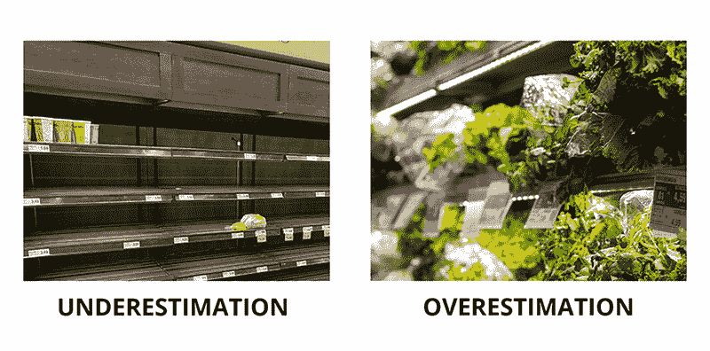
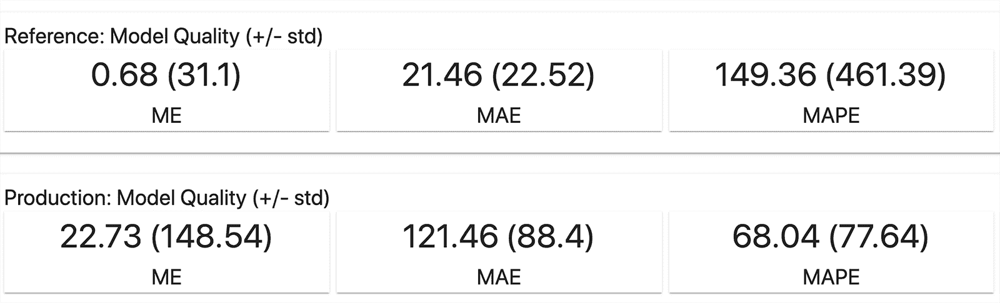
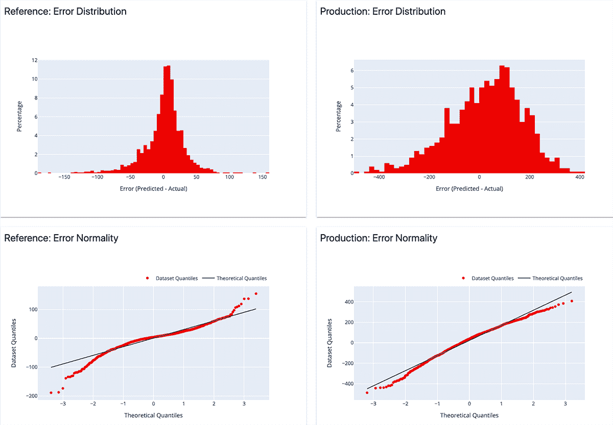
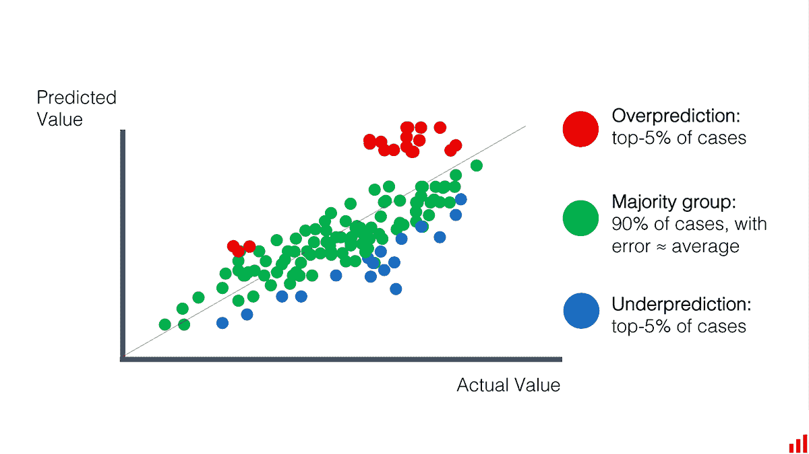
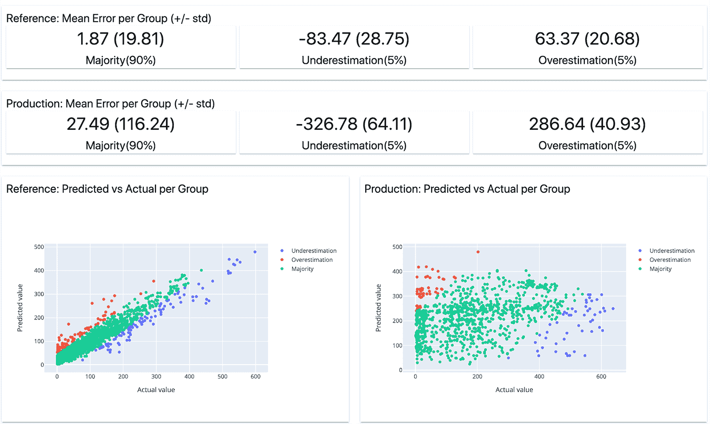
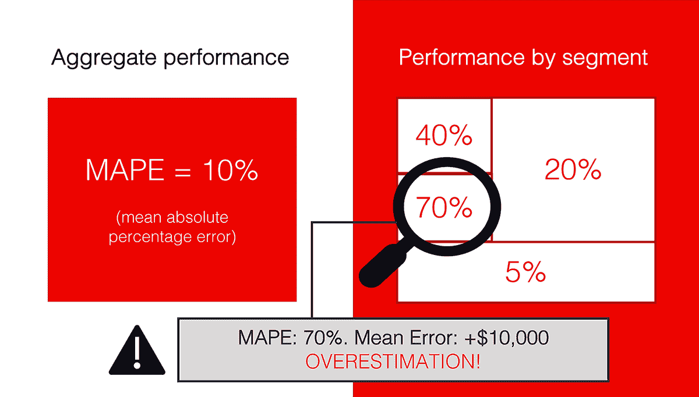
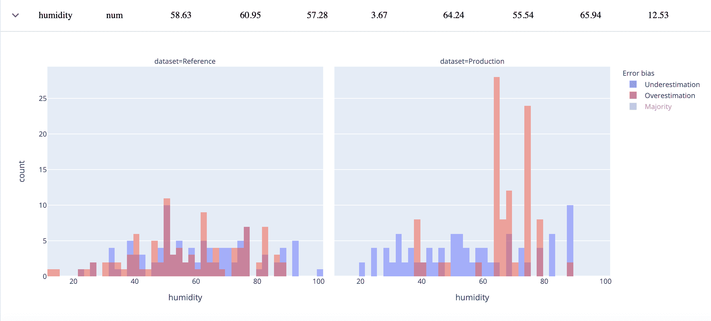
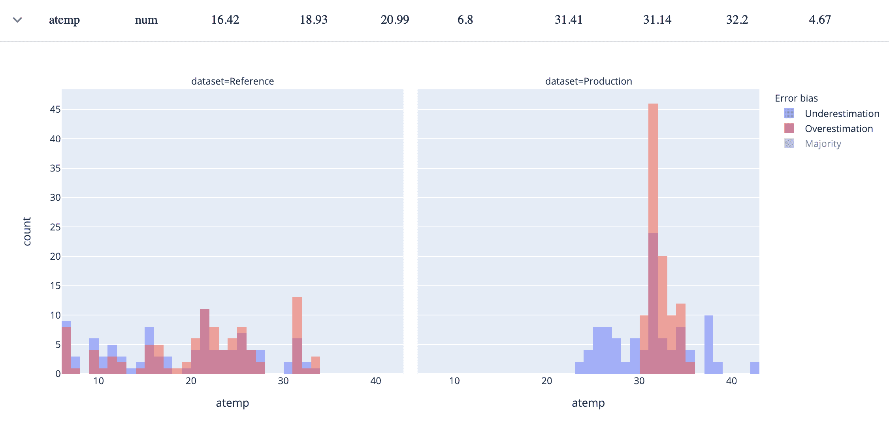
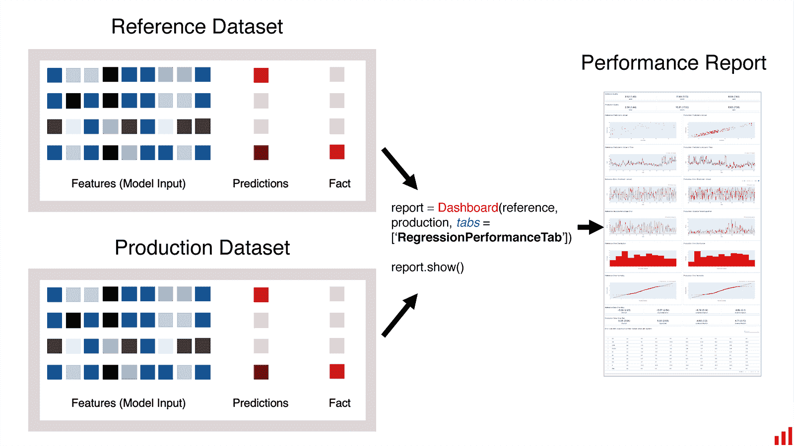

# 从机器学习错误中学习

> 原文：[`www.kdnuggets.com/2021/03/learning-from-machine-learning-mistakes.html`](https://www.kdnuggets.com/2021/03/learning-from-machine-learning-mistakes.html)

评论

**由[Emeli Dral](https://twitter.com/EmeliDral)，Evidently AI 的 CTO 和联合创始人**

图片由作者提供

当我们分析机器学习模型性能时，我们通常关注单一质量指标。对于回归问题，这可能是 MAE、MAPE、RMSE，或者其他最适合问题领域的指标。

在训练实验中优化单一指标绝对是有意义的。这样，我们可以比较不同的模型运行，并选择最佳的那个。

**但当涉及到解决实际业务问题并将模型投入生产时，我们可能需要了解更多信息。**模型在不同用户组中的表现如何？它会产生哪些类型的错误？

在这篇文章中，我将更详细地介绍评估回归模型性能的方法。

### 回归误差：过多还是过少？

当我们预测一个连续变量（如价格、需求等）时，常识定义的错误很简单：我们希望模型预测尽可能接近实际值。

在实际操作中，我们可能不仅关心绝对误差值，还会关注其他标准。例如，我们对趋势的捕捉程度如何，预测值与实际值之间是否有相关性——最后我们的错误符号是什么。

**低估和高估目标值可能会有不同的业务影响。**特别是当模型输出上有一些业务逻辑时。

想象一下你在为一家超市连锁进行需求预测。一些产品是易腐品，根据错误的预测交付过多会导致浪费。高估有明显的成本需要考虑。

图片由作者提供。图片来源于 Unsplash: [1](https://unsplash.com/photos/7n6hNFagvhg), [2](https://unsplash.com/photos/gXnvxmqG2lE)。

**除了经典的误差分析外，我们可能还需要追踪这种误差偏斜**（高估或低估的倾向）及其随时间的变化。这在分析模型验证和生产监控时都很有意义。

为了说明分析误差偏差的概念，让我们通过一个例子来讲解。

### 评估模型性能

假设我们有一个模型来预测城市自行车租赁的需求。（如果你想尝试这个用例，这个[Bike Demand Prediction dataset](https://www.kaggle.com/c/bike-sharing-demand/data)是公开的）。

我们训练了一个模型，模拟了部署，并将其在“生产”环境中的表现与训练集上的表现进行了比较。

实际中，我们需要知道实际情况。一旦我们了解实际需求，就可以计算我们模型的质量，并估计预测的偏差程度。

**在训练中的参考性能和当前生产性能之间，我们可以看到误差的显著增加。**

截图来自 [明显](https://github.com/evidentlyai/evidently) 报告。

**为了更好地理解质量，我们可以查看误差分布。** 这确认了我们已经知道的：误差增加了。也有一些偏向过度估计的偏差。

截图来自 [明显](https://github.com/evidentlyai/evidently) 报告。

**情况并不理想，我们希望深入了解发生了什么。** 我们的业务利益相关者也有相同的期望。这些误差为何发生？具体在哪里？重新训练能否提高质量？我们是否需要工程化新特征或进行进一步的后处理？

这里有一个探索它的想法。

### 观察边缘

聚合质量指标向我们展示了均值性能。然而，这些极端情况往往能提供有用的信息。让我们直接看这些！

**我们可以将误差较高的预测进行分组，并从中学习一些有用的信息。**

我们如何实现这种方法？

我们来计算每个单独预测的误差。然后，我们根据误差的类型创建两个组：

+   **过度估计。** 模型预测的值高于实际值的情况。

+   **低估。** 模型预测的值低于实际值的情况。

我们限制每组的大小，只选择 5%误差最大的极端例子。这样，我们得到了模型过度估计的前 5%预测和模型低估的前 5%预测。

剩余的 90%预测是“多数”。这一组的误差应该接近均值。

这就是我们如何可视化建议的细分。我们希望看到的情况是：大多数预测接近实际值。分析离群值可以带来有意义的洞见。

作者提供的图像。

这如何有用？

**让我们以时间序列为例。** 如果我们建立了一个优秀的模型，并“学习”了数据中的所有信号，误差应该是随机的。应该没有模式。除了少数可能的离群值外，所有组的误差应该接近平均值。有时稍大，有时稍小。但平均而言，差不多相同。

**如果数据中有一些有用的信号可以解释误差，情况可能会有所不同。** 某些特定组可能会有较大的误差。也可能会有明显的低估或高估的偏差。

**在这些情况下，错误可能依赖于特定的特征值。**如果我们能够找到并描述错误高于正常水平的实例，那正是我们想要调查的内容！

### 识别缺陷

在我们的案例中，我们可以看到，过高估计和低估组的错误都显著高于“主要”组的错误。

来自[Evidently](https://github.com/evidentlyai/evidently)报告的截图。

然后我们可以尝试调查和探索新的模式。

为了做到这一点，我们查看 5%-组中的对象，并查看对应的特征值。逐个特征，如果可能的话。

**我们的目标是确定特定特征值与高错误之间是否存在关系。**为了深入了解，我们还需要区分过高估计或低估。

想象一下，我们预测医疗成本，并且始终高估某些人口统计特征的患者的价格？或者，错误是无偏的但很大，我们的模型在特定段上失败了？这就是我们想要找到的洞察。

作者提供的图片。

我们可以制作一个复杂（且计算量大的）算法来执行这一搜索，以查找表现不佳的段落。作为合理的替代方案，我们可以逐个特征进行此分析。

**我们如何做到这一点？让我们绘制特征分布和目标需求，并用颜色标记我们犯高错误的示例。**

在我们的自行车需求预测用例中，我们已经可以得到一些见解。如果我们绘制“湿度”特征，我们可以注意到，当湿度值在 60 到 80 之间时，我们的模型现在显著高估需求（右侧绘制）。

我们在训练数据集中看到了这些值（左侧绘制），但错误在整个范围内都是无偏的和相似的。

来自[Evidently](https://github.com/evidentlyai/evidently)报告的截图。

我们也可以注意到其他模式。例如，在温度方面。当温度高于 30°C 时，模型也会高估需求。

来自[Evidently](https://github.com/evidentlyai/evidently)报告的截图。

我们现在可以怀疑天气发生了变化，新的相关模式出现了。实际上，我们使用的是仅来自一年寒冷月份的数据来训练模型。当模型进入“生产”阶段时，夏天刚刚开始。随着新天气的到来，出现了新的季节性模式，而模型之前未能掌握这些模式。

好消息是，通过查看这些图表，我们可以看到数据中似乎存在一些有用的信号。用新数据重新训练我们的模型可能会有所帮助。

### 如何对我的模型做同样的事情？

我们在[Evidently](https://github.com/evidentlyai/evidently)开源库中实现了这种方法。要使用它，你应该将模型应用数据准备为 pandas DataFrame，包括模型特征、预测和实际（目标）值。

该库可以与单个 DataFrame 或两个 DataFrame 一起使用——如果你想比较模型在生产环境中的表现与训练数据或其他过去的时间段。

图片来源：作者。

回归性能报告将生成一组关于模型性能的图表和一个误差偏差表。该表有助于探索特征值与误差类型和大小之间的关系。

你还可以快速排序特征，以找到那些“极端”组与“多数”组表现不同的特征。这有助于在不需要逐一查看每个特征的情况下，识别最有趣的细分。

你可以在[Github](https://github.com/evidentlyai/evidently)上阅读完整文档。

### 什么时候会有用？

我们相信这种分析在你的模型生命周期中多次使用会很有帮助。你可以用它：

1.  **分析模型测试结果。**例如，一旦你对模型进行了离线测试，或者进行了 A/B 测试或影子部署后。

1.  **进行生产环境中模型的持续监控。**你可以在每次运行批量模型时执行此操作，也可以将其安排为定期任务。

1.  **决定模型是否需要重新训练。**通过查看报告，你可以判断是否需要更新模型，或者重新训练是否会有所帮助。

1.  **调试生产环境中的模型。**如果模型质量出现问题，你可以发现模型表现不佳的细分，并决定如何解决。例如，你可能会为低性能的细分提供更多数据，重建模型或在模型上添加业务规则。

如果你需要一个实际示例，这里有一个[tutorial](https://towardsdatascience.com/how-to-break-a-model-in-20-days-a-tutorial-on-production-model-analytics-25497e2eab9c)关于如何在生产环境中调试机器学习模型性能的教程：“如何在 20 天内破坏一个模型”。

**简介：[Emeli Dral](https://twitter.com/EmeliDral)** 是 Evidently AI 的联合创始人兼首席技术官，她创建了分析和监控机器学习模型的工具。她曾共同创办一家工业 AI 初创公司，并担任 Yandex Data Factory 的首席数据科学家。她是 Coursera 上机器学习和数据分析课程的共同作者，该课程有超过 100,000 名学生。

[原文](https://evidentlyai.com/blog/tutorial-1-model-analytics-in-production)。经许可转载。

**相关：**

+   机器学习模型监控清单：需要跟踪的 7 个事项

+   MLOps：模型监控 101

+   使用平均精度评估目标检测模型

* * *

## 我们的前三大课程推荐

 1\. [谷歌网络安全证书](https://www.kdnuggets.com/google-cybersecurity) - 快速入门网络安全职业。

 2\. [谷歌数据分析专业证书](https://www.kdnuggets.com/google-data-analytics) - 提升你的数据分析能力

 3\. [谷歌 IT 支持专业证书](https://www.kdnuggets.com/google-itsupport) - 支持你所在组织的 IT 工作

* * *

### 更多相关话题

+   [软件错误及权衡：Tomasz Lelek 的新书及…](https://www.kdnuggets.com/2021/12/manning-software-mistakes-tradeoffs-book.html)

+   [新手数据科学家应避免的错误](https://www.kdnuggets.com/2022/06/mistakes-newbie-data-scientists-avoid.html)

+   [可能影响你数据分析准确性的 3 个错误](https://www.kdnuggets.com/2023/03/3-mistakes-could-affecting-accuracy-data-analytics.html)

+   [我在转行数据科学时犯的 5 个错误](https://www.kdnuggets.com/2023/07/5-mistakes-made-switching-data-science-career.html)

+   [避免这 5 个每个 AI 新手常犯的错误](https://www.kdnuggets.com/avoid-these-5-common-mistakes-every-novice-in-ai-makes)

+   [5 个常见的数据科学错误及如何避免它们](https://www.kdnuggets.com/5-common-data-science-mistakes-and-how-to-avoid-them)
