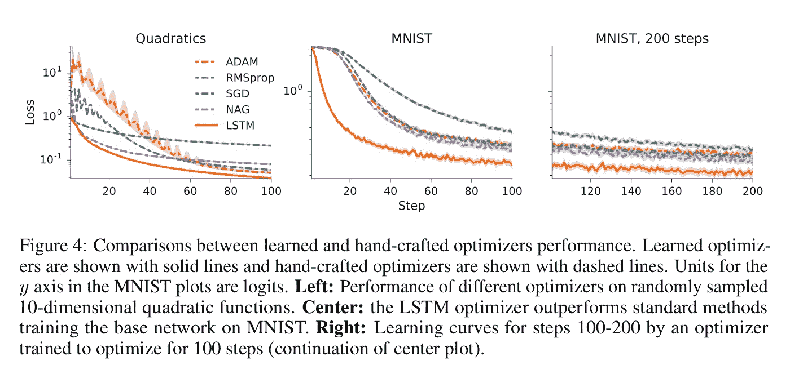
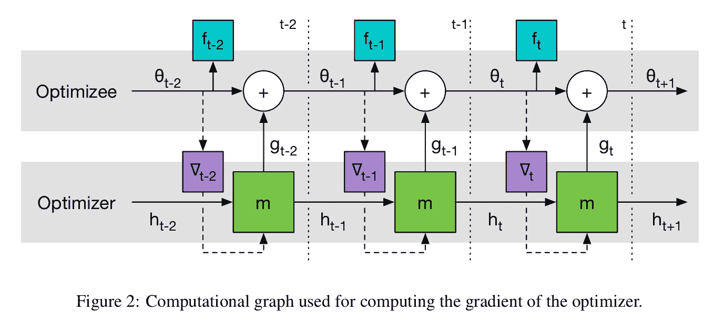
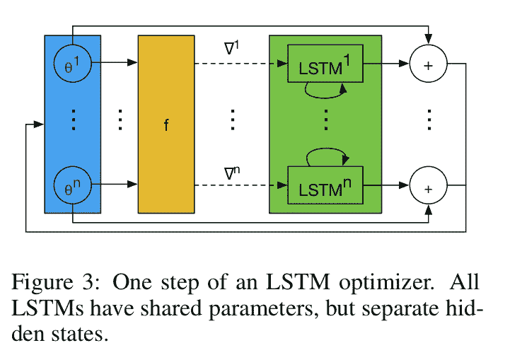
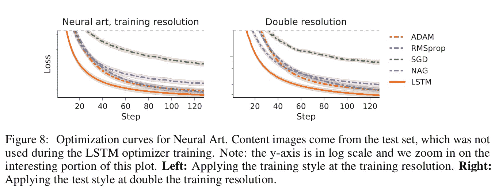
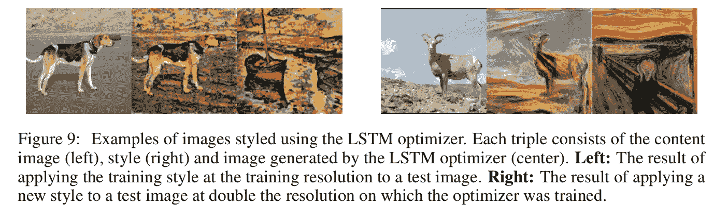
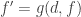
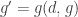
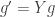

# 通过梯度下降学习学习

> 原文：[`www.kdnuggets.com/2017/02/learning-learn-gradient-descent.html`](https://www.kdnuggets.com/2017/02/learning-learn-gradient-descent.html)

[通过梯度下降学习学习](https://arxiv.org/pdf/1606.04474v2.pdf)，Andrychowicz 等，*NIPS 2016*

阅读这些 NIPS 论文时，让我印象深刻的一点是有些论文的长度是如此之短——在介绍和评估部分之间你可能只会找到一两页！一种通用形式是从问题领域的基本数学模型开始，用函数表示。然后，选择的函数被*学习*，通过进入机器学习工具箱并以潜在的新方式组合现有的构建块。从这个角度看，我们可以真正称机器学习为‘*函数学习*’。

用这种函数的方式思考对我来说是一种回到熟悉领域的桥梁。我们有函数组合。例如，给定一个将图像映射到特征表示的函数*f*，以及一个作为分类器的函数*g*，将图像特征表示映射到对象，我们可以构建一个用*g ○ f*分类图像中的对象的系统。

系统模型中的每个函数可以是学习得来的，也可以直接用某些算法实现。例如，特征映射（或编码）传统上是手动实现的，但越来越多的是通过学习实现的...

> 从手动设计的特征到学习得来的特征的转变在机器学习中取得了巨大成功。

艺术的一部分似乎在于以一种方式定义整体模型，使得单个函数不需要做太多工作（避免输入和目标输出之间差距过大），从而使学习变得更高效/可处理，并且我们可以根据需要为每个函数采用不同的技术。在上述示例中，我们组合了一个用于创建良好表示的学习函数和另一个用于从这些表示中识别对象的函数。

我们可以拥有将现有（学习过的或其他）函数结合起来的高阶函数，当然这也意味着我们可以使用*组合子*。

当我们查看“函数学习器”（机器学习系统）的组件时，我们发现了什么？更多的函数！

> 机器学习中的任务通常可以表达为优化一个在某些领域*θ ∈ Θ*上定义的目标函数*f(θ)*的问题。

*优化器*函数从*f θ*映射到*argmin[θ ∈ Θ] f θ*。标准方法是使用某种形式的梯度下降（例如，SGD——随机梯度下降）。优化领域的一篇经典论文是《优化的无免费午餐定理》，它告诉我们没有通用的优化算法可以主导所有其他算法。因此，为了获得最佳性能，我们需要将优化技术与手头问题的特点匹配：

> ... 针对特定问题子类的专业化实际上是实现普遍性能提升的*唯一*方式。

因此，在为不同类别的问题定义更新规则方面，已经进行了大量研究——在深度学习中，这些包括例如*momentum*、*Rprop*、*Adagrad*、*RMSprop*和*ADAM*。

但如果我们不是手动设计一个优化算法（函数），而是*学习*它呢？通过在我们感兴趣的问题类别上进行训练，我们可以为这一类别学习一个最佳优化器！

> 这项工作的目标是开发一个构建学习算法的程序，使其在特定类别的优化问题上表现良好。将算法设计视为学习问题使我们能够通过示例问题实例来指定我们感兴趣的问题类别。这与通过分析有趣问题的性质并利用这些分析洞察手动设计学习算法的传统方法形成对比。

如果学习的表示最终比手动设计的表示表现更好，那么学习型优化器是否也能比手动设计的优化器表现更好呢？答案确实是肯定的！

> 我们的实验已确认，学习型神经网络优化器与深度学习中使用的最先进优化方法相比表现优越。



实际上，这些学习型优化器不仅表现非常好，还提供了一种有趣的跨问题集迁移学习方式。传统上，*迁移学习*是一个作为独立问题研究的困难领域。但在这种情况下，由于我们正在学习如何学习，直接的*泛化*（机器学习的关键特性，使我们能够在训练集上学习，然后在以前未见过的例子上表现良好）提供了迁移学习！

> 我们见证了显著的迁移能力，例如，在 12,288 参数神经艺术任务上训练的 LSTM 优化器能够在具有 49,512 参数、不同风格和不同内容图像的任务上进行泛化。我们在将其迁移到 MNIST 任务的不同架构时也观察到了类似的令人印象深刻的结果。

### 学习如何学习

从功能性思维来看，这是我对发生情况的心理模型……起初，你可能手动编码了一个分类器函数*c*，它将某些*Input*映射到一个*Class*：

```py

   c :: Input -> Class
```

通过机器学习，我们发现对于某些类型的函数，学习一个实现比手动编码更为有效。一个优化函数*f*接受一些*TrainingData*和一个现有的分类器函数，然后返回一个更新后的分类器函数：

```py

   type Classifier = (Input -> Class)
   f :: TrainingData -> Classifier -> Classifier
```

我们现在的做法是，既然我们可以学习一个函数，为什么不直接学习*f*本身呢？

```py

   type Optimiser = (TrainingData -> Classifier -> Classifier)
   g :: TrainingData -> Optimiser -> Optimiser
```

设*ϕ*为我们（优化器）的（待学习的）更新规则。我们需要评估在多次迭代中*g*的效果，因此*g*使用递归神经网络（LSTM）进行建模。该网络在时间*t*的状态由*h[t]*表示。

假设我们正在训练*g*以优化一个优化函数*f*。设*g(ϕ)*导致一个学习到的*f θ*参数集，训练*g(ϕ)*的损失函数使用*f*经过*g(ϕ)*训练后的预期损失作为*其*预期损失。

> 我们可以通过对*ϕ*进行梯度下降来最小化*L(ϕ)*的值。



为了扩展到数万或更多的参数，优化器网络*m*在目标函数的参数上逐坐标操作，类似于 RMSProp 和 ADAM 等更新规则。每个坐标的更新规则是使用一个具有遗忘门架构的 2 层 LSTM 网络实现的。

> 网络输入单个坐标的优化梯度以及之前的隐藏状态，并输出对应优化参数的更新。我们称这种架构为 LSTM 优化器。



### 运行中的学习型学习者

> 我们将训练好的优化器与深度学习中使用的标准优化器进行比较：SGD、RMSprop、ADAM 以及 Nesterov 加速梯度（NAG）。对于每个优化器和每个问题，我们调整了学习率，并报告了在每个问题上给出最佳最终误差的学习率结果。

优化器被训练用于 10 维二次函数、优化 MNIST 上的小型神经网络、CIFAR-10 数据集，以及学习用于神经艺术的优化器（例如，参见[纹理网络](https://blog.acolyer.org/2016/09/23/texture-networks-feed-forward-synthesis-of-textures-and-stylized-images/)）。

这里是训练的 LSTM 优化器在 Neural Art 任务上的性能与标准优化器的对比：



而且因为它们非常漂亮……这里有一些由 LSTM 优化器风格化的图像！



### 系统模型及学习到的组件

所以就是这样。看起来在不久的将来，最先进的技术将涉及使用学习到的优化器，就像今天使用学习到的特征表示一样。这似乎是机器可以设计出比最优秀的人类设计师更优算法的另一个交叉点。当然，学习学习算法有特别强大的潜力，因为更好的学习算法可以加速学习……

在这篇论文中，作者探讨了如何构建一个函数*g*来优化函数*f*，使得我们可以写出：



其中*d*是一些训练数据。

以这种方式表达时，显然会引发一个问题，如果我写：



或者更进一步使用 Y 组合子找到一个固定点：



发人深省...

**简介： [Adrian Colyer](https://twitter.com/adriancolyer)** 曾任 SpringSource 的 CTO，随后是 VMware 和 Pivotal 的应用 CTO。他现在是伦敦 Accel Partners 的风险合伙人，与欧洲的早期阶段和初创公司合作。*如果你正在从事有趣的技术相关业务，他很乐意听到你的消息：你可以通过 acolyer at accel dot com 联系他*。

[原文](https://blog.acolyer.org/2017/01/04/learning-to-learn-by-gradient-descent-by-gradient-descent/)。转载许可。

**相关：**

+   标准模型拟合方法的简明概述

+   神经网络中的深度学习：概述

+   人工智能与 2030 年的生活

* * *

## 我们的三大课程推荐

 1\. [Google 网络安全证书](https://www.kdnuggets.com/google-cybersecurity) - 快速进入网络安全职业

 2\. [Google 数据分析专业证书](https://www.kdnuggets.com/google-data-analytics) - 提升你的数据分析技能

 3\. [Google IT 支持专业证书](https://www.kdnuggets.com/google-itsupport) - 支持你的组织的 IT 工作

* * *

### 更多相关主题

+   [你应该知道的 5 个梯度下降和成本函数的概念](https://www.kdnuggets.com/2020/05/5-concepts-gradient-descent-cost-function.html)

+   [回归基础，第二部分：梯度下降](https://www.kdnuggets.com/2023/03/back-basics-part-dos-gradient-descent.html)

+   [梯度下降：优化的山地徒步指南](https://www.kdnuggets.com/gradient-descent-the-mountain-trekker-guide-to-optimization-with-mathematics)

+   [梯度消失问题：原因、后果和解决方案](https://www.kdnuggets.com/2022/02/vanishing-gradient-problem.html)

+   [停止学习数据科学以寻找目标，并寻找目标来...](https://www.kdnuggets.com/2021/12/stop-learning-data-science-find-purpose.html)

+   [通过构建 15 个神经网络项目学习深度学习](https://www.kdnuggets.com/2022/01/15-neural-network-projects-build-2022.html)
