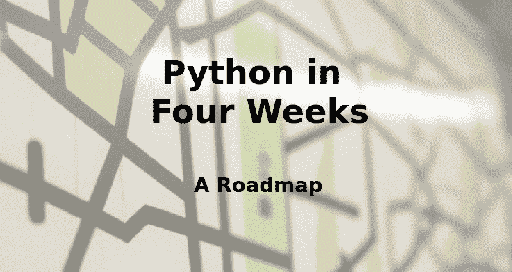

# 四周学会 Python：学习路线图

> 原文：[`www.kdnuggets.com/2023/02/learning-python-four-weeks-roadmap.html`](https://www.kdnuggets.com/2023/02/learning-python-four-weeks-roadmap.html)

图片来源：作者

现在是时候学习 Python 了。这不仅仅是我的建议：Python 目前位居[TIobe 指数](https://www.tiobe.com/tiobe-index/)（2023 年 2 月）的编程语言流行度榜首。Python 的流行有[很多原因](https://www.pulumi.com/why-is-python-so-popular/)，你可能有自己学习它的理由，但就我们的目的而言，Python 是数据科学领域的主流通用语言。这就是为什么你现在需要学习它。

* * *

## 我们的前三大课程推荐

 1\. [谷歌网络安全证书](https://www.kdnuggets.com/google-cybersecurity) - 快速进入网络安全职业的捷径。

 2\. [谷歌数据分析专业证书](https://www.kdnuggets.com/google-data-analytics) - 提升你的数据分析技能

 3\. [谷歌 IT 支持专业证书](https://www.kdnuggets.com/google-itsupport) - 支持你的组织 IT 事务

* * *

学习编程可能是耗时、混乱且令人沮丧的。编程主题广泛多样，在线上关于学习 Python 的资源非常多，信息过载很容易让人放弃这个想法。学习一种新的编程语言（或编程本身）所需的时间也可能让人却步。

考虑到以上因素，我们制定了以下四周学习 Python 的路线图。该程序包含经过筛选的免费资源，按天和周进行组织，因此你可以明确知道每一天应该学习什么内容。为了提供额外的指导，我们还请 ChatGPT 每天提供几个相关的提示，以便你可以使用这些提示向 ChatGPT 提问，从而深入学习当天的主题。

所以，这就是：四周学会 Python 的路线图。请注意，每一天的要点是用于 ChatGPT 的提示，以便进一步学习当天的主题。希望这种略具创新的方法对你的编程学习之旅有所帮助。

# 第 1 周：Python 入门

**第 1 天**：[Python 简介](https://www.w3schools.com/python/python_intro.asp)、[安装 Python 和 IDLE](https://realpython.com/installing-python/)、[基本数据类型](https://www.tutorialspoint.com/python/python_data_types.htm)（int、float、str 等）和[变量](https://www.tutorialspoint.com/python/python_variables.htm)

+   Python 中的基本数据类型有哪些？它们是如何使用的？

+   如何在 Python 中声明和赋值变量？

+   如何在 Python 中将一种数据类型转换为另一种数据类型？

**第 2 天**：[运算符](https://www.tutorialspoint.com/python/python_operators.htm)（算术、比较、逻辑等），[控制语句](https://www.tutorialspoint.com/python/python_if_else.htm)（if-else、for 循环等）

+   Python 中有哪些不同类型的运算符？如何使用它们？

+   如何在 Python 中使用条件语句，如 if-else？能否提供一些示例？

+   如何在 Python 中使用循环，如 for 和 while？能否提供一些示例？

**第 3 天**：[函数](https://www.tutorialspoint.com/python/python_functions.htm)，[模块和库](https://docs.python.org/3/tutorial/modules.html)，[读写文件](https://www.tutorialspoint.com/python/python_files_io.htm)

+   什么是 Python 中的函数？如何定义和调用它们？

+   什么是 Python 中的库和模块？如何导入和使用它们？

+   如何在 Python 中读写文件？能否提供一些示例？

**第 4 天**：[面向对象编程简介](https://realpython.com/python3-object-oriented-programming/)，[类和对象](https://docs.python.org/3/tutorial/classes.html)

+   什么是面向对象编程，它与其他编程范式有何不同？

+   如何在 Python 中定义类和对象？能否提供一些示例？

+   如何在 Python 中使用继承和多态？能否提供一些示例？

**第 5 天**：回顾本周学习的内容，[练习编程挑战](https://www.hackerrank.com/domains/python) 和 完成一个迷你项目

你可以从这些资源和提示开始，以便对第 1 周涵盖的主题有一个良好的理解。请记住，在线上还有许多其他资源，所以可以随意探索，找到最适合你的资源。

# 第 2 周：中级与科学 Python

**第 1 天**：[继承与多态](https://realpython.com/inheritance-composition-python/)，以及 [使用 try-except 进行错误处理](https://docs.python.org/3/tutorial/errors.html)

+   什么是 Python 中的继承？它如何用于代码重用？

+   多态在 Python 中如何工作？有哪些实际应用场景？

+   如何在 Python 中使用 try-except 语句处理错误？有哪些最佳实践？

**第 2 天**：[文件处理与异常](https://docs.python.org/3/tutorial/inputoutput.html#reading-and-writing-files)，处理 [CSV 文件](https://realpython.com/python-csv/) 和 [JSON 文件](https://realpython.com/python-json/)

+   如何在 Python 中打开和读取文件？有哪些常见的文件模式？

+   在 Python 中处理文件时，处理异常有哪些最佳实践？

+   如何在 Python 中处理 CSV 文件和 JSON 文件？你可以使用哪些库来简化这个过程？

**第 3 天**：[NumPy](https://numpy.org/doc/stable/user/quickstart.html) 和 [Pandas](https://pandas.pydata.org/docs/user_guide/10min.html) 简介，涵盖数组、矩阵和数据框

+   NumPy 在 Python 中是什么，它如何用于数值计算？

+   如何在 NumPy 中处理数组和矩阵，有哪些常见的操作？

+   Pandas 在 Python 中是什么，它如何用于数据操作和分析？

**第 4 天**：使用 [Matplotlib](https://matplotlib.org/stable/contents.html) 和 [Seaborn](https://seaborn.pydata.org/introduction.html) 进行数据分析和可视化

+   Matplotlib 在 Python 中是什么，它如何用于数据可视化？

+   使用 Matplotlib 可以创建哪些类型的图表和图形，如何自定义它们？

+   Seaborn 与 Matplotlib 有何不同，你可能在什么情况下选择其中一个？

**第 5 天**：复习本周涉及的主题，[练习编码挑战](https://pythonprinciples.com/challenges/)，并完成一个迷你项目

这些资源和提示将帮助你对第 2 周涵盖的主题有一个坚实的理解。你也可以探索其他在线资源来补充学习。

# 第 3 周：数据存储、网络应用程序和部署

**第 1 天**：数据库操作，第一部分：[SQL 和数据库管理简介](https://www.w3schools.com/sql/)，[使用 Python 连接数据库](https://docs.python.org/3/library/sqlite3.html)，[使用 SQL 查询和操作数据](https://www.w3schools.com/sql/sql_insert.asp)

+   SQL 是什么，如何使用它与数据库互动？

+   如何使用 Python 连接到数据库，有哪些流行的库可以使用？

+   如何在 Python 中执行 SQL 查询，以及一些基本的 SQL 操作用于查询和操作数据？

**第 2 天**：数据库操作，第二部分：高级 [SQL](https://www.w3schools.com/sql/sql_join.asp) [操作](https://www.w3schools.com/sql/sql_groupby.asp)，[存储过程](https://www.w3schools.com/sql/sql_stored_procedures.asp) 和 [事务](https://www.tutorialspoint.com/sql/sql-transactions.htm)，以及 [NoSQL 数据库](https://realpython.com/introduction-to-mongodb-and-python/) 和 Python

+   一些高级 SQL 操作，如连接和子查询，如何使用 Python 执行这些操作？

+   存储过程和事务是什么，如何使用它们简化和优化数据库操作？

+   什么是 NoSQL，它与传统关系数据库有何不同？有哪些 NoSQL 数据库可以与 Python 一起使用？

**第 3 天**：[Flask 网络开发简介](https://flask.palletsprojects.com/en/1.1.x/)，[Flask 中的表单和验证](https://flask.palletsprojects.com/en/1.1.x/patterns/wtforms/)，[Flask 中的数据库操作](https://flask.palletsprojects.com/en/1.1.x/tutorial/database/)

+   Flask 是什么？你如何使用它在 Python 中构建 Web 应用程序？

+   你如何在 Flask 中创建和验证表单？有哪些最佳实践？

+   你如何将数据库集成到 Flask 应用程序中？在 Flask 中处理数据库有哪些常见模式？

**第 4 天**： [将 Web 应用程序部署到云端](https://flask.palletsprojects.com/en/1.1.x/deploying/)（例如，Heroku、AWS）

+   部署 Web 应用程序的一些热门云平台有哪些，比如 Heroku 和 AWS？

+   你如何将 Flask 应用程序部署到云平台上？有哪些最佳实践？

+   你如何配置和管理云数据库？在扩展和性能方面有哪些考虑？

**第 5 天**：复习本周学习的主题，[练习编码挑战](https://www.hackerrank.com/domains/databases)，并完成一个 迷你项目

这些资源和提示将帮助你学习在 Python 中使用数据库的基础知识。你还可以探索其他在线资源来补充你的学习。

# 第四周：综合运用并展望未来

**第 1 天**：复习所有已学的主题，解决 [编码挑战](https://www.interviewkickstart.com/blog/advanced-python-coding-challenges)

**第 2 天**：练习解决实际问题并实施 [迷你项目](https://realpython.com/tutorials/projects/)

**第 3 天**： 完善你的作品集，记录项目并 与社区分享

**第 4 天**：通过 阅读博客、观看教程 和参与 [在线论坛](https://www.kaggle.com/discussion) 来提升你的知识

**第 5 天**：继续练习和探索新主题，开始一个新项目，并继续你的学习之旅

这些资源将帮助你展望未来的 Python 学习，并在前几周学到的基础上进一步发展。务必关注实际项目，讨论在线论坛中的问题，并且不要忘记 ChatGPT 是一个很有用的资源。你还可以探索其他在线资源来补充你的学习。

# 总结

这是一个全面的计划，将为你提供坚实的 Python 基础。然而，学习是一个持续的过程，需要奉献和努力，所以请确保每天练习编程，并花时间理解你正在学习的概念。祝好运！

**[马修·梅约](https://www.linkedin.com/in/mattmayo13/)** （**[@mattmayo13](https://twitter.com/mattmayo13)**）是一名数据科学家以及 KDnuggets 的主编，这是一个开创性的在线数据科学和机器学习资源。他的兴趣包括自然语言处理、算法设计与优化、无监督学习、神经网络以及自动化机器学习方法。马修拥有计算机科学硕士学位和数据挖掘研究生文凭。可以通过 editor1 at kdnuggets[dot]com 联系他。

### 更多相关主题

+   [掌握数据分析的力量：四种数据分析方法](https://www.kdnuggets.com/2023/03/master-power-data-analytics-four-approaches-analyzing-data.html)

+   [数据分析：四种数据分析方法及其有效应用](https://www.kdnuggets.com/2023/04/data-analytics-four-approaches-analyzing-data-effectively.html)

+   [KDnuggets 新闻，12 月 14 日：3 门免费机器学习课程](https://www.kdnuggets.com/2022/n48.html)

+   [完整的机器学习学习路线图](https://www.kdnuggets.com/2022/12/complete-machine-learning-study-roadmap.html)

+   [免费的数据科学学习路线图：适用于所有级别，IBM 提供](https://www.kdnuggets.com/a-free-data-science-learning-roadmap-for-all-levels-with-ibm)

+   [机器学习算法选择路线图](https://www.kdnuggets.com/roadmap-to-machine-learning-algorithm-selection)
