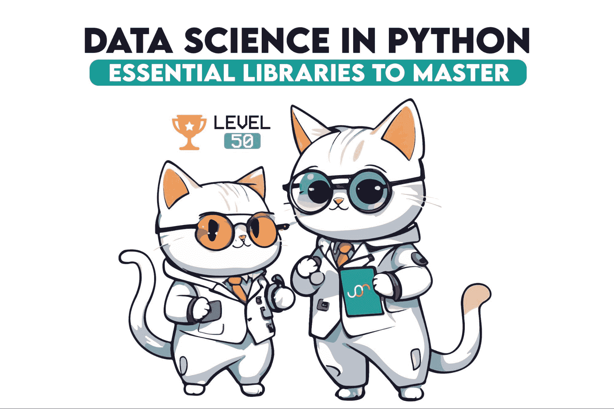
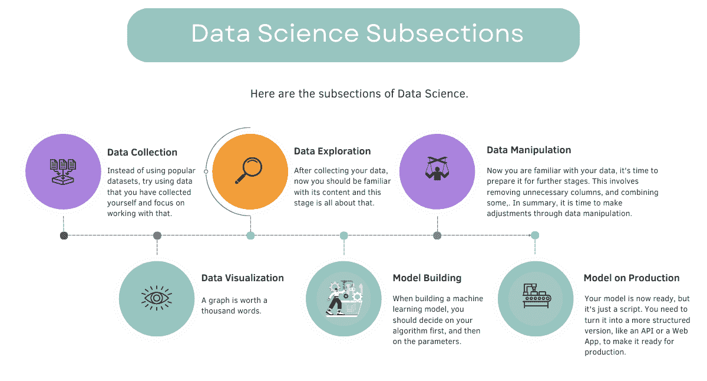
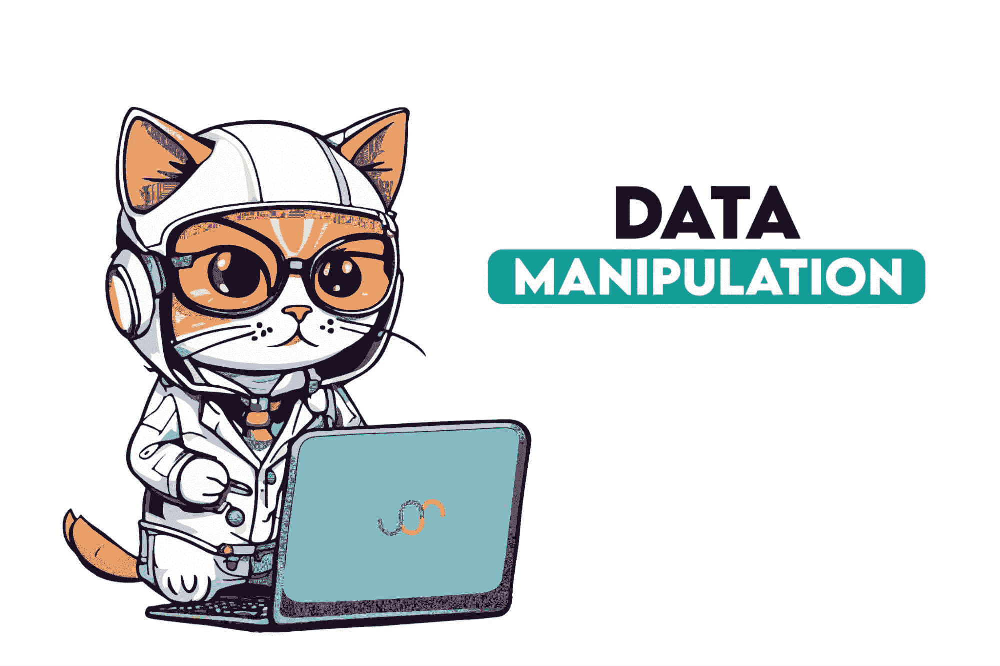

# Level 50 数据科学家：需要了解的 Python 库

> 原文：[`www.kdnuggets.com/level-50-data-scientist-python-libraries-to-know`](https://www.kdnuggets.com/level-50-data-scientist-python-libraries-to-know)

图片来源：作者

数据科学仍然是 21 世纪最热门的职位之一。因此，对于数据科学的好奇心也就不足为奇了。但首先，什么是数据科学？

* * *

## 我们的前三个课程推荐

 1\. [谷歌网络安全证书](https://www.kdnuggets.com/google-cybersecurity) - 快速进入网络安全职业的快车道。

 2\. [谷歌数据分析专业证书](https://www.kdnuggets.com/google-data-analytics) - 提升你的数据分析技能

 3\. [谷歌 IT 支持专业证书](https://www.kdnuggets.com/google-itsupport) - 支持你的组织 IT

* * *

数据科学是一个跨学科领域，包括来自不同领域的各种元素，如数据可视化、模型构建和数据处理。

在本文中，我们将深入探讨这些元素，并通过使用 Python 探索可以应用这些元素的库。无论你是专业人士还是自认为是初学者，本文一定会拓展你的知识。让我们开始吧！

图片来源：作者

# 第一步：数据收集

数据收集意味着从网络上整合信息的过程。

你可能会看到不同的数据项目，这些项目包括合成数据集或来自 Kaggle 的数据集。

即使这对初学者来说很好，但如果你想获得一份有竞争力的工作，你应该做更多的准备。

在 Python 中，有很多选择来实现这一点，让我们深入了解其中的三个。

## Scrapy

这是一个用于 Python 的网页爬取框架，适用于大规模数据提取。

它比 BeautifulSoup 更复杂，允许进行更复杂的数据收集。

Scrapy 的一个独特功能是其高效处理异步请求的能力，使其在大规模抓取任务中更快。如果你是新手，接下来的内容更适合你。

## BeautifulSoup

BeautifulSoup 用于解析 HTML 和 XML 文档。它比 Scrapy 更简单、更友好，因此非常适合初学者或简单的抓取任务。

BeautifulSoup 的一个显著特点是它在解析即使是格式不良的 HTML 时的灵活性。

## Selenium

Selenium 主要用于自动化 Web 浏览器。它非常适合从需要互动的网站抓取数据，例如填写表单或包含 JavaScript 驱动的内容。

它的新颖功能是能够自动化和与网页交互，仿佛一个人正在浏览，从而允许从动态网页中收集数据。

# 第 2 步：数据探索

现在你有数据，但你应该探索它以查看其特性。

## Scipy

Scipy 用于科学和技术计算。

与 numpy 相比，它更侧重于高级计算，提供了如优化、积分和插值等附加功能。

Scipy 的一个独特特点是其针对不同科学计算任务的广泛子模块集合。

## Numpy

它是 Python 中与数据科学相关的最重要的库之一。

它声名显赫的最大原因在于其数组对象。虽然 Scipy 基于 Numpy，但 Numpy 本身也能单独工作。

一个显著特点是其执行高效数组计算的能力，这实际上是它在数据科学中如此重要的原因，不过下一个也同样重要。

## Pandas

Pandas 提供了易于使用的数据结构，如数据帧，以及适合通过数据帧操作数据的数据分析工具。

Pandas 的一个新颖之处在于 DataFrames，这使其与其他数据处理工具有所不同，提供了广泛的数据处理和分析能力。

# 第 3 步：数据处理

作者提供的图片

数据处理是你在准备数据以便进行下一阶段的过程。

## Pandas

Pandas 提供了如 DataFrame 这样的数据结构，使一切操作变得更简单。因为 Pandas 定义了太多的内置函数，它将你的 100 行代码变成了 2 个内置函数。

它还具有数据可视化能力和数据探索功能，使其比其他 Python 库更具通用性。

# 第 4 步：数据可视化

数据可视化使你能够在一页上讲述完整的故事。为了做到这一点，本节将涵盖其中的 3 种。

## Matplotlib

如果你使用 Python 可视化数据，你就知道 matplotlib 是什么了。它是一个 Python 库，用于创建各种类型的图形，如静态的、交互式的甚至是动画的。

它是一个比其他库更具可定制性的数据显示库。你几乎可以控制图表的任何元素。

## Seaborn

Seaborn 基于 Matplotlib 构建，并提供了相同图表的不同视角，如条形图。

与 Matplotlib 相比，它用于创建复杂可视化更简单，并且与 Pandas DataFrames 完全集成。

## Plotly

Plotly 比其他库更具交互性。你甚至可以用它创建仪表板，还可以将你的代码与 Plotly 集成，在 Plotly 网站上查看你的图表。

如果你想了解更多，这里是 [Python 数据可视化库](https://www.stratascratch.com/blog/4-python-data-visualization-libraries-you-can-t-do-without/?utm_source=blog&utm_medium=click&utm_campaign=kdn+python+libraries+to+know)。

# 步骤 5：模型构建

模型构建是你最终可以看到你的行动结果的步骤，以进行预测。为此，我们仍有太多的库可用。

## Sci-kit Learn

最著名的 Python 机器学习库是 Sci-kit Learn。它提供了简单而高效的功能，可以在几秒钟内构建模型。当然，你可以自己开发许多这些功能，但你愿意写 100 行代码而不是 1 行吗？

它的新颖特点是将算法的综合集合打包在一个包中。

## TensorFlow

TensorFlow 由 Google 创建，更适合高阶模型，如深度学习，并提供构建大规模神经网络的高阶功能，相比之下，Scikit-learn 主要提供基础功能。此外，还有许多免费的工具，也是由 Google 创建，使学习 TensorFlow 更加轻松。

## Keras

Keras 提供了一个高级神经网络 API，并且能够在 TensorFlow 之上运行。它比 TensorFlow 更注重快速实验深度神经网络。

# 步骤 6：生产环境中的模型

现在你已经有了模型，但这只是脚本。为了使其更有意义，你应该将模型转化为 Web 应用程序或 API，使其准备好用于生产。

## Django

最著名的 Web 框架允许你以结构化的方式开发模型。它比 Flask 和 FastAPI 更复杂，但其原因在于它具有许多内置功能，如管理面板。

以 Flask 为例，你需要从零开始开发许多东西，但如果你对 Web 框架了解不多，这里是一个很好的起点。

## Flask

Flask 是一个用于 Python 的微型 Web 框架，借助它你可以更容易地开发自己的 Web 应用程序或 API。它比 Django 更灵活，更适合较小的应用程序。

## FastAPI

FastAPI 速度快且易于使用，这使其变得更受欢迎。

FastAPI 的一个独特特点是其自动生成文档和使用 Python 类型提示进行内置验证。

如果你想了解更多，这里是 [18 大 Python 库](https://www.stratascratch.com/blog/top-18-python-libraries-a-data-scientist-should-know/?utm_source=blog&utm_medium=click&utm_campaign=kdn+python+libraries+to+know)。

# 奖励步骤：云系统

在这个阶段，你已经拥有了一切，但在自己的环境中。为了将模型分享给世界并进一步测试，你应该与他人分享它们。为此，你的 Web 应用程序或 API 应该在服务器上运行。

## Heroku

一个支持多种编程语言的云平台即服务 (PaaS)。

相比 AWS，它对初学者更友好，也提供更简单的网页应用部署过程。如果你是一个完全的初学者，它可能更适合你，比如 PythonAnywhere。

## PythonAnywhere

PythonAnywhere 是一个基于 Python 编程语言的在线开发环境，同时提供网页托管服务，从其名称就可以理解。

相比其他工具，它更专注于特定于 Python 的项目。如果你在第 6 步选择了 Flask，你可以将你的模型上传到[pythonanywhere](https://www.pythonanywhere.com/)，它也提供了一个免费的功能。

## AWS（亚马逊网络服务）

AWS 有太多不同的选项，每个功能都有不同的选择。如果你打算选择一个数据库，即使是它，也有太多的选择。

它比其他工具更复杂和全面，适合大规模操作。

比如如果你在前一部分选择了 django，并花时间创建一个大规模的网页应用程序，你的下一个选择可能会是 AWS。

# 结束语

在这篇文章中，我们探讨了数据科学中使用的主要 Python 库。在进行数据科学项目时，请记住，没有一种**终极**的方法。我希望这篇文章能向你介绍不同的工具。

****[Nate Rosidi](https://twitter.com/StrataScratch)**** 是一名数据科学家，专注于产品策略。他还是一位兼任教授，教授分析学，并且是 StrataScratch 的创始人，这是一个帮助数据科学家准备面试的在线平台，提供来自顶级公司的真实面试问题。Nate 撰写有关职业市场的最新趋势，提供面试建议，分享数据科学项目，并涵盖所有 SQL 相关内容。

### 更多相关话题

+   [KDnuggets 新闻，4 月 13 日：数据科学家应该知道的 Python 库](https://www.kdnuggets.com/2022/n15.html)

+   [每个数据科学家都应该知道的三个 R 库（即使你使用 Python）](https://www.kdnuggets.com/2021/12/three-r-libraries-every-data-scientist-know-even-python.html)

+   [每个数据科学家都应该知道的 10 个 Python 库](https://www.kdnuggets.com/10-python-libraries-every-data-scientist-should-know)

+   [2022 年数据科学家应该知道的 Python 库](https://www.kdnuggets.com/2022/04/python-libraries-data-scientists-know-2022.html)

+   [每个数据工程师都应该知道的 7 个 Python 库](https://www.kdnuggets.com/7-python-libraries-every-data-engineer-should-know)

+   [初级数据科学家：下一阶段](https://www.kdnuggets.com/2022/02/junior-data-scientist-next-level.html)
