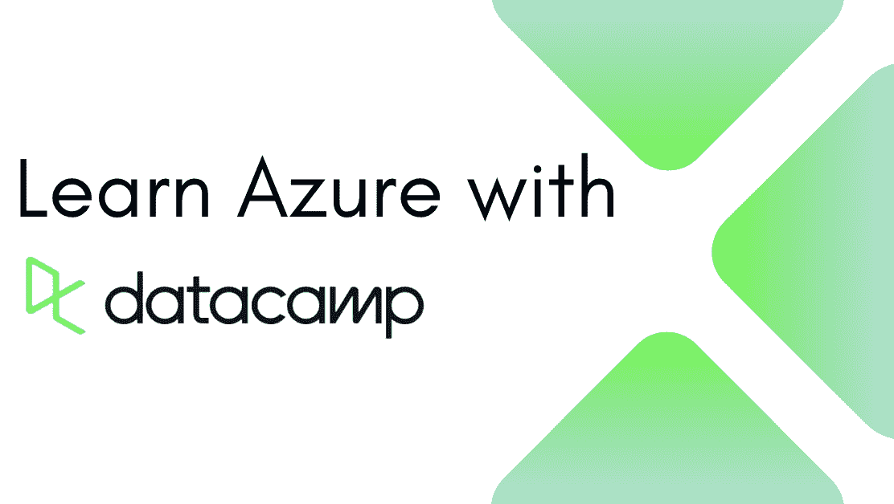

# 通过 DataCamp 的新 Azure 认证提升自我

> 原文：[`www.kdnuggets.com/level-up-with-datacamps-new-azure-certification`](https://www.kdnuggets.com/level-up-with-datacamps-new-azure-certification)

作者提供的图片

当你决定成为一名数据专业人士时，你知道一件事：学习永无止境。跟上市场上的新知识或提升技能以保持竞争力可能会很困难。

KDnuggets 将帮助你完成这段旅程。

我们想介绍 [DataCamp 的新 Azure](http://datacamp.pxf.io/q4jAdq) 学习课程，在这里你可以获得认证并开启你的新旅程。

## 我应该学习 Azure 吗？

在今天的市场上，Azure 认证和知识是科技行业中最受追捧的。如果你希望在云计算、大型企业基础设施和可扩展性方面发展事业——你需要学习 Azure。

但为什么呢？

如果你看看当前市场，更多初创公司正在进入，它们需要按需的 IT 资源。这就是云计算成为每个初创公司必需的资产的原因！话虽如此——它们需要合适的专业人士来处理这些任务。

获得 Azure 证书不仅会增加你的知识和技能，还会使你在对这类专业人士需求高但供应少的市场中具有很强的竞争力。

你明白我想表达的意思，对吧？

工作保障和高薪酬！

## DataCamp 的 Azure 认证

认证链接：[DataCamp 的 Azure 认证](http://datacamp.pxf.io/q4jAdq)

这项 [认证](http://datacamp.pxf.io/q4jAdq) 与微软共同创建，让你从基础开始。你将掌握云计算的基本概念、模型、公共/私有和混合云，同时深入了解基础设施即服务（IaaS）、平台即服务（PaaS）和软件即服务（SaaS）。

一旦你对 Azure 及其架构组件和服务（如计算、网络和存储）有了良好的基础理解，你将继续学习用于保护、管理和管理 Azure 的工具。

你将无需编写任何代码即可学习所有这些内容。

一旦你对 Azure 的所有内容有了良好的理解并掌握了相关知识，你的下一步将是完成 [AZ-900 认证](http://datacamp.pxf.io/q4jAdq)——通过 DataCamp 你可以享受 50% 的折扣！

就这样——你已 [认证](http://datacamp.pxf.io/q4jAdq)！

## 总结

作为一名数据专业人士，你应该始终寻找新的方法来提升技能和拓宽知识。你希望在今天的市场上保持竞争力，尤其是在我们当前面临许多裁员的情况下。

了解你渴望成为的职业目标并开始学习吧！

****[Nisha Arya](https://www.linkedin.com/in/nisha-arya-ahmed/)**** 是一名数据科学家、自由技术写作人，以及 KDnuggets 的编辑和社区经理。她特别感兴趣于提供数据科学职业建议或教程，以及围绕数据科学的理论知识。Nisha 涉及广泛的话题，并希望探索人工智能如何有益于人类寿命的不同方式。作为一个热衷学习者，Nisha 旨在拓宽她的技术知识和写作技能，同时帮助指导他人。

### 更多相关内容

+   [SAS 认证的新动态是什么？](https://www.kdnuggets.com/2023/03/sas-whats-new-sas-certification.html)

+   [Meta 的新数据分析师专业认证已上线！](https://www.kdnuggets.com/metas-new-data-analyst-professional-certification-has-dropped)

+   [通过免费访问 DataCamp 提升您的数据技能](https://www.kdnuggets.com/2022/07/datacamp-hone-data-skills-free-access-datacamp.html)

+   [通过 DataCamp 的分析师接管更快地实现数据驱动](https://www.kdnuggets.com/2022/10/datacamp-data-driven-faster-analyst-takeover.html)

+   [黑色星期五特惠 - 通过 DataCamp 更便宜地掌握机器学习](https://www.kdnuggets.com/2022/11/datacamp-black-friday-deal-master-machine-learning-less-datacamp.html)

+   [通过 DataCamp 体验数据的乐趣](https://www.kdnuggets.com/2022/12/datacamp-experience-joy-data-datacamp.html)
