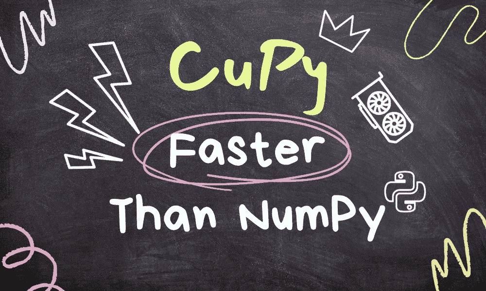
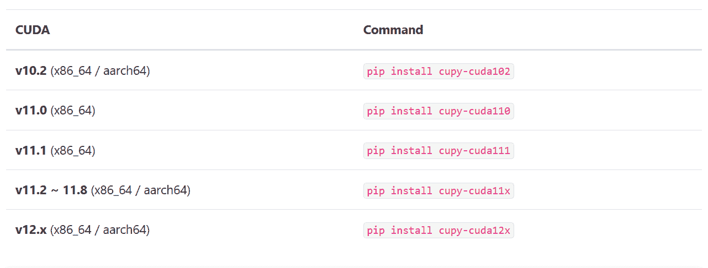

# 利用 CuPy 在 Python 中发挥 GPU 的威力

> 原文：[`www.kdnuggets.com/leveraging-the-power-of-gpus-with-cupy-in-python`](https://www.kdnuggets.com/leveraging-the-power-of-gpus-with-cupy-in-python)



图片由作者提供

# 什么是 CuPy？

* * *

## 我们的前三个课程推荐

 1\. [谷歌网络安全证书](https://www.kdnuggets.com/google-cybersecurity) - 快速进入网络安全职业

 2\. [谷歌数据分析专业证书](https://www.kdnuggets.com/google-data-analytics) - 提升你的数据分析技能

 3\. [谷歌 IT 支持专业证书](https://www.kdnuggets.com/google-itsupport) - 支持你的组织 IT

* * *

[CuPy](https://docs.cupy.dev/en/stable/overview.html) 是一个与 NumPy 和 SciPy 数组兼容的 Python 库，旨在用于 GPU 加速计算。通过将 NumPy 替换为 CuPy 语法，你可以在 NVIDIA CUDA 或 AMD ROCm 平台上运行代码。这使你能够利用 GPU 加速执行数组相关的任务，从而更快地处理更大的数组。

通过仅替换几行代码，你可以利用 GPU 的大规模并行处理能力，显著加速数组操作，如索引、归一化和矩阵乘法。

CuPy 还使得访问低级 CUDA 功能成为可能。它允许使用 RawKernels 将 `ndarrays` 传递到现有的 CUDA C/C++ 程序，利用 Streams 简化性能，并直接调用 CUDA Runtime API。

# 安装 CuPy

你可以使用 pip 安装 CuPy，但在此之前，你需要使用下面的命令找出正确的 CUDA 版本。

```py
!nvcc --version
```

```py
nvcc: NVIDIA (R) Cuda compiler driver
Copyright (c) 2005-2022 NVIDIA Corporation
Built on Wed_Sep_21_10:33:58_PDT_2022
Cuda compilation tools, release 11.8, V11.8.89
Build cuda_11.8.r11.8/compiler.31833905_0
```

目前 Google Colab 的版本似乎使用的是 CUDA 11.8。因此，我们将继续安装 `cupy-cuda11x` 版本。

如果你使用的是较旧的 CUDA 版本，我提供了一个表格来帮助你确定要安装的适当 CuPy 包。



图片来自 [CuPy 12.2.0](https://docs.cupy.dev/en/stable/install.html)

选择正确版本后，我们将使用 pip 安装 Python 包。

```py
pip install cupy-cuda11x
```

如果你安装了 Anaconda，你也可以使用`conda`命令自动检测并安装正确版本的 CuPy 包。

```py
conda install -c conda-forge cupy
```

# CuPy 基础知识

在这一部分，我们将比较 CuPy 和 Numpy 的语法，它们的相似度高达 95%。使用 `np` 的地方，你将用 `cp` 替代。

我们将首先使用 Python 列表创建一个 NumPy 和 CuPy 数组。之后，我们将计算向量的范数。

```py
import cupy as cp
import numpy as np

x = [3, 4, 5]

x_np = np.array(x)
x_cp = cp.array(x)

l2_np = np.linalg.norm(x_np)
l2_cp = cp.linalg.norm(x_cp)

print("Numpy: ", l2_np)
print("Cupy: ", l2_cp)
```

正如我们所见，我们得到了类似的结果。

```py
Numpy:  7.0710678118654755
Cupy:  7.0710678118654755
```

要将 NumPy 数组转换为 CuPy 数组，你可以简单地使用 `cp.asarray(X)`。

```py
x_array = np.array([10, 22, 30])
x_cp_array = cp.asarray(x_array)
type(x_cp_array)
```

```py
cupy.ndarray
```

或者，使用 `.get()` 将 CuPy 转换为 NumPy 数组。

```py
x_np_array = x_cp_array.get()
type(x_np_array)
```

```py
numpy.ndarray
```

# 性能比较

在这一部分，我们将比较 NumPy 和 CuPy 的性能。

我们将使用 `time.time()` 来计时代码执行时间。然后，我们将创建一个 3D NumPy 数组并执行一些数学函数。

```py
import time

# NumPy and CPU Runtime
s = time.time()
x_cpu = np.ones((1000, 100, 1000))
np_result = np.sqrt(np.sum(x_cpu**2, axis=-1))
e = time.time()
np_time = e - s
print("Time consumed by NumPy: ", np_time)
```

```py
Time consumed by NumPy: 0.5474584102630615
```

同样，我们将创建一个 3D CuPy 数组，执行数学运算，并对其性能进行计时。

```py
# CuPy and GPU Runtime
s = time.time()
x_gpu = cp.ones((1000, 100, 1000))
cp_result = cp.sqrt(cp.sum(x_gpu**2, axis=-1))
e = time.time()
cp_time = e - s
print("\nTime consumed by CuPy: ", cp_time)
```

```py
Time consumed by CuPy: 0.001028299331665039
```

为了计算差异，我们将 NumPy 时间与 CuPy 时间进行比较，使用 CuPy 时我们似乎得到了超过 500 倍的性能提升。

```py
diff = np_time/cp_time
print(f'\nCuPy is {diff: .2f} X time faster than NumPy')
```

```py
CuPy is 532.39 X time faster than NumPy
```

> **注意：** 为了取得更好的效果，建议进行几次热身测试，以减少时间波动。

除了速度优势外，CuPy 还提供了优越的多 GPU 支持，使得可以利用多个 GPU 的集体力量。

如果你想对比结果，也可以查看我的 [Colab 笔记本](https://colab.research.google.com/drive/1xhORH4VQr5vuaDVsvKY54JW_dIE5EMUz?usp=sharing)。

# 结论

总之，CuPy 提供了一种简单的方法来加速 NVIDIA GPU 上的 NumPy 代码。通过仅做少量修改将 NumPy 替换为 CuPy，你可以在数组计算中体验数量级的加速。这种性能提升使你能够处理更大规模的数据集和模型，从而实现更高级的机器学习和科学计算。

## 资源

+   文档: [CuPy – NumPy 和 SciPy 的 GPU 实现 — CuPy 12.2.0 文档](https://docs.cupy.dev/en/stable/index.html)

+   GitHub: [cupy/cupy](https://github.com/cupy/cupy)

+   示例: [cupy/examples](https://github.com/cupy/cupy/tree/main/examples)

+   API: [API 参考](https://docs.cupy.dev/en/stable/reference/)

[](https://www.polywork.com/kingabzpro)****[Abid Ali Awan](https://www.polywork.com/kingabzpro)**** ([@1abidaliawan](https://www.linkedin.com/in/1abidaliawan)) 是一位认证的数据科学专业人士，热衷于构建机器学习模型。目前，他专注于内容创作，并撰写有关机器学习和数据科学技术的技术博客。Abid 拥有技术管理硕士学位和电信工程学士学位。他的愿景是利用图神经网络构建一款 AI 产品，帮助那些面临心理健康问题的学生。

### 更多相关主题

+   [掌握 GPUs：Python 中 GPU 加速数据框的初学者指南](https://www.kdnuggets.com/2023/07/mastering-gpus-beginners-guide-gpu-accelerated-dataframes-python.html)

+   [从 Google Colab 到 Ploomber 流水线：利用 GPUs 实现大规模 ML](https://www.kdnuggets.com/2022/03/google-colab-ploomber-pipeline-ml-scale-gpus.html)

+   [利用 GeoPandas 在 Python 中处理地理空间数据](https://www.kdnuggets.com/leveraging-geospatial-data-in-python-with-geopandas)

+   [数据库内分析：利用 SQL 的分析函数](https://www.kdnuggets.com/2023/07/indatabase-analytics-leveraging-sql-analytic-functions.html)

+   [数据科学中的 SQL：理解和利用连接](https://www.kdnuggets.com/2023/08/sql-data-science-understanding-leveraging-joins.html)

+   [利用 XGBoost 进行时间序列预测](https://www.kdnuggets.com/2023/08/leveraging-xgboost-timeseries-forecasting.html)
