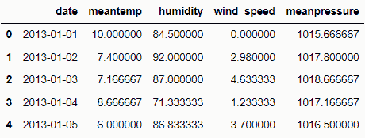
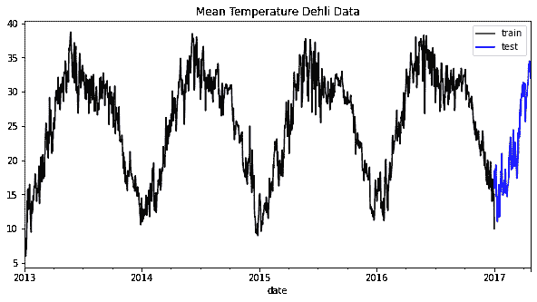
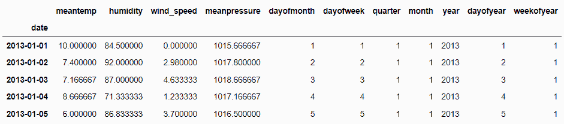
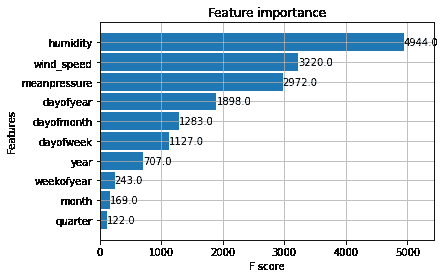
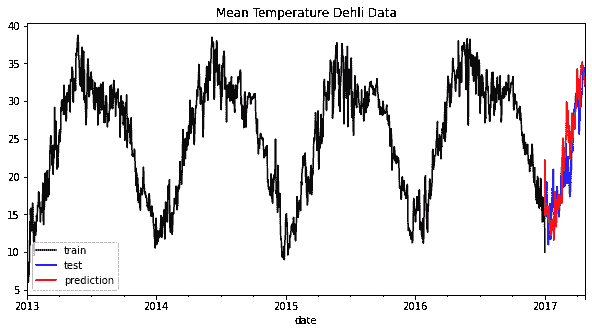

# 利用 XGBoost 进行时间序列预测

> 原文：[`www.kdnuggets.com/2023/08/leveraging-xgboost-timeseries-forecasting.html`](https://www.kdnuggets.com/2023/08/leveraging-xgboost-timeseries-forecasting.html)

[XGBoost](https://xgboost.readthedocs.io/en/stable/)（极端梯度提升）是一种开源算法，实施了 [梯度提升](https://en.wikipedia.org/wiki/Gradient_boosting) 树，并进行了额外改进以提高性能和速度。该算法快速准确的预测能力使其成为许多竞赛的首选模型，如 Kaggle 竞赛。

XGBoost 应用的常见案例包括分类预测，如欺诈检测，或回归预测，如房价预测。然而，将 XGBoost 算法扩展到预测时间序列数据也是可能的。它是如何工作的？让我们进一步探讨。

* * *

## 我们的前三大课程推荐

 1\. [Google 网络安全证书](https://www.kdnuggets.com/google-cybersecurity) - 快速进入网络安全职业轨道

 2\. [Google 数据分析专业证书](https://www.kdnuggets.com/google-data-analytics) - 提升你的数据分析能力

 3\. [Google IT 支持专业证书](https://www.kdnuggets.com/google-itsupport) - 支持你的组织 IT

* * *

# 时间序列预测

数据科学和机器学习中的预测是一种基于随时间收集的历史数据来预测未来数值的方法，可以是规则的或不规则的间隔。

与常见的机器学习训练数据中每个观察值相互独立不同，时间序列预测的数据必须按连续顺序排列，并与每个数据点相关。例如，时间序列数据可以包括每月的股票、每周的天气、每日销售等。

让我们看看示例时间序列数据 [Kaggle 的每日气候数据](https://www.kaggle.com/datasets/sumanthvrao/daily-climate-time-series-data)。

```py
import pandas as pd

train = pd.read_csv('DailyDelhiClimateTrain.csv')
test = pd.read_csv('DailyDelhiClimateTest.csv')

train.head()
```



如果我们查看上述数据框，每个特征都被记录为每日数据。日期列表示数据被观察的时间，每个观察值之间是相关的。

时间序列预测通常结合数据中的趋势、季节性和其他模式进行预测。查看这些模式的一种简单方法是通过可视化。例如，我会可视化我们示例数据集中的平均温度数据。

```py
train["date"] = pd.to_datetime(train["date"])
test["date"] = pd.to_datetime(test["date"])

train = train.set_index("date")
test = test.set_index("date")

train["meantemp"].plot(style="k", figsize=(10, 5), label="train")
test["meantemp"].plot(style="b", figsize=(10, 5), label="test")
plt.title("Mean Temperature Dehli Data")
plt.legend()
```



我们可以在上面的图表中很容易地看到每年都有一个共同的季节性模式。通过结合这些信息，我们可以理解数据如何工作，并决定哪个模型可能适合我们的预测模型。

典型的预测模型包括 ARIMA、向量自回归、指数平滑和 Prophet。然而，我们也可以利用 XGBoost 来提供预测。

# XGBoost 预测

在准备使用 XGBoost 进行预测之前，我们必须首先安装该软件包。

```py
pip install xgboost
```

安装完成后，我们将准备数据以进行模型训练。理论上，XGBoost 预测将基于单一或多个特征实现回归模型，以预测未来的数值。这就是为什么数据训练也必须是数值的原因。此外，为了将时间的变化融入我们的 XGBoost 模型，我们将把时间数据转化为多个数值特征。

让我们从创建一个函数开始，将日期转换为数值特征。

```py
def create_time_feature(df):
    df['dayofmonth'] = df['date'].dt.day
    df['dayofweek'] = df['date'].dt.dayofweek
    df['quarter'] = df['date'].dt.quarter
    df['month'] = df['date'].dt.month
    df['year'] = df['date'].dt.year
    df['dayofyear'] = df['date'].dt.dayofyear
    df['weekofyear'] = df['date'].dt.weekofyear
    return df
```

接下来，我们将把这个函数应用于训练数据和测试数据。

```py
train = create_time_feature(train)
test = create_time_feature(test)

train.head() 
```



所需的信息现在都已经准备好。接下来，我们将定义我们想要预测的内容。在这个例子中，我们将预测平均温度，并基于上述数据制作训练数据。

```py
X_train = train.drop('meantemp', axis =1)
y_train = train['meantemp']

X_test = test.drop('meantemp', axis =1)
y_test = test['meantemp']
```

我仍然会使用其他信息，如湿度，以展示 XGBoost 也可以通过多变量方法进行预测。然而，在实际应用中，我们只会纳入我们知道存在的数据来进行预测。

让我们通过将数据拟合到模型中开始训练过程。对于当前的示例，我们不会做太多超参数优化，除了树的数量。

```py
import xgboost as xgb

reg = xgb.XGBRegressor(n_estimators=1000)
reg.fit(X_train, y_train, verbose = False)
```

训练过程结束后，让我们查看模型的特征重要性。

```py
xgb.plot_importance(reg)
```



三个初始特征在预测中非常有用，但时间特征也有助于预测。让我们尝试在测试数据上进行预测并进行可视化。

```py
test['meantemp_Prediction'] = reg.predict(X_test)

train['meantemp'].plot(style='k', figsize=(10,5), label = 'train')
test['meantemp'].plot(style='b', figsize=(10,5), label = 'test')
test['meantemp_Prediction'].plot(style='r', figsize=(10,5), label = 'prediction')
plt.title('Mean Temperature Dehli Data')
plt.legend()
```



从上面的图表中，我们可以看到，预测可能看起来稍有偏差，但仍然遵循总体趋势。让我们尝试根据误差指标来评估模型。

```py
from sklearn.metrics import mean_squared_error, mean_absolute_error, mean_absolute_percentage_error

print('RMSE: ', round(mean_squared_error(y_true=test['meantemp'],y_pred=test['meantemp_Prediction']),3))
print('MAE: ', round(mean_absolute_error(y_true=test['meantemp'],y_pred=test['meantemp_Prediction']),3))
print('MAPE: ', round(mean_absolute_percentage_error(y_true=test['meantemp'],y_pred=test['meantemp_Prediction']),3))
```

RMSE: 11.514

MAE: 2.655

MAPE: 0.133

结果表明，我们的预测可能有约 13%的误差，而 RMSE 也显示预测有轻微误差。模型可以通过超参数优化来改进，但我们已经了解了 XGBoost 如何用于预测。

# 结论

XGBoost 是一种开源算法，通常用于许多数据科学案例以及 Kaggle 竞赛中。使用案例通常包括常见的分类任务，如欺诈检测，或回归任务，如房价预测，但 XGBoost 也可以扩展到时间序列预测中。通过使用 XGBoost 回归器，我们可以创建一个能够预测未来数值的模型。

**[Cornellius Yudha Wijaya](https://www.linkedin.com/in/cornellius-yudha-wijaya/)** 是一位数据科学助理经理和数据撰稿人。他在全职工作于 Allianz Indonesia 的同时，喜欢通过社交媒体和撰写媒体分享 Python 和数据技巧。

### 更多相关主题

+   [如何加速 XGBoost 模型训练](https://www.kdnuggets.com/2021/12/speed-xgboost-model-training.html)

+   [XGBoost 的假设是什么？](https://www.kdnuggets.com/2022/08/assumptions-xgboost.html)

+   [调整 XGBoost 超参数](https://www.kdnuggets.com/2022/08/tuning-xgboost-hyperparameters.html)

+   [GBM 和 XGBoost 之间到底有什么区别？](https://www.kdnuggets.com/wtf-is-the-difference-between-gbm-and-xgboost)

+   [学习现代预测技术以帮助预测未来业务结果…](https://www.kdnuggets.com/2022/12/sphere-learn-modern-forecasting-techniques-help-predict-future-business-outcomes.html)

+   [使用最先进的深度学习进行可解释预测和即时预测…](https://www.kdnuggets.com/2021/12/sota-explainable-forecasting-and-nowcasting.html)
