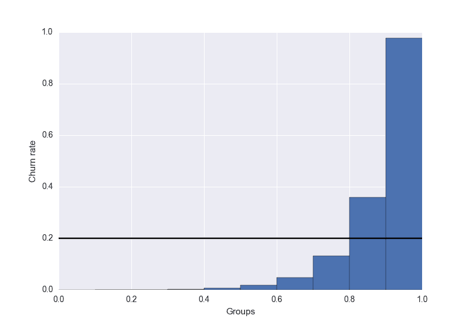

# 提升分析 - 数据科学家的秘密武器

> 原文：[`www.kdnuggets.com/2016/03/lift-analysis-data-scientist-secret-weapon.html`](https://www.kdnuggets.com/2016/03/lift-analysis-data-scientist-secret-weapon.html)

**安迪·戈德施密特, Akanoo**。

每当我阅读关于数据科学的文章时，我觉得总有一个重要的方面缺失：评估机器学习模型的性能和质量。

* * *

## 我们的前三个课程推荐

 1\. [谷歌网络安全证书](https://www.kdnuggets.com/google-cybersecurity) - 快速开启网络安全职业之路

 2\. [谷歌数据分析专业证书](https://www.kdnuggets.com/google-data-analytics) - 提升你的数据分析技能

 3\. [谷歌 IT 支持专业证书](https://www.kdnuggets.com/google-itsupport) - 支持你的组织 IT 需求

* * *

总是有一个解决的干净问题，讨论数据获取、处理和模型创建的过程，但评估方面通常非常简略。但我确实相信，在构建新模型时，这才是最重要的。因此，本博客的第一篇文章将讨论一个非常有用的评估技术：提升分析。

机器学习涵盖了各种问题，如回归和聚类。然而，提升分析用于分类任务。因此，本文其余部分将集中在这些模型上。

### 提升图表背后的原因

在评估机器学习模型时，有大量可能的指标来评估性能。比如准确率、精确度-召回率、ROC 曲线等等。所有这些指标都可能有用，但它们也可能具有误导性，或者不能很好地回答当前的问题。

例如，准确率[1]对于平衡类（即每个标签大致有相同数量的出现）可能是一个有用的指标，但对于不平衡类则完全误导。问题是：数据科学家必须经常处理不平衡的类别，例如，当预测一个用户是否会在网上商店购买某样东西时。如果在 100 个客户中只有 2 个购买，那么模型很容易预测所有人都不会购买，并且仍然会达到 98%的准确率！在评估模型质量时，这完全没有用。

当然，像精确度和召回率这样的其他指标也能提供关于你模型的重要信息。但我想深入探讨另一种有价值的评估技术，通常称为提升分析。

为了说明这个概念，我们将考虑一个简单的流失模型：我们想要预测一个在线服务的客户是否会取消订阅。这是一个二分类问题：用户要么取消订阅（*churn=1*），要么保留订阅（*churn=0*）。

提升分析的基本概念如下：

+   根据预测的流失概率（0.0 到 1.0 之间的值）对数据进行分组。通常，你会查看十分位数，这样你就会有 10 组：0.0 - 0.1，0.1 - 0.2，…，0.9 - 1.0

+   计算每组的真实流失率。也就是说，你需要统计每组中流失的人数，并将其除以每组的总客户数。

### 这有什么用呢？

我们模型的目的是估计客户取消订阅的可能性。这意味着我们预测的（流失）概率应该与实际的流失概率直接成正比，即高预测分数应与高实际流失率相关联。反之，如果模型预测客户不会流失，我们希望确保这位客户*真的不太可能*流失。

但正如常言所说，一图胜千言。让我们看看理想的提升图表应如何呈现：

在这里你可以看到，最右边桶中的流失率最高，这正如预期的那样。对于低于 0.5 的分数，桶中的实际流失率几乎为零。你可以使用这个提升图表来验证你的模型是否如你所期望的那样运行。

假设低分组出现了峰值；那么你可以立即知道你的模型存在一些缺陷，它没有正确反映现实。因为如果它反映了现实，那么真实的流失率只能随着分数的下降而降低。当然，提升分析只能帮助到此。识别问题原因并在必要时加以修正还是要靠你自己[2]。改进模型后，你可以返回提升图表，看看质量是否有所提高。

另外，我为假设的平均流失率（20%）画了一条黑线。这对于定义目标阈值非常有用：低于阈值的分数将设置为 0，高于阈值的分数将设置为 1。在我们的例子中，你可能希望通过提供折扣来阻止客户取消订阅。然后你可以针对得分在 0.8 到 1.0 之间的所有用户，因为这是流失率*高于平均流失率*的范围。你不想把钱浪费在流失概率低于平均水平的客户身上。

### 那么，提升到底是什么呢？

到目前为止，我们只看了漂亮的图表。但通常你也会对**提升分数**感兴趣。定义相当简单：

`lift = ( predicted rate / average rate )`

在我们的情况中，*rate* 指的是流失率，但也可能是转化率、响应率等。

回顾我们的示例图表，最高组的提升为 0.97 / 0.2 = 4.85，第二高组为 1.8。这意味着，如果你仅针对得分高于 0.9 的用户，你可以预期比随机选择相同数量的人多捕获将近五倍的流失用户。

### 结论

就像其他评估指标一样，提升图并不是一劳永逸的解决方案。但它们帮助你更好地了解模型的整体性能。如果提升图的斜率不是单调的，你可以快速发现缺陷。此外，它帮助你设置一个阈值，以决定哪些用户值得定位。最后但同样重要的是，你可以估计与随机定位相比，你能更好地定位用户。

我希望这篇第一篇博客文章能给你一些新的见解，或者作为一个温故知新的回顾。如果你有任何问题或反馈，只需留下评论或 [发我一条推文](https://twitter.com/datenheini)。

*[1] 正确标记的观察值与总观察值的比率。*

[2] 在某些情况下，这可能不重要，例如当你的主要目标是针对所有流失者，但如果你也针对一些不会流失的人，这并不重要。*

**简介： [安迪·戈德施密特](https://twitter.com/datenheini)** 是来自德国汉堡的数据科学家。他目前在 Akanoo 一家现场定位初创公司工作，之前在一家 DIY 网站建设者的数据团队工作过。

[原文](http://blog.datalifebalance.com/lift-charts-a-data-scientists-secret-weapon)。经许可转载。

**相关：**

+   哪些大数据、数据挖掘和数据科学工具可以结合使用？

+   统计学否定神话：重新包装统计数据与模糊术语

+   前 10 大数据挖掘算法解析

### 更多相关内容

+   [HuggingGPT: 解决复杂 AI 任务的秘密武器](https://www.kdnuggets.com/2023/05/hugginggpt-secret-weapon-solve-complex-ai-tasks.html)

+   [GPT-4: 8 种模型合而为一；秘密已揭晓](https://www.kdnuggets.com/2023/08/gpt4-8-models-one-secret.html)

+   [入门 LLMOps: 实现无缝互动的秘密调料](https://www.kdnuggets.com/getting-started-with-llmops-the-secret-sauce-behind-seamless-interactions)

+   [数据科学家的探索性数据分析必备指南](https://www.kdnuggets.com/2023/06/data-scientist-essential-guide-exploratory-data-analysis.html)

+   [数据科学家职位薪资分析](https://www.kdnuggets.com/2023/04/data-scientist-job-salaries-analysis.html)

+   [掌握 SQL、Python、数据清理、数据整理和探索性数据分析的指南合集](https://www.kdnuggets.com/collection-of-guides-on-mastering-sql-python-data-cleaning-data-wrangling-and-exploratory-data-analysis)
