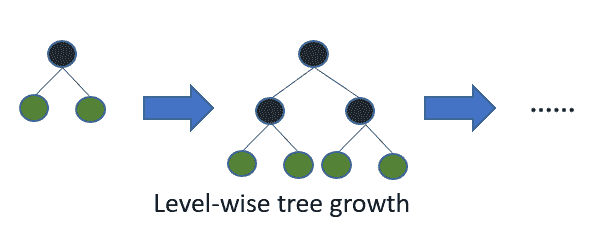
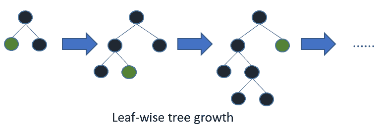

# LightGBM：一种高效的梯度提升决策树

> 原文：[`www.kdnuggets.com/2020/06/lightgbm-gradient-boosting-decision-tree.html`](https://www.kdnuggets.com/2020/06/lightgbm-gradient-boosting-decision-tree.html)

评论

LightGBM 算法的威力不可小觑（有意双关）。LightGBM 是一个分布式且高效的[梯度提升框架](https://scikit-learn.org/stable/modules/generated/sklearn.ensemble.GradientBoostingClassifier.html)，它使用[基于树的学习](https://www.analyticsvidhya.com/blog/2016/04/tree-based-algorithms-complete-tutorial-scratch-in-python/)。它是[基于直方图的](https://scikit-learn.org/stable/modules/generated/sklearn.ensemble.HistGradientBoostingClassifier.html)，将连续值放入离散的箱子中，这导致更快的训练和更高效的内存使用。在这篇文章中，我们将深入探讨 LightGBM。

### LightGBM 优势

* * *

## 我们的三大课程推荐

 1\. [Google 网络安全证书](https://www.kdnuggets.com/google-cybersecurity) - 快速进入网络安全职业生涯。

 2\. [Google 数据分析专业证书](https://www.kdnuggets.com/google-data-analytics) - 提升你的数据分析水平

 3\. [Google IT 支持专业证书](https://www.kdnuggets.com/google-itsupport) - 支持你的组织进行 IT 管理

* * *

根据官方文档，LightGBM 框架的优势如下：

+   更快的训练速度和更高的效率

+   更低的内存使用

+   更高的准确性

+   支持并行和 GPU 学习

+   能够处理大规模数据

### 参数调整

该框架使用了叶子优先的树生长算法，这不同于许多其他基于树的算法使用的深度优先生长。叶子优先树生长算法通常比深度优先算法收敛更快，但更容易过拟合。



[来源](https://lightgbm.readthedocs.io/en/latest/Features.html?highlight=dart#other-features)

[来源](https://lightgbm.readthedocs.io/en/latest/Features.html?highlight=dart#other-features)

以下是我们需要调整的参数，以在叶子优先树算法上获得良好的结果：

+   `num_leaves`：设置叶子数为`num_leaves = 2^(max_depth)`将给你与深度优先树相同数量的叶子。然而，这并不是一个好的做法。理想情况下，叶子数应小于`2^(max_depth)`

+   `min_data_in_leaf`防止过拟合。它的设置取决于`num_leaves`和训练样本的数量。对于大型数据集，可以设置为数百或数千。

+   `max_depth`用于限制树的深度。

通过使用以下方式可以获得更快的算法速度：

+   一个较小的`max_bin`

+   `save_binary` 以加速未来学习中的数据加载

+   并行学习

+   通过设置 `bagging_freq` 和 `bagging_fraction` 进行袋装

+   `feature_fraction` 用于特征子抽样

为了获得更好的准确性，可以使用较大的 `max_bin`、使用较小的学习率与较大的 `num_iterations`、以及更多的训练数据。也可以使用更多的 `num_leaves`，但这可能导致过拟合。说到过拟合，你可以通过以下方法处理：

+   增加 `path_smooth`

+   使用更大的训练集

+   尝试 `lambda_l1`、`lambda_l2` 和 `min_gain_to_split` 进行正则化

+   避免生成非常深的树

> 机器学习正在迅速向数据收集地点——边缘设备靠近。[订阅 Fritz AI 新闻通讯以了解更多关于这一过渡以及如何帮助扩大业务的信息。](https://www.fritz.ai/newsletter?utm_campaign=fritzai-newsletter-scale6&utm_source=heartbeat)

### 分类特征

机器学习中处理分类特征的一种常见方法是独热编码。该方法对树模型并不理想，特别是对于高基数分类特征。基于独热编码特征构建的树是不平衡的，并且为了获得良好的准确度，必须生长得过深。

使用 `categorical_feature` 属性，我们可以为模型指定分类特征（无需独热编码）。分类特征应编码为小于 `Int32.MaxValue` 的非负整数。它们应从零开始。

### LightGBM 应用

LightGBM 最适用于以下问题：

+   使用 `logloss` 目标函数的二分类

+   使用 `L2` 损失进行回归

+   多分类

+   使用 `logloss` 目标函数的交叉熵

+   LambdaRank 使用 `lambdarank` 以 NDCG 作为目标函数

### 指标

LightGBM 支持的指标有：

+   L1 损失

+   L2 损失

+   对数损失

+   分类错误率

+   AUC

+   NDCG

+   MAP

+   多类对数损失

+   多类错误率

+   Fair

+   Huber

+   Poisson

+   分位数

+   MAPE

+   Kullback-Leibler

+   Gamma

+   Tweedie

### 处理缺失值

默认情况下，LightGBM 能够处理缺失值。你可以通过设置 `use_missing=false` 来禁用此功能。它使用 NA 表示缺失值，但要使用零，你可以将其设置为 `zero_as_missing=true`。

### 核心参数

这是 LightGBM 的一些核心参数：

+   `task` 默认为 `train`。其他选项包括 `predict`、`convert_model` 和 `refit`。该参数的别名是 `task_type`。`convert_model` 将模型转换为 if-else 格式。

+   `objective` 默认为回归。其他选项包括 `regression_l1`、`huber`、`fair`、`poisson`、`quantile`、`mape`、`gamma`、`tweedie`、`binary`、`multiclass`、`multiclassova`、`cross_entropy`、`cross_entropy_lambda`、`lambdarank` 和 `rank_xendcg`。该参数的别名有 `objective_type`、`app` 和 `application`。

+   `boosting` 默认值为 `gbdt` — 传统的梯度提升决策树。其他选项包括 `rf` — 随机森林，`dart` — [Dropouts meet Multiple Additive Regression Trees](https://arxiv.org/abs/1505.01866)，`goss` — 基于梯度的单侧采样。此参数的别名为 `boosting_type` 和 `boost`。

+   `num_leaves`：基学习器的最大树叶数量 — 默认值为 31

+   `max_depth`：基学习器的最大树深度

+   `learning_rate`：提升学习率

+   `n_estimators`：要拟合的提升树的数量 — 默认值为 200000

+   `importance_type`：要填入 `feature_importances_` 的重要性类型。使用 `split` 表示模型中使用特征的次数将包含在结果中。

+   `device_type`：树学习的设备 — CPU 或 GPU。可以与 `device` 作为别名一起使用。

### 学习控制参数

我们来看看几个学习控制参数：

+   `force_col_wise`：当设置为 true 时，它强制进行按列直方图构建。建议当列数较多或总的 bins 数量较大时将其设置为 true。你也可以在内存成本需要减少时将其设置为 true，特别是当 `num_threads` 较大，例如大于 20 时。此参数仅在使用 CPU 时适用。

+   `force_row_wise`：当设置为 true 时，它强制进行按行直方图构建。此参数仅在使用 CPU 时适用。当数据点数量较大、总的 bins 数量较少，并且 `num_threads` 较少（例如小于或等于 16）时可以启用此选项。当你希望使用较小的 `bagging_fraction` 或 `goss` 提升训练速度时，也可以设置为 true。

+   `neg_bagging_fraction`：用于不平衡的二分类问题。

+   `bagging_freq`：Bagging 的频率。零表示禁用 bagging。

+   `feature_fraction`：可以用来处理过拟合。例如，设置为 0.5 意味着 LightGBM 在每棵树节点上将选择 50% 的特征。

+   `extra_trees`：当你想使用极端随机树时设置为 true。

+   `early_stopping_round`：当设置为 true 时，一旦某个参数未能改善，训练将停止。

+   `max_drop`：默认为 50。表示每次迭代中要丢弃的树的数量。

+   `cat_l2`：分类分裂中的 L2 正则化

+   `cat_smooth`：减少分类特征中的噪声影响，特别是对数据有限的类别。

+   `path_smooth`：帮助防止叶节点样本过少时的过拟合。

### 目标参数

这里有几个需要注意的目标参数：

+   `is_unbalance`：如果训练数据在分类问题中不平衡，可以设置为 true。

+   `num_class`：用于指示多分类问题中的类别数量。

+   `scale_pos_weight`：正类标签的权重。不能与 `is_unbalance` 一起使用。此参数提高了模型的总体性能指标，但可能导致对各个类别概率的估计不准确。

### 实际应用

现在我们将快速实现该算法。我们将使用 scikit-learn 对分类器的包装器。

一如既往，我们首先导入模型：

```py
from lightgbm import LGBMClassifier
```

下一步是创建模型实例并设置目标。目标选项为回归用于 `LGBMRegressor`，二分类或多分类用于 `LGBMClassifier`，LambdaRank 用于 `LGBMRanker`。

```py
model = LGBMClassifier(objective=’multiclass’)
```

在拟合模型时，我们可以设置分类特征：

```py
model.fit(X_train,y_train,categorical_feature=[0,3])
```

一旦你对模型进行预测，你还可以获得重要特征：

```py
predictions = model.predict(X_test)importances = model.feature_importances_
```

### 结论

我希望这能为你提供足够的 LightGBM 背景，以便你开始自主实验。我们已经看到它可以用于回归和分类问题。有关框架的更多信息，你可以查看官方文档：

[**欢迎访问 LightGBM 文档！- LightGBM 2.3.2 文档**](https://lightgbm.readthedocs.io/en/latest/)

LightGBM 是一个使用基于树的学习算法的梯度提升框架。它设计为可以分布式...

**简介：[Derrick Mwiti](https://derrickmwiti.com/)** 是一名数据分析师、作家和导师。他致力于在每一个任务中取得出色的成果，并且是 Lapid Leaders Africa 的导师。

[原文](https://heartbeat.fritz.ai/lightgbm-a-highly-efficient-gradient-boosting-decision-tree-53f62276de50)。经许可转载。

**相关：**

+   研究指南：机器学习模型的高级损失函数

+   Python 中的自动化机器学习

+   联邦学习：简介

### 更多相关主题

+   [数据科学家应该使用 LightGBM 的 3 个理由](https://www.kdnuggets.com/2022/01/data-scientists-reasons-lightgbm.html)

+   [通过 Python 和 Scikit-learn 简化决策树可解释性](https://www.kdnuggets.com/2017/05/simplifying-decision-tree-interpretation-decision-rules-python.html)

+   [决策树算法，解释](https://www.kdnuggets.com/2020/01/decision-tree-algorithm-explained.html)

+   [通过实现理解：决策树](https://www.kdnuggets.com/2023/02/understanding-implementing-decision-tree.html)

+   [讲述一个精彩的数据故事：可视化决策树](https://www.kdnuggets.com/2021/02/telling-great-data-story-visualization-decision-tree.html)

+   [随机森林与决策树：关键区别](https://www.kdnuggets.com/2022/02/random-forest-decision-tree-key-differences.html)
