# 如何在 Python 中进行“无限制”数学运算

> 原文：[`www.kdnuggets.com/2021/10/limitless-math-python.html`](https://www.kdnuggets.com/2021/10/limitless-math-python.html)

评论


**图片来源**: [Pixabay](https://pixabay.com/photos/steelwool-fire-infinite-firespin-458842/)（免费使用）

## 无限数学？

听起来像个吸引人的标题？好吧，我们真正指的是 **任意精度计算**，即突破我们通常熟悉的 **32 位或 64 位算术的限制**。

这是一个快速的例子。

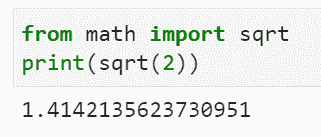

如果你直接从 Python 的标准 `math` 模块中导入，你将获得平方根 2 的值。

你可以使用 Numpy 来选择结果是 32 位还是 64 位浮点数。

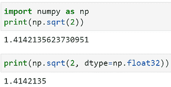

但如果你想要精确到 25 位小数的结果呢…

> 1.414213562373095048801689

还是 50 位小数？

> 1.4142135623730950488016887242096980785696718753769

我们是如何得到这些结果的？

仅使用一个名为 `**mpmath**` 的整洁小包。让我们详细检查一下它。

## 使用 `mpmath` 进行任意精度计算

`Mpmath` 是一个用于任意精度浮点算术的 Python 库。有关 `mpmath` 的一般信息，请参见 [项目网站](http://mpmath.org/)。

从其 [网站](https://mpmath.org/doc/current/#advanced-mathematics) 上看，除了任意精度算术，“`*mpmath*`* 提供了广泛的超越函数、求和、积分、极限、根等的支持”。它还执行许多标准数学任务，例如，

+   多项式

+   根求解和优化

+   求和、乘积、极限和外推

+   微分

+   数值积分（求积）

+   求解常微分方程

+   函数逼近

+   数值逆拉普拉斯变换

简而言之，它是一个功能强大的数学库，具有无限的可能性！我们将在本文中探讨一些功能。

> **任意精度计算是** 从我们通常熟悉的 **32 位或 64 位算术的限制中突破出来**…

## 安装和选择一个快速的后端引擎

只需使用 pip。

```py
pip install mpmath
```

默认情况下，`mpmath` 在内部使用 Python 整数。如果系统中安装了 `*[gmpy](https://code.google.com/p/gmpy/)*` 1.03 版或更高版本，`mpmath` 会自动检测并使用 `gmpy` 整数，而不会改变高级用户体验。使用这个后端使得其操作速度更快，特别是在高精度下。

`gmpy2` 是一个 **用 C 编写的 Python 扩展模块**，支持多精度算术。[**这是安装它的方法**](https://gmpy2.readthedocs.io/en/latest/intro.html#installation)。

## 代码

这是本文中展示的 [包含所有代码的 Notebook](https://github.com/tirthajyoti/Stats-Maths-with-Python/blob/master/mpmath-1.ipynb)。

## 选择精度

关于如何选择和控制 `mpmath` 的精度有大量的资料。鼓励读者直接查阅 [这个参考资料](https://mpmath.org/doc/current/basics.html)。

我将向你展示在工作中设置精度的快捷方法。

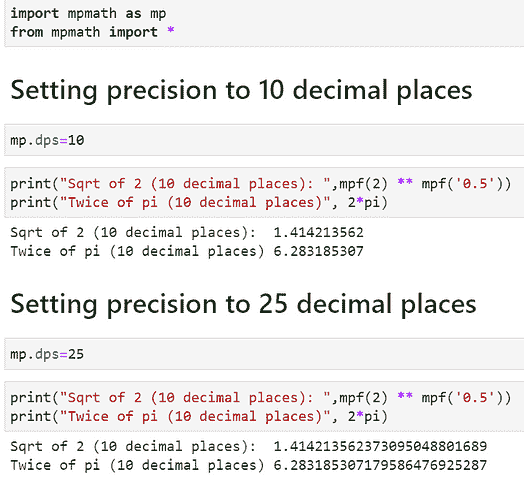

你可以随时打印 `mp` 上下文以查看当前的全局精度设置。`mp.prec` 显示的是位精度，`mp.dps` 显示的是小数精度。

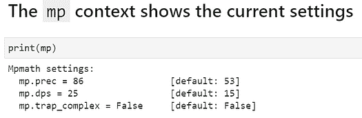

## 使用 ``mpf`` 实例代替普通浮点数

在上面的代码片段中，你可能注意到了一个函数 `mpf`。一个 `mpf` 实例保存了一个实值浮点数。它们与 Python 浮点数类似，但支持任意精度的算术运算。

你应该使用字符串（而不是 Python 浮点数）来定义 `mpf` ，以获得真正的准确性。你也可以将 `mp.pretty` 设置为 `True` 来进行舍入而不失去内部准确性。

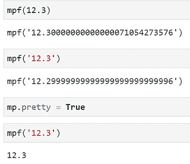


## 现在有些魔法！阶乘计算速度提升 11,000 倍

`mpmath` 可以利用智能技巧进行大规模计算。一个例子是阶乘。对于大数，它可以适当地使用近似值，而无需指导，给出比默认 Python 数学模块更快的结果。

当我们尝试计算 100,000 的阶乘时，发生了什么。`mpmath` 的速度是**11,333 倍**。

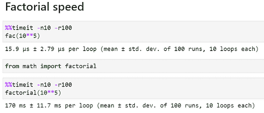

## 有理数和复数是原生支持的

我们可以像处理浮点数一样轻松地将有理数或复数混入计算中。为此，我们需要使用一个神奇的函数 `**mpmathify**` ，它与 `**sympy**` 内部配合工作来解释这些量。

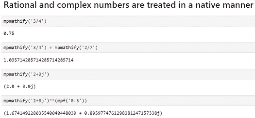

我们不必导入像 `[**fraction**](https://docs.python.org/3/library/fractions.html)` 或 `[**cmath**](https://docs.python.org/3/library/cmath.html)` 这样的 Python 模块来处理这些量，以选择我们需要的精度。

了解所有其他的 [通用工具函数](https://mpmath.org/doc/current/general.html)`[mpmath](https://mpmath.org/doc/current/general.html)`[ 提供的信息](https://mpmath.org/doc/current/general.html)。

## 快速绘图

如果系统上可用 Matplotlib，`mpmath` 提供了一种快速且简单的绘图选择，只需传递函数列表及其对应范围。

这是一个单行代码示例，

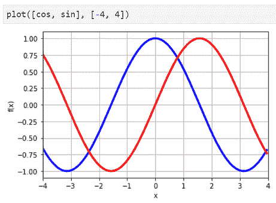

**图片来源**：由作者生成

另一个例子是 [Fresnel 函数](https://en.wikipedia.org/wiki/Fresnel_integral)，

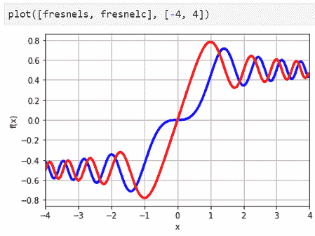

**图片来源**：由作者生成

复数量可以通过 `cplot` 轻松绘制。默认情况下，复数参数（相位）显示为颜色（色调），而幅度显示为亮度。

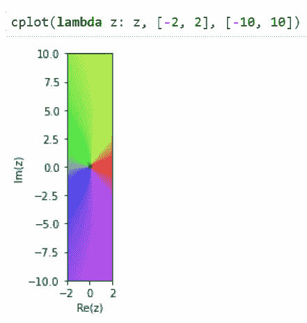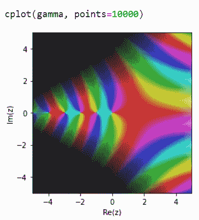**图片来源**：作者生成

表面图也是一个好选择，

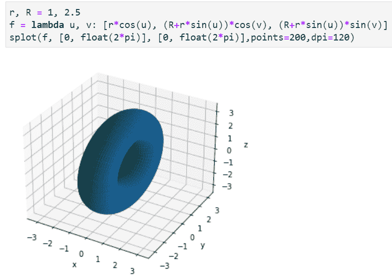

**图片来源**：作者生成

## 特殊函数

`mpmath` 支持数百种特殊函数。以下是该列表的部分截图。有关详细信息，请参阅此文档。

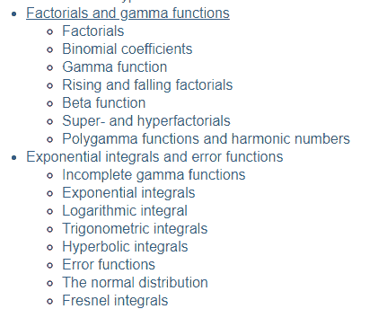

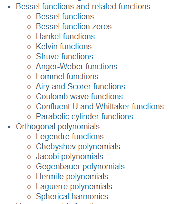

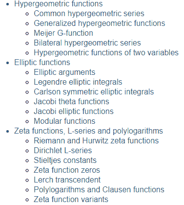

**图片来源**：作者生成

## 二项式系数

使用 `binomial` 函数快速而轻松地计算统计学和组合数学中的二项式系数，


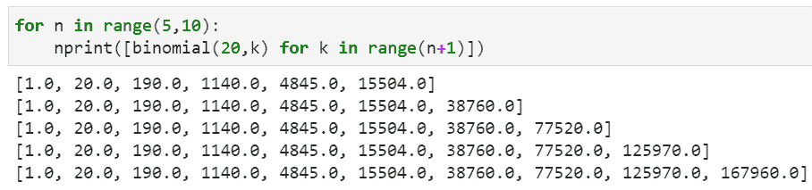

这个函数支持 **巨大的参数，这正是它真正出色的地方**。Scipy 的计算速度更快，但对于大数字，Scipy 甚至无法运行！

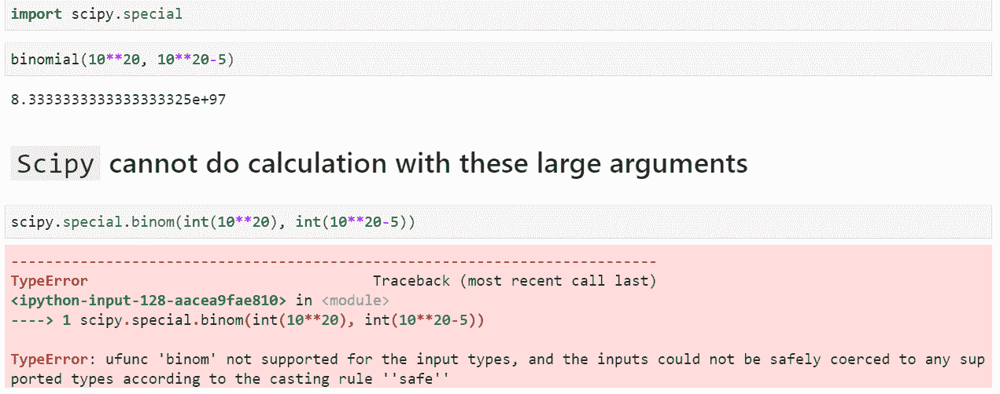

而且，扩展到非整数和负参数是自然的（使用 Gamma 函数），


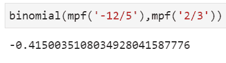

## 超阶乘

对于整数，超阶乘定义为，

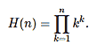

它们非常大。你能想到一种简单的方法来计算这种数字吗？

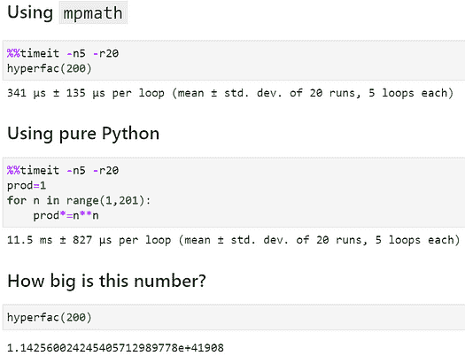

这个数字是 1.1425…后面跟着 41908 个零！为了理解这一点，可以考虑这个事实——宇宙中大约有 [10⁸⁰ 个原子](https://www.thoughtco.com/number-of-atoms-in-the-universe-603795)，即 1 后面跟着 80 个零。

无限的数学（以快速的方式），不是吗？

## 斐波那契数

计算斐波那契数列的朴素 Python（递归函数）是一个流行的面试问题，因为它可以通过几种不同的方法完成，而这些方法在效率上差异巨大。

然而，使用大参数或非整数（甚至复数）参数计算近似解对于 `mpmath` 来说是自然且简单的。这在使用原生 Python 编码时并不那么简单。

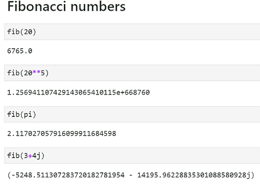

多项式评估和根

使用 `polyeval` 和 `polyroots` 函数快速且轻松地评估任意阶数的多项式并求解根。当然，`polyroots` 可以一次性评估所有实数和复数根。

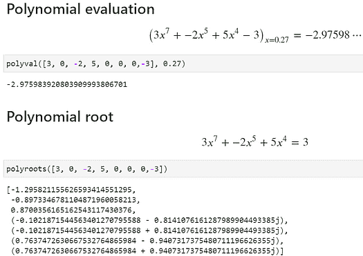

## 任意函数的根求解

我们可以使用 `rootfind` 函数来搜索任何任意函数的根。这里是一个例子，

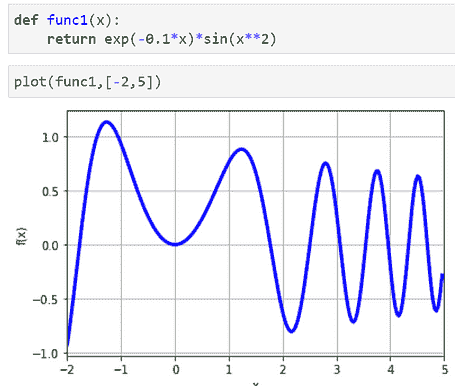

**图片来源**：作者生成

然后，我们在 -2 到 5 之间寻找所有整数附近的解，发现多个解对应于函数过零的所有 x 值。

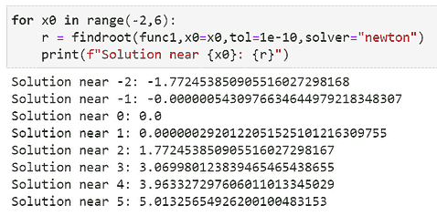

## 数值微积分

计算任何阶数和任何函数的导数，


偏导数很简单，

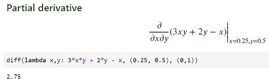

查看[这个参考资料](https://mpmath.org/doc/current/calculus/differentiation.html)以了解其他与导数相关的高级示例和函数。

## 1-D 积分

简单快速的任意精度评估，

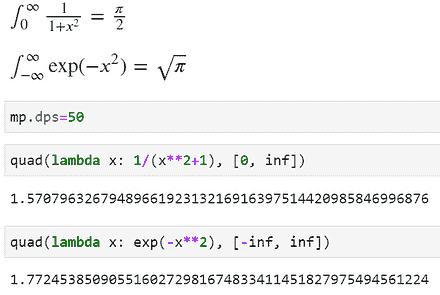

## 2-D 或 3-D 积分

二维或三维积分也可以处理！

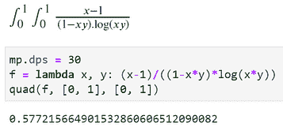

阅读更多[详细信息](https://mpmath.org/doc/current/calculus/integration.html)。

## 常微分方程

我们可以使用`odefun`来求解已知边界条件的常微分方程。


或者，更困难一些，

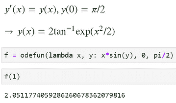

## 矩阵和线性代数

`mpmath` 包还提供了所有涉及矩阵和线性代数的标准操作。为了简洁起见，我们在这里[参考文档](https://mpmath.org/doc/current/matrices.html)而不是展示示例。

## 总结

在这篇文章中，我们展示了一个强大的 Python 库及其执行任意精度数值计算的能力，涉及各种数字和函数。基本上，这个库的主要优点是它涵盖了非常广泛的数学领域（代数、数论、微积分、特殊函数等），而且**一切都在一个屋檐下，不需要加载多个库**。

这个库的许多应用领域涉及复杂的科学/技术领域，如有限元模拟或密码学，但作为一个数字爱好者，你总能从这个包中挑选出对你的数据科学或机器学习工作有用的函数。

再次，这里是[本文中展示的所有代码的 Notebook](https://github.com/tirthajyoti/Stats-Maths-with-Python/blob/master/mpmath-1.ipynb)。

祝你数据处理愉快！

你可以查看作者的[**GitHub**](https://github.com/tirthajyoti?tab=repositories)**库**，以获取机器学习和数据科学方面的代码、创意和资源。如果你和我一样，对 AI/机器学习/数据科学充满热情，请随时[在 LinkedIn 上添加我](https://www.linkedin.com/in/tirthajyoti-sarkar-2127aa7/)或[在 Twitter 上关注我](https://twitter.com/tirthajyotiS)。

**简介: [Tirthajyoti Sarkar](https://www.linkedin.com/in/tirthajyoti-sarkar-2127aa7/)** 是 Adapdix Corp 的数据科学/机器学习经理。他定期为 KDnuggets 和 TDS 等出版物撰写有关数据科学和机器学习的多样化话题。他编著了数据科学书籍，并参与开源软件开发。Tirthajyoti 拥有电气工程博士学位，并正在攻读计算数据分析硕士学位。可以通过 tirthajyoti at gmail[dot]com 联系他。

**相关：**

+   数据科学中的基础数学：‘为什么’和‘如何’

+   为什么以及如何学习“高效的数据科学”？

+   教 AI 分类时间序列模式的合成数据

* * *

## 我们的三大课程推荐

 1\. [Google 网络安全证书](https://www.kdnuggets.com/google-cybersecurity) - 快速进入网络安全职业

 2\. [Google 数据分析专业证书](https://www.kdnuggets.com/google-data-analytics) - 提升你的数据分析能力

 3\. [Google IT 支持专业证书](https://www.kdnuggets.com/google-itsupport) - 支持你的组织 IT 工作

* * *

### 更多相关话题

+   [如何克服对数学的恐惧并为数据科学学习数学](https://www.kdnuggets.com/2021/03/overcome-fear-learn-math-data-science.html)

+   [数据科学中的基础数学：奇异值分解的视觉介绍](https://www.kdnuggets.com/2022/06/essential-math-data-science-visual-introduction-singular-value-decomposition.html)

+   [数据科学中的基础数学：特征向量及其在 PCA 中的应用](https://www.kdnuggets.com/2022/06/essential-math-data-science-eigenvectors-application-pca.html)

+   [在数据科学中需要多少数学？](https://www.kdnuggets.com/2020/06/math-data-science.html)

+   [如何为机器学习学习数学](https://www.kdnuggets.com/2022/02/learn-math-machine-learning.html)

+   [KDnuggets™ 新闻 22:n07，2 月 16 日：如何为机器学习学习数学](https://www.kdnuggets.com/2022/n07.html)
