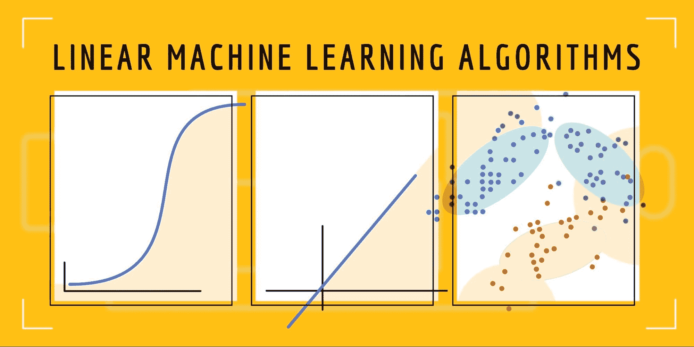
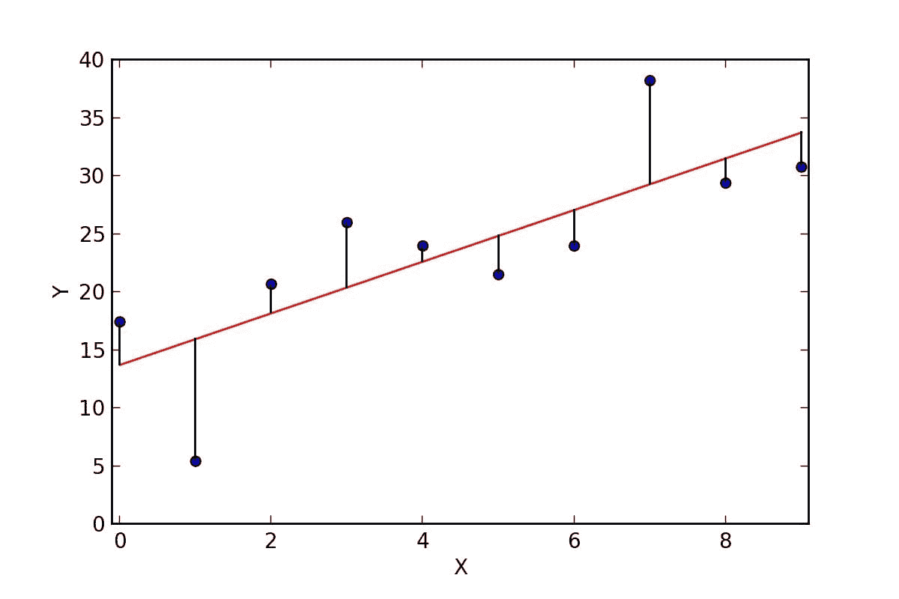
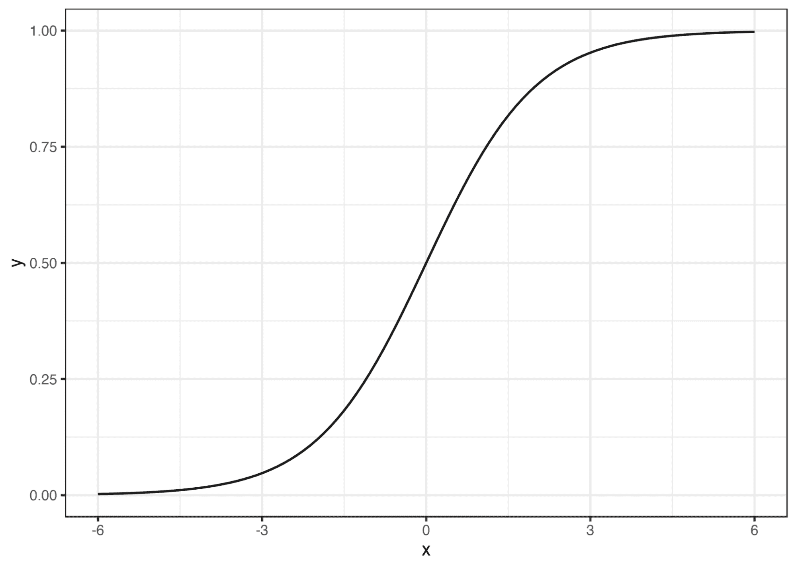
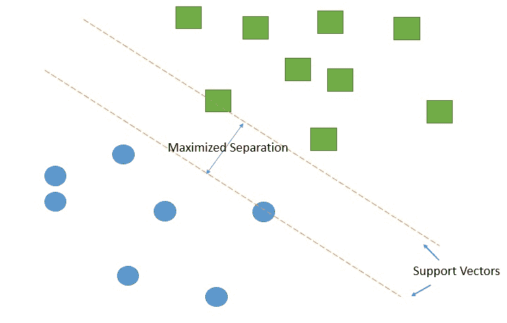
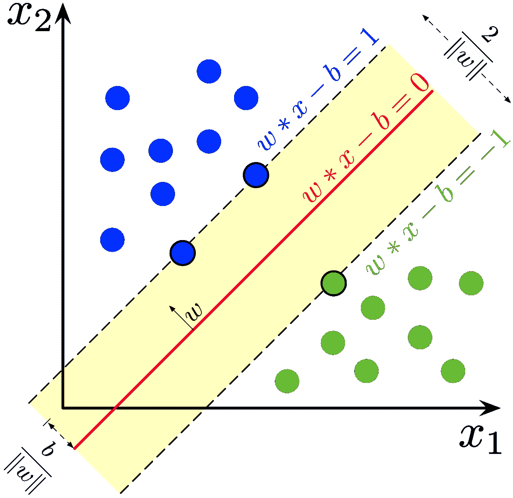
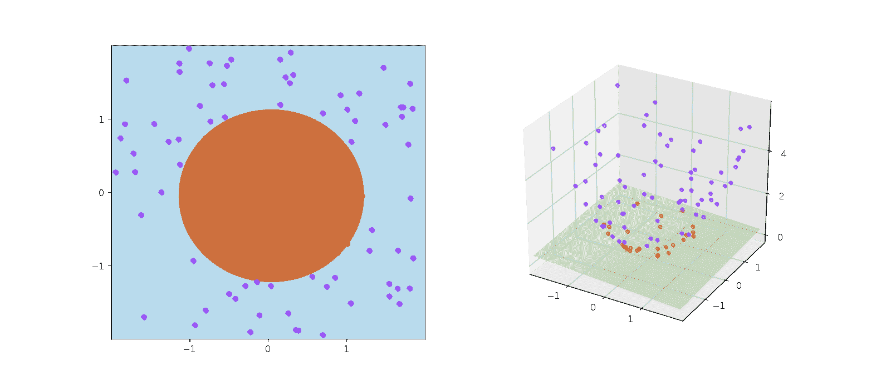

# 线性机器学习算法概述

> 原文：[`www.kdnuggets.com/2022/07/linear-machine-learning-algorithms-overview.html`](https://www.kdnuggets.com/2022/07/linear-machine-learning-algorithms-overview.html)

图片来源：作者

线性机器学习算法假设特征与目标变量之间存在线性关系。在本文中，我们将讨论几种线性算法及其概念。以下是你可以期待学习的内容：

+   线性机器学习算法的类型。

+   线性算法的假设。

+   各种线性机器学习算法之间的差异。

+   如何解读线性算法的结果。

+   何时使用不同的线性算法。

* * *

## 我们的前三大课程推荐

 1\. [谷歌网络安全证书](https://www.kdnuggets.com/google-cybersecurity) - 快速进入网络安全职业生涯。

 2\. [谷歌数据分析专业证书](https://www.kdnuggets.com/google-data-analytics) - 提升你的数据分析技能

 3\. [谷歌 IT 支持专业证书](https://www.kdnuggets.com/google-itsupport) - 支持你所在组织的 IT 工作

* * *

让我们直接深入探讨吧。

# 线性机器学习算法的类型

你可以将线性算法用于分类和回归问题。让我们开始了解不同的算法以及它们解决的问题。

## 线性回归

线性回归可以说是最古老也是最流行的算法之一。该算法源于统计学领域，用于解决回归问题。这意味着模型的最终输出是一个数值。该算法映射了输入特征（X）与输出（y）之间的线性关系。

[普通最小二乘线性回归](https://scikit-learn.org/stable/modules/generated/sklearn.linear_model.LinearRegression.html)是线性回归中最广泛使用的实现之一。它拟合一个具有系数`w = (w1, …, wp)的线性模型，以最小化数据集中观察到的目标与线性近似预测的目标之间的残差平方和`。[来源](https://scikit-

learn.org/stable/modules/generated/sklearn.linear_model.LinearRegression.html）。

在这种方法中，拟合了多条直线，并选择返回误差最小的直线作为**最佳拟合**。误差是估计值与实际值之间的差异。

由于线性回归拟合的是一条直线，它可以对未来的数据进行外推，这不同于如随机森林等其他算法。基于树的算法无法预测给定数据之外的值，因为它们的预测基于不同决策树预测值的均值。

[线性回归拟合的残差](https://commons.wikimedia.org/wiki/File:Residuals_for_Linear_Regression_Fit.png)

例如，当预测商品价格时，会在自变量和因变量之间拟合一条直线。线性回归线的一般方程如下：

其中：

+   c 是截距，即当 x 为零时 y 的值。

+   m 是直线的斜率。

+   x 是自变量。

+   y 是因变量。

其他线性回归算法包括：

+   [**套索回归**](https://scikit-learn.org/stable/modules/linear_model.html#lasso) 是一种引入了***L1 正则化***的线性模型，其目标是最小化系数的绝对和。在此算法中，不重要特征的权重被驱动到零。因此，不重要的特征会从线性方程中去除，使最终方程更简单。

+   [**岭回归**](https://scikit-learn.org/stable/modules/linear_model.html#ridge-regression) 的系数最小化了一个带惩罚的残差平方和。此正则化被称为***L2 正则化***。在此算法中，不重要特征的权重被减少到接近零的小数值，但不会完全为零。这对于修剪系数同时保留所有特征并相应调整权重非常有用。

## 线性回归的假设

线性回归对数据中的异常值非常敏感。其他需要注意的事项包括：

+   数据呈正态分布。

+   输入变量和输出之间的关系是线性的。

+   变量之间的相关性不高。如果出现这种情况，请去除高度相关的变量。

+   标准化或归一化数据也不会对算法造成伤害！

## 逻辑回归

逻辑回归是一种用于分类问题的线性模型。它生成一个介于 0 和 1 之间的概率。这是通过拟合一个 [逻辑函数，也称为 sigmoid 函数](https://en.wikipedia.org/wiki/Logistic_function) 实现的。该函数负责将预测值映射到介于 0 和 1 之间的数字。

Logistic 函数 | [图像来源](https://christophm.github.io/interpretable-ml-book/images/logistic-function-1.png)

当用于多类别分类时，称为多项式回归。这是通过调整逻辑回归算法来预测一个多项分布来实现的。通过将训练模型所用的损失函数从对数损失更改为交叉熵损失来实现。同时，算法也被修改为为每个类别输出一个概率，而不是单一的概率。

逻辑回归最受欢迎的实现之一是在[Scikit-learn](https://scikit-learn.org/stable/modules/generated/sklearn.linear_model.LogisticRegression.html)中完成的。该实现通过将`class_weight`参数设置为`balanced`来处理不平衡数据集。在这种情况下，算法将调整权重以给予样本较少的类别更多的权重，从而使算法能从该类别中学到更多。

**逻辑回归假设**

逻辑回归算法的假设类似于线性回归的假设。这里的独特之处在于，该算法期望目标变量是分类的。

## 支持向量机

支持向量机（SVM）是一种监督式机器学习算法，可用于回归和分类问题。它主要用于分类。

当数据线性可分时使用线性 SVM。在这种情况下，数据可以通过一条直线轻松分隔。

分类是通过找到最佳分隔两个类别的超平面来完成的。SVM 使用极端数据点来创建决策边界。这些极端数据点被称为***支持向量***，因此得名支持向量机。

[支持向量机模型。支持向量被创建以最大化两个组之间的分隔](https://upload.wikimedia.org/wikipedia/commons/thumb/b/b5/Svm_separating_hyperplanes_%28SVG%29.svg/800px-Svm_separating_hyperplanes_%28SVG%29.svg.png)。

向量之间的距离称为***间隔***。该算法通过最大化两个类别之间的间隙——即间隔来工作。***最优超平面***是具有最大间隔的超平面。

[SVM 在两个类别上训练得到的最大间隔超平面和间隔。](https://commons.wikimedia.org/wiki/File:SVM_margin.png)

SVM 还可以通过一种称为***核技巧***的技术计算非线性分类的边界。它通过添加第三维度并在 3D 空间中分隔数据点来工作。

[SVM 中的核技巧示意图](https://commons.wikimedia.org/wiki/File:Kernel_trick_idea.svg)

# SVM、线性回归和逻辑回归之间的区别

线性回归算法与逻辑回归的不同在于逻辑回归输出概率。因此，逻辑回归算法可用于分类，而线性回归算法则不能。逻辑回归算法输出 0 到 1 之间的值，而线性回归算法则会外推并输出零以上或以下的值。

SVM 更具内存效率，因为它在决策函数中使用了训练数据的一个子集。与逻辑回归算法不同，SVM 不提供概率估计。SVM 也不像逻辑回归那样容易受到异常值的影响，因为它主要关注的是最接近超平面的数据点。

# 线性算法结果解释：汇总统计

线性回归输出每个自变量的系数。以一个用来预测商品价格的自变量 X1 为例。如果 X1 的系数是 6.2，可以这样解释：在所有因素保持不变的情况下，X1 每增加一个单位，商品价格将增加 6.2。

逻辑回归算法输出一个项目属于某个类别的概率。因此，通过设置 0.5 的阈值来解释结果，从而分隔这两个类别。

给定一个包含两个类别的数据集，SVM 算法将通过计算最佳超平面来预测项目属于哪个类别。它不计算任何概率，而是使用数据点与最优超平面的距离来分隔类别。

# 何时使用逻辑回归与支持向量机

逻辑回归和支持向量机是分类中两种流行的算法。然而，在某些情况下，你可能会偏好其中一个。例如，当存在异常值时，使用 SVM 更好，因为它们不会影响算法如何分离两个类别。SVM 在数据维度较高时也是更好的选择。

当类别没有很好地分离时，逻辑回归是更好的选择。否则，使用支持向量机（SVM）。不过，通常会先使用逻辑回归模型来创建基线模型。

# 最终思考

线性算法在机器学习中非常流行。在这篇文章中，我们探讨了几种线性模型及其内部工作原理。我们还讨论了何时偏好使用其中一种算法。一般来说，算法的选择将依赖于问题和数据集。

## 资源

[稀疏性正则化](https://developers.google.com/machine-learning/crash-course/regularization-for-sparsity/l1-regularization)

**[德里克·穆伊提](https://www.linkedin.com/in/mwitiderrick/)** 在数据科学、机器学习和深度学习方面经验丰富，并且在构建机器学习社区方面具有敏锐的眼光。

### 更多相关话题

+   [提升机器学习算法：概述](https://www.kdnuggets.com/2022/07/boosting-machine-learning-algorithms-overview.html)

+   [理解机器学习算法：深入概述](https://www.kdnuggets.com/understanding-machine-learning-algorithms-an-indepth-overview)

+   [机器学习数据标注：市场概述、方法和工具](https://www.kdnuggets.com/2021/12/data-labeling-ml-overview-and-tools.html)

+   [机器学习评估指标：理论与概述](https://www.kdnuggets.com/machine-learning-evaluation-metrics-theory-and-overview)

+   [学习机器学习线性代数的三大免费资源](https://www.kdnuggets.com/2022/03/top-3-free-resources-learn-linear-algebra-machine-learning.html)

+   [机器学习中的主要监督学习算法](https://www.kdnuggets.com/2022/06/primary-supervised-learning-algorithms-used-machine-learning.html)
