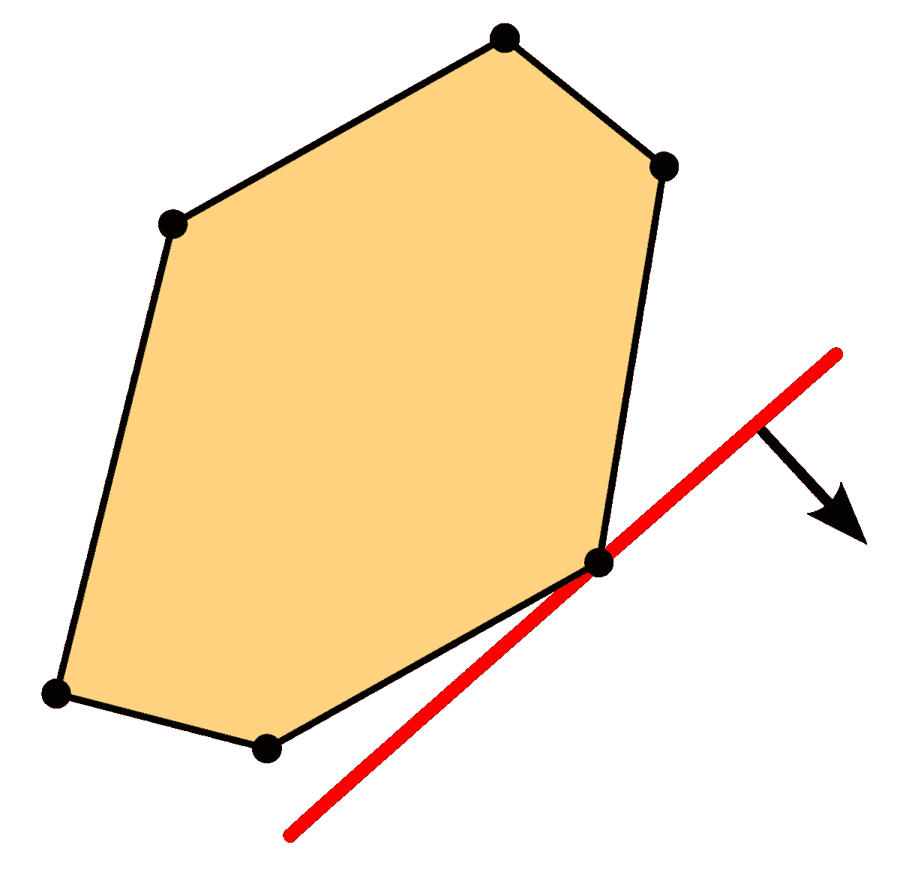
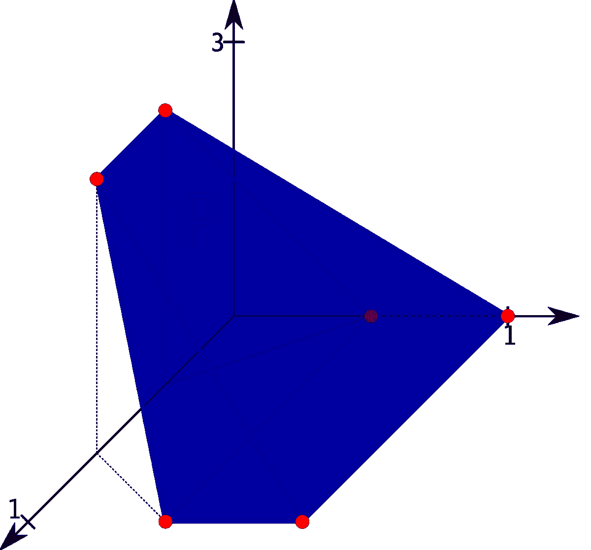
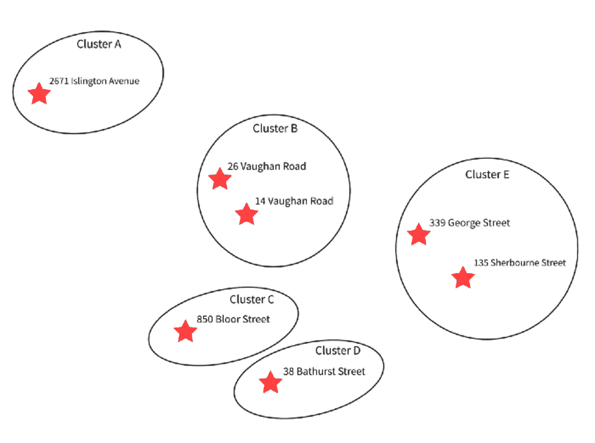

# 线性规划 101 数据科学家

> 原文：[`www.kdnuggets.com/2023/02/linear-programming-101-data-scientists.html`](https://www.kdnuggets.com/2023/02/linear-programming-101-data-scientists.html)



图片来自[维基百科](https://en.wikipedia.org/wiki/Linear_programming)

# 1\. 线性规划的起源

对于那些对这一主题较为熟悉的人，你们可能知道线性规划的起源大致是在 1950 年代中期，一位名叫[乔治·丹茨格](https://en.wikipedia.org/wiki/George_Dantzig)的数学家参与了其中。如果这是你的猜测，你大致是对的，但我们都知道，归功于许多（如果不是全部）科学和数学发现的过程并非那么简单——通常有多个个体为一个研究领域的发展做出贡献，线性规划就是这种情况。初步进展由两位独立工作的数学家在 20 世纪中期同时取得，因此确实有多个贡献者。

在不深入历史的情况下，我们先对线性规划的关键进展时间线有一个大致的了解。线性规划的最初概念源于[列昂尼德·坎托罗维奇](https://en.wikipedia.org/wiki/Leonid_Kantorovich)试图降低自己军队的成本同时增加敌军的成本。他的努力发生在 1939 年的第二次世界大战期间，但当时被苏联忽视。与此同时，[T.C. 库普曼斯](https://en.wikipedia.org/wiki/Tjalling_Koopmans)有一个类似的想法，但他独立工作，且针对他自己的经济应用。几年后，1941 年，弗兰克·劳伦·希区柯克开始研究类似的想法，这些想法同样针对他自己的运输问题，但他发展出了类似于现在著名的单纯形法的解决方案。简而言之，这三个人都在正确的轨道上，但当发现获得诺贝尔经济学奖时，希区柯克已经去世，因此[坎托罗维奇和库普曼斯获得了荣誉](https://www.nobelprize.org/prizes/economic-sciences/1975/summary/)。

在 1946 年至 1947 年间，乔治·B·丹茨格开发了一种单纯形法算法，这种算法*高效*地解决了*大多数情况下*的线性规划问题——这是一项令人惊叹的成就。随后，丹茨格向约翰·冯·诺依曼介绍了线性规划中的对偶理论，冯·诺依曼当时正在发展博弈论，并惊讶地发现丹茨格在未解决的线性规划问题上取得了进展。这非常令人兴奋。（《心灵捕手》，有人看过吗？丹茨格的成就实际上是该电影情节的灵感来源！）


[心灵捕手](https://en.wikipedia.org/wiki/Good_Will_Hunting) ([来源](https://tenor.com/en-GB/view/figure-it-out-gif-14765862))

这些领域现在已经得到充分研究，并在重要的实际应用中被广泛使用。二战后，丹兹格的工作被应用于许多行业的日常规划应用中，数学家们很快在将线性规划问题的求解时间缩短为多项式时间方面取得了进展。这些是关于其起源的一些背景（例如，你可以[在这里](https://apps.dtic.mil/sti/pdfs/ADA112060.pdf)阅读详细信息），但现在，让我们简要了解一下最近的进展。

# 2\. 线性规划的最新进展

最近，线性规划的研究集中在开发能够改善计算复杂性的算法上。例如，[这篇论文](https://arxiv.org/abs/2004.07470)讨论了用于加速 LP 的快速动态矩阵求逆。（不过，它内容偏向计算机科学，我们无需深入了解）。总体而言，[今天有大量的研究](https://arxiv.org/list/math.OC/recent)集中在数学优化领域，无论是为了加速计算、减少低效，还是引入新的机器学习应用。

# 3\. 应用线性规划的软件

目前有无数的软件包支持行业中的应用线性规划。你可以使用 IBM 的[CPLEX](https://en.wikipedia.org/wiki/CPLEX)、[GUROBI](https://www.gurobi.com/) 专有优化软件，开源 Python 包（如[SciPy](https://docs.scipy.org/doc/scipy/reference/generated/scipy.optimize.linprog.html#scipy.optimize.linprog)、[Pyomo](http://www.pyomo.org/)、[PuLP](https://coin-or.github.io/pulp/)、[GEKKO](https://gekko.readthedocs.io/en/latest/)），还有可能更多。一个有趣的事实是，所有这些包都使用了我们称之为[代数建模语言（AML）](https://en.wikipedia.org/wiki/Algebraic_modeling_language)的关键范式，这一范式在 1970 年代末期开发出来。所有这些包都在各自的领域表现出色，有许多博客文章可以阅读，以获得它们之间的良好比较——例如，可以查看[这篇文章](https://medium.com/opex-analytics/optimization-modeling-in-python-pulp-gurobi-and-cplex-83a62129807a)。

# 4\. 线性规划中的主题

我们不会详细讨论，但让我们谈谈作为线性规划理论和方法的用户你应该知道的东西。线性规划的理论本身很美，但当你能够将线性规划与线性代数联系起来时，它会更美。无论你是读了一本[教科书](https://www.sciencedirect.com/book/9780124179103/elementary-linear-programming-with-applications)，还是参加了一个[在线入门课程](https://www.udemy.com/course/linear-programming-for-machine-learning/?utm_source=adwords&utm_medium=udemyads&utm_campaign=Webindex_Catchall_la.EN_cc.CA&utm_term=_._ag_119831896715_._ad_533102824920_._kw__._de_c_._dm__._pl__._ti_dsa-392284169515_._li_9000737_._pd__._&matchtype=&gclid=EAIaIQobChMI_p2at7m2_AIVOxXUAR0dMQM1EAAYAiAAEgL6jvD_BwE)，还是在学校[正式学习了这门课程](https://www.youtube.com/playlist?list=PLDndWhwv4Ujo10_a2T4R4Uqng1nduvfu1)，毫无疑问，你会得出线性规划是线性代数的一个特例，并且可能是基础线性代数最重要和相关的扩展之一的结论。

无论你选择了哪种学习线性规划的途径，你可能都遇到了以下（或类似的）主题：

+   线性程序的组成部分

+   线性程序的形式

+   常见的线性规划问题

+   对偶理论和敏感性分析

+   专门类型的线性程序

+   应用线性规划

（这听起来对吗？如果我遗漏了什么，请在下面留言。）如果是这样，并且你认为自己对所有这些话题都很熟悉，那么我建议你可以在这里停下，结束这篇文章（并祝贺自己，因为你刚刚了解了线性规划的简短历史！）。然而，如果以上话题中至少有一个对你来说是新的，那么我认为你应该继续阅读这篇文章，因为我觉得这将值得你的时间。

# 5. 常见线性规划问题

为了简洁和易于消化，我们将跳过序列中的前两个主题，但[这里是一个好资源](https://towardsdatascience.com/elements-of-a-linear-programming-problem-lpp-325075688c18)，你可以在这里了解线性程序的组成部分和线性程序的形式。同样，我们将省略对偶理论和敏感性分析的讨论，但一些很好的资源在[这里](https://towardsdatascience.com/the-sensitivity-analysis-a-powerful-yet-underused-tool-for-data-scientists-e553fa695976)和[这里](https://machinelearninggeek.com/sensitivity-analysis-in-python/)。

现在，如果你正在尝试应用线性规划原理来解决一个问题，你可能已经考虑了各种其他模型，并且（希望合理地）得出结论认为线性规划模型能够解决你的问题。如果是这样，可能你也考虑过一些经典的使用线性规划的问题：[混合问题](https://machinelearninggeek.com/solving-blending-problem-in-python-using-gurobi/)，[分配问题](https://machinelearninggeek.com/solving-assignment-problem-using-linear-programming-in-python/)，[运输问题](https://machinelearninggeek.com/solving-transportation-problem-using-linear-programming-in-python/)，[旅行商问题](https://medium.com/analytics-vidhya/model-and-solution-of-the-traveling-salesman-problem-with-python-and-pyomo-db45f2631e8c)，还有许多其他问题。

如果你的问题大致类似于这些问题中的任何一个，那么我们已经知道如何解决你的问题，你可以继续进行。如果不是，你需要更深入地思考你的问题，并找出一种巧妙的方法将其转化为线性规划问题。考虑一些类似的问题：

+   你*需要*一个线性规划来解决这个问题吗，还是这个问题可能是一个简单的问题？

+   你的主要目标是什么？

+   你只有一个目标，还是有多个目标？

+   这是一个最大化问题还是一个最小化问题？

+   你能想到的所有可能的约束条件是什么？

+   你的决策变量都是非负的吗，还是需要一些特殊的规格？

# 6\. Python 中的应用线性规划：基于多伦多收容所数据的案例研究

我已经做了大量的解释，所以与其再多说些，不如直接展示一个“非标准”的应用线性规划问题，代码如下。如果你还记得，我们提到过有许多开源的 Python 包使用 AML 范式。PuLP 就是其中之一，所以我们这次使用 PuLP。

这是一个半假设性的例子，涉及 12 个真实存在的无家可归者收容所，位于多伦多市——真实的地址、真实的建筑物、虚假的房间/床位数量（即供应/容量）、虚假的新床位请求数量（即需求）、虚假的‘集群’收容所所属。话题有些沉重，我知道。这些数据来源于该市的[开放数据目录](https://open.toronto.ca/dataset/daily-shelter-overnight-service-occupancy-capacity/)。

作者编写的代码

假设我们在查看多伦多的无家可归者避难所的任意一天的床位供应和需求快照。我们选择的无家可归者避难所是战略性地分布在整个城市的——有些避难所彼此较近，而有些则相隔较远。请记住，这一点对于我们将要指定的优化问题是相关的。请注意，需求是按集群级别而不是避难所级别计算的。

此外，每增加一个床位，无论是在避难所还是在集群中，都会产生（货币和时间）成本，这些成本有所不同——有时按避难所计算，有时按集群计算。我们将集群定义为相对接近的避难所组——下方是位置相对彼此的粗略“地图”示意图。



除了货币成本之外，假设开设每个额外床位也会有时间成本——有时按避难所计算，有时按集群计算。这些时间成本的原因是，可能在邻近/集群内对床位有需求，但请求是在满员的位置提出的，需要重新安置服务用户。

我们将把这个设置为一个 [多目标优化问题](https://www.supplychaindataanalytics.com/multi-objective-linear-optimization-with-pulp-in-python/)，因此我们的规范（代码中）需要能够适应这个问题。首先，我们最小化货币成本，然后最小化时间成本。第二个目标函数中的系数对应于特定避难所组内的相对时间增加（即，将新用户从避难所 X 转移到避难所 Y 的时间成本）。请注意，优化问题的规范不是唯一的，可能有多个规范导致相同的结果。

这是所有代码的一个长脚本。模型规范代码可以压缩/简化，但我们保持这种形式，以便你能更清楚地看到所有细节。我们注释掉了初始目标函数，因为我们在第 5 步中将其作为货币成本约束添加了。

作者代码

如果你在本地运行了这段代码，你会看到如下输出：

```py
A:2671Islington:      1 additional bed(s).

B1:26Vaughan:         0 additional bed(s).

B2:14Vaughan:         5 additional bed(s).

C:850Bloor:           1 additional bed(s).

D1:38Bathurst:        2 additional bed(s).

D2:38Bathurst:        1 additional bed(s).

E1:135Sherbourne:     6 additional bed(s).

E2:339George:         5 additional bed(s).

E3:339George:         4 additional bed(s).

E4:339George:         0 additional bed(s).

E5:339George:         0 additional bed(s).

E6:339George:         4 additional bed(s).

Optimal Value of Objective Function:  36.9
```

你可能会问：这不是一个微不足道的问题吗？如果不是，那是为什么？这是一个重要的问题，这可能证明不需要指定线性规划问题！然而，在这种情况下，这是一个非平凡的问题，我们确实需要线性规划规范，考虑一下原因。

> **提示：** 首先，我们最小化货币成本，然后最小化时间成本。你能想到用手动方式解决这个问题的方法吗？

## 参考文献

[1] B. Kolman 和 R.E. Beck, [《基础线性规划及应用》](https://www.sciencedirect.com/book/9780124179103/elementary-linear-programming-with-applications) (1995), ScienceDirect

[2] G.B. 丹齐格，[线性规划起源的回忆](https://apps.dtic.mil/sti/pdfs/ADA112060.pdf)（1982 年），运筹学系 — 斯坦福大学

[3] R. 福尔尔，D.M. 盖伊，B.W. 肯尼汉，[数学编程建模语言](https://vanderbei.princeton.edu/307/textbook/AMPLbook.pdf)（1990 年）

**[玛丽亚姆·瓦拉](https://www.linkedin.com/in/mariamwalaa/)** 是一名数学专业背景的数据科学家，拥有超过 3 年的工程、零售和学术领域的数据科学经验，涉及自然语言处理、推荐系统、线性规划和优化等多种问题。

* * *

## 我们的前三个课程推荐

 1\. [谷歌网络安全证书](https://www.kdnuggets.com/google-cybersecurity) - 快速进入网络安全职业的捷径

 2\. [谷歌数据分析专业证书](https://www.kdnuggets.com/google-data-analytics) - 提升你的数据分析技能

 3\. [谷歌 IT 支持专业证书](https://www.kdnuggets.com/google-itsupport) - 支持你的组织 IT

* * *

### 更多相关主题

+   [KDnuggets™ 新闻 22:n04, 1 月 26 日: 高薪副业…](https://www.kdnuggets.com/2022/n04.html)

+   [DataLang: 为数据科学家创建的新编程语言…](https://www.kdnuggets.com/2023/04/datalang-new-programming-language-data-scientists-chatgpt.html)

+   [LangChain 101: 构建你自己的 GPT 驱动应用](https://www.kdnuggets.com/2023/04/langchain-101-build-gptpowered-applications.html)

+   [提示工程 101: 精通有效的 LLM 沟通](https://www.kdnuggets.com/prompt-engineering-101-mastering-effective-llm-communication)

+   [KDnuggets™ 新闻 22:n06, 2 月 9 日: 数据科学编程…](https://www.kdnuggets.com/2022/n06.html)

+   [数据科学编程语言及其使用时机](https://www.kdnuggets.com/2022/02/data-science-programming-languages.html)
