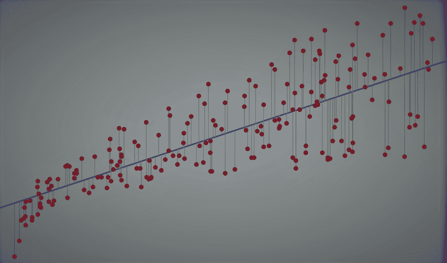
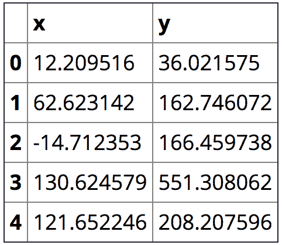
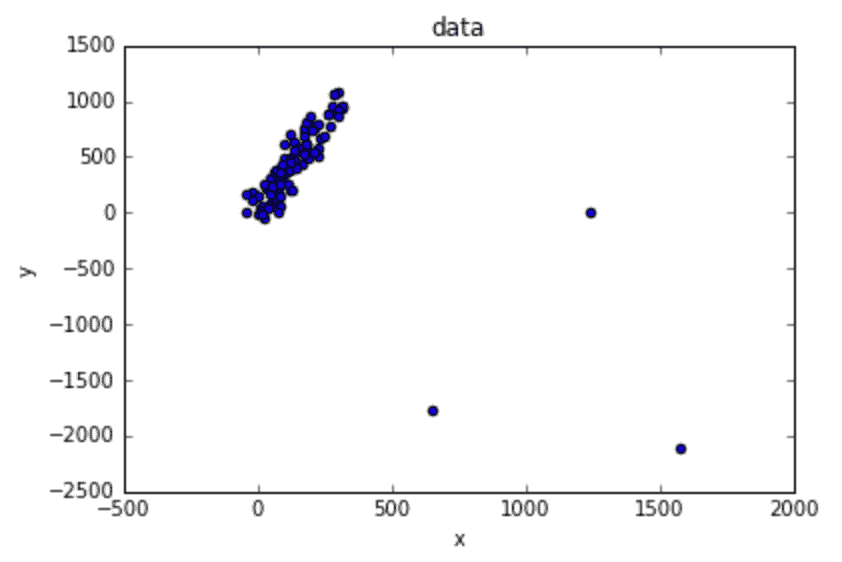
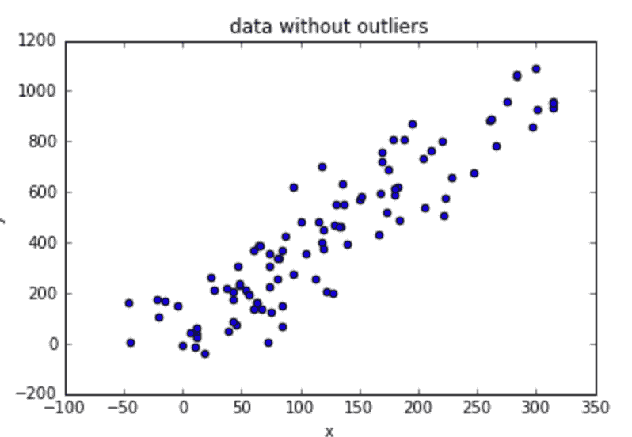
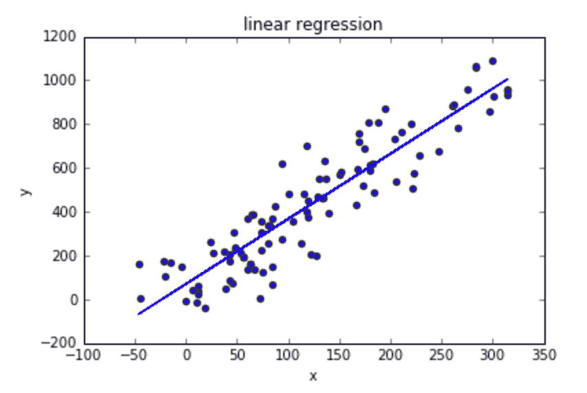
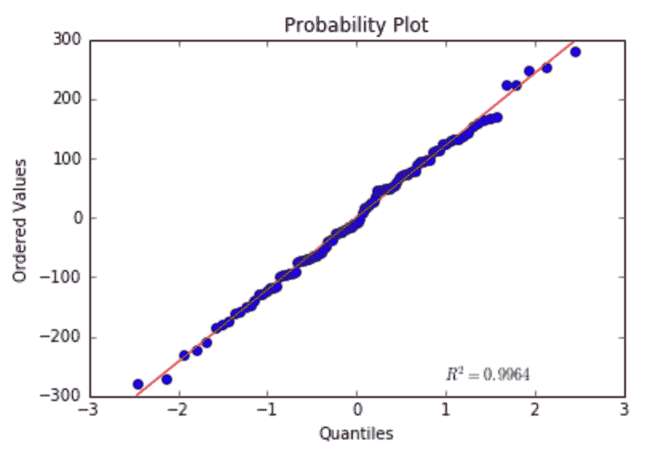
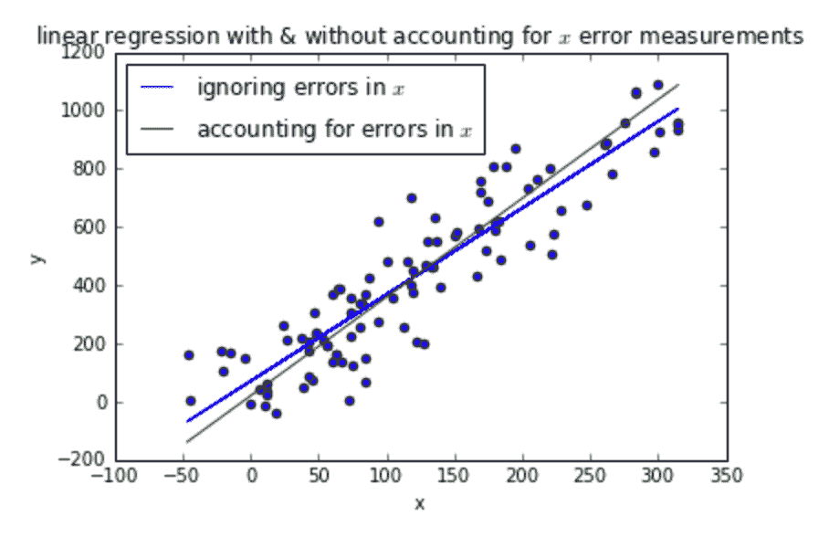

# 野外的线性回归

> 原文：[`www.kdnuggets.com/2018/10/linear-regression-wild.html`](https://www.kdnuggets.com/2018/10/linear-regression-wild.html)

 评论



在我一次数据科学职位的面试中，我收到了一项家庭作业，我想和你分享。

面试官给了我一个包含测量量 x 和 y 的 CSV 文件，其中 y 是一个响应变量，可以写成 x 的显式函数。已知用于测量 x 的技术在标准差意义上是测量 y 的技术的两倍好。

任务：将 y 建模为 x 的函数。

这是我需要的所有导入：

```py

import pandas as pd
import numpy as np
from sklearn.linear_model import LinearRegression
from scipy.stats import probplot

import matplotlib.pyplot as plt
%matplotlib inline

data = pd.read_csv('data.csv', names=['x', 'y'])
data.head()

```

 让我们可视化数据，看看是否容易通过目测捕捉到模式：

```py

data.plot.scatter('x', 'y', title='data')

```



这明显看起来是线性回归的情况。我首先会手动去除异常值：

```py

data = data[data['x'] < 600]
data.plot.scatter('x', 'y', title='data without outliers')

```



我将使用**LinearRegression**来拟合最佳直线：

```py

lr = LinearRegression().fit(data[['x']], data['y'])
data.plot.scatter('x', 'y', title='linear regression')
lr_predicted_y = lr.predict(data[['x']])
plt.plot(data['x'], lr_predicted_y)

```



在数据上拟合一条直线视觉上看起来很有说服力，但我将验证线性回归的假设，以确保我使用了正确的模型。

如果你对线性回归假设不熟悉，你可以阅读文章[深入回归分析：假设、图示与解决方案](https://www.analyticsvidhya.com/blog/2016/07/deeper-regression-analysis-assumptions-plots-solutions/)。

首先，我们将绘制残差误差：

```py

residuals = lr_predicted_y - data['y']
plt.scatter(x=lr_predicted_y, y=residuals)
plt.title('residuals')

```


+   残差中似乎没有自相关。

+   异方差性似乎不是问题，因为方差看起来几乎是恒定的（除了图的左边部分，但数据不多，所以我会忽略它）。

+   多重共线性在这里不相关，因为只有一个因变量。

+   残差应当是正态分布的：我将通过 QQ 图验证这一点：

```py

probplot(residuals, plot=plt)

```



看起来相当正常…

我将得出结论，假设 x 和 y 之间的线性关系最好的模型为：

```py

print 'y = %f + %f*x'  % (lr.intercept_, lr.coef_)

>>> y = 70.023655 + 2.973585*x

```

我们得到了一致的估计量来计算给定*x*的*y*（两者都有测量误差）的参数，换句话说，就是直线的系数。

到目前为止，我做的只是普通的线性回归。这项任务有趣的地方在于*x*有测量误差（这在实际应用中很常见）。

如果我们想估计计算 *y* 所需的参数（给定准确的 *x* 值，没有测量误差），我们需要使用不同的方法。使用简单线性回归而不考虑 *x* 随机噪声会导致直线斜率稍微小于 *真实* 直线斜率（描述 *x* 没有测量误差的直线）。你可以阅读 [这篇维基百科页面](https://en.wikipedia.org/wiki/Errors-in-variables_models#Motivational_example) 来了解原因。

我将使用 [Deming 回归](https://en.wikipedia.org/wiki/Deming_regression)，这是一种可以用于假设两个变量 *x* 和 *y* 的误差是独立且正态分布的，并且它们的方差比率（记作 *δ*）已知的方法。这种方法非常适合我们的设置，其中我们有

> *用于测量 x 的技术在标准差的意义上是测量 y 的技术的两倍。*

因此，在我们的设置中，*δ* 是 2 的平方。

使用 [维基百科页面](https://en.wikipedia.org/wiki/Deming_regression#Solution) 中找到的公式，我们得到

```py

cov = data.cov()
mean_x = data['x'].mean()
mean_y = data['y'].mean()
s_xx = cov['x']['x']
s_yy = cov['y']['y']
s_xy = cov['x']['y']
delta = 2 ** 2

slope = (s_yy  - delta * s_xx + np.sqrt((s_yy - delta * s_xx) ** 2 + 4 * delta * s_xy ** 2)) / (2 * s_xy)
intercept = mean_y - slope  * mean_x

```

使用 Deming 回归，x 和 y 之间的关系被建模为

```py

print 'y = %f + %f*x'  % (intercept, slope)

>>> y = 19.575797 + 3.391855*x

```

让我们绘制这两个模型：

```py

data.plot.scatter('x', 'y', title='linear regression with & without accounting for $x$ error measurements')
plt.plot(data['x'], lr_predicted_y, label='ignoring errors in $x$')
X = [data['x'].min(), data['x'].max()]
plt.plot(X, map(lambda x: intercept + slope * x, X), label='accounting for errors in $x$')
plt.legend(loc='best')

```



我们拟合了两个模型：一个是简单的线性回归模型，另一个是考虑了 *x* 测量误差的线性回归模型。

如果我们的目的是计算给定新 *x* 的 *y* （具有测量误差，来自与训练模型时使用的测量误差相同的分布），那么较简单的模型可能就足够了。

如果我们想在没有测量误差的世界中准确表述 *y* 作为 *x* 的函数的真实关系，我们应该选择第二个模型。

这是一个很好的面试问题，因为我学到了一个新的模型，这非常棒 :)

尽管这并不完全是标题所建议的 *野外线性回归* 示例（好吧，我撒谎了），但这篇文章确实展示了许多人没有注意到的一个重要概念：在许多情况下，因变量的测量是不准确的，这可能需要考虑（具体取决于应用）。

小心回归！

[原始](https://towardsdatascience.com/linear-regression-in-the-wild-335723a687e8)。经许可转载。

**简介**: [Yoel Zeldes](https://medium.com/@yoelzeldes) 是 Taboola 的算法工程师。Yoel 是一位机器学习爱好者，尤其喜欢深度学习的见解。

**相关内容:**

+   [现实生活中的线性回归](https://www.kdnuggets.com/2018/08/linear-regression-real-life.html)

+   [使用线性回归进行 R 中的预测建模](https://www.kdnuggets.com/2018/06/linear-regression-predictive-modeling-r.html)

+   [针对机器学习新手的十大算法巡礼](https://www.kdnuggets.com/2018/02/tour-top-10-algorithms-machine-learning-newbies.html)

* * *

## 我们的前三名课程推荐

 1\. [谷歌网络安全证书](https://www.kdnuggets.com/google-cybersecurity) - 快速进入网络安全职业生涯

 2\. [谷歌数据分析专业证书](https://www.kdnuggets.com/google-data-analytics) - 提升你的数据分析技能

 3\. [谷歌 IT 支持专业证书](https://www.kdnuggets.com/google-itsupport) - 支持你的组织的 IT

* * *

### 更多相关话题

+   [让深度学习在实际应用中发挥作用：以数据为中心的课程](https://www.kdnuggets.com/2022/04/corise-deep-learning-wild-data-centric-course.html)

+   [让深度学习在实际应用中发挥作用：以数据为中心的课程](https://www.kdnuggets.com/2022/11/corise-deep-learning-wild-data-centric-course.html)

+   [比较线性回归和逻辑回归](https://www.kdnuggets.com/2022/11/comparing-linear-logistic-regression.html)

+   [你应该使用线性回归模型而不是…的 3 个原因](https://www.kdnuggets.com/2021/08/3-reasons-linear-regression-instead-neural-networks.html)

+   [线性回归与逻辑回归：简明解释](https://www.kdnuggets.com/2022/03/linear-logistic-regression-succinct-explanation.html)

+   [KDnuggets 新闻 22:n12, 3 月 23 日：最佳数据科学书籍](https://www.kdnuggets.com/2022/n12.html)
