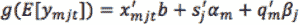
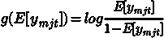

# 如何通过 Photon-ML 机器学习工具在 LinkedIn 上生成个性化推荐

> 原文：[`www.kdnuggets.com/2017/10/linkedin-personalized-recommendations-photon-ml.html`](https://www.kdnuggets.com/2017/10/linkedin-personalized-recommendations-photon-ml.html)

**作者：马一鸣、陈碧中与迪帕克·阿加瓦尔，LinkedIn 公司**

### 介绍

推荐系统是自动化计算机程序，用于在不同的上下文中将项目匹配到用户。这些系统无处不在，已成为我们日常生活的不可或缺的一部分。例如，像亚马逊这样的网站向用户推荐产品，像 Yahoo! 这样的网站向用户推荐内容，像 Netflix 这样的网站向用户推荐电影，LinkedIn 上向用户推荐工作等等。鉴于用户偏好的显著异质性，提供个性化推荐是这些系统成功的关键。

* * *

## 我们的前三个课程推荐

 1\. [谷歌网络安全证书](https://www.kdnuggets.com/google-cybersecurity) - 快速开启网络安全职业生涯。

 2\. [谷歌数据分析专业证书](https://www.kdnuggets.com/google-data-analytics) - 提升您的数据分析技能

 3\. [谷歌 IT 支持专业证书](https://www.kdnuggets.com/google-itsupport) - 支持您的组织的 IT 工作

* * *

为了在大规模上实现这一目标，使用机器学习模型从反馈数据中估计用户偏好是至关重要的。这些模型是通过大量从过去用户与项目互动中获得的高频数据构建的。它们本质上是统计性的，涉及诸如序列决策过程、高维分类数据交互建模以及开发可扩展统计方法等挑战。该领域的新方法需要计算机科学家、机器学习专家、统计学家、优化专家、系统专家以及领域专家之间的紧密合作。这是大数据应用中最令人兴奋的领域之一。

LinkedIn 上的许多产品都由推荐系统驱动。这些系统的核心组件是一个易于使用和灵活的机器学习库，名为 Photon-ML，它对我们的生产力、敏捷性和开发者满意度至关重要。我们已经开源了 Photon-ML 使用的大部分算法。在本文中，我们关注模型构建的个性化方面，并解释建模原理以及如何实现 Photon-ML 以便能够扩展到数亿用户。

### Photon-ML 中的个性化模型

在 LinkedIn，我们通过 Photon-ML 在许多产品领域观察到了用户参与度和其他业务指标的显著提升。以一个具体的例子来说，我们使用广义加性混合效应（GAME）模型进行个性化职位推荐，在我们的在线 A/B 实验中，为求职者产生了 20% 到 40% 更多的职位申请。

图 1\. LinkedIn 职位首页的快照

作为全球最大的职业社交网络，LinkedIn 为其超过 5 亿会员提供了独特的价值主张，以便他们能够与各种职业成长机会连接。我们提供的最重要的产品之一是职位首页，它作为一个中心位置，帮助有求职意向的会员找到适合申请的职位。图 1 是 LinkedIn 职位首页的快照。页面上的主要模块之一是“您可能感兴趣的职位”，根据会员的公开资料数据和在网站上的过往活动，向会员推荐相关的职位缩略图。如果会员对推荐的职位感兴趣，可以点击该职位进入职位详细信息页面，页面上显示了原始职位发布信息，包括职位名称、描述、职责、所需技能和资格。职位详细信息页面上还有一个“申请”按钮，允许会员一键申请该职位，无论是在 LinkedIn 上还是在发布职位的公司网站上。LinkedIn 职位业务的一个关键成功指标是**职位申请点击总数**（即点击“申请”按钮的次数）。

我们模型的目标是准确预测会员点击推荐职位的“申请”按钮的概率。直观地说，模型由三个组件（子模型）组成：

+   捕捉会员申请职位的一般行为的全局模型，

+   针对特定会员的模型，具有特定于给定会员的参数（从数据中学习），以捕捉会员的个人行为，这些行为偏离了通用行为，以及

+   针对特定职位的模型，具有特定于给定职位的参数（从数据中学习），以捕捉职位的独特行为，这些行为偏离了通用行为。

像许多推荐系统应用一样，我们观察到每个会员或职位的数据量存在很大的异质性。网站上有新会员（因此几乎没有数据），以及有强烈求职意图且过去申请过许多职位的会员。类似地，职位也有流行和不流行之分。对于过去对不同职位有许多响应的会员，我们希望依赖于特定会员的模型。另一方面，如果会员没有很多过去的响应数据，我们希望该会员可以退回到捕捉一般行为的全局模型。

现在让我们深入探讨一下 GAME 模型如何实现如此高水平的个性化。令 *y[mjt]* 表示成员 *m* 在上下文 *t* 中是否申请职位 *j* 的二元响应，其中上下文通常包括职位展示的时间和地点。我们用 *q[m]* 表示成员 *m* 的特征向量，包含从成员的公开资料中提取的特征，例如成员的头衔、职位职能、教育历史、行业等。我们用 *s[j]* 表示职位 *j* 的特征向量，包含从职位发布中提取的特征，例如职位头衔、所需技能和经验等。令 *x[mjt]* 表示（*m, j, t*）三元组的整体特征向量，这可以包括 *q[m]* 和 *s[j]* 的特征级主效应，*q[m]* 和 *s[j]* 的外积用于捕捉成员和职位特征之间的交互作用，以及上下文的特征。我们假设 *x[mjt]* 不包含成员 ID 或项目 ID 作为特征，因为 ID 会与常规特征不同对待。用于预测成员 *m* 申请职位 *j* 的概率的 GAME 模型采用逻辑回归形式：

      **(1)**

其中

是连接函数，***b*** 是全局系数向量（在统计学文献中也称为 ***固定效应*** 系数），*α[m]* 和 *β[j]* 分别是成员 *m* 和职位 *j* 特有的系数向量。*α[m]* 和 *β[j]* 称为 ***随机效应系数***，它们捕捉成员 *m* 对不同项目特征的个人偏好以及职位 *j* 对不同成员特征的吸引力。对于过去对不同项目有许多响应的成员 *m*，我们能够准确估计她的个人系数向量 *α[m]* 并提供个性化预测。另一方面，如果成员 *m* 过去没有多少响应数据，*α[m]* 的后验均值将接近于零，成员 *m* 的模型将回退到全局固定效应组件 *x'[mjt]b*。相同的行为适用于每个职位的系数向量 *β[j]*。

### Photon-ML: 可扩展的平台用于构建个性化模型

为了在 Hadoop 集群上使用大量数据训练模型，我们在 Apache Spark 的基础上开发了 Photon-ML。设计可扩展算法的一个主要挑战是需要从数据中学习的模型参数数量巨大（例如，数十亿）。如果我们天真地使用标准机器学习方法（例如 Spark 提供的 MLlib）训练模型，则更新大量参数的网络通信成本过高，计算上不可行。大量的参数主要来自用户特定和工作特定模型。因此，使算法可扩展的关键是避免将用户特定和工作特定模型中的大量参数传递或广播到集群。

我们通过应用并行块坐标下降（PBCD）解决了大规模模型训练问题，该方法交替训练全球模型、用户特定模型和工作特定模型，直到收敛。全球模型使用标准的分布式梯度下降方法进行训练。对于用户特定模型和工作特定模型，我们设计了一种模型参数更新方案，使得用户特定和工作特定模型中的参数无需在集群中的机器之间传递。相反，每个训练样本的部分得分在机器之间传递。这显著降低了通信成本。PBCD 可以轻松应用于具有不同子模型类型的模型。

### 结论与未来工作

在本文中，我们简要说明了如何使用 Photon-ML 实现个性化推荐。由于文章长度限制，许多有趣的优化和实现细节被省略了。我们强烈建议读者查看开源的 Photon-ML 库。在 LinkedIn，我们致力于构建最先进的推荐系统。我们对 Photon-ML 制定了令人兴奋的计划。在不久的将来，我们计划向 Photon-ML 添加更多建模能力，包括树模型和不同的深度学习算法，以捕捉非线性和更深层次的表示结构。

**相关：**

+   推荐系统算法概述

+   调查推荐系统的 9 个必备数据集

+   LinkedIn 上的前 10 位活跃大数据、数据科学、机器学习影响者（更新）

### 更多相关内容

+   [是什么让 Python 成为初创公司的理想编程语言](https://www.kdnuggets.com/2021/12/makes-python-ideal-programming-language-startups.html)

+   [停止学习数据科学以寻找目标并找到目标以...](https://www.kdnuggets.com/2021/12/stop-learning-data-science-find-purpose.html)

+   [学习数据科学统计的最佳资源](https://www.kdnuggets.com/2021/12/springboard-top-resources-learn-data-science-statistics.html)

+   [一个 90 亿美元 AI 失败的剖析](https://www.kdnuggets.com/2021/12/9b-ai-failure-examined.html)

+   [成功数据科学家的 5 个特征](https://www.kdnuggets.com/2021/12/5-characteristics-successful-data-scientist.html)

+   [每个数据科学家都应该知道的三个 R 库（即使你使用 Python）](https://www.kdnuggets.com/2021/12/three-r-libraries-every-data-scientist-know-even-python.html)
