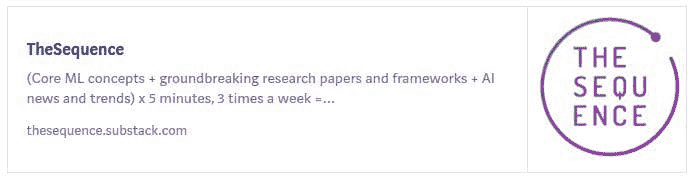
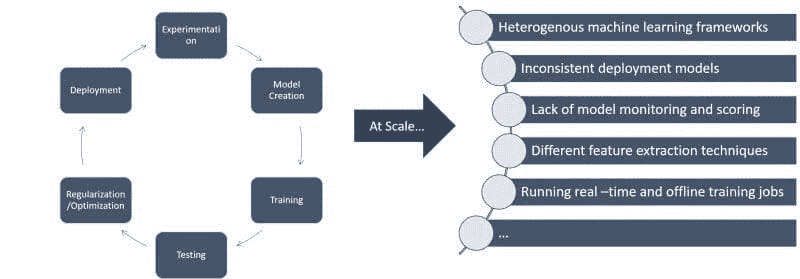
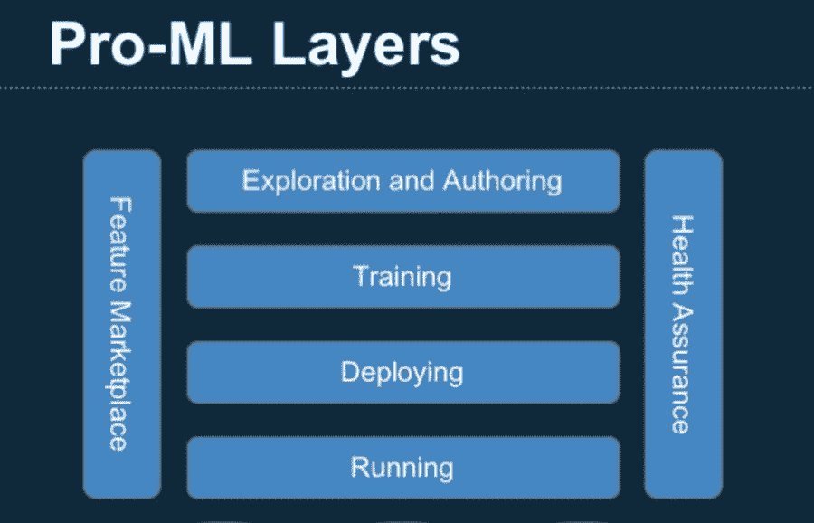

# LinkedIn 的 Pro-ML 架构总结了大规模构建机器学习的最佳实践

> 原文：[`www.kdnuggets.com/2020/09/linkedin-pro-ml-architecture-best-practices-building-machine-learning-scale.html`](https://www.kdnuggets.com/2020/09/linkedin-pro-ml-architecture-best-practices-building-machine-learning-scale.html)

评论

来源: [`solutionsreview.com/business-intelligence/machine-learning-linkedin-groups/`](https://solutionsreview.com/business-intelligence/machine-learning-linkedin-groups/)

> 我最近开始了一份专注于 AI 教育的新通讯。TheSequence 是一份不含虚假信息（即没有炒作，没有新闻等）的 AI 专注通讯，阅读时间为 5 分钟。目标是让您及时了解机器学习项目、研究论文和概念。请通过以下方式订阅试试看：

在规模化构建机器学习解决方案仍然是大多数组织的一个活跃实验领域。虽然许多公司开始了初步的机器学习试点，但很少有公司拥有强大的战略来扩展机器学习工作流程。如果考虑到目前市场上，机器学习研究和开发框架的进展速度远远快于扩展机器学习程序所需的基础设施运行时，这个问题就尤为具有挑战性。由于关于如何在规模化下构建机器学习解决方案的指导非常有限，互联网巨头如 Uber、LinkedIn、Google、Netflix 或 Microsoft 的经验就显得尤为宝贵，因为它们的可扩展性要求远远复杂于大多数公司所面临的挑战。在 LinkedIn，提供大规模机器学习解决方案的障碍变得如此关键，以至于公司决定创建一个名为 Productive Machine Learning (Pro-ML) 的独立倡议来解决这一挑战。

一个机器学习解决方案通常经历从模型训练到部署的一系列阶段。虽然在具有少量模型和小团队的机器学习解决方案中，结构化这些生命周期相对简单，但在跨越数十个数据科学团队和数千个机器学习模型时，规模化却是一场噩梦。在像 LinkedIn 这样的组织中，机器学习面临着许多著名的扩展挑战：

### 介绍 Pro-ML

LinkedIn 的 Pro-ML 倡议的目标是将机器学习工程师的工作效率提高一倍，同时提供一个开放的基础设施，以促进公司内部机器学习技术的采用。为了实现这一目标，Pro-ML 专注于提供一个强大的基础设施，能够支持机器学习解决方案生命周期中的一系列关键阶段：

+   探索与创作

+   培训

+   部署

+   运行

+   健康保障

+   特征市场

来源：[`engineering.linkedin.com/blog/2019/01/scaling-machine-learning-productivity-at-linkedin`](https://engineering.linkedin.com/blog/2019/01/scaling-machine-learning-productivity-at-linkedin)

### 探索与创作

数据探索和模型创作是机器学习解决方案生命周期中至关重要的方面。随着数据科学组织的成长，它们面临不同团队采用不同数据探索方法和依赖不同框架来创建模型的挑战。这不会成为问题，除非数据探索基础设施往往是机器学习工作流中最耗费计算资源的组件之一。

为了实现一致的数据探索和模型创作体验，Pro-ML 依赖于一个领域特定语言（DSL），该语言抽象了机器学习模型的关键表示，如输入特征、转换、算法、输出等。此外，Pro-ML 提供了 Jupyter Notebook，允许逐步探索数据、选择特征和编写 DSL。Pro-ML 团队还提供了与流行 IDE（如 IntelliJ）集成的绑定。

提供一个互操作的机制来表示机器学习模型是确保不同数据科学栈之间一致性的聪明机制。查看 Pro-ML DSL，我不禁想是否像 [开放神经网络交换格式（ONNX）](https://onnx.ai/) 这样的格式更为自然，但这种方法无论如何是有意义的。

### 特征市场

补充前一点，数据探索过程在机器学习工作流中的一个关键作用是识别目标数据集的关键特征。在像 LinkedIn 这样的组织规模下，机器学习解决方案需要处理成千上万的特征，这些特征需要被生成、发现、使用和监控。为应对这一挑战，Pro-ML 建立了一个名为 Frame 的模型特征中央目录。

Pro-ML 的 Frame 的目标是捕捉与数据集特征相关的元数据，包括在线和离线的。Frame 将数据捕捉到一个集中式数据库中，该数据库与 Pro-ML 的模型库连接。此外，Frame 提供了一个 UI，允许数据科学家根据各种方面（包括特征类型（数值型、类别型）、统计总结和当前在整体生态系统中的使用情况）搜索特征。

### 训练

在像 LinkedIn 这样的巨大组织中，机器学习训练工作流可以分为两个主要组：实时（在线）和批量（离线）。时间敏感的机器学习模型需要定期使用接近实时的数据集进行训练。其他模型则适合在较长时间周期内如每日或每周进行批量训练。

Pro-ML 提供了一个支持在线和离线模型的培训基础设施。该基础设施包括一个支持不同模型类型的培训服务，以及用于超参数调整等功能的工具。Pro-ML 的培训运行时依赖于 Hadoop 进行离线培训，同时利用如 [Azkaban](https://azkaban.github.io/) 和 [Spark](http://spark.apache.org/) 等技术来执行培训工作流。

### 模型部署

模型部署是大规模机器学习解决方案中最具挑战性的方面之一。有效的模型部署通常需要将不同的模型工件结构化和打包成可移植的格式，以便在基础设施中执行。

Pro-ML 包括一个部署服务，该服务识别机器学习模型的不同工件，如特征、库或代码依赖，并将它们存储在集中式仓库中以进行自动验证。部署服务支持诸如编排、监控和通知等功能，以确保所需的代码和数据工件正确部署并正常工作。

### 运行

模型服务和执行是机器学习工作流中的另一个挑战性方面。与传统软件应用不同，机器学习模型的性能可能需要在其生命周期内进行不同的基础设施配置，并且其性能可能会因多个因素而有显著变化。

当前版本的 Pro-ML 包括一个名为 Quasar 的模型执行引擎，该引擎负责执行之前讨论的专有 DSL 中定义的机器学习模型。Quasar 与特征市场集成，以定期评估模型的性能，并利用主流服务框架，如 [TensorFlow Serving](https://www.tensorflow.org/serving/) 或 [XGBoost](https://xgboost.readthedocs.io/en/latest/) 来启用联邦执行模型。

### 健康保障

机器学习模型的测试和监控特别困难。Pro-ML 包括一个健康保障层，可以测试和监控机器学习工作流。健康保障层定期验证部署模型的性能是否与培训期间展示的行为一致，并在检测到异常情况时，提供诊断问题源头的工具。Pro-ML 的健康保障层包括数据重播、错误诊断或模型重训等工具，有助于确保机器学习模型的正确行为。

Pro-ML 当前正在为不同的 LinkedIn 产品提供数百个机器学习模型。虽然 LinkedIn 尚未开源 Pro-ML 背后的许多组件，但这些模式和经验教训对于那些开始机器学习之旅的组织来说，代表了宝贵的资源。

[原文](https://medium.com/dataseries/linkedins-pro-ml-architecture-summarizes-best-practices-for-building-machine-learning-at-scale-77fcb6afc9ec). 经许可转载。

**相关：**

+   深度学习梦想：在单一模型中实现准确性和可解释性

+   阿根廷作家与匈牙利数学家如何教会我们机器学习的过拟合

+   神经网络能否展现想象力？DeepMind 认为它们可以

* * *

## 我们的前三大课程推荐

 1\. [Google 网络安全证书](https://www.kdnuggets.com/google-cybersecurity) - 快速进入网络安全职业生涯。

 2\. [Google 数据分析专业证书](https://www.kdnuggets.com/google-data-analytics) - 提升您的数据分析技能

 3\. [Google IT 支持专业证书](https://www.kdnuggets.com/google-itsupport) - 支持您的组织的 IT

* * *

### 更多相关内容

+   [构建 ML 的最佳 ETL 实践](https://www.kdnuggets.com/best-practices-for-building-etls-for-ml)

+   [您的文本分类任务的最佳架构：基准测试…](https://www.kdnuggets.com/2023/04/best-architecture-text-classification-task-benchmarking-options.html)

+   [KDnuggets™ 新闻 22:n07，2 月 16 日：如何学习机器…](https://www.kdnuggets.com/2022/n07.html)

+   [KDnuggets 新闻，5 月 18 日：5 个免费的机器…托管平台](https://www.kdnuggets.com/2022/n20.html)

+   [机器学习不像您的大脑 第三部分：基本架构](https://www.kdnuggets.com/2022/06/machine-learning-like-brain-part-3-fundamental-architecture.html)

+   [LinkedIn 如何利用机器学习来排名您的信息流](https://www.kdnuggets.com/2022/11/linkedin-uses-machine-learning-rank-feed.html)
