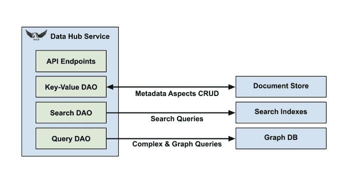
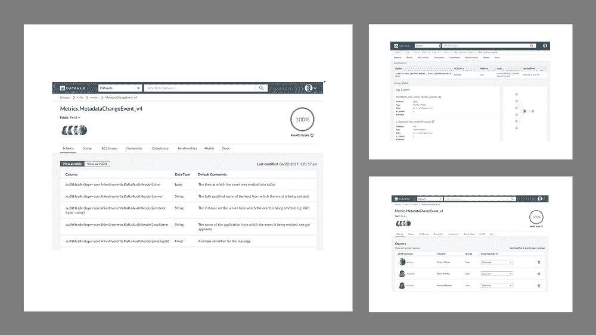
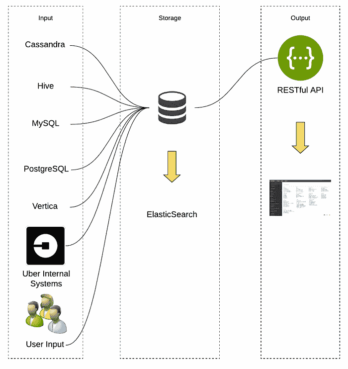
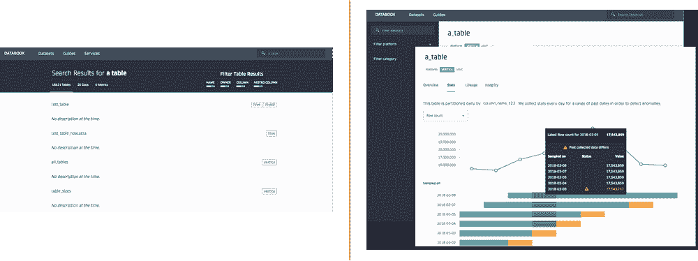
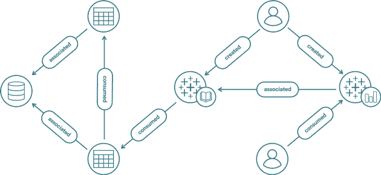
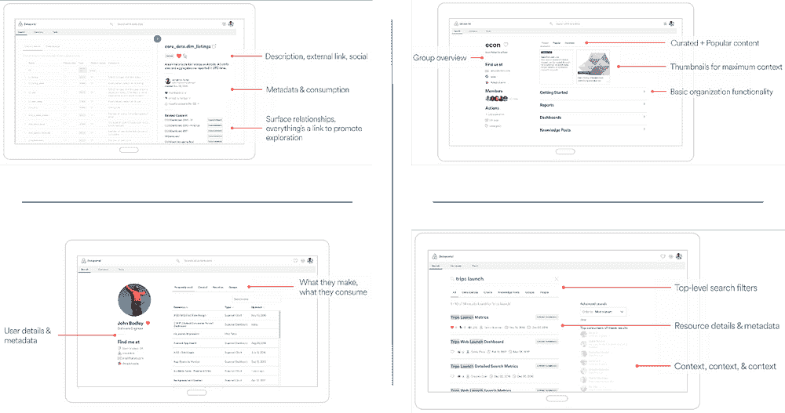
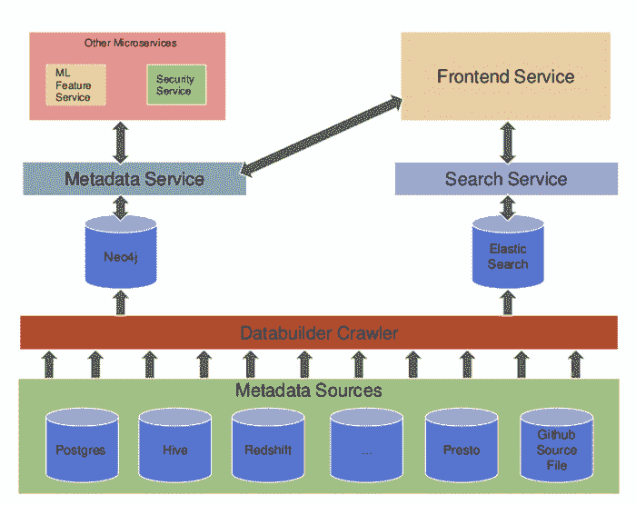
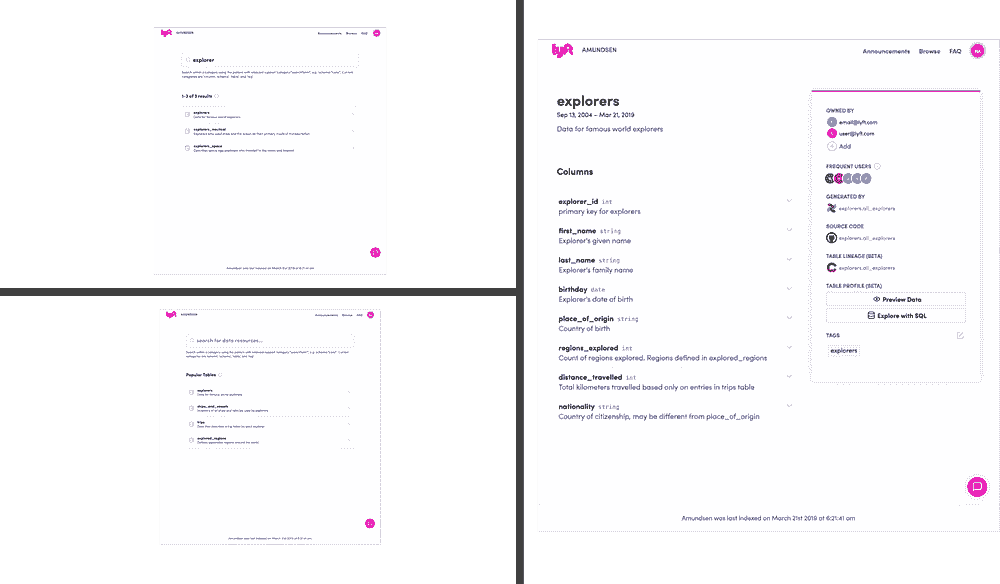
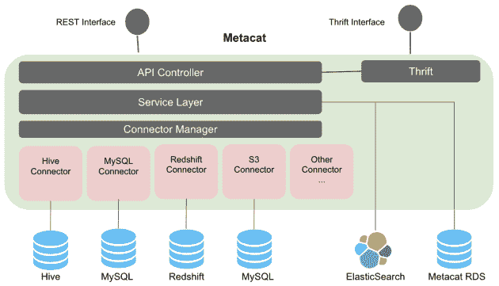

# LinkedIn、Uber、Lyft、Airbnb 和 Netflix 如何解决数据管理和发现以实现机器学习解决方案

> 原文：[`www.kdnuggets.com/2019/08/linkedin-uber-lyft-airbnb-netflix-solving-data-management-discovery-machine-learning-solutions.html`](https://www.kdnuggets.com/2019/08/linkedin-uber-lyft-airbnb-netflix-solving-data-management-discovery-machine-learning-solutions.html)

 评论

在机器学习领域，数据无疑是新的石油。管理数据集生命周期的过程是大规模机器学习解决方案中最具挑战性的部分之一。数据摄取、索引、搜索、标注和发现是维护高质量数据集所需的一些方面。这些挑战的复杂性随着目标数据集的大小和数量呈线性增加。虽然管理单一机器学习模型的训练数据集相对简单，但在数千个数据集和数百个模型之间扩展这一过程可能会变得极为困难。像 LinkedIn、Uber、Netflix、Airbnb 或 Lyft 这样的机器学习创新前沿公司，肯定体会到了这一挑战的巨大规模，并且他们已经构建了具体的解决方案来应对它。今天，我想带你了解其中的一些解决方案，希望它们能为你的机器学习之旅提供灵感。

* * *

## 我们的前三大课程推荐

 1\. [谷歌网络安全证书](https://www.kdnuggets.com/google-cybersecurity) - 快速入门网络安全职业生涯。

 2\. [谷歌数据分析专业证书](https://www.kdnuggets.com/google-data-analytics) - 提升你的数据分析能力

 3\. [谷歌 IT 支持专业证书](https://www.kdnuggets.com/google-itsupport) - 支持你所在组织的 IT

* * *

高质量的机器学习需要高质量的数据集，而这些数据集并不容易生产。随着机器学习的发展，对自动化训练和测试数据集生命周期管理工具和平台的需求变得越来越重要。有些矛盾的是，机器学习框架的发展速度比相应的数据管理工具集快了几个数量级。虽然如今我们拥有数十种高质量的开发框架，融入了深度学习学科的最新研究，但用于管理机器学习模型数据集生命周期的平台仍处于初期阶段。为了解决这个挑战，像 Uber 或 LinkedIn 这样的快速成长的科技公司被迫构建自己的内部数据生命周期管理解决方案，以支持不同组的机器学习模型。让我们来看看他们是如何做到的。

### LinkedIn 的数据中心

数据中心是 LinkedIn 数据分析堆栈中的最新补充。LinkedIn 数据中心的核心重点是自动化与数据集相关的元数据的收集、搜索和发现，以及其他实体，如机器学习模型、微服务、人员、群体等。具体来说，数据中心旨在实现四个特定目标：

1.  **建模：** 以开发者友好的方式建模所有类型的元数据和关系。

1.  **摄取：** 大规模摄取大量元数据更改，既通过 API 也通过流。

1.  **服务：** 提供收集的原始和派生元数据，以及对元数据的大规模复杂查询。

1.  **索引：** 大规模索引元数据，并在元数据更改时自动更新索引。

为了实现上述能力，数据中心使用了包括多个 LinkedIn 内部开发的框架在内的先进技术堆栈。例如，数据中心中存储的所有元数据构造都使用[Pegasus](https://linkedin.github.io/rest.li/DATA-Data-Schema-and-Templates)数据模式语言进行建模，该语言由 LinkedIn 数年前孵化。类似地，驱动数据中心的 API 基于 LinkedIn 的[Rest.li](https://engineering.linkedin.com/architecture/restli-restful-service-architecture-scale)架构，旨在提供高可扩展性的 RESTful 服务。LinkedIn 的数据存储技术，如[Expresso](https://engineering.linkedin.com/espresso/introducing-espresso-linkedins-hot-new-distributed-document-store)或[Galene](https://engineering.linkedin.com/search/did-you-mean-galene)，也被用于以支持多种用例的方式存储元数据表示，如搜索或复杂关系导航。为了抽象这些不同类型的存储，数据中心使用了一组通用的[数据访问对象（DAO）](https://en.wikipedia.org/wiki/Data_access_object)，如键值 DAO、查询 DAO 和搜索 DAO。这使得可以使用不同的基础存储技术来操作数据中心。

LinkedIn 的 Data Hub 的强大后台架构得到了一个简单用户界面的补充，后者支持元数据元素的搜索和发现。

### Uber 的 Databook

Databook 是驱动 Uber 数据科学工作流程中数据发现和生命周期管理的主要平台。Databook 平台管理并展示关于 Uber 数据集的丰富元数据，使 Uber 员工能够在 Uber 内探索、发现和有效利用数据。从概念上讲，Databook 旨在实现四个关键功能：

+   **扩展性：** 新的元数据、存储和实体易于添加。

+   **可访问性：** 服务可以以编程方式访问所有元数据。

+   **可扩展性：** 支持高吞吐量读取。

+   **能力：** 跨数据中心读取和写入。

目前的 Databook 架构可以处理来自各种数据存储系统的元数据，包括 Vertica、PostgreSQL、MySQL 等。元数据最终在基于 ElasticSearch 的存储库中进行索引，并通过由[Dropwizard](https://www.dropwizard.io/)提供支持的 RESTful API 展现，Dropwizard 是一个用于高性能 RESTful Web 服务的 Java 框架。

Databook 允许用户通过基于 React、Redux 和 D3.js 的简单 Web 界面搜索和浏览与特定资产相关的元数据。

### Airbnb 的 Dataportal

与许多其他快速增长的科技公司一样，Airbnb 也面临了为这些数据资产启用生命周期管理和发现层的挑战。Dataportal 是解决这些需求的方案。Dataportal 以连接图的形式捕获关于不同数据资产的元数据信息。图中的节点是各种资源：数据表、仪表板、报告、用户、团队、业务结果等。它们的连接反映了它们的关系：消费、生产、关联等。

Dataportal 技术栈以 Neo4J 和 ElasticSearch 作为主要的数据存储组件。平台上的 API 由[Flask 框架](http://flask.pocoo.org/)提供支持，UI 基于 React 和 Redux。

Airbnb 的 Dataportal 的终极体现是一个时尚的用户界面，使得与企业数据集相关的元数据的搜索、协作和发现变得更加便捷。

### Lyft 的 Amundsen

Amundsen 是 Lyft 的元数据摄取、搜索和发现平台。该平台以挪威探险家 [罗纳德·阿蒙森](https://en.wikipedia.org/wiki/Roald_Amundsen) 的名字命名，最初旨在提高数据分析师、数据科学家和工程师与数据交互的生产力。从架构的角度来看，Amundsen 提供了一个数据收集层，该层与一系列数据库以及用于元数据管理和搜索的微服务集成。

Amundsen 微服务抽象了平台的核心功能。当前版本的 Amundsen 包括以下微服务：

+   [amundsenfrontendlibrary](https://github.com/lyft/amundsenfrontendlibrary)：前端服务，是一个带有 React 前端的 Flask 应用程序。

+   [amundsensearchlibrary](https://github.com/lyft/amundsensearchlibrary)：搜索服务，利用 Elasticsearch 提供搜索功能，用于支持前端元数据搜索。

+   [amundsenmetadatalibrary](https://github.com/lyft/amundsenmetadatalibrary)：元数据服务，利用 Neo4j 或 Apache Atlas 作为持久层，提供各种元数据。

+   [amundsendatabuilder](https://github.com/lyft/amundsendatabuilder)：用于构建元数据图谱和搜索索引的数据摄取库。用户可以使用该库的 [python 脚本](https://github.com/lyft/amundsendatabuilder/blob/master/example/scripts/sample_data_loader.py) 或使用 [Airflow DAG](https://github.com/lyft/amundsendatabuilder/blob/master/example/dags/sample_dag.py) 来加载数据。

Amundsen 将其后台架构与简单的用户体验相结合，能够进行数据集的搜索和探索。

### Netflix Metacat

Netflix 一直积极参与大数据领域的开源技术，数据发现和管理也不例外。Metacat 是 Netflix 用于自动化元数据资产生命周期的解决方案。从功能上讲，Metacat 是一个联邦服务，提供统一的 REST/Thrift 接口来访问各种数据存储的元数据。在高级层面上，Metacat 提供以下功能：

+   数据抽象和互操作性

+   业务和用户定义的元数据存储

+   数据发现

+   数据变更审计和通知

+   Hive metastore 优化

Metacat 架构结合了一个连接层，集成了不同的数据存储，一个存储层，捕获与数据资产相关的元数据，以及一个 API 层，使得元数据元素的搜索和查询成为可能。

与该领域的其他解决方案不同，Metacat 主要关注启用元数据搜索和发现所需的后台基础设施。API 的简洁性促进了基于特定需求实施不同数据目录前端的工作。

正如你所见，元数据发现和管理是一些技术快速增长公司的一个活跃发展领域。机器学习的快速发展将继续增加数据发现和管理的相关性，我们很快会看到一些这些解决方案被纳入主流机器学习堆栈中。

[原文](https://towardsdatascience.com/how-linkedin-uber-lyft-airbnb-and-netflix-are-solving-data-management-and-discovery-for-machine-9b79ee9184bb)。经许可转载。

**相关：**

+   手动编码还是自动化数据集成——哪种方式最适合集成企业数据？

+   Andrew Ng《机器学习的渴望》中 6 个关键概念

+   统计建模与机器学习

### 更多相关主题

+   [了解如何设计、衡量和实施可信的 A/B 测试……](https://www.kdnuggets.com/2023/01/sphere-design-measure-implement-trustworthy-ab-tests-ronny-kohavi.html)

+   [5 个数据管理挑战及其解决方案](https://www.kdnuggets.com/2023/04/5-data-management-challenges-solutions.html)

+   [2024 年前 8 大云容器管理解决方案](https://www.kdnuggets.com/the-top-8-cloud-container-management-solutions-of-2024)

+   [解决 5 个复杂 SQL 问题：难题查询解析](https://www.kdnuggets.com/2022/07/5-hardest-things-sql.html)

+   [解决 MySQL 中幽灵读问题的终极指南](https://www.kdnuggets.com/2022/06/definitive-guide-solving-phantom-read-mysql.html)

+   [思维图谱：大型语言模型中精细问题解决的新范式](https://www.kdnuggets.com/graph-of-thoughts-a-new-paradigm-for-elaborate-problem-solving-in-large-language-models)
