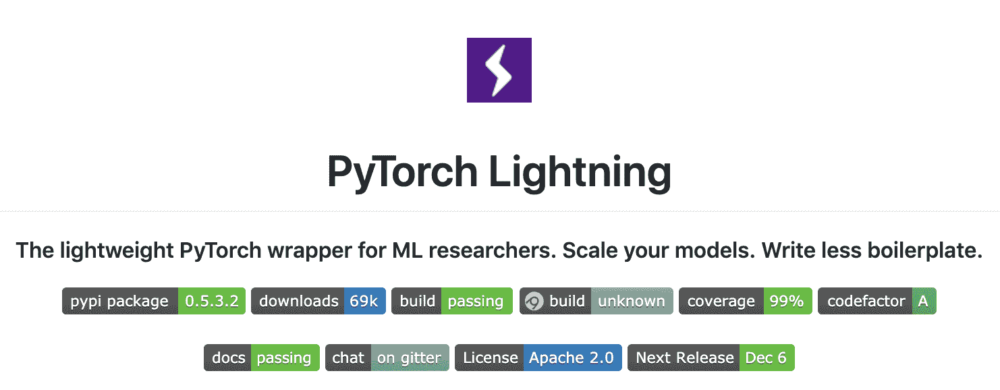

# Lit BERT：NLP 迁移学习的 3 个步骤

> 原文：[`www.kdnuggets.com/2019/11/lit-bert-nlp-transfer-learning-3-steps.html`](https://www.kdnuggets.com/2019/11/lit-bert-nlp-transfer-learning-3-steps.html)

comments

**作者：[William Falcon](https://www.linkedin.com/in/wfalcon/)，AI 研究员**

[BERT](https://arxiv.org/pdf/1810.04805.pdf)（Devlin 等，2018）也许是最流行的迁移学习 NLP 方法。由[Huggingface](https://github.com/huggingface/transformers)提供的实现提供了许多良好的功能，并通过一个美丽的 API 抽象化了细节。

[PyTorch Lightning](https://github.com/williamFalcon/pytorch-lightning)是一个轻量级框架（实际上更像是重构你的 PyTorch 代码），允许使用[PyTorch](https://pytorch.org/)的学生、研究人员和生产团队等，轻松扩展深度学习代码并确保其可重复性。它还通过训练器标志提供 42+个高级研究功能。

Lightning 不会在 PyTorch 之上添加抽象，这意味着它与其他优秀的软件包，如 Huggingface，兼容良好！在本教程中，我们将使用他们的 BERT 实现来完成 Lightning 中的微调任务。

在本教程中，我们将通过 3 个步骤进行 NLP 的迁移学习：

1.  我们将从[huggingface](https://github.com/huggingface/transformers)库中导入 BERT。

1.  我们将创建一个[LightningModule](https://pytorch-lightning.readthedocs.io/en/latest/LightningModule/RequiredTrainerInterface/)，该模块使用 BERT 提取的特征进行微调。

1.  我们将使用[Lighting Trainer](https://github.com/williamFalcon/pytorch-lightning)训练 BertMNLIFinetuner。

### 实时演示

如果你希望看到实际代码，[复制此 colab 笔记本！](https://colab.research.google.com/drive/1DovlWenVCuXZ-EZT66wc3GVHZqREyblV)

### 微调（即迁移学习）

如果你是一位研究人员试图改进[NYU GLUE](https://gluebenchmark.com/)基准，或是一位数据科学家试图理解产品评论以推荐新内容，你可能在寻找一种方法来提取文本表示，从而解决不同的任务。

对于迁移学习，通常有两个步骤。你使用数据集 X 来预训练模型。然后，你使用该预训练模型将知识应用于解决数据集 B。在这种情况下，BERT 已经在 BookCorpus 和英文维基百科上进行了预训练[[1]](https://arxiv.org/pdf/1810.04805.pdf)。*下游任务*是你关心的，即解决 GLUE 任务或分类产品评论。

预训练的好处在于我们不需要在下游任务中使用大量数据即可获得出色的结果。

### 使用 PyTorch Lightning 进行微调

一般来说，我们可以使用以下抽象方法通过 PyTorch Lightning 进行微调：

对于迁移学习，我们在 LightningModule 中定义了两个核心部分。

1.  预训练模型（即：特征提取器）

1.  微调模型。

你可以将预训练模型视为特征提取器。这可以让你以比布尔值或某些表格映射更好的方式表示对象或输入。

例如，如果你有一组文档，你可以将每个文档输入到预训练模型中，并使用输出向量将文档彼此比较。

微调模型可以任意复杂。它可以是一个深度网络，或者是一个简单的线性模型或 SVM。

### 使用 BERT 进行微调

Huggingface

在这里，我们将使用一个预训练的 BERT 对 MNLI 任务进行微调。这实际上是试图将文本分类为三种类别。以下是 LightningModule：

在这种情况下，我们使用来自 huggingface 库的预训练 BERT，并添加了我们自己的简单线性分类器，将给定的文本输入分类为三种类别之一。

然而，我们仍然需要定义计算验证准确性的验证循环

以及计算我们测试准确性的测试循环

最后，我们定义了优化器和我们将操作的数据集。这个数据集应该是你试图解决的*下游数据集*。

完整的 LightningModule 如下所示。

### 总结

在这里，我们学会了在 LightningModule 中使用 Huggingface BERT 作为特征提取器。这种方法意味着你可以利用非常强大的文本表示来完成以下任务：

1.  情感分析

1.  建议的聊天机器人回复

1.  使用 NLP 构建推荐引擎

1.  [改进 Google 搜索算法](https://www.blog.google/products/search/search-language-understanding-bert/)

1.  …

1.  为文档创建嵌入进行相似性搜索

1.  任何你能富有创意地想到的事情！

你还看到了[PyTorch Lightning](https://github.com/williamFalcon/pytorch-lightning/)与其他库，包括[Huggingface](https://github.com/huggingface/transformers)，的良好配合！

**简历：[William Falcon](https://www.linkedin.com/in/wfalcon/)** 是一位 AI 研究员、初创公司创始人、首席技术官、Google Deepmind 研究员，并且目前是 Facebook AI 的博士 AI 研究实习生。

[原文](https://towardsdatascience.com/lit-bert-nlp-transfer-learning-in-3-steps-272a866570db)。已获得许可转载。

**相关：**

+   Pytorch Lightning 与 PyTorch Ignite 与 Fast.ai

+   渴望注意的 RNNS：逐步构建 Transformer 网络

+   在 Pytorch 中训练快速神经网络的 9 个技巧

* * *

## 我们的前三个课程推荐

 1\. [谷歌网络安全证书](https://www.kdnuggets.com/google-cybersecurity) - 快速进入网络安全职业生涯。

 2\. [谷歌数据分析专业证书](https://www.kdnuggets.com/google-data-analytics) - 提升你的数据分析技能

 3\. [谷歌 IT 支持专业证书](https://www.kdnuggets.com/google-itsupport) - 支持你的组织 IT 工作

* * *

### 更多相关话题

+   [8 篇创新的 BERT 知识蒸馏论文改变了…](https://www.kdnuggets.com/2022/09/eight-innovative-bert-knowledge-distillation-papers-changed-nlp-landscape.html)

+   [用 HuggingFace 微调 BERT 以进行推文分类](https://www.kdnuggets.com/2022/01/finetuning-bert-tweets-classification-ft-hugging-face.html)

+   [使用 BERT 对长文本进行分类](https://www.kdnuggets.com/2022/02/classifying-long-text-documents-bert.html)

+   [BERT 在稀疏性下的处理速度有多快？](https://www.kdnuggets.com/2022/04/fast-bert-go-sparsity.html)

+   [比较自然语言处理技术：RNNs、Transformers、BERT](https://www.kdnuggets.com/comparing-natural-language-processing-techniques-rnns-transformers-bert)

+   [使用 BERT 的抽取式总结](https://www.kdnuggets.com/extractive-summarization-with-llm-using-bert)
