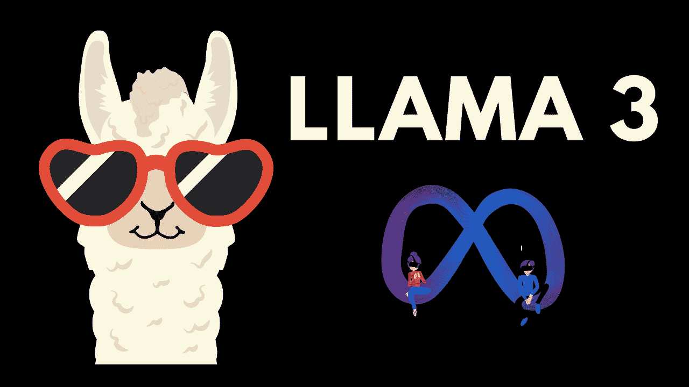
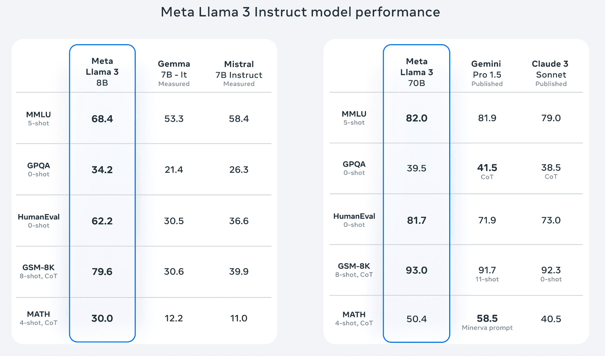
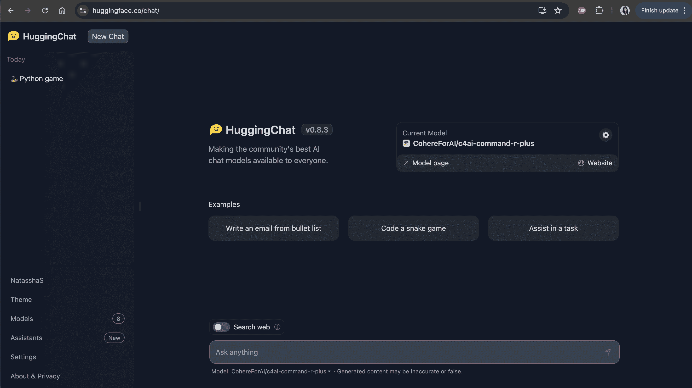
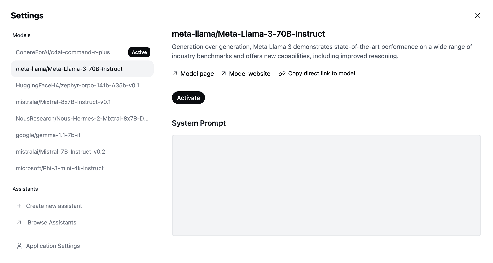
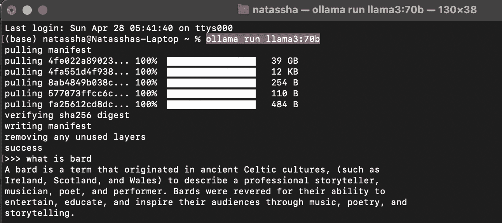

# LLaMA 3: Meta 迄今最强大的开源模型

> 原文：[`www.kdnuggets.com/llama-3-metas-most-powerful-open-source-model-yet`](https://www.kdnuggets.com/llama-3-metas-most-powerful-open-source-model-yet)

图片由作者提供

## 介绍 Llama 3

Meta 最近发布了 Llama 3，这是迄今为止最强大的“开源”AI 模型之一。

* * *

## 我们的前三大课程推荐

 1\. [谷歌网络安全证书](https://www.kdnuggets.com/google-cybersecurity) - 快速进入网络安全职业生涯。

 2\. [谷歌数据分析专业证书](https://www.kdnuggets.com/google-data-analytics) - 提升你的数据分析技能

 3\. [谷歌 IT 支持专业证书](https://www.kdnuggets.com/google-itsupport) - 支持你所在组织的 IT 工作

* * *

Llama 3 提供 2 种规格：Llama 3 8B，具有 80 亿个参数，以及 Llama 3 70 B，具有 700 亿个参数。

这些模型相对较小，仅稍大于其前身 Llama 2。 然而，Llama 3 似乎更注重质量而非规模，因为该模型在超过 15 万亿个数据标记上进行了训练。

由于训练数据量的增加和训练技术的进步，尽管 Llama 3 和 Llama 2 的规模相同，Llama 3 的表现显著优于 Llama 2。

这将使在本地计算机上运行 Llama 3 更加容易。

## Llama 3 在其他开源模型中的表现如何？

这里是一张展示 Llama 3 在各种基准测试中与其他语言模型表现对比的表格：

来源：[Meta](https://llama.meta.com/llama3/)

以下是这些基准测试的含义：

+   **MMLU（大规模多任务语言理解）**：一个基准测试，旨在理解语言模型的多任务处理能力。该模型在数学、计算机科学和法律等多个学科中的表现被评估。

+   **GPQA（研究生水平谷歌验证问答）**：评估模型回答搜索引擎难以直接解决的问题的能力。该基准测试评估 AI 是否能处理通常需要人类级别研究技能的问题。

+   **HumanEval**：评估模型通过执行编程任务来编写代码的能力。

+   **GSM-8K**：评估模型解决数学文字问题的能力。

+   **数学**：测试模型解决中学和高中数学问题的能力。

在左侧，我们看到较小模型 Llama 3 8B 与 Gemma 7B It 和 Mistral 7B Instruct 两个类似规模的开源模型的性能对比。

> Llama 3 8B 在列表上的每个基准测试中均优于同等规模的语言模型。

Llama 3 70B 已与 Gemini Pro 1.5 和 Claude 3 Sonnet 进行了基准测试。这些是谷歌和 Anthropic 发布的两个最先进的 AI 模型，并且不开放源代码。

有趣的是，[Gemini Pro 1.5](https://blog.google/technology/ai/google-gemini-next-generation-model-february-2024/) 是谷歌的旗舰模型。据说它的表现优于目前最强大的模型 Gemini Ultra。

作为列表中唯一公开可用的模型，Llama 3 70B 在 5 个性能基准测试中击败了 Gemini Pro 1.5 和 Claude 3 Sonnet 的 3 项，这一点令人印象深刻。

## 认识 MetaAI：最智能、免费可用的 AI 助手

Llama 3 也为 [Meta AI](https://ai.meta.com/meta-ai/) 提供支持，这是一个能够进行复杂推理、遵循指令和可视化想法的 AI 助手。

它具有聊天界面，允许你与 Llama 3 进行互动。你可以向它提问、进行研究，甚至让它生成图像。

与现有的 LLM 聊天机器人如 ChatGPT、Gemini 和 Claude 不同，Meta AI 完全免费使用。其最先进的模型并未隐藏在付费墙后面，使其成为现有 AI 助手的强大免费替代品。

Meta AI 已整合到 Meta 的应用套件中，如 Facebook、Instagram、WhatsApp 和 Messenger。你可以使用它在这些平台上执行高级搜索。

根据马克·扎克伯格的说法，Meta AI 现在是最智能的、免费可用的 AI 助手。

不幸的是，Meta AI 目前仅在部分国家提供，将在不久的将来向全球用户推出。

如果在你的国家尚不可用，不必担心！我将向你展示另外两种免费访问 Llama 3 的方法。

## 入门指南：如何访问 Llama 3

这里有另外两种免费访问 Llama 3 的方法：

### 使用 Hugging Face 访问 Llama 3

[Hugging Face](https://huggingface.co/) 是一个帮助开发者构建和训练机器学习模型的社区。该组织致力于使 AI 访问民主化，并允许你免费访问前沿的机器学习模型。

要在 Hugging Face 中访问 Llama 3，你首先需要通过注册创建一个 Hugging Face 帐户。

然后，导航到 [HuggingChat](https://huggingface.co/chat/)；Hugging Face 的平台使社区中的最佳 AI 模型对公众开放。

你应该会看到如下的界面：

来源：[HuggingChat](https://huggingface.co/chat/)

只需选择齿轮图标并将当前模型更改为 Meta Llama 3，如下所示：

来源：[HuggingChat](https://huggingface.co/chat/)

然后，选择“激活”，你就可以开始与模型互动！

### 使用 Ollama 访问 Llama 3

Ollama 是一个允许你在本地计算机上运行语言模型的工具。使用 Ollama，你可以轻松地与开源模型如 Llama、Mistral 和 Gemma 进行交互，只需几个步骤。

要使用 Ollama 访问 Llama 3，只需导航到 [Ollama 网站](https://ollama.com/) 并下载该工具。按照屏幕上的安装说明进行操作。

然后，导航到你的命令行界面并输入以下命令：`ollama run llama3:70b`。

模型下载应该需要几分钟时间。完成后，你可以在终端中输入你的提示，与 Llama 3 进行互动，如下图所示：

作者提供的图片

## 总结

Llama 3 是 Meta 最新公开的模型。这个 LLM 超越了 Google 和 Anthropic 发布的同类模型，目前为 Meta AI 提供支持，这是一款内置于 Meta 产品套件中的 AI 助手。

要访问 Llama 3，你可以使用 [Meta AI](https://ai.meta.com/meta-ai/) 聊天界面，通过 [HuggingChat](https://huggingface.co/chat/) 与模型互动，或使用 [Ollama](https://ollama.com/) 在本地运行。

**[Natassha Selvaraj](https://linktr.ee/natasshaselvaraj)** 是一位自学成才的数据科学家，对写作充满热情。Natassha 涉猎所有与数据科学相关的领域，是所有数据话题的真正大师。你可以通过 [LinkedIn](https://www.linkedin.com/in/natassha-selvaraj-33430717a/) 与她联系，或查看她的 [YouTube 频道](https://www.youtube.com/@natassha_ds)。

### 更多相关信息

+   [Llama, Llama, Llama：用你的内容本地 RAG 的 3 个简单步骤](https://www.kdnuggets.com/3-simple-steps-to-local-rag-with-your-content)

+   [揭示 Meta 的 Llama 2 的威力：生成 AI 的飞跃？](https://www.kdnuggets.com/2023/07/unveiling-power-metas-llama-2-leap-forward-generative-ai.html)

+   [如何找到 ML 职位：来自 Meta、Google Brain 和 SAP 工程师的建议](https://www.kdnuggets.com/2022/08/corise-land-ml-job-advice-engineers-meta-google-brain-sap.html)

+   [DINOv2：Meta AI 的自监督计算机视觉模型](https://www.kdnuggets.com/2023/05/dinov2-selfsupervised-computer-vision-models-meta-ai.html)

+   [Meta 新的数据分析师职业认证发布了！](https://www.kdnuggets.com/metas-new-data-analyst-professional-certification-has-dropped)

+   [如何构建一个模型以找到用户旅程中最具影响力的路径](https://www.kdnuggets.com/2022/09/objectiv-build-model-impactful-paths-user-journeys.html)
