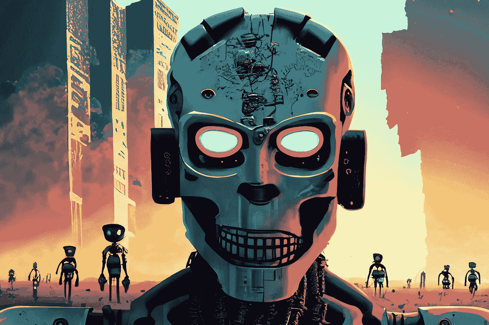
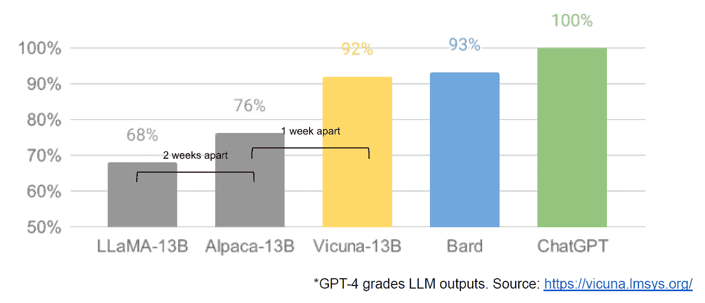

# LLM 世界末日：开源克隆的复仇

> 原文：[`www.kdnuggets.com/2023/05/llm-apocalypse-revenge-open-source-clones.html`](https://www.kdnuggets.com/2023/05/llm-apocalypse-revenge-open-source-clones.html)

图片来自 Adobe Firefly

> *“我们中的人太多了。我们拥有太多的钱、太多的设备，渐渐地，我们失去了理智。”*

* * *

## 我们的前三个课程推荐

 1\. [谷歌网络安全证书](https://www.kdnuggets.com/google-cybersecurity) - 快速进入网络安全职业。

 2\. [谷歌数据分析专业证书](https://www.kdnuggets.com/google-data-analytics) - 提升你的数据分析技能

 3\. [谷歌 IT 支持专业证书](https://www.kdnuggets.com/google-itsupport) - 支持你的组织 IT 部门

* * *

弗朗西斯·福特·科波拉并不是在为那些花费过多而迷失方向的 AI 公司做隐喻，但他本可以这样做。*现代启示录* 是一部史诗般的作品，但制作过程漫长、困难且昂贵，就像 GPT-4 一样。我建议 LLM 的发展过于依赖金钱和设备。而且一些“我们刚刚发明了通用智能”的炒作有些疯狂。但现在是开源社区发挥其最佳优势的时候了：用更少的钱和设备提供免费的竞争软件。

OpenAI 已获得超过 110 亿美元的资金，估计 GPT-3.5 每次训练的成本为 500 万到 600 万美元。我们对 GPT-4 知之甚少，因为 OpenAI 没有透露，但我认为可以安全地假设它不会比 GPT-3.5 小。目前全球范围内的 GPU 短缺——而且这次不是因为最新的加密货币。生成式 AI 初创公司在巨大的估值下获得了超过 1 亿美元的 A 轮融资，而他们并不拥有用于支持其产品的 LLM 的任何知识产权。LLM 的风潮正处于高档次，资金正源源不断地流入。

看起来一切都已定局：只有像微软/OpenAI、亚马逊和谷歌这样的财大气粗的公司才能负担得起训练百亿参数的模型。更大的模型被认为是更好的模型。GPT-3 出了问题？只要等到有一个更大的版本，一切都会好起来！希望竞争的小公司不得不筹集更多资金，否则只能在 ChatGPT 市场上建立商品集成。由于预算更加有限，学术界被排除在外。

幸运的是，一群聪明的人和开源项目将其视为挑战而非限制。斯坦福大学的研究人员发布了 Alpaca，这是一种 70 亿参数的模型，其性能接近 GPT-3.5 的 1750 亿参数模型。由于缺乏构建 OpenAI 所用训练集的资源，他们聪明地选择了使用经过训练的开源 LLM LLaMA，并对其进行了一系列 GPT-3.5 提示和输出的微调。实质上，该模型学习了 GPT-3.5 的工作方式，事实证明这是一种非常有效的复制其行为的策略。

Alpaca 仅限于在代码和数据上进行非商业使用，因为它使用了开源的非商业 LLaMA 模型，OpenAI 明确禁止使用其 API 创建竞争产品。这确实创造了一个诱人的前景，即对 Alpaca 的提示和输出进行不同开源 LLM 的微调……创造一个具有不同许可证可能性的第三个类似 GPT-3.5 的模型。

这里还有另一层讽刺，所有主要的 LLM 都是在互联网上可获得的版权文本和图像上进行训练的，而且它们没有支付一分钱给权利持有者。这些公司以“公平使用”作为美国版权法下的豁免理由，主张其使用是“变革性的”。然而，当涉及到他们用免费数据构建的模型的输出时，他们实际上不希望任何人对他们做同样的事情。我预计随着权利持有者的觉醒，这种情况将发生变化，并可能最终进入法庭。

这是一个与限制性许可证开源作者提出的观点完全不同的点，他们对于像 CoPilot 这样的代码生成 AI 产品，反对他们的代码被用于训练，理由是许可证没有得到遵守。对于个人开源作者来说，问题在于他们需要证明立场——实质性的复制——以及他们已经遭受了损害。而且，由于模型很难将输出代码与输入（作者的源代码行）关联起来，并且没有经济损失（这本应是免费的），因此更难提出案件。这不同于以盈利为目的的创作者（例如，摄影师），他们的整个商业模式是许可证/销售他们的作品，他们由像 Getty Images 这样的聚合商代表，后者可以展示实质性的复制。

关于 LLaMA 的另一个有趣之处在于它来自 Meta。它最初仅向研究人员发布，然后通过 BitTorrent 泄露给了全世界。Meta 与 OpenAI、Microsoft、Google 和 Amazon 的业务模式根本不同，它不试图向你销售云服务或软件，因此激励措施也非常不同。它过去开源了其计算设计（OpenCompute）并见证了社区的改进——它理解开源的价值。

Meta 可能会成为最重要的开源 AI 贡献者之一。它不仅拥有巨大的资源，而且如果有大量出色的生成 AI 技术出现，它也会受益：社交媒体上会有更多内容可以变现。Meta 已发布了另外三个开源 AI 模型：ImageBind（多维数据索引）、DINOv2（计算机视觉）和 Segment Anything。后者识别图像中的独特对象，并在高度宽松的 Apache 许可证下发布。

最后，我们还发现了所谓的内部谷歌文件“我们没有护城河，OpenAI 也没有”，该文件对封闭模型与社区生产的远小于或接近于封闭源模型的创新持悲观态度。我之所以说“所谓”是因为无法验证该文章的来源是否为谷歌内部。然而，它确实包含了这张引人注目的图表：

垂直轴是 GPT-4 对 LLM 输出的评分，需明确说明。

稳定扩散（Stable Diffusion），从文本合成图像，是开源生成 AI 能够比专有模型更快发展的另一个例子。该项目的最新迭代（ControlNet）已将其改进，使其超越了 Dall-E2 的能力。这是通过全球范围的大量调试实现的，导致的进展速度是任何单一机构都难以匹敌的。部分调试者发现了如何使 Stable Diffusion 在更便宜的硬件上更快地训练和运行，从而使更多人能够缩短迭代周期。

因此我们回到了起点。没有过多的资金和设备激发了整个普通人社区的巧妙创新。成为 AI 开发者的时代真是太棒了。

**[Mathew Lodge](https://www.linkedin.com/in/mathew/vvv)** 是 Diffblue 的首席执行官，该公司是一家 AI For Code 初创公司。他在 Anaconda 和 VMware 等公司拥有超过 25 年的多元化产品领导经验。Lodge 目前担任 Good Law Project 董事会成员，并是皇家摄影学会理事会副主席。

### 相关话题

+   [介绍 MPT-7B：一个新的开源 LLM](https://www.kdnuggets.com/2023/05/introducing-mpt7b-new-opensource-llm.html)

+   [Falcon LLM：开源 LLM 的新王者](https://www.kdnuggets.com/2023/06/falcon-llm-new-king-llms.html)

+   [介绍 MetaGPT 的数据解释器：基于 SOTA 开源 LLM 的…](https://www.kdnuggets.com/metagpt-data-interpreter-open-source-llm-based-data-solutions)

+   [Mistral 7B-V0.2：使用…微调 Mistral 的新开源 LLM](https://www.kdnuggets.com/mistral-7b-v02-fine-tuning-mistral-new-open-source-llm-with-hugging-face)

+   [封闭源 VS 开源图像注释](https://www.kdnuggets.com/closed-source-vs-open-source-image-annotation)

+   [Web LLM: 将 LLM 聊天机器人带到浏览器](https://www.kdnuggets.com/2023/05/webllm-bring-llm-chatbots-browser.html)
