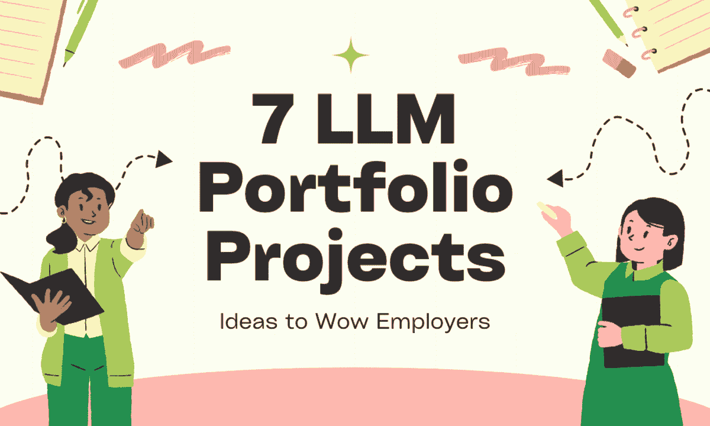
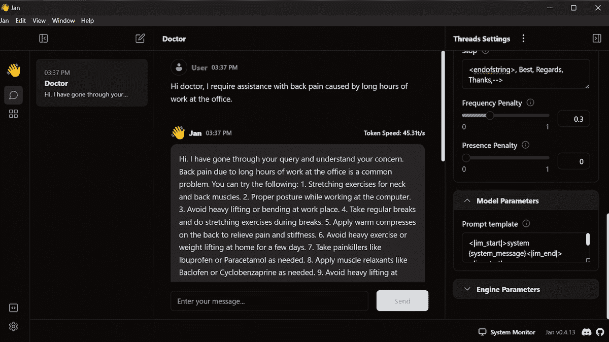
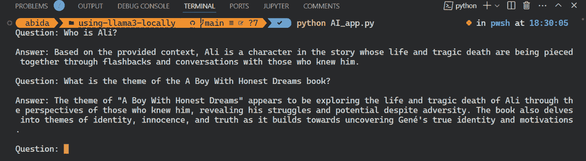
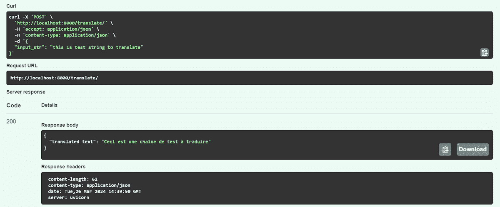
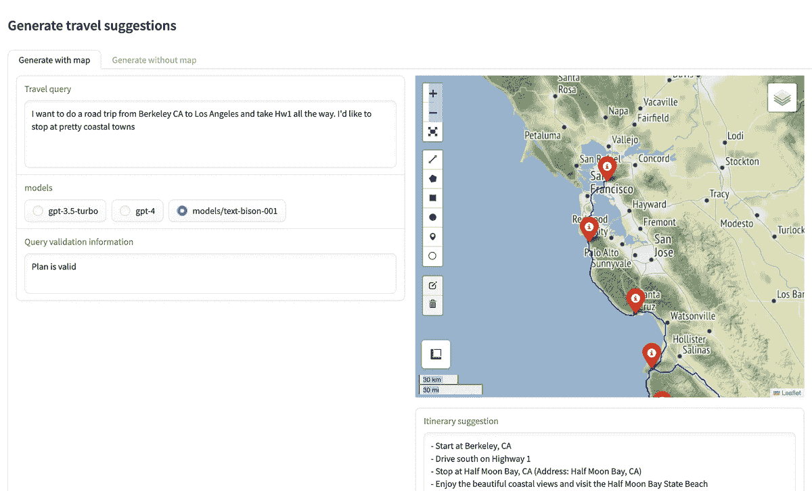
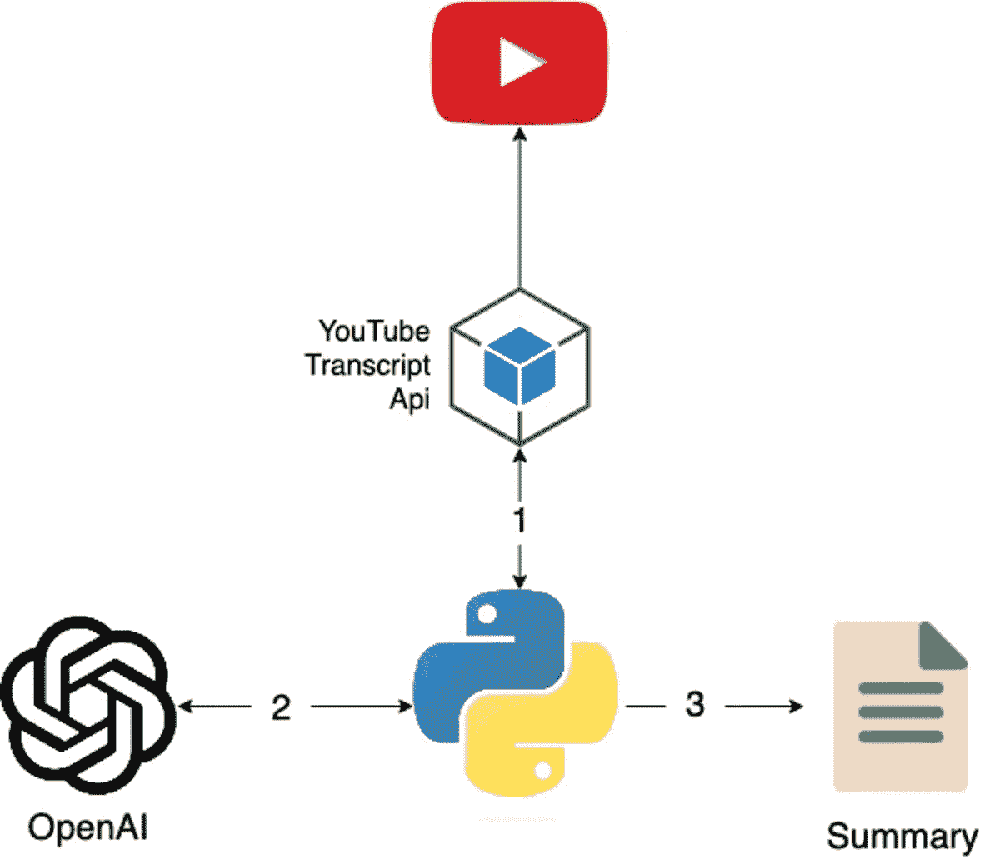
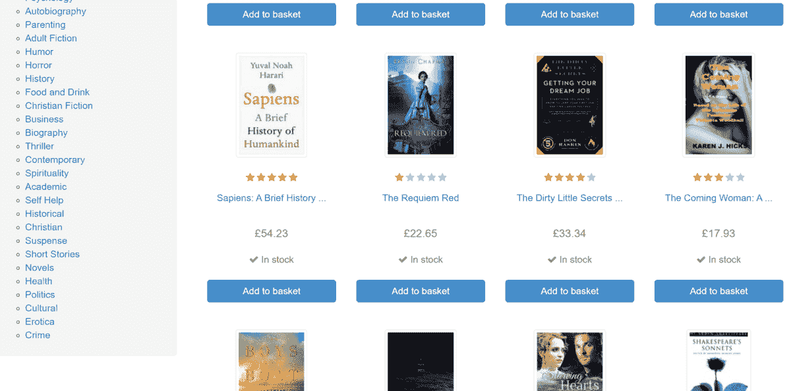
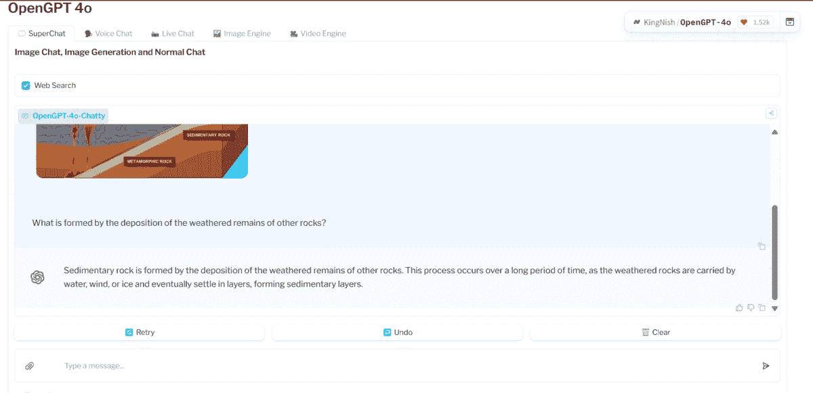

# LLM 投资组合项目创意，令雇主惊叹

> 原文：[`www.kdnuggets.com/llm-portfolio-projects-ideas-to-wow-employers`](https://www.kdnuggets.com/llm-portfolio-projects-ideas-to-wow-employers)

作者提供的图像

大多数缺乏技术知识的人可能会认为，与 AI 或 LLM（大语言模型）打交道是具有挑战性的，并且仅限于专家和工程师。然而，如果我告诉你，只需精通 Python，你就可以构建各种 LLM 项目，从问答系统到 YouTube 总结器，你会怎么看？你甚至可以使用多个开源模型和组件创建你自己的 GPT-4o 应用程序。

* * *

## 我们的前三个课程推荐

 1\. [Google 网络安全证书](https://www.kdnuggets.com/google-cybersecurity) - 快速进入网络安全职业的快车道。

 2\. [Google 数据分析专业证书](https://www.kdnuggets.com/google-data-analytics) - 提升你的数据分析技能

 3\. [Google IT 支持专业证书](https://www.kdnuggets.com/google-itsupport) - 支持你的组织 IT

* * *

在这个项目中，我们将探索有趣且容易实现的 LLM 项目创意，你可以使用免费或负担得起的资源进行构建。此外，每个项目创意都有一个示例项目链接，你可以查看以更好地理解它的工作原理。

## 1\. 微调 Llama 3 及其本地使用

[微调 Llama 3 及其本地使用](https://www.datacamp.com/tutorial/llama3-fine-tuning-locally)是一个包含多个步骤和文件的完整项目。目标是使用 Kaggle 提供的免费资源在患者-医生对话的数据集上微调模型。一旦模型成功微调，它可以以高度专业的方式回答医学相关的问题。

项目图像

为了在你的笔记本电脑上离线使用模型，你可以按照以下步骤进行：

1.  将适配层合并到基础模型中。

1.  将模型转换为 Llama.cpp 格式，这被称为 GGUF。

1.  使用量化方法减小模型的大小。

1.  最后，使用 Windows Jan 应用程序在你的笔记本电脑上使用模型。

保持医学对话在医生和患者之间的隐私非常重要，因此有必要在本地使用并确保隐私。

## 2\. 问答检索系统

如果你不想微调模型，你仍然可以使用 LangChain、Chroma DB 和 Ollama 等工具在本地创建上下文感知的 AI 应用程序。这个应用程序将利用你的数据集作为上下文，然后生成响应。

要构建 RAG（检索增强生成）应用程序，你可以按照以下步骤进行：

1.  **加载 PDF 文件：** 首先从指定文件夹中加载所有 PDF 文件。

1.  **拆分文本：** 将文本拆分成较小的块，以便高效处理。

1.  **转换为嵌入：** 将文本转换为嵌入并将其存储在向量数据库中。

1.  **构建检索链：** 使用 LangChain 构建检索链。

1.  **开发 Python 应用程序：** 创建一个合适的 Python 应用程序，以确保流畅的聊天体验。

项目图片

LangChain 通过提供高级 API 和易于使用的命令简化了这一过程。通过遵循 "[如何在本地运行 Llama 3](https://www.datacamp.com/tutorial/run-llama-3-locally)" 的教程，你可以构建一个具有上下文感知的智能 LLM 应用程序。

## 3\. 使用 FastAPI 在 Python 中将 LLM 应用程序作为 API 端点服务

在此项目中，你将使用 OpenAI API 和 FastAPI 构建一个英语到法语的翻译器 API。该项目将分为两个主要部分：了解如何使用 OpenAI API 确保生成的输出始终为法语，以及使用 FastAPI 构建一个 REST API 来接收文本并通过简单的 CURL 命令生成输出。

如果你熟悉 FastAPI，你可以在 30 分钟内构建一个更好的 LLM 应用程序，作为 API 端点服务。

项目图片

作为参考，按照指南 "[在 Python 中使用 FastAPI 将 LLM 应用程序作为 API 端点服务](https://www.datacamp.com/tutorial/serving-an-llm-application-as-an-api-endpoint-using-fastapi-in-python)"，并尝试服务你的 LLM。它也可以是你在本地运行的模型。

## 4\. 假期规划助手

没有旅行代理的假期规划可能会很困难。有很多变数，有时人们甚至不知道该怎么做。那么，为什么不创建你自己的旅行行程应用程序，让它在地图上显示你的行程并提供详细的计划和各种景点呢？

在此项目中，你将构建一个 Web 应用程序，该应用程序接受用户关于旅行计划的指示，并提供行程建议，并在地图上显示这些建议。

项目图片

该项目要求你在深入项目之前学习一些关于 Gradio、启动和 Google Maps API 的基础知识。你可以通过以下教程 "[使用 LangChain、Google Maps API 和 Gradio 构建智能旅行行程建议器（第一部分）](https://towardsdatascience.com/building-a-smart-travel-itinerary-suggester-with-langchain-google-maps-api-and-gradio-part-1-4175ff480b74)" 开始，但如果你想构建假期规划助手，可能需要向你的应用程序中添加更多组件，使其更加强大。

## 5\. YouTube 摘要器

YouTube 摘要器是一个适合初学者的项目，非常适合学生和新手学习 API 和自然语言处理。该项目涉及使用 YouTube API 从视频中提取字幕，并使用 OpenAI API 对这些字幕进行总结。鉴于一些视频可能很长，而像 ChatGPT 这样的模型的上下文窗口可能有限，该项目需要将字幕拆分成可管理的部分。每部分单独总结，然后将总结后的部分组合成整个视频的连贯摘要。

图片来自项目

你可以参考 "[仅需 3 个简单步骤创建自己的 YouTube 视频摘要应用](https://pub.towardsai.net/create-your-own-youtube-video-summarizer-app-in-just-3-easy-steps-2d404cca5077)" 教程，亲自体验其精彩之处。

**注意：** 该项目使用的是旧版 API。你可以随时查看 OpenAI API 文档以更新到新的结构。

## 6\. 使用 LLM 的网络爬虫

网络爬虫可能是一个有利可图的业务，通过运行一个简单的脚本，个人每天可以赚取高达 $200。它被认为有利可图，因为绕过某些网站结构可能会具有挑战性。在这种情况下，使用 Scrapy 和 Ollama 构建一个 LLM 驱动的网络爬虫可以帮助自动化或增强网页解析。

图片来自 books.toscrape.com

通过参考 "[使用 LLM 进行网络爬虫](https://docs.zyte.com/web-scraping/guides/llm/index.html)" 指南，你可以学习如何在每个网页上使用 LLM 提取特定属性，如产品名称和价格。LLM 消除了手动编码以提取这些属性的需求；你需要做的只是更改提示。

## 7\. 使用开源模型构建 GPT4o

构建一个全功能的 AI 应用通常需要数百万美元和多年的研究。如果我告诉你，你可以使用开源模型在一天之内免费构建自己的 GPT-4o 模型，你会怎么想？

在这个项目中，我们将创建一个全面的 Open GPT-4o 应用，它可以理解音频、图像和文本数据。它将包括一个实时语音聊天功能和视频聊天功能。此外，你还可以用它生成图像和视频。简而言之，它将是你的 AGI（人工通用智能）应用。

请注意，该项目没有指南或教程，因此你需要通过理解源代码来学习一切：[app.py · KingNish/OpenGPT-4o at main (huggingface.co)](https://huggingface.co/spaces/KingNish/OpenGPT-4o/blob/main/app.py)

图片来自 [OpenGPT 4o](https://huggingface.co/spaces/KingNish/OpenGPT-4o)

在你构建 LLM 应用程序之前，我强烈推荐你测试一下 [OpenGPT 4o](https://huggingface.co/spaces/KingNish/OpenGPT-4o)。了解它的各种功能和所使用的模型类型，了解它的高效性和速度。

## 结语

构建 LLM 作品集项目可以显著提升你的职业前景。如果你是寻求就业的学生，这 7 个项目将帮助你比其他人更快找到工作。招聘人员和人力资源经理特别欣赏那些融入最新技术（如 AI）的项目。

首先，收藏此页面并开始构建简单的项目。随着你逐步转向更复杂的项目，确保在 LinkedIn 上持续展示你的作品。这样，你很快就会引起招聘人员的注意。

****[Abid Ali Awan](https://www.polywork.com/kingabzpro)**** ([@1abidaliawan](https://www.linkedin.com/in/1abidaliawan)) 是一名认证的数据科学专业人士，热爱构建机器学习模型。目前，他专注于内容创作，并撰写有关机器学习和数据科学技术的技术博客。Abid 拥有技术管理硕士学位和电信工程学士学位。他的愿景是利用图神经网络构建一款帮助面临心理健康问题的学生的 AI 产品。

### 更多相关话题

+   [2022 年数据科学家的顶级行业和雇主](https://www.kdnuggets.com/2022/06/top-industries-employers-hiring-data-scientists-2022.html)

+   [学位还是证书？雇主更看重哪个资质？](https://www.kdnuggets.com/degree-or-certificate-which-credential-do-employers-value-more)

+   [7 个机器学习作品集项目，提升简历](https://www.kdnuggets.com/2022/09/7-machine-learning-portfolio-projects-boost-resume.html)

+   [5 个数据科学作品集的高级项目](https://www.kdnuggets.com/2023/03/5-advance-projects-data-science-portfolio.html)

+   [5 个最终年数据科学学生的作品集项目](https://www.kdnuggets.com/5-portfolio-projects-for-final-year-data-science-students)

+   [7 个 AI 作品集项目，提升简历](https://www.kdnuggets.com/7-ai-portfolio-projects-to-boost-the-resume)
