# Logistic 回归：简明技术概述

> 原文：[`www.kdnuggets.com/2018/02/logistic-regression-concise-technical-overview.html`](https://www.kdnuggets.com/2018/02/logistic-regression-concise-technical-overview.html)

 评论

### I. 介绍：

预测二项结果（y = 0 或 1）的流行统计技术是 Logistic 回归。Logistic 回归预测分类结果（二项/多项 y 值），而线性回归适用于预测连续值结果（例如体重以 kg 为单位，降雨量以 cm 为单位）。

Logistic 回归（以下简称 LogR）的预测形式为事件发生的概率，即在给定某些输入变量 x 的情况下，y=1 的概率。因此，LogR 的结果范围在 0-1 之间。

* * *

## 我们的前三大课程推荐

 1\. [谷歌网络安全证书](https://www.kdnuggets.com/google-cybersecurity) - 快速开启网络安全职业生涯。

 2\. [谷歌数据分析专业证书](https://www.kdnuggets.com/google-data-analytics) - 提升你的数据分析能力

 3\. [谷歌 IT 支持专业证书](https://www.kdnuggets.com/google-itsupport) - 支持你的组织的 IT 工作

* * *

LogR 使用标准 Logistic 函数对数据点建模，该函数是由方程给出的 S 形曲线：

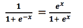

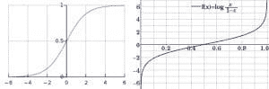

图 1：（左）：标准 Logistic 函数 [:Source |](https://en.wikipedia.org/wiki/Logistic_function) （右）：Logit 函数 [:Source](https://en.wikipedia.org/wiki/Logit)

如图 1 所示，右侧的 logit 函数（范围从- ∞到+∞）是左侧 logistic 函数（范围从 0 到 1）的逆函数。

### II. 概念：

LogR 中需要解的方程是：

其中：

+   p = 在给定输入特征 x 的情况下，y=1 的概率。

+   x1, x2, …, xk = 输入特征集合 x。

+   B0、B1、…、Bk = 通过最大似然法估计的参数值。B0、B1、…、Bk 被估计为与其相关联的输入特征单位变化的‘对数赔率’。

+   Bt = 系数向量

+   X = 输入特征向量

估计 B0、B1、…、Bk 的值涉及概率、赔率和对数赔率的概念。让我们首先注意它们的范围：

+   概率范围从 0 到 1

+   概率范围从 0 到∞

+   对数赔率范围从-∞到+∞

### 示例：

示例数据集来源于[UCLA 网站](https://stats.idre.ucla.edu/other/mult-pkg/faq/general/faq-how-do-i-interpret-odds-ratios-in-logistic-regression/)。

任务是预测 200 名学生是否获得荣誉（y=1 或 0），字段包括*female, read, write, math, hon, femalexmath*。这些字段描述了性别（*female=1*表示女性）、阅读成绩、写作成绩、数学成绩、荣誉状态（*hon=1*表示获得荣誉）以及*femalexmath*显示如果*female=1*时的数学成绩。

变量 hon 与女性的交叉表显示有 109 位男性和 91 位女性；这些 109 位女性中有 32 位获得了荣誉。

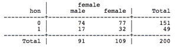

**概率：**

事件的概率是事件发生的实例数除以总实例数。

因此，女性获得荣誉的概率：

= 32/109

= 0.29

**几率：**

事件的几率是该事件发生的概率（y=1 的概率），除以它不发生的概率。

因此，女性获得荣誉的几率：

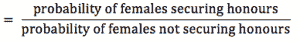

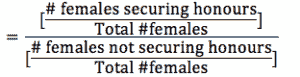

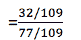

= 32/77

= 0.4155

≈ 0.42

这被解释为：

1.  32/77 => 每 32 位获得荣誉的女性，相应地有 77 位女性没有获得荣誉。

1.  32/77 => 每 109 位女性中（即 32+77）有 32 位获得荣誉。

**对数几率：**

事件的 Logit 或对数几率是几率的对数。这指的是自然对数（以‘e’为底）。因此，

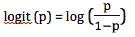

因此，女性获得荣誉的对数几率：

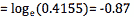

**几率比：**

这是 2 个几率的比率；这 2 个几率是在 x 的 2 个不同值下获得的，这 2 个 x 值相差 1 单位。

例如：当 x=0 和 x=1 时获得的几率（即当 x 值变化 1 单位时，其中 x=0 表示男性，x=1 表示女性）。

**问：找出女性和男性获得荣誉的几率比。**

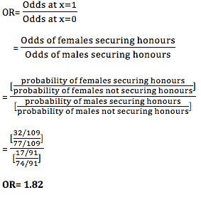

=> 由于 OR=1.82，女性获得荣誉的几率比男性获得荣誉的几率高约 82%。

### III. 概率计算：

假设我们想计算性别对获得荣誉概率的影响。

其中：

1.  B0，B1，..Bk 被估计为与输入特征相关的‘对数几率’的单位变化。

1.  由于 B0 是与任何输入特征无关的系数，B0=参考变量 x=0（即 x=男性）的对数几率。即这里，B0= log[（男性获得荣誉的几率）]

1.  由于 B1 是输入特征‘female’的系数，

    +   B1= x=女性时单位变化获得的对数几率。

    +   B1=当 x=女性和 x=男性时获得的对数几率。

    +   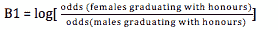

**计算：**

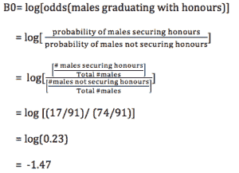

从“赔率比（OR）”部分的计算中，

B1= log (1.82)

B1= 0.593

因此，LogR 方程变为

y= -1.47 + 0.593* female

其中 female 的值分别代入 0 或 1 以表示男性和女性。

现在，让我们尝试找出当只有一个输入特征-‘女性’存在时，女性获得荣誉的概率。

在 y= -1.47 + 0.593* female 中代入 female=1

因此，y=log[odds(female)]= -1.47 + 0.593*1 = -0.877

+   因为对数赔率 = -0.877。

+   因此，赔率= e^ (Bt.X)= e^ (-0.877)= 0.416

+   而且，概率计算如下：

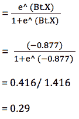

因此，当只有一个输入特征-‘女性’存在时，女性获得荣誉的概率为 0.29\。

> 因此，LogR 的方法论：
> 
> 1.  为了找到系数 B0、B1、B2、…Bk 的值，并将其代入方程： y= log(p/(1-p))= β0 + β1*x1 + … + βk*xk = Bt.X ，对于特定的 x 值。
> 1.  
> 1.  将 B0、B1、B2、..Bk 的值和 x 的值代入此方程，得到事件的对数赔率（即给定 x 的这些值时 y=1 的对数赔率）。因此，系数是在对数尺度下获得的。
> 1.  
> 1.  现在，将系数转换为赔率尺度，然后再转换为概率。使用事件的对数赔率值（Bt.X），通过 e^ (Bt.X) 得到赔率。然后，事件的概率由 {e^ (Bt.X)/[1+e^ (Bt.X)] } 推导出来。

### IV. 一个重要的问题：

**问：为什么不直接建模概率，为什么需要转换为对数赔率？**

*1) 范围受限的问题：*

+   概率的范围从 0 到 1

+   赔率的范围从 0 到 ∞

+   对数赔率的范围从 - ∞ 到 +∞

尽管概率、赔率和对数赔率都传达了事件的可能性，但由于以下原因，概率和赔率并未被使用：数据集中的输入变量可能是连续值。因此，概率和赔率不应作为输出使用，因为它们的范围有限。

因此，将赔率转换为对数赔率-以扩展输出范围。

*2) 对数赔率的简洁性：*

概率和对数赔率都传达了事件的可能性，尽管概率对外行来说稍微更易于理解。然而，通过赔率及其对数形式更好地传达了 x 的变化（保持其他变量不变）对事件可能性的影响。这是因为事件的概率随着 x 的变化而变化，但事件的对数赔率在 x 值变化时保持不变。

这类似于两个处于相同税档两端的人——他们缴纳的税额不同，但适用相同的税率。假设$40000-$80000 的税档税率为 30%——收入$40000 的人缴纳$12000 税，收入$80000 的人缴纳$24000 税，但这两个税额的税率都是固定的（30%）。x 值（自变量——收入）发生了变化，因此 y 值（因变量——缴税金额）也发生了变化。但是在考虑一个收入$75000 的人时，如果单纯从“收入”角度来看，需要提及“收入”的最大值、平均值、最小值才能正确描述$75000 的 y 值。然而，如果单纯从固定税率的角度来看，只需考虑一个数字——30%，即可准确预测他的 y 值。

因此，如果要表达变量 x 值变化对事件概率的影响，需要在 x 的最大值、平均值和最小值处陈述 3 个不同的概率值，以描绘整体情况。但对数赔率是一个能够传达整个图景的单一数字，因为它在 x 变化时保持不变。因此，为了简洁并避免受限范围的问题，使用对数赔率来建模事件的可能性；它随后使用公式（e^ (Bt.X) )/(1+e^ (Bt.X) ）转换为概率。

### V. Python 和 R 实现代码：

[此链接](https://www.st-andrews.ac.uk/media/capod/students/mathssupport/logisticknit.pdf)提供了一个很好的开始来使用 R 实现逻辑回归。

以下 Python 中的 LogR 代码适用于[Pima 印度糖尿病数据集](https://archive.ics.uci.edu/ml/datasets/pima+indians+diabetes)。它预测 Pima 印度血统患者是否会发生糖尿病。该代码灵感来自此网站。

**相关内容：**

+   机器学习算法：简明技术概述 - 第一部分

+   逻辑回归入门 - 第一部分

+   回归分析：入门

### 更多相关话题

+   [停止学习数据科学以寻找目标，并以目标…](https://www.kdnuggets.com/2021/12/stop-learning-data-science-find-purpose.html)

+   [90 亿美元的人工智能失败，详解](https://www.kdnuggets.com/2021/12/9b-ai-failure-examined.html)

+   [学习数据科学统计学的顶级资源](https://www.kdnuggets.com/2021/12/springboard-top-resources-learn-data-science-statistics.html)

+   [成功数据科学家的 5 个特征](https://www.kdnuggets.com/2021/12/5-characteristics-successful-data-scientist.html)

+   [是什么让 Python 成为初创企业理想的编程语言](https://www.kdnuggets.com/2021/12/makes-python-ideal-programming-language-startups.html)

+   [每位数据科学家都应该了解的三个 R 库（即使你使用 Python）](https://www.kdnuggets.com/2021/12/three-r-libraries-every-data-scientist-know-even-python.html)
