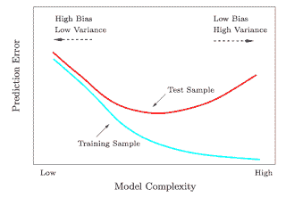
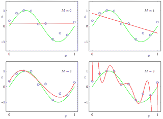
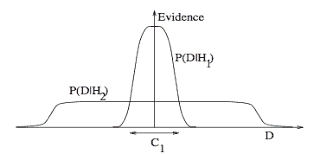
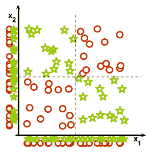
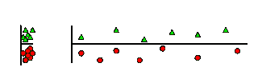
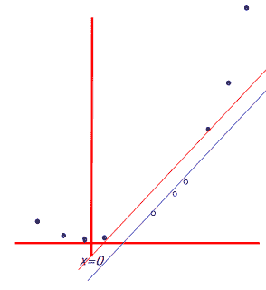
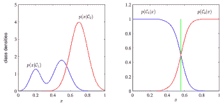

# 机器学习的 7 张图片

> 原文：[`www.kdnuggets.com/2014/03/machine-learning-7-pictures.html`](https://www.kdnuggets.com/2014/03/machine-learning-7-pictures.html)

 评论**由 Deniz Yuret, 2014 年 2 月。**

我发现自己在解释基础机器学习概念时，总是回到几个相同的图片。下面是我认为最具启发性的列表。

 1\. **偏差与方差权衡 - 测试和训练误差：** 为什么较低的训练误差并不总是好事：[ESL](http://statweb.stanford.edu/%7Etibs/ElemStatLearn/) 图 2.11。测试和训练误差作为模型复杂度的函数。

* * *

2\. **欠拟合与过拟合：** [PRML](http://research.microsoft.com/en-us/um/people/cmbishop/prml/) 图 1.4。具有不同阶数 M 的多项式图，如红色曲线，拟合到由绿色曲线生成的数据集。

* * *

3\. **奥卡姆剃刀** [ITILA](http://www.inference.phy.cam.ac.uk/itila/) 图 28.3。这个图给出了为什么复杂模型可能更不可能的基本直觉。横轴表示可能数据集 D 的空间。贝叶斯定理根据模型预测发生的数据的程度来奖励模型。这些预测通过 D 上的归一化概率分布来量化。给定模型 Hi 的数据概率 P(D | Hi)称为 Hi 的证据。简单模型 H1 仅做有限范围的预测，通过 P(D|H1)表示；而更强大的模型 H2，例如拥有比 H1 更多的自由参数，可以预测更多种类的数据集。然而，这意味着 H2 对区域 C1 中的数据集的预测不如 H1 强。如果两个模型分配了相等的先验概率，那么如果数据集落在区域 C1 中，较弱的模型 H1 将是更可能的模型。

* * *

4\. **特征组合** (1) 为什么集体相关的特征可能看起来个别无关，以及 (2) 为什么线性方法可能会失败。来自 Isabelle Guyon 的[特征提取幻灯片](http://clopinet.com/isabelle/Projects/ETH/）。

* * *

 5\. **无关特征：** 为什么无关特征会影响 kNN、聚类和其他基于相似度的方法？左侧的图显示了在纵轴上分隔良好的两个类别。右侧的图添加了一个无关的横轴，这破坏了分组，使许多点成为对立类别的最近邻。

* * *

 6\. **非线性基函数** 非线性基函数如何将一个没有线性边界的低维分类问题转化为具有线性边界的高维问题。

* * *

 7\. **判别式与生成式**

来自[支持向量机教程幻灯片](http://www.autonlab.org/tutorials/svm.html) by Andrew Moore：一个一维非线性分类问题，通过输入 x 转化为一个 2 维问题 z=(x, x²)，可以线性分隔。

* * *

查看更多机器学习图片：[`www.denizyuret.com/2014/02/machine-learning-in-5-pictures.html`](http://www.denizyuret.com/2014/02/machine-learning-in-5-pictures.html)

 [Deniz Yuret](http://www.denizyuret.com/)是土耳其伊斯坦布尔[科克大学](http://www.ku.edu.tr/)的[计算机工程](http://comp.ku.edu.tr/)副教授，在[人工智能实验室](http://ai.ku.edu.tr/)工作。他曾在 MIT AI 实验室工作，并共同创办了[Inquira](http://www.inquira.com/)。

### 更多相关主题

+   [KDnuggets 新闻，12 月 14 日：3 个免费的机器学习课程…](https://www.kdnuggets.com/2022/n48.html)

+   [每位机器学习工程师都应该掌握的 5 种机器学习技能…](https://www.kdnuggets.com/2023/03/5-machine-learning-skills-every-machine-learning-engineer-know-2023.html)

+   [学习数据科学、机器学习和深度学习的稳固计划](https://www.kdnuggets.com/2023/01/mwiti-solid-plan-learning-data-science-machine-learning-deep-learning.html)

+   [人工智能、分析、机器学习、数据科学、深度学习…](https://www.kdnuggets.com/2021/12/developments-predictions-ai-machine-learning-data-science-research.html)

+   [打破数据障碍：零-shot、单-shot 和少-shot 学习如何转变机器学习](https://www.kdnuggets.com/2023/08/breaking-data-barrier-zeroshot-oneshot-fewshot-learning-transforming-machine-learning.html)

+   [联邦学习：带教程的协作机器学习…](https://www.kdnuggets.com/2021/12/federated-learning-collaborative-machine-learning-tutorial-get-started.html)
