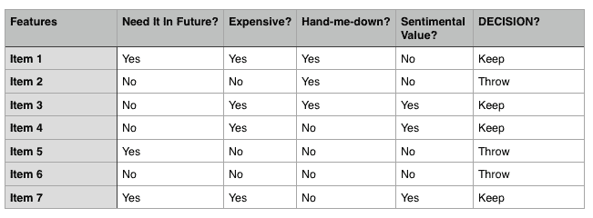
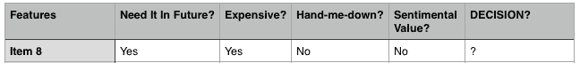

# 机器学习概述：分类

> 原文：[`www.kdnuggets.com/2017/07/machine-learning-abstracts-classification.html`](https://www.kdnuggets.com/2017/07/machine-learning-abstracts-classification.html)

**由纳伦德拉·纳思·乔希撰写，卡内基梅隆大学。**

* * *

## 我们的前三大课程推荐

 1\. [谷歌网络安全证书](https://www.kdnuggets.com/google-cybersecurity) - 快速通道进入网络安全职业。

 2\. [谷歌数据分析专业证书](https://www.kdnuggets.com/google-data-analytics) - 提升你的数据分析技能

 3\. [谷歌 IT 支持专业证书](https://www.kdnuggets.com/google-itsupport) - 支持你的组织的 IT

* * *

是否曾申请过信用卡并在几秒钟内获得批准？

是否读过关于银行欺诈检测的文章？

是否曾想过你的电子邮件如何过滤垃圾邮件？

是否曾好奇过相机是如何检测面部的？

> 一切都是分类

分类是将一些项目归类到预定义的类别或“类”中的过程。

即使机器这样做也是完全一样的。

让我们深入了解一下。

**怎么做？**

人类是如何执行分类任务的？假设你想处理掉家里的一些旧物品。你查看每个物品并决定是否要丢弃它。

你正在将每个项目“分类”到两个“类别”中：**“丢弃”**和**“保留”**。

让我们尝试理解一下你会考虑哪些因素来决定是否丢弃某个项目。可能的例子有：

+   你将来是否需要它？

+   它是否很贵？

+   是否可以作为二手物品转送给别人？

+   它是否具有 sentimental value？

你考虑的这些东西就是**“特征”**。

**计算机怎么样？**

计算机也以相同的方式运作。一个典型的分类算法会使用这些特征来确定如何对特定项目进行分类。

正式定义中，每个项目被称为**“输入向量”**。决定保留或丢弃每个项目的过程被称为该项目的**“标签”**。你需要提供一些示例给分类算法，让它**“学习”**哪些项目应该丢弃，哪些项目应该保留。这种学习方式称为**“监督学习”**，因为我们通过提供标签来*监督*算法的学习。在未来的文章中，我将详细讲解各种机器学习算法（监督学习、无监督学习、半监督学习和强化学习）。

**给我一个例子，怎么样！**

让我们考虑这个春季清理的例子。假设你有 10 个项目需要决定是保留还是丢弃。

你使用 7 项物品来**“训练”**你的分类算法。训练是使算法**“学习”**的过程。

我的**“训练集”**

**经过仔细检查，我们可以推断并确认，我们*保留*物品只有在其具有 sentimental value 或者既在未来需要又昂贵时。**

> 保留 = SENTIMENTAL_VALUE | (NEED_FUTURE & EXPENSIVE)

训练后，分类算法将学习到相同的内容，并尝试将其学到的应用于尚未见过的下一个物品，例如，物品 8。

物品 8

根据算法的学习，它将把物品 8 分类为**保留**。

我希望这能给你一个关于分类背后直觉的大致了解。在下一篇文章中，我将讨论不同类型的分类算法。

**剧透提醒：**

+   决策树

+   神经网络

+   支持向量机

**简介：[纳伦德拉·纳斯·乔希](http://nnjoshi.co/)** 是卡内基梅隆大学人工智能和机器学习的研究生，目前在迪士尼匹兹堡研究所进行研究实习。对自然语言、计算机视觉和深度学习有浓厚兴趣。

[原文](https://medium.com/the-science-of-data/the-machine-learning-abstracts-part-1-classification-63c620bd3707)。经许可转载。

**相关内容：**

+   我应该使用哪种机器学习算法？

+   为什么选择人工智能和机器学习？

+   机器学习速成课程：第一部分

### 更多相关话题

+   [分类的机器学习算法](https://www.kdnuggets.com/2022/03/machine-learning-algorithms-classification.html)

+   [使用 Scikit-learn 开始进行机器学习分类](https://www.kdnuggets.com/getting-started-with-scikit-learn-for-classification-in-machine-learning)

+   [更多分类问题的性能评估指标……](https://www.kdnuggets.com/2020/04/performance-evaluation-metrics-classification.html)

+   [使用 PyCaret 介绍二元分类](https://www.kdnuggets.com/2021/12/introduction-binary-classification-pycaret.html)

+   [使用 HuggingFace 对 BERT 进行微调以进行推文分类](https://www.kdnuggets.com/2022/01/finetuning-bert-tweets-classification-ft-hugging-face.html)

+   [用于分类的逻辑回归](https://www.kdnuggets.com/2022/04/logistic-regression-classification.html)
