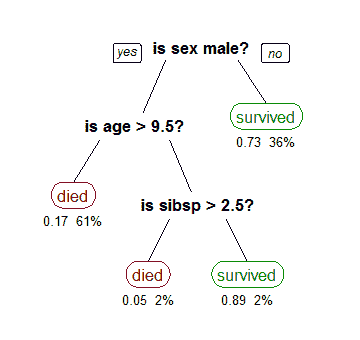
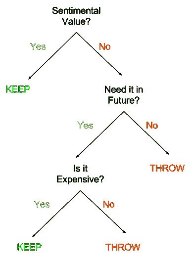

# 机器学习摘要：决策树

> 原文：[`www.kdnuggets.com/2017/08/machine-learning-abstracts-decision-trees.html`](https://www.kdnuggets.com/2017/08/machine-learning-abstracts-decision-trees.html)

**由纳伦德拉·纳斯·乔希，卡内基梅隆大学。**

是存在还是不存在，这是个问题？但真的是吗？或者真的不是吗？天啊，这真是令人上瘾，不是吗？但再说一次，是吗？

*决策树学习*是用于分类和回归目的的经典机器学习算法。

> 回归是预测连续值的过程，与分类中预测离散类标签相对。

决策树的基本直觉是将所有可能的决策路径映射成一棵树。

一棵显示乘客在[Titanic](https://en.wikipedia.org/wiki/Titanic)上生存情况的树（“sibsp”是船上配偶或兄弟姐妹的数量）。树叶下的数字显示了结果的概率和叶子中的观察百分比。**来源：维基百科**

从根到树叶的每条路径表示一个决策过程。让我们尝试使用我们在[前一部分分类](https://medium.com/the-science-of-data/the-machine-learning-abstracts-part-1-classification-63c620bd3707)中讨论的春季清理示例来深入分析和理解决策树。

我们的训练数据。

我们推测分类算法学习到的规则是

> *KEEP = SENTIMENTAL_VALUE | (NEED_FUTURE & EXPENSIVE)*

因此，当前问题的决策树可能是这样的：

我们春季清理问题的决策树

### 解释一下，没人有时间去做这个吧？

让我们看看我们是如何进行决策树构建的过程。

决策树的构建涉及分裂。在我们的例子中，每个特征只有两个可能的值（**“yes”**和**“no”**）。因此，每个特征可以有两种分裂方式。

我们可以尝试将每个特征分割成两个，但那样会得到一个非常大且效率极低的树。

**我们如何确保有一棵合理且好的树？**

在每个层次分裂之前，我们会根据特征的分布评估所有特征，并决定哪个特征最适合分裂。更正式地说，哪个特征在分裂时提供了最高的***信息增益***。

信息增益定义为确定新输入实例是否应该被分类为**“yes”**或**“no”**所需的信息量，前提是该示例从根节点到达该节点。

**你所说的“*到达那个节点*”是什么意思？**

并非所有训练示例都到达树的所有部分。例如，考虑我们春季清理示例中的第 3 项。

它在我们的决策树根部被排除并分类为**“KEEP”**，并没有到达树的下层。

构建决策树有许多算法。我刚才提到的是 [ID3 算法](https://en.wikipedia.org/wiki/ID3_algorithm)，这是一个基础算法。

还有一些高级算法，如 [C4.5 算法](https://en.wikipedia.org/wiki/C4.5_algorithm)、[CART](https://en.wikipedia.org/wiki/Predictive_analytics#Classification_and_regression_trees_.28CART.29)（分类与回归树）和 [CHAID](https://en.wikipedia.org/wiki/CHAID)（卡方自动交互检测器）

谢谢大家，下次我将稍微讲讲无监督学习等相关内容。

**个人简介： [Narendra Nath Joshi](http://nnjoshi.co/)** 是卡内基梅隆大学人工智能和机器学习的研究生，目前在迪士尼研究匹兹堡实习。对自然语言、计算机视觉和深度学习有浓厚兴趣。

[原文](https://medium.com/the-science-of-data/the-machine-learning-abstracts-part-2-decision-trees-58c87c40a22b)。转载已获许可。

**相关：**

+   机器学习摘要：分类

+   我应该使用哪种机器学习算法？

+   为什么选择人工智能和机器学习？

* * *

## 我们的三大课程推荐

 1\. [谷歌网络安全证书](https://www.kdnuggets.com/google-cybersecurity) - 快速进入网络安全职业生涯。

 2\. [谷歌数据分析专业证书](https://www.kdnuggets.com/google-data-analytics) - 提升你的数据分析技能

 3\. [谷歌 IT 支持专业证书](https://www.kdnuggets.com/google-itsupport) - 支持你的组织的 IT 需求

* * *

### 更多相关话题

+   [从零开始的机器学习：决策树](https://www.kdnuggets.com/2022/11/machine-learning-scratch-decision-trees.html)

+   [决策树与随机森林解释](https://www.kdnuggets.com/2022/08/decision-trees-random-forests-explained.html)

+   [广义和可扩展的最优稀疏决策树(GOSDT)](https://www.kdnuggets.com/2023/02/generalized-scalable-optimal-sparse-decision-treesgosdt.html)

+   [解密现实世界中的决策树](https://www.kdnuggets.com/demystifying-decision-trees-for-the-real-world)

+   [讲述一个精彩的数据故事：可视化决策树](https://www.kdnuggets.com/2021/02/telling-great-data-story-visualization-decision-tree.html)

+   [随机森林与决策树：关键差异](https://www.kdnuggets.com/2022/02/random-forest-decision-tree-key-differences.html)
