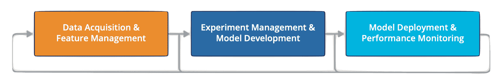
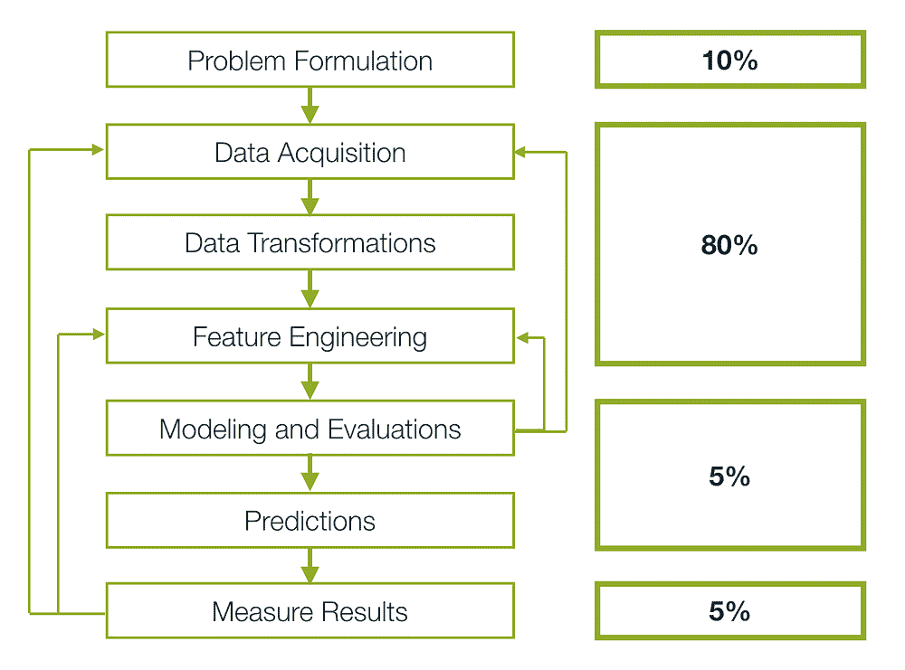
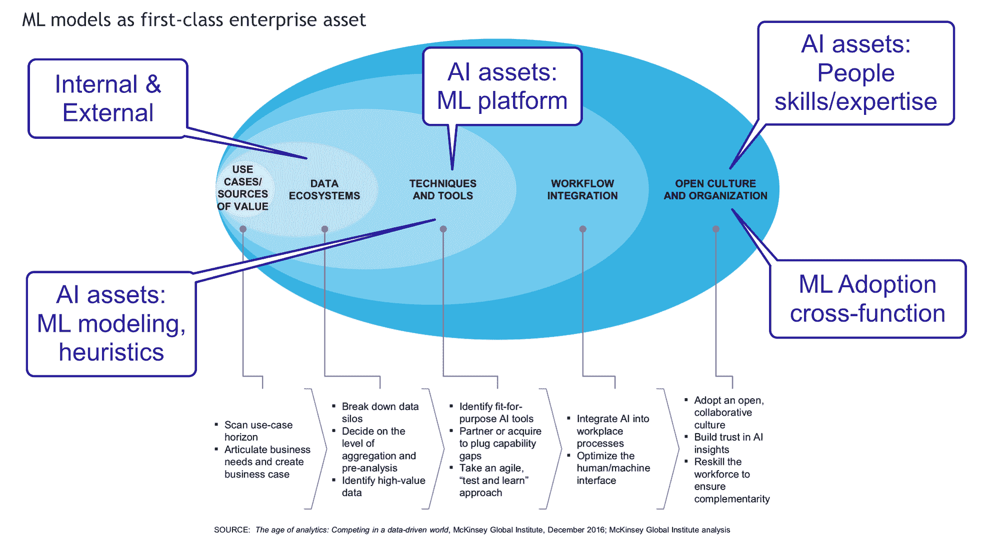
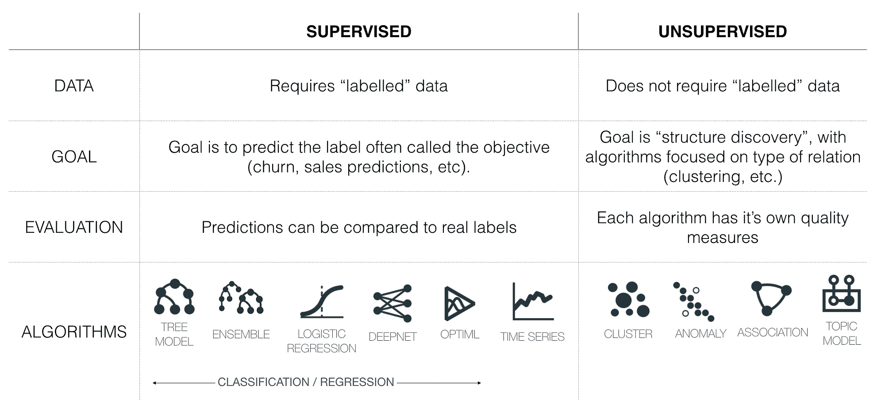
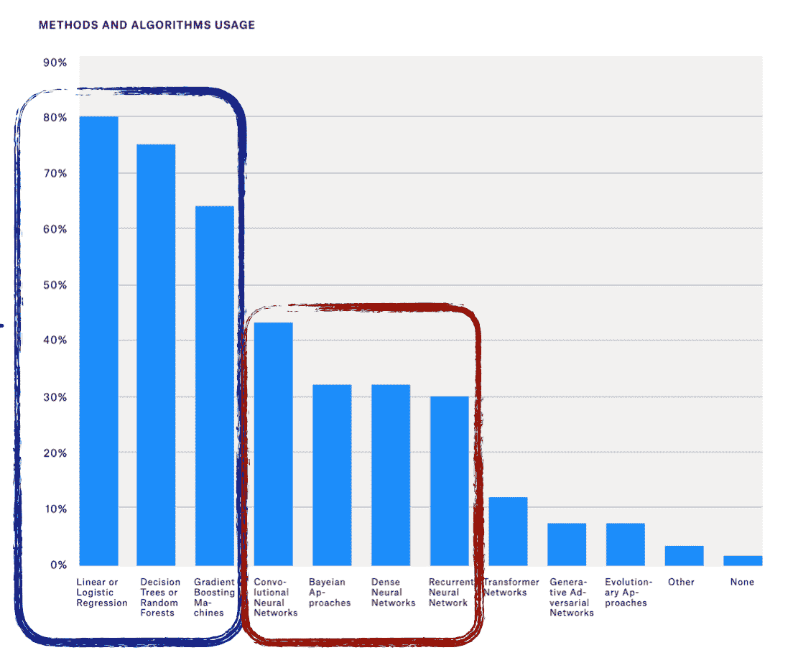
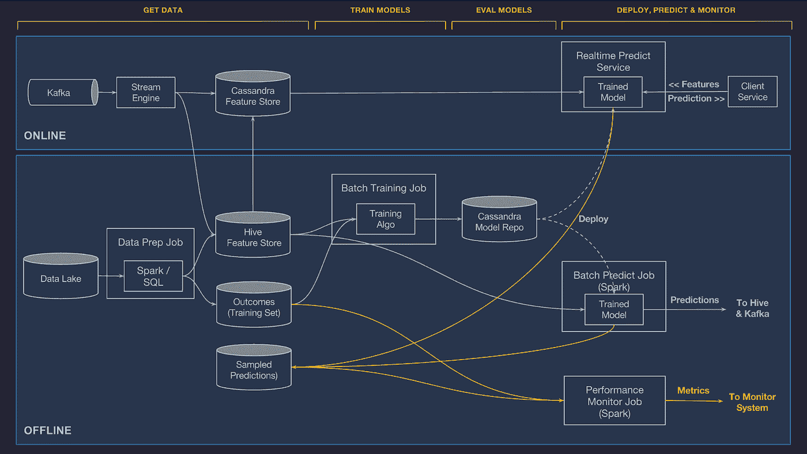
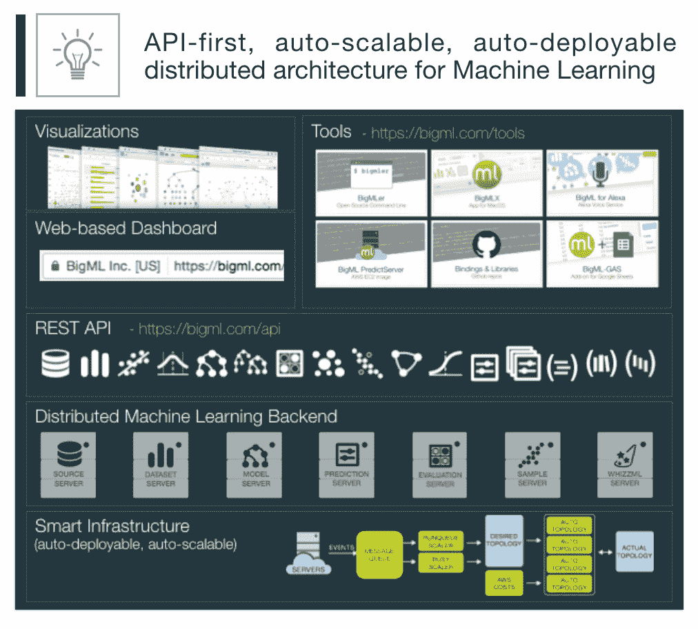
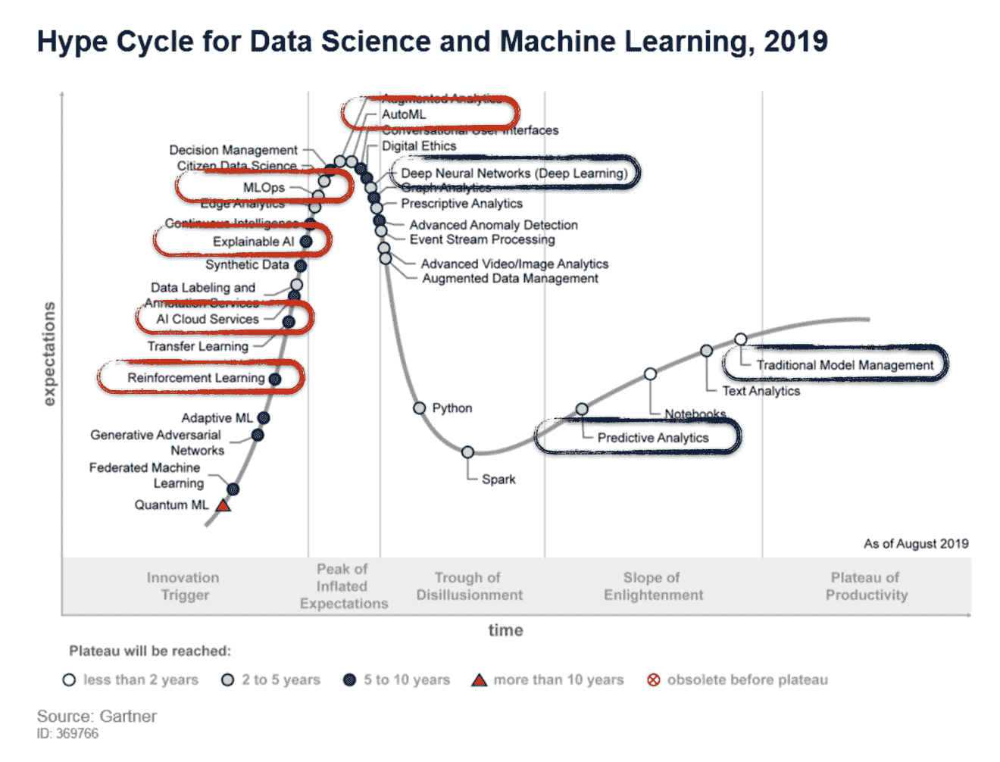
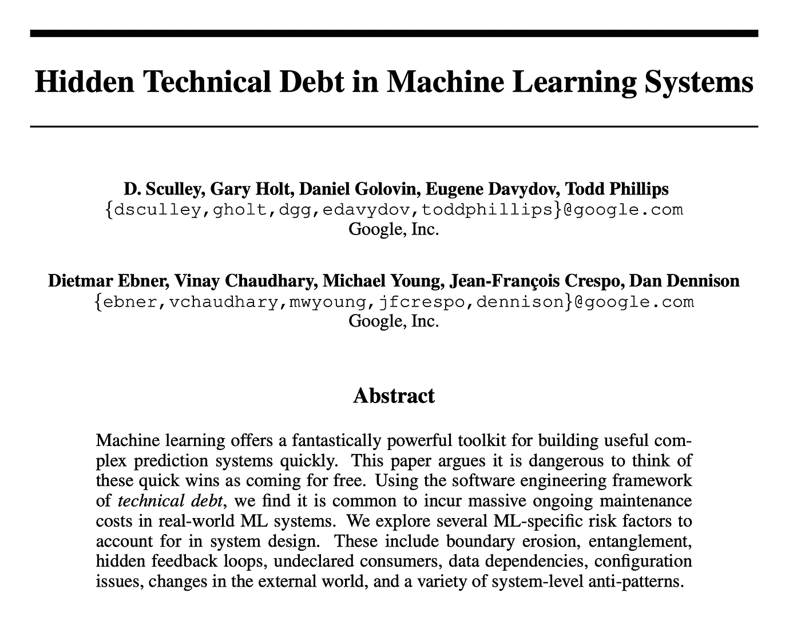
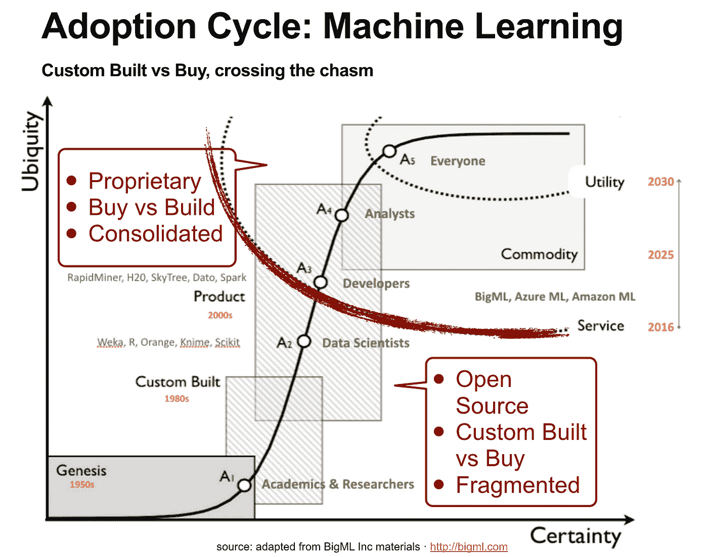

# 机器学习和人工智能行业现状

> 原文：[`www.kdnuggets.com/2020/04/machine-learning-ai-industry.html`](https://www.kdnuggets.com/2020/04/machine-learning-ai-industry.html)

评论

**由[Ed Fernandez](https://cps.northeastern.edu/faculty/eduardo-fernandez-rojo)，董事会成员、顾问、早期阶段及初创公司风险投资**。

从 2012 年到 2018 年，蓝筹技术公司为内部使用实施了定制构建的机器学习平台（即 Facebook 的 FBLearning、Uber 的 Michelangelo、Twitter 的 Cortex、AirBnB 的 BigHead），这些平台大多基于开源包，并且针对各自公司的特定用例进行了深度定制。

自那时以来，行业已经看到企业级机器学习平台解决方案的强劲演变，包括来自现有供应商（如 Amazon Sagemaker、Microsoft Azure ML、Google Cloud ML 等）和领域挑战者（如 DataRobot、H2O、BigML、Dataiku）的解决方案。现有供应商采用增量策略，其机器学习服务建立在现有云服务之上，作为另一应用层，而挑战者则采取了机器学习的*本土*方法。

随着机器学习的普及，许多企业正迅速转向*现成*的数据科学和机器学习平台，以加速上市时间、降低运营成本，并提高成功率（*部署和运营的机器学习模型数量*）。

鉴于当前只有一小部分机器学习项目、概念验证（PoC）和模型能够投入生产并实现有意义的投资回报率（ROI），机器学习平台和自动机器学习（*Automated Machine Learning*）正作为首选工具出现，以加快机器学习模型的快速原型制作和用例验证（*ROI 验证*）。

**结论：**

1.  尽管过去几年包括公司对机器学习项目和倡议的显著和不断增长的投入，**只有一小部分机器学习模型达到了生产阶段**并且产生了实际成果。那些成功的模型在很多情况下已经证明是有利可图的。在大规模应用中，[帕累托原则](https://en.wikipedia.org/wiki/Pareto_principle)适用，**20%的机器学习项目带来了 80%的收益**，而许多概念验证（PoC）项目则被弃置或冻结以便后续改进。

1.  证据表明，市场正接近一个转折点，越来越多的公司倾向于**购买（而非自建）**与机器学习平台和工具相关的解决方案，考虑**现成供应商解决方案或混合方法与开源方案**。

1.  **自动机器学习（AutoML）以及 API**是机器学习平台的重要组成部分，用于提高模型快速原型制作、机器学习用例验证和部署能力。其基本原理是通过增加机器学习候选用例的数量和成功率（生产中的机器学习模型）来实现更好的投资回报率（ROI）。

1.  **数据（数量和质量 — 机器学习准备就绪）、机器学习技术债务、MLOps 与 DevOps 以及企业机器学习流程和技能仍然是采纳的主要障碍**。尽管如此，传统的机器学习很快就会超越炒作周期的顶峰，预计在企业中的主流采用只有 2-3 年的时间。

1.  **未来演变**：在未来十年，除了深度学习，预计机器学习平台将逐步融入**知识表示、推理、规划和优化**功能，为强大的人工智能铺平道路。

> ****免责声明****：在本帖的背景下，**人工智能**（Artificial Intelligence）一词特指**构建机器学习驱动应用的能力**，这最终**自动化和/或优化业务流程**，**不应与正式意义上的强大人工智能混淆**，（作者强调，‘这至少在本十年和/或下一个十年内不太可能发生’）。

### 总结

[幻灯片请见这里](https://www.slideshare.net/edslide/machine-learning-platformization-automl-adopting-ml-at-scale-in-the-enterprise) — [视频 45 分钟请见这里](https://youtu.be/SZWWbi_hq24)

**[1] 定义与背景（本帖）**

机器学习平台定义 • 企业中的机器学习模型与应用作为一级资产 • 机器学习应用的工作流 • 机器学习算法概述 • 机器学习平台的架构 • 机器学习炒作周期更新

**[2] 大规模采用机器学习**

机器学习的问题 • 机器学习系统中的技术债务 • 多少模型算是太多模型 • 对机器学习平台的需求

**[3] 机器学习平台市场**

机器学习平台市场参考 • 早期采用者 • 自定义构建与购买：ROI 与技术债务 • 机器学习平台 • 供应商格局

**[4] 自定义构建的机器学习平台**

机器学习平台市场参考 — 更深入的了解 • Facebook — FBlearner • Uber — Michelangelo • AirBnB — BigHead • 机器学习平台化进入主流

**[5] 从 DevOps 到 MLOps**

DevOps **<>** ModelOps • 机器学习平台驱动的组织 • 领导力与问责制

**[6] 自动化机器学习 — AutoML**

扩展机器学习 — 快速原型与 AutoML • 供应商比较 • AutoML：OptiML

**[7] 机器学习平台的未来演变**

超越深度学习：知识表示、推理、规划与优化

### 1\. 定义与背景

[不存在单一的机器学习平台](https://www.forbes.com/sites/cognitiveworld/2019/12/12/theres-no-such-thing-as-the-machine-learning-platform/#4a9b5eda8dde)、产品或服务。该行业仍然非常分散，“机器学习平台”、“数据科学平台”或“人工智能平台”等术语经常被互换使用。

然而，从市场上不同的产品和服务中，确实出现了共同点，总结如下：

*机器学习平台提供了构建机器学习解决方案（主要是预测和处方模型）所需的高级功能。*

*机器学习平台支持将这些解决方案融入到业务流程、周边基础设施、产品和应用程序中。*

*它支持多技能的数据科学家（以及其他相关人员，如机器学习工程师、数据分析师和业务分析师/专家）在数据和分析管道中的多个任务，包括以下所有领域：*

机器学习工作流 — 资源分配百分比

+   *数据摄取 • 数据准备与转换 • 数据探索与可视化*

+   *特征工程*

+   *模型选择、评估与测试（及 AutoML）*

+   *部署*

+   *监控与解释性*

+   *维护与 • 协作*

机器学习平台作为工具、系统和服务的组合，能够进行实验和快速原型开发，但它们的投资回报率在企业运营和业务流程中体现，远超实验阶段。

> *参考资料：*
> 
> *Poul Petersen，端到端机器学习应用的解剖 [`www.slideshare.net/bigml/mlsev-anatomy-of-an-ml-application`](https://www.slideshare.net/bigml/mlsev-anatomy-of-an-ml-application)*
> 
> *[机器学习平台研究报告](https://assets.ctfassets.net/nubxhjiwc091/48kgJWJ6s6p7QZWKOsKWhH/c92e2a2a1e85f6ef44d1bd19d012bf8e/Machine_Learnings_Platform_Digital_Catapult_paper.pdf) Papis.io*

### 企业机器学习与人工智能采纳框架*

机器学习平台及工具，以及它们的产品、机器学习模型和数据驱动应用程序，可以被视为一流的企业资产，鉴于它们在企业中的影响力和投资回报率。

[麦肯锡全球人工智能调查](https://www.mckinsey.com/featured-insights/artificial-intelligence/global-ai-survey-ai-proves-its-worth-but-few-scale-impact) 提供了关于企业自我报告的人工智能影响及其好处的最新概述。

然而，这不仅仅是技术问题。流程、优先级和人员（领导力与问责）在引入和成功部署机器学习驱动的应用程序和服务中也发挥着重要作用。

机器学习应用程序不仅在软件开发上有所不同，部署和集成它们与现有系统也证明是一个主要挑战。考虑到机器学习软件开发的众多差异，DevOps 无法充分处理 MLOps（机器学习操作）（更多细节见第五部分）。

### 机器学习算法

管理机器学习算法以及支持它们的计算和数据转换需求可以说是机器学习平台为数据科学家和领域专家解决的关键任务。能够快速实验和将不同算法应用于给定数据集对于验证任何用例（假设验证）至关重要。

精确地说，AutoML（自动化机器学习）为这一过程提供了进一步的自动化，创建许多具有不同算法的模型候选者，并评估其性能以建议给定预测目标的最佳模型选项。

*机器学习算法 — 监督学习与非监督学习 (#MLSEV 感谢 BigML Inc)。*

实际上，大多数企业中的机器学习用例（如营销、金融、人力资源、制造业等）不需要深度学习或神经网络算法，除非有特别的性能需求，或者在需要处理非结构化数据（如视频、图像或声音）的特定用例中。

几乎 80-90% 的用例利用了传统的机器学习算法，如线性回归、逻辑回归、随机森林或集成方法，这些方法提供了可靠的结果并进一步解释了相对于更不透明的神经网络方法的可解释性。

[Kaggle 的调查](https://www.kaggle.com/kaggle-survey-2019)涵盖了近 20K 名受访者（数据科学家占据了重要部分），是监控算法使用情况的良好代理：

*蓝色框：传统机器学习算法 — 红色框：CNN、RNN、DNN 和贝叶斯 — 来源：Kaggle · 数据科学与机器学习现状 2019。*

> *参考资料：*
> 
> *Kaggle 的数据科学与机器学习现状调查 [`www.kaggle.com/kaggle-survey-2019`](https://www.kaggle.com/kaggle-survey-2019)*
> 
> *麦肯锡 — [分析时代](https://www.mckinsey.com/~/media/McKinsey/Business%20Functions/McKinsey%20Analytics/Our%20Insights/The%20age%20of%20analytics%20Competing%20in%20a%20data%20driven%20world/MGI-The-Age-of-Analytics-Full-report.ashx)*

### 机器学习平台架构

对于定制构建的机器学习平台，开源软件包和技术一直是首选（例如，Uber 的案例：[HDFS](http://hadoop.apache.org/)、[Spark](https://spark.apache.org/)、[Samza](http://samza.apache.org/)、[Cassandra](http://cassandra.apache.org/)、[MLLib](https://spark.apache.org/mllib/)、[XGBoost](https://github.com/dmlc/xgboost) 和 [TensorFlow](https://www.tensorflow.org/)），决定了大部分底层架构。

需要解决的用例和实时与静态数据建模的需求是影响平台架构的其他因素。Uber 服务的实时需求（例如，预测乘车时间）与 AirBnB（例如，推荐系统）和 FICO（例如，信用评分）在访问、处理数据需求和预测时间上有很大不同，因此具有非常独特的架构需求。

*Uber 的机器学习平台 — Michelangelo，来源：Uber 工程 [`eng.uber.com/michelangelo-machine-learning-platform/`](https://eng.uber.com/michelangelo-machine-learning-platform/)。*

例如，在 Uber 的案例中，在线部署的模型无法访问存储在 HDFS 中的数据，这使得从生产在线数据库中检索关键特征变得困难（例如，查询 UberEATS 订单服务以计算某餐厅在特定时间段内的平均餐前准备时间）。

Uber 的解决方案是预计算并在 Cassandra 中存储所需的特征，以便在预测时能够满足延迟要求（来源：Uber 工程 — Michelangelo [`eng.uber.com/michelangelo-machine-learning-platform/`](https://eng.uber.com/michelangelo-machine-learning-platform/)）。

商业 ML 平台，与定制构建的开源平台不同，旨在对大量多样化的 ML 问题和用例进行概括。它们的架构需要支持关键功能，同时通过抽象层允许足够的定制：

1.  基础设施的自动部署和自动扩展（云端、混合和本地）——分布式

1.  **API**——RESTful ML 服务——程序化 API 化和集成

1.  高级特征工程 ——**DSL**

1.  算法和模型的程序化使用

1.  通过程序化自动化定制 ML 工作流 ——**DSL**

1.  前端：可视化和界面

1.  开发工具：绑定（Python、R、Java、C）、库、CLI 工具

**DSL 领域特定语言**

*ML 平台架构概述（感谢 BigML Inc）。*

APIs 和程序化自动化与 DSLs ——**领域特定语言**——值得另写一篇文章。特别是 AutoML，将在本系列文章的第七部分中进行讲解。

DSLs 在 APIs 和计算基础设施之上提供了必要的抽象层，以应对复杂性、自动化和定制化。DSL 方法的例子包括 Uber 的特征选择和转换 DSL ([Uber’s ML Platform — Michelangelo](https://eng.uber.com/michelangelo-machine-learning-platform/)) 和 [BigML 的 ML 工作流自动化 DSL](https://github.com/whizzml/examples) ([WhizzML](https://github.com/whizzml/examples))。

> *参考资料：*
> 
> *Uber 工程 — Michelangelo [`eng.uber.com/michelangelo-machine-learning-platform/`](https://eng.uber.com/michelangelo-machine-learning-platform/)*
> 
> *Arxiv: 关于 DSLs 用于机器学习和大数据的调查 [`arxiv.org/pdf/1602.07637`](https://arxiv.org/pdf/1602.07637)*
> 
> *PAPIS.io 会议记录：机器学习 API 的过去、现在和未来 [`proceedings.mlr.press/v50/cetinsoy15.pdf`](http://proceedings.mlr.press/v50/cetinsoy15.pdf)*
> 
> *WhizzML，一个用于 ML 工作流自动化的 DSL [`bigml.com/whizzml`](https://bigml.com/whizzml)*

### 机器学习炒作周期的更新

随着企业和从业者超越 ML 实践的学习曲线，机器学习和深度学习技术已经经历并超越了炒作周期的高峰，迅速穿越“失望谷”（调整期望）。Gartner 最新的炒作周期报告对此进行了反映，并预测主流采用将在接下来的 2-3 年内发生。

*来源：Gartner 数据科学与机器学习 2019 年炒作周期。*

随着趋势，新机器学习平台的功能，如 AutoML、MLOps、可解释人工智能或强化学习，正在进入炒作曲线，迅速变得过度炒作。这些新兴的机器学习技术仍然不成熟，还没有准备好进行主流或大规模采用。

### 自建与购买

近年来，市场已被划分为开源解决方案和行业解决方案。

从 2012 年到 2018 年，蓝筹科技公司实施了用于内部使用的定制机器学习平台（例如，Facebook 的 FBLearning、Uber 的 Michelangelo、Twitter 的 Cortex、AirBnB 的 BigHead，更多详细分析见第四部分）。

这些平台中的许多主要基于开源包，并且已被深度定制以适应这些公司的具体使用场景。

尽管开源包具有固有的免费特性（获取的成本效益）和几乎无限的定制能力，但开源的一个问题在于其相关的隐性技术债务，尤其是 Glue Code（更多细节见第二部分，请参阅 [机器学习系统中的隐性技术债务](https://papers.nips.cc/paper/5656-hidden-technical-debt-in-machine-learning-systems.pdf)。*D. Sculley 等人，Google，NIPS 2015*）。

[*Sculley 等人，Google，NIPS 2015*](https://papers.nips.cc/paper/5656-hidden-technical-debt-in-machine-learning-systems.pdf)

正是配置、编排和整合不同开源包的成本（Glue Code）在长期中增加了成本，使得自建与购买的商业案例更倾向于行业解决方案。

行业内已经出现了企业级机器学习平台解决方案和机器学习即服务（MLaaS）的强劲发展，目前的提供者分为行业现有公司（如 Amazon Sagemaker、Microsoft Azure ML、Google Cloud ML 等）和挑战者（DataRobot、H2O、BigML、Dataiku 等）。

对于许多企业来说，一个重要的关键驱动因素是**市场时间和竞争力**。由于他们在传统的研发方法中难以扩大规模并成功将足够的机器学习模型投入生产，许多企业正在迅速转向*现成*的数据科学与机器学习平台，以加速市场进入，降低运营成本，并提高成功率（部署和运营的机器学习模型数量）。

> *参考资料：*
> 
> *机器学习系统中的隐性技术债务。*D. Sculley 等人，Google，NIPS 2015 *[`papers.nips.cc/paper/5656-hidden-technical-debt-in-machine-learning-systems.pdf`](https://papers.nips.cc/paper/5656-hidden-technical-debt-in-machine-learning-systems.pdf)*
> 
> *Gartner 的 AI 热点周期 [`www.gartner.com/smarterwithgartner/top-trends-on-the-gartner-hype-cycle-for-artificial-intelligence-2019/`](https://www.gartner.com/smarterwithgartner/top-trends-on-the-gartner-hype-cycle-for-artificial-intelligence-2019/)*

该帖子对应的配套幻灯片可通过以下链接获取 [[在机器学习学校 #MLSEV 的演示文稿 - 3 月 26 日](https://www.slideshare.net/edslide/machine-learning-platformization-automl-adopting-ml-at-scale-in-the-enterprise)]

[原文](https://medium.com/@efernandez/state-of-the-machine-learning-ai-industry-9bb477f840c8)。经允许转载。

**简介：** [Ed Fernandez](https://cps.northeastern.edu/faculty/eduardo-fernandez-rojo) ([@efernandez](https://twitter.com/efernandez)) 是董事会董事、顾问、早期阶段及初创公司风投/私募股权 - 企业家，并在帕洛阿尔托的东北大学担任教职。

**相关内容：**

+   [2020 年行业 AI、分析、机器学习、数据科学预测](https://www.kdnuggets.com/2019/12/predictions-ai-machine-learning-data-science-industry.html)

+   [公司在数据科学领域面临的 3 个挑战](https://www.kdnuggets.com/2018/11/mathworks-3-challenges-companies-data-science.html)

+   [数据科学家的死亡 - AutoML 会取代他们吗？](https://www.kdnuggets.com/2020/02/data-scientists-automl-replace.html)

* * *

## 我们的前三名课程推荐

 1\. [谷歌网络安全证书](https://www.kdnuggets.com/google-cybersecurity) - 快速进入网络安全职业生涯。

 2\. [谷歌数据分析专业证书](https://www.kdnuggets.com/google-data-analytics) - 提升您的数据分析能力

 3\. [谷歌 IT 支持专业证书](https://www.kdnuggets.com/google-itsupport) - 支持您的组织进行 IT 工作

* * *

### 相关话题

+   [KDnuggets 新闻，11 月 2 日：数据科学的当前状态…](https://www.kdnuggets.com/2022/n43.html)

+   [最新深度学习技术下的可解释预测与实时预测](https://www.kdnuggets.com/2021/12/sota-explainable-forecasting-and-nowcasting.html)

+   [数据科学职业的当前状态](https://www.kdnuggets.com/2022/10/current-state-data-science-careers.html)

+   [PEFT 概述：最新的参数高效微调技术](https://www.kdnuggets.com/overview-of-peft-stateoftheart-parameterefficient-finetuning)

+   [模型很少被部署：机器学习领导力的行业性失败](https://www.kdnuggets.com/2022/01/models-rarely-deployed-industrywide-failure-machine-learning-leadership.html)

+   [2021 年数据科学与分析行业的主要发展及关键…](https://www.kdnuggets.com/2021/12/developments-predictions-data-science-analytics-industry.html)
