# 一种顶级机器学习算法解析：支持向量机（SVM）

> 原文：[`www.kdnuggets.com/2020/03/machine-learning-algorithm-svm-explained.html`](https://www.kdnuggets.com/2020/03/machine-learning-algorithm-svm-explained.html)

评论

支持向量机（SVM）是最流行且令人兴奋的监督学习模型之一，其关联的学习算法分析数据并识别模式。它用于解决回归和分类问题。然而，它主要用于解决分类问题。SVMs 首次由 B.E. Boser 等人于 1992 年引入，并因 1994 年手写数字识别的成功而变得流行。在 Boosting 算法（如 XGBoost 和 AdaBoost）出现之前，SVMs 曾被广泛使用。

* * *

## 我们的前三大课程推荐

 1\. [谷歌网络安全证书](https://www.kdnuggets.com/google-cybersecurity) - 快速进入网络安全职业生涯。

 2\. [谷歌数据分析专业证书](https://www.kdnuggets.com/google-data-analytics) - 提升你的数据分析能力

 3\. [谷歌 IT 支持专业证书](https://www.kdnuggets.com/google-itsupport) - 支持组织的 IT 工作

* * *

如果你想要一个全面的机器学习算法基础，你应该把它纳入你的工具箱。SVMs 的算法非常强大，但其背后的概念并不像你想象的那么复杂。

### 逻辑回归的问题

在我之前的文章中，我已经清楚地解释了逻辑回归是什么（[链接](https://towardsdatascience.com/from-linear-to-logistic-regression-explained-step-by-step-11d7f0a9c29)）。它帮助解决分类问题，将实例分为两类。然而，存在无数个决策边界，而逻辑回归只选择了一个任意的边界。

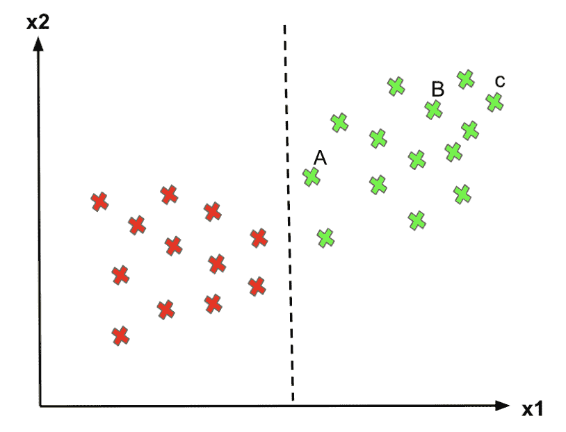

+   对于点 C，由于它远离决策边界，我们可以相当确定地将其分类为 1（绿色）。

+   对于点 A，尽管我们现在将其分类为 1，由于它非常接近决策边界，如果边界稍微向右移动，我们将把点 A 标记为“0”。因此，我们对点 C 的预测信心远高于对点 A 的预测。

逻辑回归不关心实例是否接近决策边界。因此，它选择的决策边界可能不是最优的。从上面的图可以看出，如果一个点远离决策边界，我们对预测可能更有信心。因此，最优的决策边界应该能够最大化决策边界与所有实例之间的距离，即最大化边距。这就是为什么 SVM 算法很重要！

### 什么是支持向量机（SVM）？

给定一组标记为属于两个类别之一的训练样本，SVM 训练算法构建一个模型，将新的样本分配到一个类别或另一个类别，从而使其成为一个非概率性的二元线性分类器。

应用支持向量机（SVM）的目标是找到二维中的最佳直线或多维中的最佳超平面，以帮助我们将空间划分为不同的类别。这个超平面（直线）是通过**最大边距**来确定的，即两个类别的数据点之间的最大距离。

> *你不觉得支持向量机（SVM）的定义和概念有些抽象吗？别担心，让我详细解释一下。*

**支持向量机**

想象标记的训练集是两类数据点（二维）：爱丽丝和灰姑娘。为了分隔这两类，有很多可能的超平面可以正确地进行分隔。如下面的图所示，我们可以使用不同的超平面（L1、L2、L3）来获得完全相同的结果。然而，如果我们添加新的数据点，使用不同超平面的结果在将新数据点分类到正确类别时会有很大差异。

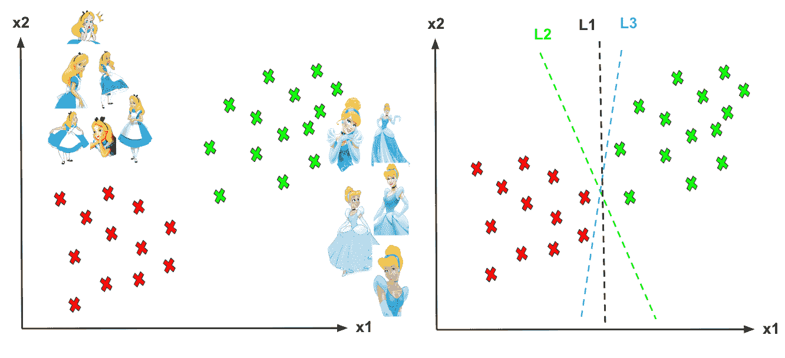

*不同的超平面（L1、L2、L3）。*

我们如何为类别决定一个分隔直线？我们应该使用哪个超平面？

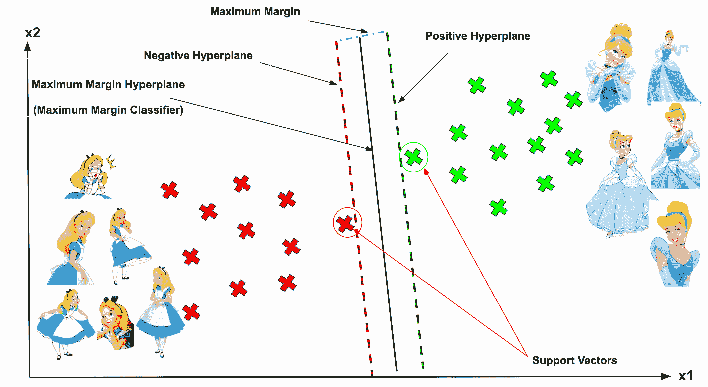

**支持向量、超平面和边距**

与超平面最接近的向量点被称为**支持向量点**，因为只有这两个点对算法的结果有贡献，其他点没有。如果一个数据点不是支持向量，那么删除它对模型没有影响。另一方面，删除支持向量会改变超平面的位置。

超平面的维度取决于特征的数量。如果输入特征的数量为 2，则超平面只是一个直线。如果输入特征的数量为 3，则超平面变为二维平面。当特征数量超过 3 时，就很难想象了。

向量与超平面的距离称为***边距***，它是直线与最近类别点的分隔。我们希望选择一个能最大化类别间边距的超平面。下面的图展示了什么是好的边距和坏的边距。

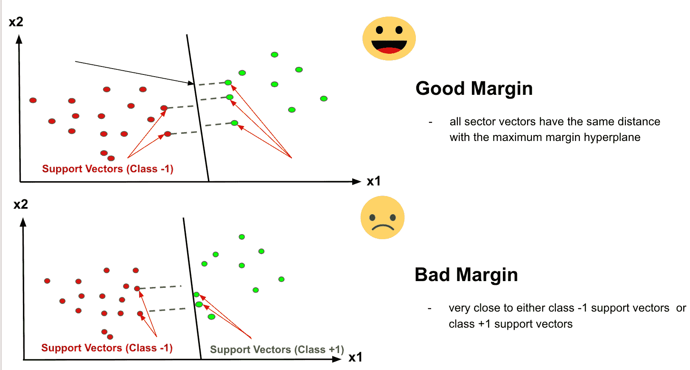

**硬边际**

如果训练数据是线性可分的，我们可以选择两个平行的超平面来分开两个类别的数据，从而使它们之间的距离尽可能大。

**软边际**

由于大多数现实世界的数据并不是完全线性可分的，我们将允许一些边际违规发生，这称为软边际分类。即便一些约束被违反，拥有一个较大的边际更为优越。边际违规意味着选择一个超平面，这可以允许一些数据点位于超平面错误的一侧或在边际与超平面的正确侧之间。

为了找到**最大边际**，我们需要最大化数据点与超平面之间的边际。在接下来的环节中，我将分享这个算法背后的数学概念。

### 线性代数回顾

在我们继续之前，让我们复习一下线性代数中的一些概念。

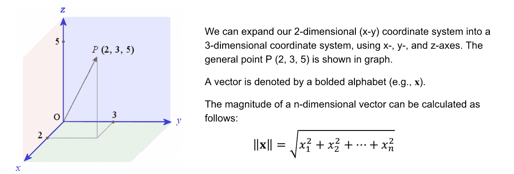

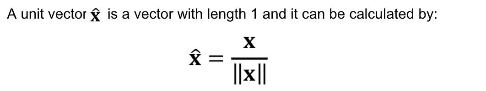

**最大化边际**

你可能学过直线的方程是**y=ax+b**。然而，你会发现超平面的方程通常被定义为：

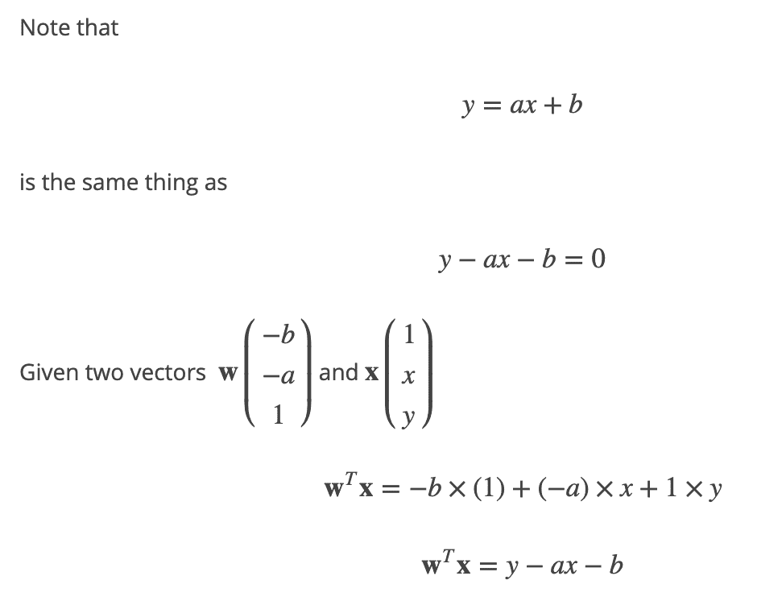

*这两个方程只是用不同的方式表达相同的内容。*

对于**支持向量分类器**（SVC），我们使用 ????T????+???? 其中 ???? 是权重向量，???? 是偏置。

你可以看到超平面方程中的变量名称是**w**和**x**，这意味着它们是向量！向量具有大小（尺寸）和方向，这在三维或更多维度中表现得非常好。因此，“**向量**”的应用被用于 SVM 算法中。

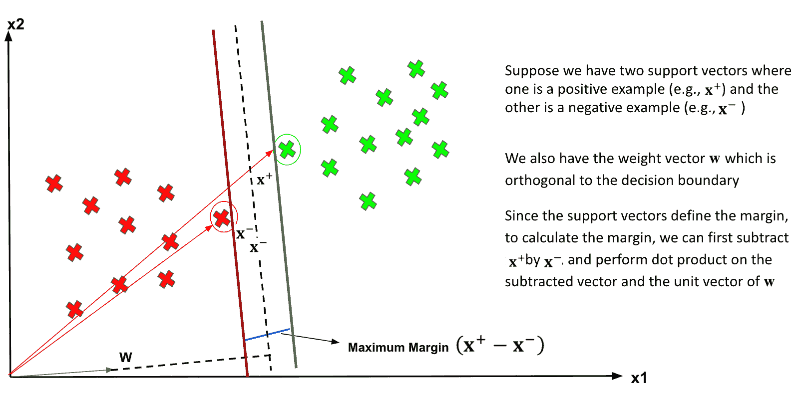

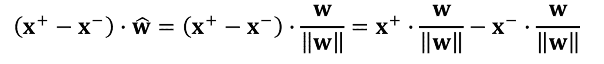

*计算边际的方程。*

**代价函数和梯度更新**

> 最大化边际等同于最小化损失。

在 SVM 算法中，我们寻求最大化**边际**，即数据点与超平面之间的边际。帮助最大化边际的损失函数是**铰接损失**。

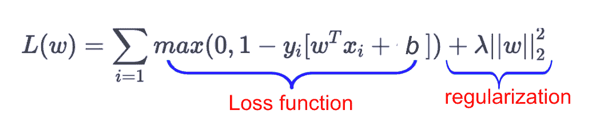

*λ=1/C（C 始终用于正则化系数）。*

第一个术语**铰接损失**的函数是用来惩罚错误分类的。它衡量由于错误分类（或数据点离分类边界比边际更近）导致的错误。第二个术语是正则化项，它是一种通过惩罚解向量中的大系数来避免过拟合的技术。λ（lambda）是正则化系数，它的主要作用是确定增加边际大小和确保 xi 位于边际正确侧之间的权衡。

“铰链”描述了错误为 0 的情况，如果数据点被正确分类（且不太靠近决策边界）。

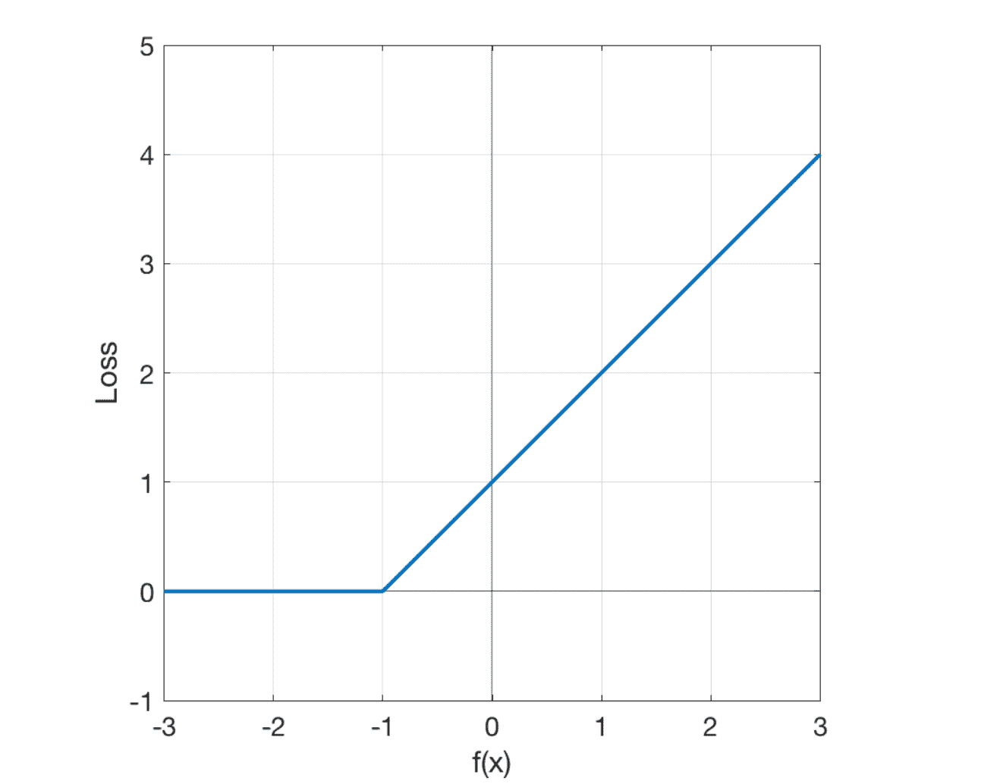

当真实类别为 -1（如你的示例中）时，铰链损失在图中看起来是这样的。

> 我们需要最小化上述损失函数，以找到最大间隔分类器。

我们可以从 **铰链损失** 中推导出间隔的公式。如果一个数据点在分类器的间隔上，铰链损失为零。因此，在间隔上，我们有：

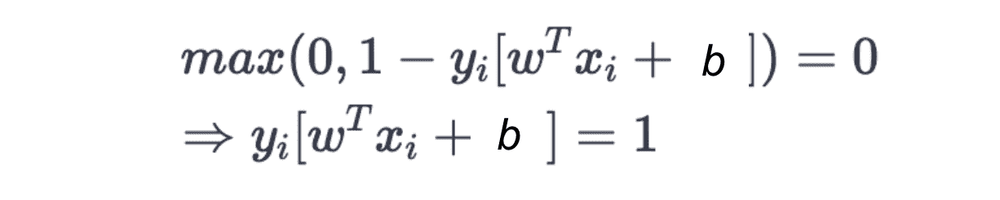

*注意到 ????i 是 +1 或 -1。*

因此，我们有：

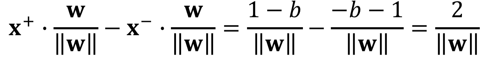

我们的目标函数是：

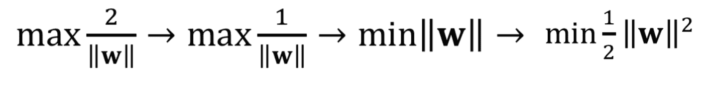

*为了最小化这种目标函数，我们应该使用拉格朗日乘子。*

**分类非线性数据**

那么，对于数据点不是线性可分的情况呢？

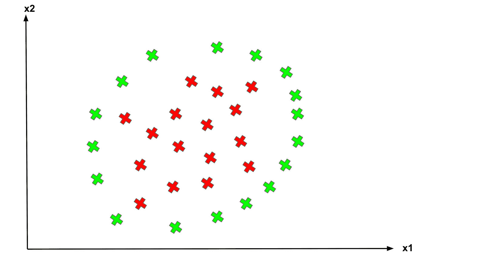

*非线性分离。*

SVM 有一个称为 [**核函数**](https://en.wikipedia.org/wiki/Kernel_method)** 技巧**。这些函数将低维输入空间转换为高维空间，即将不可分问题转换为可分问题。它主要用于非线性分离问题。如下所示：

**映射到更高维度**

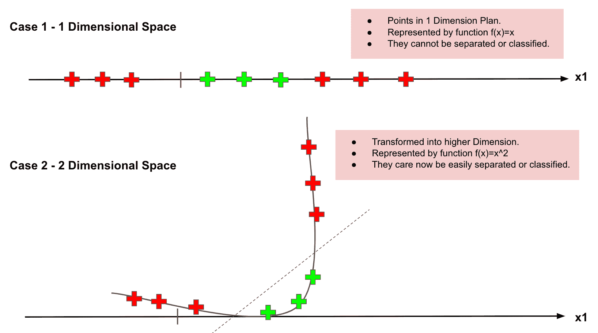

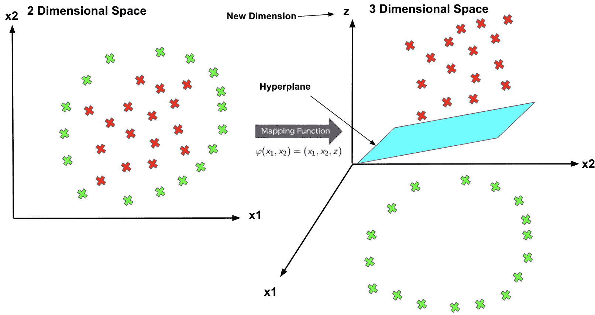

**一些常用的核函数**

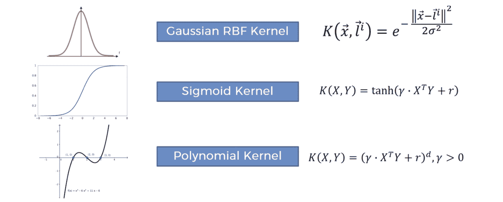

### 为什么使用 SVM

1.  解决数据点不是线性可分的情况

1.  在更高维度下有效。

1.  适用于小数据集：当特征数量多于训练样本时有效。

1.  过拟合问题：超平面仅受支持向量的影响，因此 SVM 对异常值不具鲁棒性。

### 总结：现在你应该知道

+   逻辑回归的问题

+   什么是支持向量、超平面和间隔

+   如何使用铰链损失找到最大化的间隔

+   如何使用不同的核函数处理非线性可分的数据

[原文](https://towardsdatascience.com/one-of-the-top-machine-learning-algorithms-for-supervised-learning-support-vector-machines-svms-fc45ac0667f4)。转载已获许可。

**相关内容：**

+   [支持向量机的友好介绍](https://www.kdnuggets.com/2019/09/friendly-introduction-support-vector-machines.html)

+   [支持向量机 (SVM) 教程：通过示例学习 SVM](https://www.kdnuggets.com/2017/08/support-vector-machines-learning-svms-examples.html)

+   [什么是支持向量机，它的用途是什么？](https://www.kdnuggets.com/2017/02/yhat-support-vector-machine.html)

### 更多相关主题

+   [支持向量机：一种直观的方法](https://www.kdnuggets.com/2022/08/support-vector-machines-intuitive-approach.html)

+   [支持向量机的温和入门](https://www.kdnuggets.com/2023/07/gentle-introduction-support-vector-machines.html)

+   [学习数据科学统计的最佳资源](https://www.kdnuggets.com/2021/12/springboard-top-resources-learn-data-science-statistics.html)

+   [停止学习数据科学以寻找目的，并寻找目的来…](https://www.kdnuggets.com/2021/12/stop-learning-data-science-find-purpose.html)

+   [成功数据科学家的 5 个特征](https://www.kdnuggets.com/2021/12/5-characteristics-successful-data-scientist.html)

+   [是什么让 Python 成为初创公司的理想编程语言](https://www.kdnuggets.com/2021/12/makes-python-ideal-programming-language-startups.html)
