# 你应该了解的所有机器学习算法（2021）

> 原文：[`www.kdnuggets.com/2021/01/machine-learning-algorithms-2021.html`](https://www.kdnuggets.com/2021/01/machine-learning-algorithms-2021.html)

评论

*照片由 [Markus Winkler](https://unsplash.com/@markuswinkler?utm_source=unsplash&utm_medium=referral&utm_content=creditCopyText) 提供，来自 [Unsplash](https://unsplash.com/s/photos/machine-learning?utm_source=unsplash&utm_medium=referral&utm_content=creditCopyText)。*

* * *

## 我们的前三大课程推荐

 1\. [谷歌网络安全证书](https://www.kdnuggets.com/google-cybersecurity) - 快速进入网络安全职业生涯。

 2\. [谷歌数据分析专业证书](https://www.kdnuggets.com/google-data-analytics) - 提升你的数据分析能力

 3\. [谷歌 IT 支持专业证书](https://www.kdnuggets.com/google-itsupport) - 支持你的组织在 IT 领域

* * *

随着我在机器学习领域知识的增长，机器学习算法的数量也在增加！本文将介绍数据科学社区中常用的机器学习算法。

请记住，我将会对某些算法进行更多的详细阐述，因为如果我详细解释每个算法，这篇文章将会和一本书一样长！我也会尽量减少文章中的数学内容，因为我知道对于那些不擅长数学的人来说，这可能会相当吓人。相反，我会尽量给出每个算法的简明总结，并指出一些关键特征。

有鉴于此，我将从一些基本的算法开始，然后深入探讨一些较新的算法，如 CatBoost、Gradient Boost 和 XGBoost。

### 线性回归

线性回归是用于建模因变量与一个或多个自变量之间关系的最基本算法之一。简单来说，它涉及找到代表两个或更多变量的“最佳拟合线”。

通过最小化点与最佳拟合线之间的平方距离来找到最佳拟合线——这被称为最小化平方残差之和。残差等于预测值减去实际值。

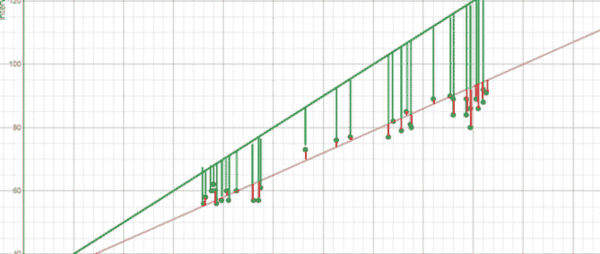

*图片由作者创建。*

如果现在还不明白，可以考虑上面的图片。比较绿色的最佳拟合线和红色的线，注意垂直线（残差）对于绿色线来说明显大于红色线。这是因为绿色线离数据点太远，根本不能很好地代表数据！

如果你想了解更多关于线性回归背后的数学知识，我建议你从[Brilliant 的解释](https://brilliant.org/wiki/linear-regression/#:~:text=Linear%20regression%20is%20a%20technique,a%20linear%20relationship%20between%20them.&text=The%20best%2Dfitting%20linear%20relationship%20between%20the%20variables%20x%20and%20y.)开始。

### 逻辑回归

逻辑回归类似于线性回归，但用于建模离散数量结果的概率，通常是两个。乍看之下，逻辑回归听起来比线性回归复杂得多，但实际上只多了一个步骤。

首先，你使用一个类似于线性回归最佳拟合线方程的方程来计算得分。

额外的步骤是将你之前计算的得分输入到下面的 Sigmoid 函数中，以便获得一个概率。这个概率然后可以转化为二进制输出，0 或 1。

要找到初始方程的权重并计算得分，可以使用梯度下降法或最大似然法等方法。由于这超出了本文的范围，我不会详细讨论，但现在你知道它是如何工作的了！

### K-最近邻

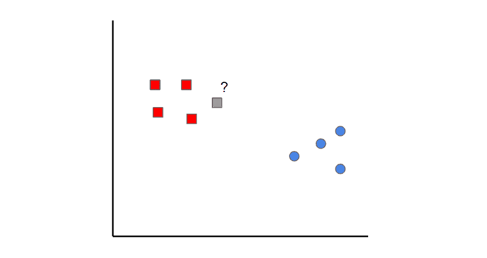

*图像由作者创建。*

K-最近邻是一个简单的概念。首先，你从已经分类的数据（即红色和蓝色的数据点）开始。然后，当你添加一个新的数据点时，你通过查看 k 个最近的已分类点来对其进行分类。得到最多投票的类别决定了新点的分类。

在这种情况下，如果我们设置*k*=1，我们可以看到灰色样本的第一个最近点是一个红色数据点。因此，这个点会被分类为红色。

需要注意的是，如果*k*的值设置得太低，它可能会受到离群值的影响。另一方面，如果*k*的值设置得太高，那么它可能会忽略只有少数样本的类别。

### 朴素贝叶斯

[朴素贝叶斯](https://www.kdnuggets.com/2020/06/naive-bayes-algorithm-everything.html)是一种分类算法。这意味着，当输出变量是离散的时，使用朴素贝叶斯算法。

朴素贝叶斯算法可能看起来很复杂，因为它需要条件概率和贝叶斯定理的初步数学知识，但它是一个非常简单和“朴素”的概念，我会尽力通过一个例子来解释：

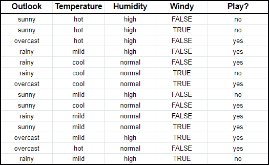

*图像由作者创建。*

假设我们有关于天气特征（如展望、温度、湿度、风力）的输入数据，以及你是否打过高尔夫的数据（即最后一列）。

朴素贝叶斯算法基本上是比较每个输入变量与输出变量类别之间的**比例**。这可以在下面的表格中显示。

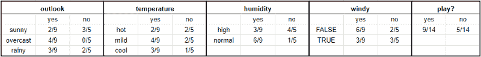

*图片由作者创建。*

为了帮助你理解这一点，在**温度**部分，你在你打高尔夫的九天中有两天是炎热的（即，打高尔夫）。

从数学角度来看，你可以将其写为**在你打高尔夫的情况下天气炎热的概率。** 数学符号是 P(hot|yes)。这是条件概率的定义，对理解接下来要讲的内容至关重要。

一旦你有了这些数据，你就可以预测在任何天气特征组合下你是否会打高尔夫。

想象一下我们有一个新的一天，其特征如下：

+   天气：晴朗

+   温度：适中

+   湿度：正常

+   有风：假

首先，我们将计算在给定 X 的情况下你打高尔夫的概率 P(yes|X)，然后是你不打高尔夫的概率 P(no|X)。

使用上面的图表，我们可以得到以下信息：

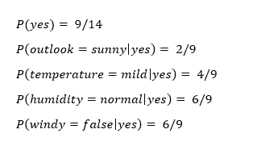

现在我们可以将这些信息简单地输入到以下公式中：

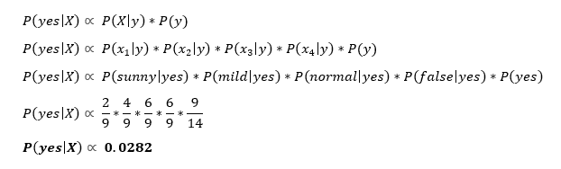

同样，你需要对 P(no|X)执行相同的步骤。

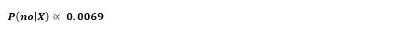

因为 P(yes|X) > P(no|X)，所以你可以预测在天气晴朗、温度适中、湿度正常且无风的情况下，这个人会打高尔夫。

这就是朴素贝叶斯的本质！

### 支持向量机

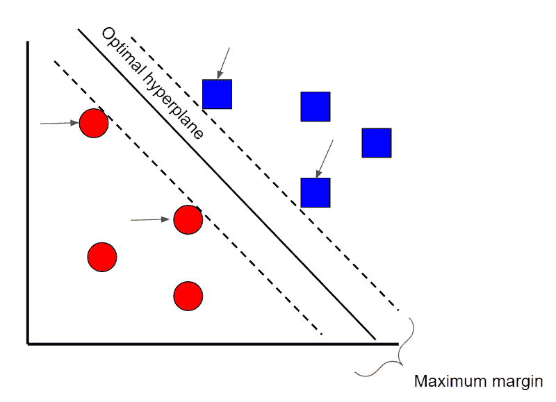

*图片由作者创建。*

支持向量机是一种监督分类技术，从本质上来看非常直观，但实际上可能会变得相当复杂。为了本文的目的，我们将保持在较高层次的讨论。

假设数据有两个类别。支持向量机将找到一个**超平面**或两个数据类别之间的边界，该边界最大化两个类别之间的间隔（见上图）。虽然有许多平面可以分隔这两个类别，但只有一个平面可以最大化两个类别之间的间隔或距离。

如果你想深入了解支持向量机的数学背景，请查看这个[系列文章](https://www.svm-tutorial.com/2014/11/svm-understanding-math-part-1/)。

# 决策树

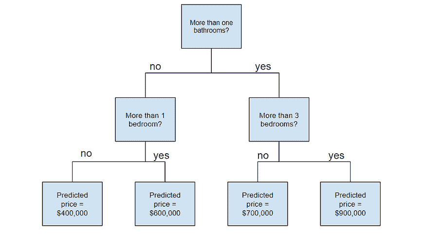

*图片由作者创建。*

# 随机森林

在理解随机森林之前，你需要了解几个术语：

+   **集成学习**是一种将多个学习算法结合使用的方法。这样做的目的是使你能够实现比单独使用任何一个算法更高的预测性能。

+   **自助法采样**是一种使用带替换的随机采样的重采样方法。这听起来很复杂，但相信我，当我说它真的很简单时——[在这里](https://towardsdatascience.com/what-is-bootstrap-sampling-in-machine-learning-and-why-is-it-important-a5bb90cbd89a)阅读更多。

+   **袋装**当你使用自助法数据集的聚合来做决策时——我专门写了一篇关于这个主题的文章，所以如果这让你感到困惑，可以[在这里](https://towardsdatascience.com/ensemble-learning-bagging-and-boosting-explained-in-3-minutes-2e6d2240ae21)查看一下。

现在你已经理解了这些术语，让我们深入探讨一下。

随机森林是一种集成学习技术，建立在决策树的基础上。随机森林涉及使用原始数据的自助法数据集创建多个决策树，并在每一步决策树中随机选择一个变量子集。然后模型选择每棵决策树预测的众数（袋装）。这样做的意义是什么？通过依赖于“多数决胜”的模型，降低了单棵树的错误风险。

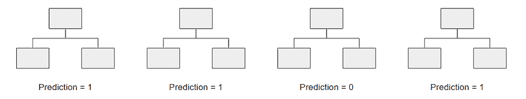

*图像由作者创作。*

例如，如果我们创建了一棵决策树，即第三棵树，它的预测结果将是 0。如果我们依赖于所有 4 棵决策树的众数，那么预测值将是 1。这就是随机森林的强大之处！

### AdaBoost

AdaBoost，即自适应增强，也是一个集成算法，利用袋装和提升方法来开发一个增强型预测器。

AdaBoost 与随机森林类似，都是通过多个决策树来进行预测。然而，有三个主要的区别使得 AdaBoost 独特：

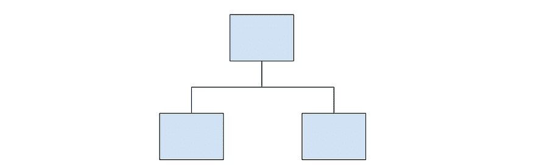

*弱分类器的示例。*

1.  首先，AdaBoost 创建的是弱分类器的森林，而不是树。弱分类器是一棵仅由一个节点和两个叶子组成的树（如上图所示）。

1.  其次，创建的弱分类器在最终决策（最终预测）中并不是等权重的。产生更多错误的弱分类器在最终决策中的影响力会更小。

1.  最后，弱分类器的创建顺序很重要，因为每个弱分类器旨在减少前一个弱分类器所犯的错误。

从本质上讲，AdaBoost 采取了一种更迭代的方法，旨在通过不断改进先前弱分类器所犯的错误来逐步提升模型。

[*如果你想了解更多关于 AdaBoost 背后的数学原理，请查看我的文章《5 分钟数学解释 AdaBoost》。*](https://towardsdatascience.com/a-mathematical-explanation-of-adaboost-4b0c20ce4382)

### 梯度提升

梯度**提升**也是一个集成算法，使用提升方法来开发增强型预测器，这一点也不奇怪。在许多方面，梯度提升与 AdaBoost 相似，但也有几个关键区别：

+   与构建桩的 AdaBoost 不同，梯度提升构建通常具有 8–32 个叶子的树。

+   梯度提升将提升问题视为优化问题，其中使用损失函数并尝试最小化误差。这就是为什么它被称为 ***梯度***提升，因为它受到梯度下降的启发。

+   最后，树用于预测样本的残差（预测值减去实际值）。

尽管最后一点可能令人困惑，但你只需要知道的是，梯度提升开始时通过构建一棵树来拟合数据，随后构建的树旨在减少残差（误差）。它通过集中关注现有学习器表现不佳的区域来实现这一点，类似于 AdaBoost。

### XGBoost

XGBoost 是目前最流行和广泛使用的算法之一，因为它非常强大。它类似于梯度提升，但具有一些额外的特性，使其更强大，包括：

+   **叶节点的比例收缩（修剪）** — 用于提高模型的泛化能力

+   **牛顿提升** — 提供比梯度下降更直接的最小值路径，使其更快

+   **额外的随机化参数** — 减少树之间的相关性，最终增强集成的强度

+   **独特的树惩罚机制**

我强烈推荐你观看 [StatQuest 的视频](https://www.youtube.com/watch?v=OtD8wVaFm6E&t=3s)，以更详细地了解算法的工作原理。

### LightGBM

如果你认为 XGBoost 是最好的算法，那么请再考虑一下。LightGBM 是另一种提升算法，它在某些情况下比 XGBoost 更快且更准确。

LightGBM 的独特之处在于它使用一种叫做**基于梯度的单边采样（GOSS）**的独特技术来筛选数据实例，以找到分裂值。这与 XGBoost 不同，XGBoost 使用预排序和基于直方图的算法来找到最佳分裂。

[*了解更多关于 Light GBM 和 XGBoost 的信息请点击这里*](https://towardsdatascience.com/catboost-vs-light-gbm-vs-xgboost-5f93620723db)*!*

### CatBoost

CatBoost 是另一种基于梯度下降的算法，具有一些微妙的差异，使其独特：

+   CatBoost 实现了对称树，这有助于减少预测时间，同时默认的树深度较浅（六）

+   CatBoost 利用随机排列，类似于 XGBoost 的随机化参数

+   然而，与 XGBoost 不同，CatBoost 更优雅地处理分类特征，使用如有序提升和响应编码等概念

总体而言，使 CatBoost 如此强大的原因是其低延迟要求，这使得其速度约为 XGBoost 的 **八倍**。

*如果你想更详细地了解 CatBoost，请查看这篇* [*文章*](https://medium.com/@hanishsidhu/whats-so-special-about-catboost-335d64d754ae)*。*

**感谢阅读！**

如果你坚持到了最后，恭喜你！你现在应该对所有不同的机器学习算法有了更好的了解。

如果你在理解最后几个算法时遇到困难，不要气馁——这些算法不仅更复杂，而且相对较新！因此，敬请关注更多将深入探讨这些算法的资源。

[原文](https://towardsdatascience.com/all-machine-learning-algorithms-you-should-know-in-2021-2e357dd494c7)。经授权转载。

**相关：**

+   [关键数据科学算法解释：从 k-means 到 k-medoids 聚类](https://www.kdnuggets.com/2020/12/algorithms-explained-k-means-k-medoids-clustering.html)

+   [一种顶级机器学习算法解释：支持向量机（SVM）](https://www.kdnuggets.com/2020/03/machine-learning-algorithm-svm-explained.html)

+   [决策树算法解释](https://www.kdnuggets.com/2020/01/decision-tree-algorithm-explained.html)

### 更多相关话题

+   [建立一个稳固的数据团队](https://www.kdnuggets.com/2021/12/build-solid-data-team.html)

+   [使用管道编写干净的 Python 代码](https://www.kdnuggets.com/2021/12/write-clean-python-code-pipes.html)

+   [每位数据科学家都应该知道的三个 R 库（即使你使用 Python）](https://www.kdnuggets.com/2021/12/three-r-libraries-every-data-scientist-know-even-python.html)

+   [2021 年最佳 ETL 工具](https://www.kdnuggets.com/2021/12/mozart-best-etl-tools-2021.html)

+   [每位初学者数据科学家都应该掌握的 6 种预测模型](https://www.kdnuggets.com/2021/12/6-predictive-models-every-beginner-data-scientist-master.html)

+   [停止学习数据科学以寻找目标，并通过寻找目标来…](https://www.kdnuggets.com/2021/12/stop-learning-data-science-find-purpose.html)
