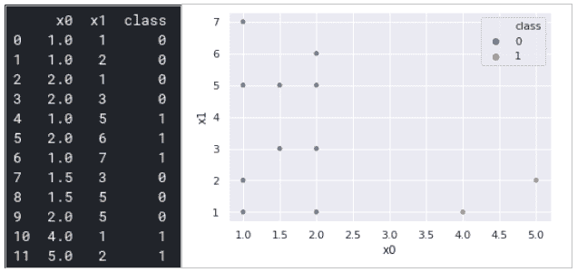
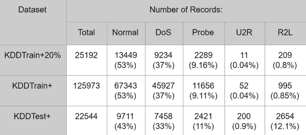
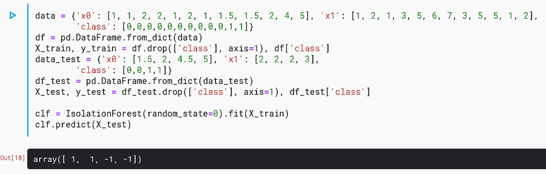

# 如何使用机器学习进行异常检测和条件监控

> 原文：[`www.kdnuggets.com/2020/12/machine-learning-anomaly-detection-conditional-monitoring.html`](https://www.kdnuggets.com/2020/12/machine-learning-anomaly-detection-conditional-monitoring.html)

评论

**由 [Michael Garbade](https://www.linkedin.com/in/garbade)，教育生态系统首席执行官兼创始人**

**主要收获**

+   异常检测分析的主要目标是识别那些不符合正常行为的一般模式的观察值。

+   异常检测在理解数据问题时可能会很有用。

+   有些领域的异常检测方法非常有效。

+   现代机器学习工具包括隔离森林和其他类似方法，但要成功实施，你需要了解基本概念。

+   隔离森林方法是一种无监督异常值检测方法，结果具有可解释性。

### **介绍**

在进行任何数据分析之前，需要找出数据集中是否存在异常值。这些异常值被称为异常。

本文解释了异常检测的目标，并概述了解决特定异常检测和条件监控用例所采用的方法。

### **什么是异常检测？实际应用案例。**

异常检测分析的主要目标是识别那些不符合正常行为的一般模式的观察值。例如，*图 1* 显示了分类和回归问题中的异常。我们可以看到一些值偏离了大多数例子。

***图 1\. 分类（a，左）和回归（b，右）问题中的异常值***

数据分析中有两个方向用于搜索异常：异常值检测和新颖性检测。因此，异常值是与训练数据集中其他数据点不同的观察值。新颖性数据点也与数据集中的其他观察值不同，但与异常值不同，新颖性点出现在测试数据集中，而通常在训练数据集中不存在。因此，图 1 中显示了异常值。

异常值最常见的原因是；

+   数据错误（测量不准确、舍入、书写错误等）；

+   噪声数据点；

+   数据集中的隐藏模式（如欺诈或攻击请求）。

因此，异常值处理取决于数据的性质和领域。噪声数据点应进行过滤（噪声去除）；数据错误应进行纠正。一些应用专注于异常选择，我们将进一步讨论一些应用。

在各种商业应用中，异常检测都很有用。例如，入侵检测系统（IDS）基于异常检测。图 2 展示了 NSL-KDD 数据集的观察分布，这是一种用于 IDS 的先进数据集。我们可以看到，大多数观察都是正常请求，而 Probe 或 U2R 是一些异常点。自然，计算机系统中的大多数请求是正常的，只有一部分是攻击尝试。

***图 2\. IDS 观察分布***

信用卡欺诈检测系统（CCFDS）是另一个异常检测的应用案例。例如，来自 kaggle.com 的开放数据集（https://www.kaggle.com/mlg-ulb/creditcardfraud）包含了 2013 年 9 月欧洲持卡人使用信用卡的交易记录。该数据集展示了发生在两天内的交易，共有 284,807 笔交易，其中 492 笔为欺诈交易。数据集高度不平衡。正类（欺诈交易）占所有交易的 0.172%。

异常检测有两种方法：

+   监督方法；

+   无监督方法。

在监督异常检测方法中，数据集具有正常和异常观察或数据点的标签。IDS 和 CCFDS 数据集适合用于监督方法。这些用例中使用了标准的机器学习方法。监督异常检测是一种二分类问题。需要注意的是，异常检测问题的数据集往往高度不平衡。因此，在使用监督分类方法之前，使用一些数据增强程序（如 k-最近邻算法、ADASYN、SMOTE、随机抽样等）是很重要的。Jordan Sweeney 展示了如何在 Education Ecosystem 的一个项目中使用 k-最近邻算法，[旅行推销员 - 最近邻](https://www.education-ecosystem.com/jsweeney91/2oPDm-travelling-salesman-nearest-neighbour)。

无监督异常检测在没有关于异常和相关模式的信息时非常有用。此时使用孤立森林、OneClassSVM 或 k-means 方法。这里的主要思想是将所有观察划分为若干个簇，并分析这些簇的结构和大小。

有不同的开放数据集用于异常检测方法的测试，例如，异常检测数据集 ([`odds.cs.stonybrook.edu/`](http://odds.cs.stonybrook.edu/))。

### **基于孤立森林的无监督异常检测**

Isolation Forests 方法基于决策树的随机实现和其他结果的集成。每棵决策树都会构建到训练数据集耗尽为止。为构建决策树的新分支而选择一个随机特征和随机分裂。该算法通过决策树叶子的深度均值来区分正常点和离群点。此方法已在 scikit-learn 库中实现 ([`scikit-learn.org/stable/modules/generated/sklearn.ensemble.IsolationForest.html`](https://scikit-learn.org/stable/modules/generated/sklearn.ensemble.IsolationForest.html))。

为了说明异常检测方法，让我们考虑一些带有离群点的玩具数据集，这些数据集已经在图 3 中展示。类 1 的点是离群点。‘class’ 列在分析中未使用，仅用于说明。

***图 3\. 数据集样本和散点图***

让我们对这个玩具例子应用 Isolation Forests 方法，并在一些玩具测试数据集上进一步测试。结果如 *图 4* 所示。完整代码请见： https://www.kaggle.com/avk256/anomaly-detection。

***图 4\. 数据集和 Isolation Forests 方法的实现***

应该注意到，‘y_train’ 和 ‘y_test’ 列没有用于方法拟合。因此，Isolation Forests 方法仅使用数据点并确定离群点。因此，‘X_test’ 数据集包含两个正常点和两个离群点，经过预测方法后，我们得到两个簇的完全相等的分布。

### **结论**

简而言之，异常检测方法可以用于分支应用，例如，清理噪声数据点和观察错误。另一方面，异常检测方法在商业应用中也很有帮助，例如入侵检测或信用卡欺诈检测系统。Andrey 在他的项目 [机器学习模型：Python Sklearn & Keras](https://www.education-ecosystem.com/andreybu/REaxr-machine-learning-model-python-sklearn-kera/oPGdP-machine-learning-model-python-sklearn-kera/) 中展示了 Isolation Forests 方法是最简单有效的无监督异常检测方法之一。此外，该方法已经在先进的库 Scikit-learn 中实现。

**简介: [迈克尔·加尔巴德](https://www.linkedin.com/in/garbade)** 是 Education Ecosystem 的首席执行官兼创始人。迈克尔是一位具有前瞻性思维的全球性连环创业者，专注于软件开发、后端架构、数据科学、人工智能、金融科技、区块链和风险投资。他将技术、数据、金融和业务开发的经验与令人印象深刻的教育背景相结合，并具有识别新商业模式的天赋。作为 Education Ecosystem 的联合创始人和首席执行官，他的使命是建立全球最大的去中心化学习生态系统，服务于职业开发者和大学生。他在 Opensource.com、Dzone.com、Cybrary、Businessinsider、Entrepreneur.com、TechinAsia、Coindesk 和 Cointelegraph 等领先博客上撰写主题专家技术和商业文章。

**相关:**

+   异常检测，AI 和机器学习的关键任务，解释

+   介绍 MIDAS：图形异常检测的新基准

+   异常检测简介

* * *

## 我们的三大课程推荐

 1\. [Google 网络安全证书](https://www.kdnuggets.com/google-cybersecurity) - 快速进入网络安全职业

 2\. [Google 数据分析专业证书](https://www.kdnuggets.com/google-data-analytics) - 提升你的数据分析能力

 3\. [Google IT 支持专业证书](https://www.kdnuggets.com/google-itsupport) - 支持你的组织的 IT 需求

* * *

### 更多相关话题

+   [BigQuery 中的异常检测：揭示隐藏的见解并推动行动](https://www.kdnuggets.com/anomaly-detection-in-bigquery-uncover-hidden-insights-and-drive-action)

+   [数据科学中异常检测技术的初学者指南](https://www.kdnuggets.com/2023/05/beginner-guide-anomaly-detection-techniques-data-science.html)

+   [用 AI 进行 AI 诈骗监控以对抗深度伪造应用](https://www.kdnuggets.com/2023/05/fighting-ai-ai-fraud-monitoring-deepfake-applications.html)

+   [如何在 Pandas 中使用条件格式化来增强数据可视化](https://www.kdnuggets.com/how-to-use-conditional-formatting-in-pandas-to-enhance-data-visualization)

+   [在 Pandas 中进行条件过滤的五种方法](https://www.kdnuggets.com/2022/12/five-ways-conditional-filtering-pandas.html)

+   [如何使用 Python 进行运动检测](https://www.kdnuggets.com/2022/08/perform-motion-detection-python.html)
