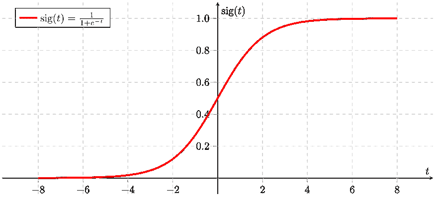
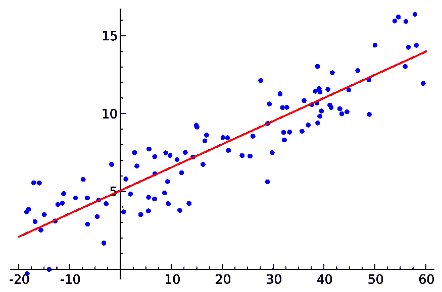
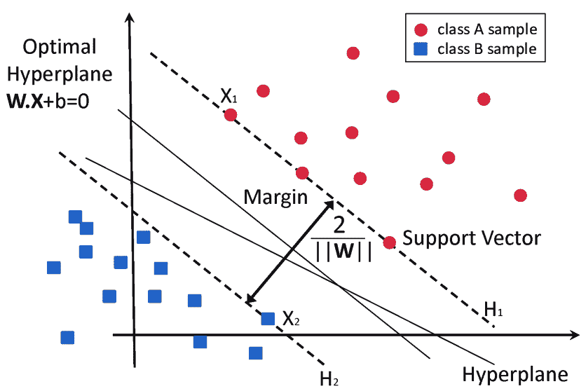
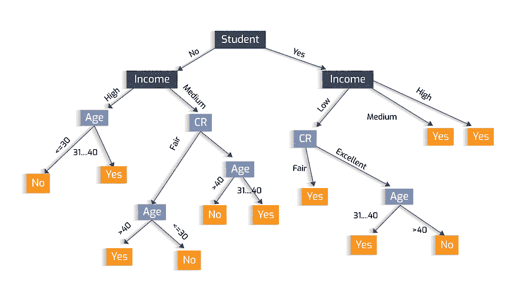
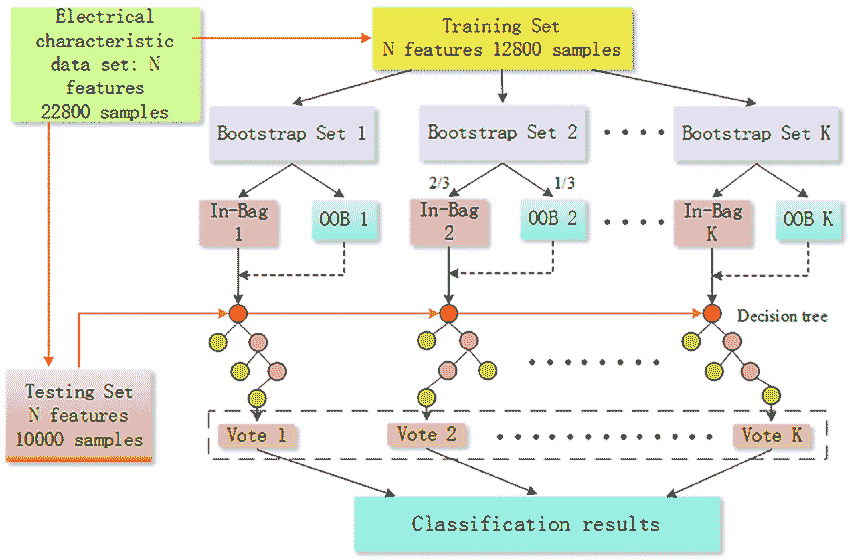
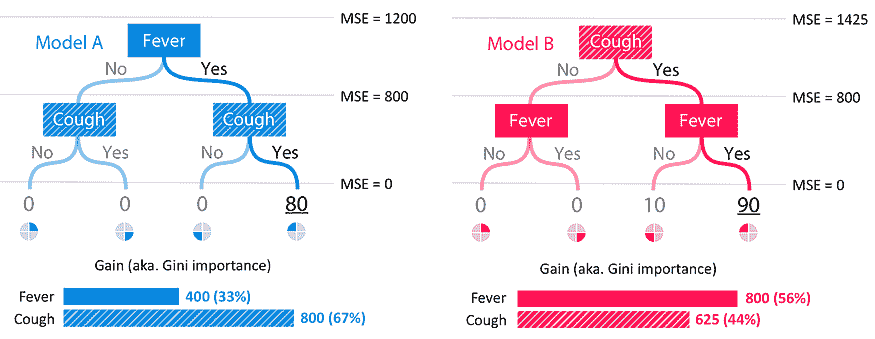

# 机器学习——一切都关于假设

> 原文：[`www.kdnuggets.com/2021/02/machine-learning-assumptions.html`](https://www.kdnuggets.com/2021/02/machine-learning-assumptions.html)

评论

**由 [Vishal Mendekar](https://www.linkedin.com/in/connect-to-vishal-mendekar/?originalSubdomain=in) 编写，精通 Python、机器学习和深度学习**。

本博客讨论了流行机器学习算法的假设及其优缺点。

* * *

## 我们的前三大课程推荐

 1\. [谷歌网络安全证书](https://www.kdnuggets.com/google-cybersecurity) - 快速进入网络安全职业生涯。

 2\. [谷歌数据分析专业证书](https://www.kdnuggets.com/google-data-analytics) - 提升你的数据分析技能

 3\. [谷歌 IT 支持专业证书](https://www.kdnuggets.com/google-itsupport) - 支持你的组织进行 IT 工作

* * *

*[来源](https://media.geeksforgeeks.org/wp-content/cdn-uploads/machineLearning3.png)*

开始这个博客之前，让我先讲讲创建这个博客的原因。

有大量的数据科学爱好者正在寻找数据科学的工作，或为了更好的机会而换工作。每一个这些人都必须经历一些严格的招聘过程，包括几轮面试。

招聘人员/面试官通常会期待回答几个基本问题。了解流行的 [机器学习算法](https://www.kdnuggets.com/2016/08/10-algorithms-machine-learning-engineers.html) 的假设及其优缺点就是其中之一。

在博客的后续部分，我将首先介绍特定算法的假设，然后是其优缺点。这将只占用你大约 5 分钟的时间，到博客结束时，你一定会学到一些东西。

*我将按照以下顺序介绍假设、优缺点。*

1.  **K-NN（K 最近邻）**

1.  **逻辑回归**

1.  **线性回归**

1.  **支持向量机**

1.  **决策树**

1.  **朴素贝叶斯**

1.  **随机森林（集成算法）**

1.  **XGBoost（提升算法）**

### 1\. K-NN

[*来源*](https://www.analyticsvidhya.com/wp-content/uploads/2014/10/scenario2.png)

***假设：***

1.  数据在特征空间中，这意味着特征空间中的数据可以通过距离度量来测量，如曼哈顿距离、欧氏距离等。

1.  每个训练数据点由一组向量和与每个向量相关联的类别标签组成。

1.  对于二分类问题，**‘K’** 应该是一个奇数。

***优点：***

1.  易于理解、实现和解释。

1.  是一种非参数算法，因此没有严格的假设。

1.  不需要训练步骤。它在运行时使用训练数据进行预测，使其比所有需要训练的算法更快。

1.  由于不需要对训练数据进行训练，数据点可以很容易地添加。

***缺点:***

1.  当数据集很大时效率低且慢。由于计算成本，新点与训练点之间的距离很高。

1.  在高维数据中表现不好，因为在更高维度中找到距离变得更加困难。

1.  对离群点敏感，因为它容易受到离群点的影响。

1.  当数据缺失时无法工作，因此需要手动填补数据才能使其正常工作。

1.  需要特征缩放/标准化。

### 2\. 逻辑回归

*[来源](https://miro.medium.com/max/2400/1*RqXFpiNGwdiKBWyLJc_E7g.png)*

***假设:***

1.  它假设自变量之间几乎没有或没有多重共线性。

1.  通常需要大量样本才能正确预测。

1.  假设观测值彼此独立。

***优点:***

1.  易于解释、实现和训练。不需要过多的计算能力。

1.  对类别分布没有假设。

1.  在分类未知记录时速度快。

1.  可以轻松容纳新的数据点。

1.  当特征线性可分时，非常高效。

***缺点:***

1.  试图预测精确的概率结果，这会在高维度中导致过拟合。

1.  由于它具有线性决策面，因此不能解决非线性问题。

1.  很难获得除了线性关系以外的复杂关系。

1.  需要很少或没有多重共线性。

1.  需要大规模的数据集和所有类别的足够训练样本以做出正确预测。

### 3\. 线性回归

[*来源*](https://upload.wikimedia.org/wikipedia/commons/thumb/3/3a/Linear_regression.svg/1200px-Linear_regression.svg.png)

***假设:***

1.  应该存在线性关系。

1.  应该没有或只有很少的多重共线性。

1.  同方差性：残差的方差对于任何 X 值应该是相同的。

***优点:***

1.  当自变量和因变量之间存在线性关系时，表现非常好。

1.  如果发生过拟合，可以通过 L1 或 L2 范数轻松减少过拟合。

***缺点:***

1.  假设数据独立性。

1.  线性可分性的假设。

1.  对离群点敏感。

### 4\. 支持向量机

[*来源*](https://www.researchgate.net/publication/304611323/figure/fig8/AS:668377215406089@1536364954428/Classification-of-data-by-support-vector-machine-SVM.png)

***假设:***

1.  假设数据是独立且同分布的。

***优点:***

1.  在高维数据上表现非常好。

1.  内存高效。

1.  在维度数大于样本数的情况下效果显著。

***缺点:***

1.  不适合大型数据集。

1.  当数据集有噪声时效果不好，即目标类重叠。

1.  训练较慢。

1.  对分类没有概率解释。

### 5. 决策树

[*来源*](https://miro.medium.com/max/3840/1*jojTznh4HOX_8cGw_04ODA.png)

***假设:***

1.  初始时，整个训练数据被视为根。

1.  记录在属性值的基础上递归分布。

***优点:***

1.  与其他算法相比，数据准备所需时间较少。

1.  不需要对数据进行归一化。

1.  缺失值在一定程度上不会严重影响其性能。

1.  非常直观，可以解释为 if-else 条件。

***缺点:***

1.  训练模型需要大量时间。

1.  数据的小变化可能导致决策树结构发生较大变化。

1.  相对较贵的训练成本。

1.  不适用于回归任务。

### 6. 朴素贝叶斯

[*来源*](https://www.kdnuggets.com/wp-content/uploads/bayes-nagesh-0.jpg)

***假设:***

1.  最大也是唯一的假设是条件独立性假设。

***优点:***

1.  当条件独立性假设成立时，表现优异。

1.  易于实现，因为只需计算概率。

1.  适用于高维数据，如文本。

1.  实时预测速度快。

***缺点:***

1.  如果条件独立性不成立，则表现不佳。

1.  由于多个小数字的乘法，存在数值稳定性或数值下溢的问题。

### 7. 随机森林

[*来源*](https://www.researchgate.net/publication/316982197/figure/fig5/AS:559887665303554@1510499029585/The-structure-of-random-forest-algorithm-The-random-forest-is-composed-of-the-generated.png)

***假设:***

1.  假设没有正式的分布。作为非参数模型，它可以处理偏斜和多模态数据。

***优点:***

1.  对异常值具有鲁棒性。

1.  对非线性数据效果良好。

1.  过拟合风险低。

1.  在大型数据集上运行高效。

***缺点:***

1.  训练缓慢。

1.  在处理分类变量时有偏差。

### 8. XGBoost

[*来源*](https://miro.medium.com/max/4000/1*IWBGb4PC7F2q0fszK-Iplw.png)

***假设:***

1.  可能假设每个变量编码的整数值具有序数关系。

***优点:***

1.  可以并行工作。

1.  可以处理缺失值。

1.  无需对数据进行缩放或归一化。

1.  解释速度快。

1.  执行速度快。

***缺点:***

1.  如果参数没有正确调整，可能会出现过拟合。

1.  调优困难。

[原文](https://medium.com/swlh/its-all-about-assumptions-pros-cons-497783cfed2d). 经许可转载。

**相关:**

+   [2021 年你应该知道的所有机器学习算法](https://www.kdnuggets.com/2021/01/machine-learning-algorithms-2021.html)

+   [关键数据科学算法解析：从 k-means 到 k-medoids 聚类](https://www.kdnuggets.com/2020/12/algorithms-explained-k-means-k-medoids-clustering.html)

+   [如何有效学习机器学习算法](https://www.kdnuggets.com/2020/11/learn-machine-learning-algorithms-effectively.html)

### 更多相关内容

+   [XGBoost 的假设是什么？](https://www.kdnuggets.com/2022/08/assumptions-xgboost.html)

+   [IBM 提供的免费数据科学学习路线图：适用于所有水平](https://www.kdnuggets.com/a-free-data-science-learning-roadmap-for-all-levels-with-ibm)

+   [Python 中的集合全解](https://www.kdnuggets.com/2022/09/collections-python.html)

+   [科技行业的大规模裁员是怎么回事？](https://www.kdnuggets.com/2023/02/layoffs-tech.html)

+   [超级巴德：能做所有事且更好的人工智能](https://www.kdnuggets.com/2023/05/super-bard-ai-better.html)

+   [今天所有营销分析和数据科学专家需要的 5 项技能](https://www.kdnuggets.com/2023/08/mads-5-skills-marketing-analytics-data-science-pros-need-today.html)
