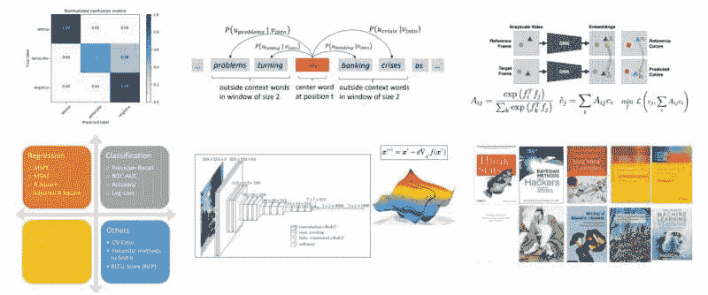

# 免费高质量机器学习与数据科学书籍与课程：隔离版

> 原文：[`www.kdnuggets.com/2020/04/machine-learning-data-science-books-courses-quarantine.html`](https://www.kdnuggets.com/2020/04/machine-learning-data-science-books-courses-quarantine.html)

评论

你现在有机会待在家里吗？由于 COVID-19，许多人被限制在家中隔离、居家避难或类似的情况。如果你发现自己处于这种情况，并且正在寻找免费的学习材料，比如书籍和课程，以便充分利用并提升你的数据科学和机器学习技能，这些我之前编写的文章将对你有帮助。总的来说，你会找到链接到这些材料的小型合集，总计超过 100 本高质量的书籍和课程。

* * *

## 我们的前三大课程推荐

 1\. [谷歌网络安全证书](https://www.kdnuggets.com/google-cybersecurity) - 快速进入网络安全职业。

 2\. [谷歌数据分析专业证书](https://www.kdnuggets.com/google-data-analytics) - 提升你的数据分析技能

 3\. [谷歌 IT 支持专业证书](https://www.kdnuggets.com/google-itsupport) - 支持你的组织的 IT 工作

* * *

我们也借此机会向那些当前无法享受这种奢侈的关键工作者致敬。KDnuggets 想向所有在这次疫情期间奋战在一线的工作者表示感谢：医生、护士、医学研究人员、邮递员、警察、消防员、急救人员、药店工作人员、超市店员、餐饮服务提供者、卡车司机、供应链上的每一个人，以及所有提供关键服务以保护脆弱群体、前线医疗工作者，并让我们其他人能够在家工作的人。谢谢你们！

### **10 本机器学习和数据科学必读书籍**

这里有一个快速的书单，以便你能顺利开始你的学习之旅。列表从基础统计学开始，接着讲解机器学习基础，进一步涉及一些更宏观的书籍，快速浏览一两个高级主题，最后以综合性的书籍结束。经典与现代标题的混合，希望你能在这里找到一些新的（对你来说）并且感兴趣的书籍。

### **10 本更多免费的必读书籍，涵盖机器学习和数据科学**

夏天，夏天，夏天的时光。是时候放松一下了。或者拿到一些免费的机器学习和数据科学书籍，开始你的学习之旅。查看这一系列精选的免费优质书籍，帮助你入门。

### **另外 10 本免费的必读书籍，涵盖机器学习和数据科学**

在这里你会找到一些基础机器学习的书籍，一些关于特征工程和模型解释等有趣的一般机器学习话题的书籍，一本深度学习的入门书，一本 Python 编程的书籍，一对数据可视化相关的书籍，以及双重强化学习的相关书籍。

### **10 本免费的必看机器学习和数据科学课程**

这是一个免费的机器学习和数据科学课程合集，帮助你开启冬季学习季节。这些课程从入门机器学习到深度学习，再到自然语言处理及其他内容。

### **10 本更多的必看免费课程，涵盖机器学习和数据科学**

这里有 10 门更多的课程来帮助你度过冬季学习季节。这些课程从入门机器学习到深度学习，再到自然语言处理及其他内容。

### **另有 10 本免费的必看课程，涵盖机器学习和数据科学**

这里还有另外 10 门课程，帮助你度过春季学习季节。这些课程从入门机器学习到深度学习，再到自然语言处理及其他内容。

### **10 本免费的顶级机器学习课程**

这是一个免费的优质在线机器学习课程集合，来自一些知名大学以及其他在线渠道。无论你是在寻找入门还是更高级的课程，理论还是实践，通用还是特定主题，这里的课程都应该能满足你年底学习的需求。

### **10 个免费顶级自然语言处理课程**

所以无论你是在寻找理论课程还是实践课程，或者是初学者还是高级学习者，这些内容都不会让你失望，承诺提供 10 个免费的顶级自然语言处理课程。

### **免费数学课程用于数据科学与机器学习**

这是一个数学课程的精选，包括课程集合和专业方向，这些内容可以帮助你实现数据科学数学目标。课程分为数学基础、代数、微积分、统计与概率以及特别相关于数据科学与机器学习的内容。

**相关**：

+   2020 年每个数据科学家必读的 50 本免费书籍

+   理解机器学习的 24 本最佳（免费）书籍

+   数据科学家的最佳免费流行病学课程

### 更多相关内容

+   [成为伟大的数据科学家所需的 5 项关键技能](https://www.kdnuggets.com/2021/12/5-key-skills-needed-become-great-data-scientist.html)

+   [每个初学者数据科学家都应该掌握的 6 种预测模型](https://www.kdnuggets.com/2021/12/6-predictive-models-every-beginner-data-scientist-master.html)

+   [2021 年最佳 ETL 工具](https://www.kdnuggets.com/2021/12/mozart-best-etl-tools-2021.html)

+   [停止学习数据科学，找到目的，并找到目的去…](https://www.kdnuggets.com/2021/12/stop-learning-data-science-find-purpose.html)

+   [数据科学统计学习的顶级资源](https://www.kdnuggets.com/2021/12/springboard-top-resources-learn-data-science-statistics.html)

+   [建立一个强大的数据团队](https://www.kdnuggets.com/2021/12/build-solid-data-team.html)
