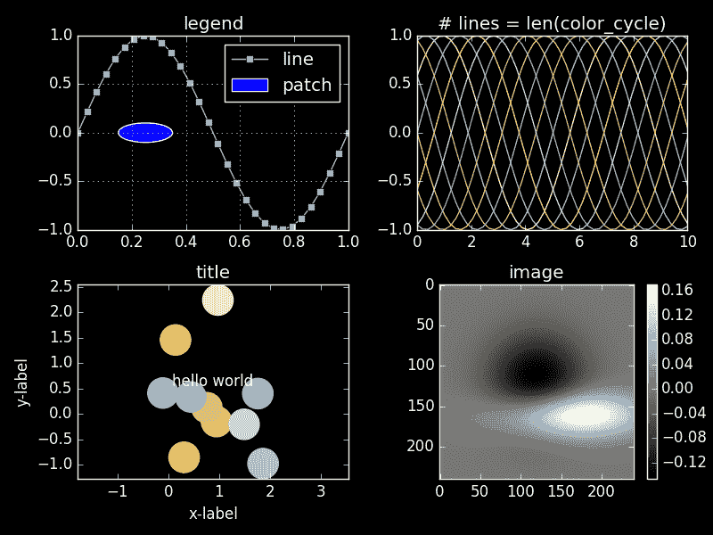
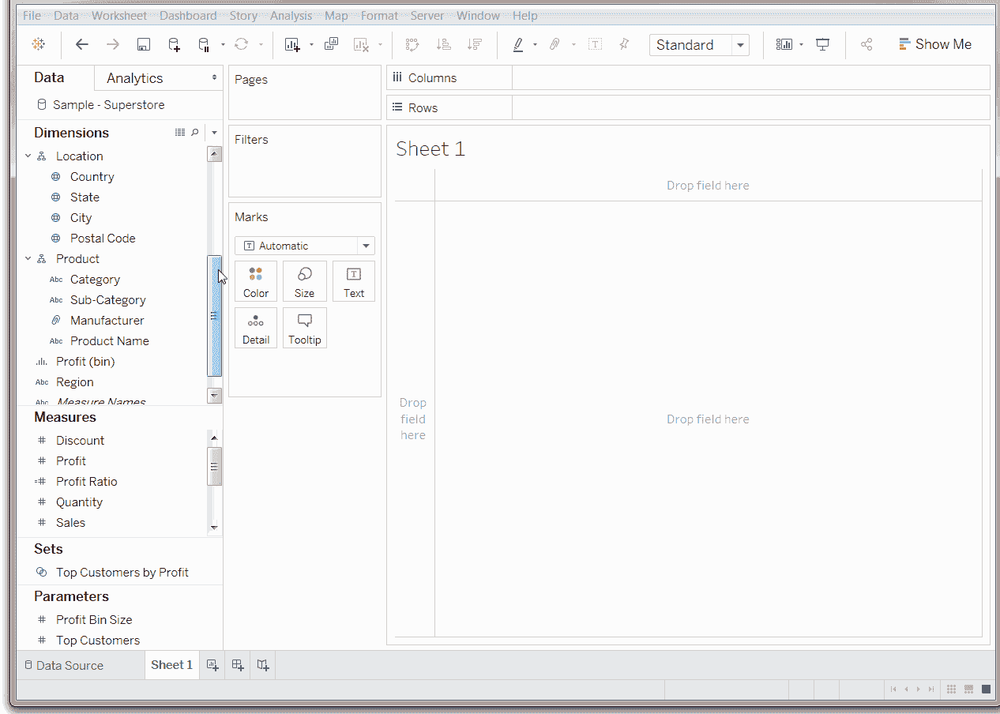
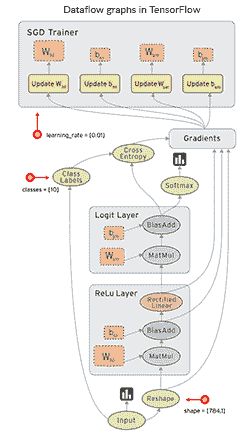
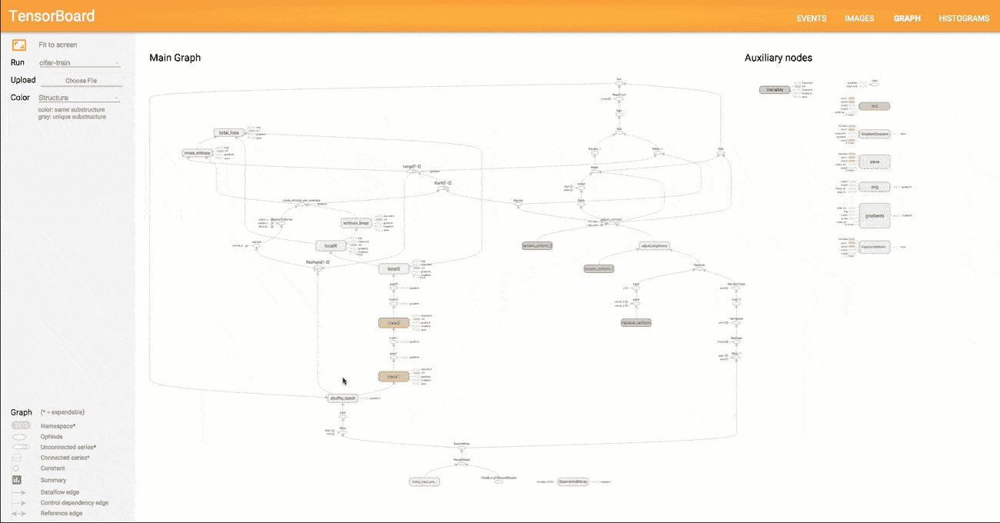

# 最佳机器学习语言、数据可视化工具、深度学习框架和大数据工具

> 原文：[`www.kdnuggets.com/2018/12/machine-learning-data-visualization-deep-learning-tools.html`](https://www.kdnuggets.com/2018/12/machine-learning-data-visualization-deep-learning-tools.html)

 评论

**由 [Altexsoft](https://www.altexsoft.com/)**。

*[原文](https://www.altexsoft.com/blog/datascience/the-best-machine-learning-tools-experts-top-picks/)。经许可转载。*

最训练有素的士兵不能空手完成任务。数据科学家有自己的武器——机器学习（ML）软件。已经有大量文章列出了可靠的机器学习工具，并深入描述了它们的功能。然而，我们的目标是获取行业专家的反馈。

这就是为什么我们采访了数据科学实践者——真正的专家——关于他们为*自己的*项目选择的有用工具。我们联系的专家有不同的专长，分别在 Facebook 和三星等公司工作。其中一些代表了 AI 初创公司（Objection Co、NEAR.AI 和 Respeecher）；一些在大学（哈尔科夫国立无线电电子大学）教授。AltexSoft 的数据科学团队也参与了讨论。

如果你在寻找特定类型的机器学习工具，只需跳到你感兴趣的领域：

[机器学习语言](https://www.altexsoft.com/blog/datascience/the-best-machine-learning-tools-experts-top-picks/#languages)

[数据分析和可视化工具](https://www.altexsoft.com/blog/datascience/the-best-machine-learning-tools-experts-top-picks/#analytics)

[通用机器学习框架](https://www.altexsoft.com/blog/datascience/the-best-machine-learning-tools-experts-top-picks/#general)

[神经网络建模框架](https://www.altexsoft.com/blog/datascience/the-best-machine-learning-tools-experts-top-picks/#neural)

[大数据工具](https://www.altexsoft.com/blog/datascience/the-best-machine-learning-tools-experts-top-picks/#big)

### 最受欢迎的机器学习语言

你在一家民族餐馆用餐，对文化不太熟悉。你可能会先询问服务员菜单上的词语是什么含义，甚至在了解你将使用什么餐具之前。所以，在讨论数据科学家最喜欢的工具之前，我们先来了解一下他们使用哪些编程语言。

#### Python：一种流行的语言，拥有高质量的机器学习和数据分析库。

Python 是一种通用语言，因其可读性、良好的结构和相对平缓的学习曲线而受到青睐，并继续获得越来越高的受欢迎度。根据 [Stack Overflow 年度开发者调查](https://insights.stackoverflow.com/survey/2018/) 的数据，Python 可以称得上是增长最快的主要编程语言。它排名第七，受欢迎程度为 38.8%，现已超过 C#（34.4%）。

Respeecher 的研究负责人 [Grant Reaber](https://www.linkedin.com/in/grant-reaber-7b9002126/)，专注于应用于语音识别的深度学习，将 Python 作为“*几乎所有人目前都将其用于深度学习。* [*Swift*](https://www.altexsoft.com/blog/engineering/the-good-and-the-bad-of-swift-programming-language/) *用于 TensorFlow 听起来是一个很酷的项目，但我们会等到它更加成熟再考虑使用它，*” Grant 总结道。

NEAR.AI 初创公司的联合创始人 [Illia Polosukhin](https://www.linkedin.com/in/illia-polosukhin-77b6538/) ，曾在 Google Research 负责 NLU 的深度学习团队，也继续使用 Python：“*Python 一直以来都是数据分析的语言，并且随着时间的推移，成为了深度学习的事实标准语言，所有现代库都是为其构建的。*”

Python 机器学习的一个应用场景是模型开发，特别是原型设计。

AltexSoft 的数据科学能力负责人 [Alexander Konduforov](https://www.linkedin.com/in/alexander-konduforov-3070494/) 说他主要将 Python 用作构建机器学习模型的语言。

[Vitaliy Bulygin](https://www.linkedin.com/in/vitaliy-bulygin-6aa31137/)，三星乌克兰的首席工程师，认为 Python 是快速原型设计的最佳语言之一。“*在原型设计过程中，我找到最佳解决方案并将其重写为项目所需的语言，例如 C++，*” 这位专家解释道。

Facebook AI 研究员 [Denis Yarats](https://www.linkedin.com/in/denisyarats/) 指出，这种语言有着惊人的深度学习工具集，如 PyTorch 框架或 NumPy 库（我们将在文章后面讨论）。

#### C++：一种用于 CUDA 上并行计算的中级语言

C++ 是一种灵活的、面向对象的、静态类型的语言，基于 C 编程语言。由于其可靠性、性能以及支持大量应用领域，该语言在开发者中仍然非常受欢迎。C++ 具有高级和低级语言的特点，因此被认为是一种中级编程语言。该语言的另一应用是开发能够在实时约束下直接与硬件交互的驱动程序和软件。由于 C++ 足够简洁以解释基本概念，因此也用于研究和教学。

数据科学家使用这种语言处理多种但具体的任务。 [Andrii Babii](https://www.linkedin.com/in/andrii-babii-26a27886/) 是哈尔科夫国立无线电电子大学（NURE）的高级讲师，他使用 C++ 在 [CUDA](https://developer.nvidia.com/about-cuda) 平台上并行实现算法，以加速基于这些算法的应用程序。

“*当我为 CUDA 编写自定义内核时，我需要 C++*，” Denis Yarats 补充道。

#### R：用于统计计算和图形的语言

R，作为一种统计、可视化和数据分析的语言和环境，是数据科学家的首选。它是 [S 编程语言](http://www.stats.ox.ac.uk/pub/MASS3/Sprog/) 的另一种实现。

R 及其编写的库提供了众多图形和统计技术，如经典统计测试、线性和非线性建模、[时间序列分析](https://www.altexsoft.com/blog/business/time-series-analysis-and-forecasting-novel-business-perspectives/)、分类、聚类等。你可以轻松地通过 R 机器学习包扩展语言。该语言允许创建高质量的图表，包括公式和数学符号。

Alexander Konduforov 指出，使用 R 进行机器学习能够快速进行数据分析和可视化。

### 数据分析和可视化工具

#### pandas：增强分析和建模的 Python 数据分析库

现在是时候稍微谈谈 Python 的 [pandas](https://pandas.pydata.org/)，一个名字非常可爱的免费库。数据科学爱好者 [Wes McKinney](https://github.com/wesm) 开发了这个库，以便在 Python 中方便地进行数据分析和建模。在 pandas 之前，这种编程语言 [仅适用于数据准备和处理](https://pandas.pydata.org/)。

pandas 通过将 CSV、JSON 和 TSV 数据文件或 SQL 数据库转换为数据框（一个看起来像 Excel 或 SPSS 表格的 Python 对象，具有行和列）来简化分析。更重要的是，pandas 与 [IPython](https://ipython.org/) 工具包和其他库结合，以提高性能并支持协作工作。

#### matplotlib：用于高质量可视化的 Python 机器学习库

[matplotlib](https://matplotlib.org/) 是一个 Python 2D 绘图库。绘图是机器学习数据的可视化。matplotlib 源自 MATLAB：其开发者 John D. Hunter 模拟了 Mathworks 的 MATLAB 软件中的绘图命令。

虽然主要用 Python 编写，但该库通过 *NumPy* 和其他代码进行了扩展，因此即使在处理大数组时也表现良好。

matplotlib 允许用几行代码生成生产质量的可视化。库的开发者 [强调](https://matplotlib.org/users/history.html) 了使用的简便性：“*如果你想看到数据的直方图，你不应该需要实例化对象、调用方法、设置属性等等，它应该直接工作*。”

**matplotlib 可视化演示。图像来源：[matplotlib Style Gallery](https://tonysyu.github.io/raw_content/matplotlib-style-gallery/gallery.html)**

该库的功能可以通过第三方可视化包扩展，如 [seaborn](https://seaborn.pydata.org/)、[ggplot](http://ggplot.yhathq.com/) 和 [HoloViews](http://holoviews.org/)。专家们还可以使用 [Basemap](http://matplotlib.org/basemap) 和 [cartopy](http://scitools.org.uk/cartopy/docs/latest) 投影和制图工具包添加额外功能。

数据科学从业者注意到 matplotlib 的灵活性和集成能力。例如，Andrii Babii 更倾向于将 matplotlib 与 seaborn 和 [ggplot2](https://www.rdocumentation.org/packages/ggplot2/versions/2.2.1) 一起使用。

Denis Yarats（Facebook AI Research）表示，他选择 matplotlib 主要是因为它很好地集成到 Python 工具集，并且可以与 NumPy 库或 PyTorch 机器学习框架一起使用。

Alexander Konduforov 和他的 AltexSoft 团队也使用 matplotlib。除了众多的 Python 机器学习库如 pandas，以及支持 R 和 Python 的 [Plotly](https://plot.ly/)，团队还选择 [dplyr](https://www.rdocumentation.org/packages/dplyr/versions/0.5.0)、[ggplot2](https://www.rdocumentation.org/packages/ggplot2/versions/2.2.1)*、* [tidyr](http://tidyr.tidyverse.org/) 和 [Shiny](https://shiny.rstudio.com/) R 库。*“这些工具是免费的，但你必须至少了解一些编程才能使用它们，有时还需要额外的时间。”*

#### Jupyter notebook：协作工作能力

[Jupyter Notebook](http://jupyter.org/) 是一款免费的互动计算网页应用程序。用户可以创建和共享包含实时代码的文档，开发和执行代码，以及展示和讨论任务结果。文档可以通过 Dropbox、电子邮件、GitHub 和 Jupyter Notebook Viewer 共享，并可以包含图形和叙述性文本。

Notebook 功能丰富，并提供多种使用场景。

它可以与许多工具集成，如 Apache Spark、pandas 和 TensorFlow。它支持 40 多种语言，包括 R、Scala、Python 和 Julia。除此之外，Jupyter Notebook 还支持容器平台——Docker 和 Kubernetes。

NEAR.AI 的 Illia Polosukhin 分享了他主要用于自定义临时分析的 Jupyter Notebook：“*这个应用程序允许快速进行任何数据或模型分析，并能够连接到远程服务器上的内核。你还可以与同事分享结果笔记本。*”

#### Tableau：强大的数据探索能力和互动可视化

[Tableau](https://www.tableau.com/) 是一款用于数据科学和商业智能的数据可视化工具。许多具体功能使这款软件在各种行业和数据环境中解决问题时非常高效。

通过数据探索和发现，Tableau 软件可以快速从数据中提取见解并以易于理解的格式展示出来。它不需要出色的编程技能，并且可以轻松安装在各种设备上。虽然需要编写少量脚本，但大多数操作都是通过拖放完成的。

**Tableau 拖放菜单的工作原理**

Tableau 支持实时分析和云集成（例如与 AWS、Salesforce 或 SAP），允许结合不同的数据集和集中数据管理。

易用性和一整套功能是数据科学家选择这个工具的原因。 *“Tableau 具有许多内置功能，不需要编码。你可以在 UI 中进行大量数据预处理、分析和可视化，这节省了大量精力。不过，由于它不是免费的产品，你需要购买许可证，”* Alexander Konduforov 说。

### 一般机器学习框架

#### NumPy：一个用于 Python 科学计算的扩展包

前面提到的 [NumPy](http://www.numpy.org/) 是一个用于 Python 数值计算的扩展包，它取代了 NumArray 和 Numeric。它支持多维数组（表格）和矩阵。机器学习数据以数组的形式表示，而矩阵是一个二维的数字数组。NumPy 包含广播功能，作为与 C/C++ 和 Fortran 代码集成的工具。它的功能还包括傅里叶变换、线性代数和随机数能力。

数据科学从业者可以使用 NumPy 作为存储多维通用数据的有效容器。通过定义任意数据类型的能力，NumPy 可以轻松快捷地与多种数据库集成。

#### scikit-learn：一个易于使用的机器学习框架，适用于众多行业

[scikit-learn](http://scikit-learn.org/stable/index.html) 是一个开源 Python 机器学习库，建立在 SciPy（科学 Python）、NumPy 和 matplotlib 之上。

scikit-learn 最初由 David Cournapeau 于 2007 年作为 Google Summer of Code 项目开始，目前由志愿者维护。截至今天，共有 1,092 人为其做出贡献。

该库设计用于生产使用。简单性、优质的代码、协作选项、性能以及用通俗语言编写的广泛文档都促进了它在各种专业人士中的受欢迎程度。

scikit-learn 为用户提供了许多成熟的监督学习和无监督学习算法。来自 Machine Learning Mastery 的数据科学从业者 Jason Brownlee [指出](https://machinelearningmastery.com/a-gentle-introduction-to-scikit-learn-a-python-machine-learning-library/)，该库专注于数据建模，而不是数据加载、处理和总结。他建议使用 NumPy 和 pandas 来处理这三项功能。

Denis Yarats 使用 NumPy、pandas 和 scikit-learn 进行一般机器学习：“*我喜欢它们的简洁和透明。这些工具被广泛采用，经过多年的使用，经过了许多人的考验，这也很好。*”

Aleksander 观察到：“AltexSoft 数据科学团队主要使用像 scikit-learn 和 [xgboost](https://github.com/dmlc/xgboost) 这样的 Python 库来进行分类和回归任务。”

Andrii Babii 更喜欢将 scikit-learn 与 [R 语言库和包](https://www.analyticsvidhya.com/blog/2015/08/list-r-packages-data-analysis/) 一起使用。“*我使用这个组合是因为它开源，功能丰富且互补*，”数据科学家解释道。

#### NLTK：基于 Python 的人类语言数据处理平台

[NLTK](https://www.nltk.org/) 是一个用于开发处理人类语言的 Python 程序的平台。

Aleksander Konduforov 更喜欢这个工具用于 NLP 任务。*“NLTK 是 Python 中处理文本的标准库，具有许多有用的功能。例如，不同类型的文本、句子和单词处理、词性标注、句子结构分析、命名实体识别、文本分类、情感分析等。所有这些库都是免费的，提供了足够的功能来解决我们大多数任务，”* 专家指出。

### 神经网络建模的 ML 框架

#### TensorFlow：大规模机器学习的灵活框架

[TensorFlow](https://www.tensorflow.org/) 是一个开源的软件库，用于机器学习和深度神经网络研究，由 Google AI 组织中的 Google Brain Team 开发并于 2015 年发布。

这个库的一个显著特点是，数值计算通过由节点和边组成的数据流图来完成。节点代表数学运算，而边是多维数据数组或 *张量*，这些操作在其上执行。

**TensorFlow 中操作间数据流的可视化**

TensorFlow 灵活，可以在各种计算平台（CPU、GPU 和 TPU）和设备上使用，从桌面到服务器集群，再到移动设备和边缘系统。它支持 Mac、Windows 和 Linux。

这个框架的另一个优势是，它既适用于研究，也适用于重复的机器学习任务。

TensorFlow 开发工具丰富，特别是对于 Android。三星乌克兰的首席工程师 Vitaliy Bulygin 建议：“*如果你需要在 Android 上实现某些功能，使用 TensorFlow*。”

[Curtis Boyd](https://www.linkedin.com/in/curtis-boyd-5908557b/)，[Objection Co](https://objection.co/) 的首席执行官，他的公司提供自动化差评移除策略，他表示他的团队选择使用 TensorFlow 进行机器学习，因为它是开源的且非常容易集成。

#### TensorBoard：一个用于模型训练可视化的好工具

[TensorBoard](https://www.tensorflow.org/programmers_guide/summaries_and_tensorboard) 是一个工具套件，用于图形化表示 TensorFlow 中机器学习的不同方面和阶段。

TensorBoard 读取 TensorFlow 事件文件，这些文件包含在 TensorFlow 运行时生成的总结数据（关于模型特定操作的观察）。

通过图示展示的模型结构可以让研究人员确保模型组件的位置和连接都正确。

**TensorBoard 中的模型图形表示**

使用图形可视化工具，用户可以探索模型抽象的不同层次，放大或缩小图示的任何部分。TensorBoard 可视化的另一个重要好处是，相同类型和相似结构的节点会用相同的颜色显示。用户还可以按设备（CPU、GPU 或两者的组合）查看颜色，使用“追踪输入”功能高亮特定节点，并一次性可视化一个或多个图表。

这种可视化方法使 TensorBoard 成为模型性能评估的热门工具，特别是对于深度神经网络等复杂结构的模型。

Grant Reaber 指出 TensorBoard 使得模型训练的监控变得简单。Grant 和他的团队也使用这个工具进行自定义可视化。

Illia Polosukhin 也选择了 TensorBoard。“*TensorBoard 在模型开发过程中显示指标，并允许做出有关模型的决策。例如，在调整超参数并选择表现最佳的参数时，监控模型性能非常方便*，”Illia 总结道。

除了显示性能指标外，TensorBoard 还可以展示许多其他信息，如直方图、音频、文本和图像数据、分布、嵌入和标量。

#### PyTorch：易于使用的研究工具

[PyTorch](https://pytorch.org/) 是一个开源机器学习框架，支持深度神经网络并加速 GPU。由 Facebook 团队与 Twitter、SalesForce、NRIA、ENS、ParisTech、Nvidia、Digital Reasoning 和 INRIA 的工程师们共同开发，首次发布于 2016 年 10 月。PyTorch 基于 Torch 框架，但与前身 Lua 编写的框架不同，它支持常用的 Python。

PyTorch 的开发理念是提供尽可能快速和灵活的建模体验。值得一提的是，PyTorch 的工作流程类似于[NumPy](http://www.numpy.org/)**，**这是一个基于 Python 的科学计算库。

动态计算图是使该库受欢迎的特性之一。在大多数框架如 TensorFlow、Theano、CNTK 和 Caffe 中，模型是以 *静态* 的方式构建的。数据科学家必须更改整个神经网络的结构 *——* 从头重建 *——* 才能改变其行为。PyTorch 使这一过程更简单、更快。该框架允许随意更改网络行为，而不会出现延迟或开销。

**Denis Yarats** 来自 Facebook AI Research 认为，构建模型 *动态*（在运行时）的能力是使用 PyTorch 的一个重要因素。“*我使用 PyTorch——它是最好的。我曾尝试过许多深度学习框架，包括 TensorFlow、Torch、Keras 和 Theano。没有一个比 PyTorch 更简单、更强大。由于我从事深度学习研究，我重视快速修改和调试模型的能力*。”

**伊利亚·波洛苏金**和**维塔利·布柳金**也强调了通过使用动态计算图实现的研究的便利性和灵活性，这也是他们选择 PyTorch 作为深度学习工具的原因。

#### Keras：轻量级、易于使用的快速原型设计库

[Keras](https://keras.io/) 是一个 Python 深度学习库，可以在 Theano、TensorFlow 或 CNTK 之上运行。Google Brain 团队成员**弗朗索瓦·肖莱**开发了它，以便数据科学家能够快速进行机器学习实验。

该库可以在 GPU 和 CPU 上运行，并支持递归网络和卷积网络及其组合。

利用该库的高级、易于理解的接口、将网络划分为易于创建和添加的独立模块的序列，可以实现快速原型设计。

数据科学家表示，建模速度是该库的一个优势。来自三星的**维塔利·布柳金**指出，Keras 与 TensorFlow 结合可以实现非常快速的神经网络实施。他建议，如果工具集足够完成特定任务，则应继续使用 Keras。如果不够，最好用 PyTorch 进行研究。

#### Caffe2：具有移动部署支持的深度学习库

[Caffe2](https://caffe2.ai/)，是 [Caffe](http://caffe.berkeleyvision.org/) 的改进版，是 Facebook 为简化和灵活处理复杂模型并支持移动部署而构建的开放机器学习框架。

用户可以通过多种方式组织计算，该库可以在桌面、云端或数据中心安装和运行。

该库具有本地 Python 和 C++ API，允许开发人员交替使用，便于快速原型设计和后期优化。

部署的模型可以通过与 Xcode、Visual Studio 和 Android Studio IDE 的集成，在移动设备上快速运行。该框架还允许快速扩展或缩减，无需重新设计。

快速原型设计、研究和开发是使用 Caffe2 的优势。**“我使用它是因为它有清晰的代码结构，并且容易扩展以研究新方法，”** NURE 的高级讲师 Andrii Babii 总结道。

### 大数据工具

#### Apache Spark: 分布式计算工具

使用 [Apache Spark](https://spark.apache.org/) 进行大数据处理就像驾驶一辆法拉利：它更快、更便捷，并且在相同时间内可以探索更多内容，相比普通汽车。

Apache Spark 是一个分布式开源集群计算框架，通常配备有内存数据处理引擎。该引擎的功能包括 ETL（提取、转换和加载）、机器学习、数据分析、批处理和数据流处理。

Apache Spark 的流处理能力是 Facebook AI 的研究员 Denis Yarats 使用它的原因之一：**“这个工具使用数据流/流处理概念进行分布式计算，并且允许将解决方案扩展到大型集群。”**

尽管主要使用 Scala 编写，但引擎提供了 Java、Python、Clojure 和 R 的高级开发者 API。

Apache Spark 的其他有益特性包括多种运行选项（本地、集群、云或本地部署）和从任何数据源访问数据的能力。

#### MemSQL: 一个为实时应用设计的数据库

[MemSQL](https://www.memsql.com/) 是用于实时分析的分布式内存 SQL 数据库平台。它处理和分析流数据，并执行 PB 级查询，以支持即时通讯、在线游戏或社区存储解决方案等实时应用。MemSQL 支持 [关系 SQL](http://docs.memsql.com/docs/sql-reference-overview)、[地理空间](http://docs.memsql.com/docs/geospatial-guide) 或 [JSON](http://docs.memsql.com/docs/json-guide) 数据的查询。

简而言之，该平台可以同时提供数据库、实时数据处理和数据仓库服务，帮助用户实现数据效率。

**“MemSQL 让你不必担心数据的大小，并且可以像使用普通 SQL 数据库一样操作，”** NEAR.AI 的 Illia Polosukhin 强调道。

### 结论

我们通过比较 [机器学习工具](https://www.altexsoft.com/blog/datascience/comparing-machine-learning-as-a-service-amazon-microsoft-azure-google-cloud-ai/) 和 [库](https://www.altexsoft.com/blog/datascience/choosing-an-open-source-machine-learning-framework-tensorflow-theano-torch-scikit-learn-caffe/)，明确了它们的使用场景和需求。在准备过程中，这对我们帮助很大。我们计划下个月写一篇关于 [航空公司如何使用人工智能解决方案](https://www.altexsoft.com/blog/datascience/7-ways-how-airlines-use-artificial-intelligence-and-data-science-to-improve-their-operations/) 的文章。如果你是一个活跃的机器学习从业者，请随时在评论区或直接联系我们，分享你偏好的工具。我们也乐意分享你的评论。

**简介**: [Altexsoft](https://www.altexsoft.com/) 是一家旅行与酒店科技咨询公司。他们与在线旅行社、旅行管理解决方案提供商以及旅行科技初创公司合作，开发定制软件。

**资源:**

+   [在线和基于网络的：分析、数据挖掘、数据科学、机器学习教育](https://www.kdnuggets.com/education/online.html)

+   [分析、数据科学、数据挖掘和机器学习软件](https://www.kdnuggets.com/software/index.html)

**相关:**

+   [初学者数据可视化与探索使用 Pandas](https://www.kdnuggets.com/2018/10/beginner-data-visualization-exploration-using-pandas-beginner.html)

+   [使用 Folium 进行 Python 地理空间数据可视化](https://www.kdnuggets.com/2018/09/visualising-geospatial-data-python-folium.html)

+   [数据可视化备忘单](https://www.kdnuggets.com/2018/08/data-visualization-cheatsheet.html)

* * *

## 我们的前三个课程推荐

 1\. [Google 网络安全证书](https://www.kdnuggets.com/google-cybersecurity) - 快速进入网络安全职业生涯。

 2\. [Google 数据分析专业证书](https://www.kdnuggets.com/google-data-analytics) - 提升你的数据分析水平

 3\. [Google IT 支持专业证书](https://www.kdnuggets.com/google-itsupport) - 支持你的组织的 IT。

* * *

### 更多相关话题

+   [停止学习数据科学，寻找目的，并找到目的…](https://www.kdnuggets.com/2021/12/stop-learning-data-science-find-purpose.html)

+   [学习数据科学统计学的顶级资源](https://www.kdnuggets.com/2021/12/springboard-top-resources-learn-data-science-statistics.html)

+   [成功数据科学家的五大特征](https://www.kdnuggets.com/2021/12/5-characteristics-successful-data-scientist.html)

+   [每个数据科学家都应了解的三个 R 语言库（即使你使用 Python）](https://www.kdnuggets.com/2021/12/three-r-libraries-every-data-scientist-know-even-python.html)

+   [一个 90 亿美元的人工智能失败案例分析](https://www.kdnuggets.com/2021/12/9b-ai-failure-examined.html)

+   [为什么 Python 是初创公司理想的编程语言](https://www.kdnuggets.com/2021/12/makes-python-ideal-programming-language-startups.html)
