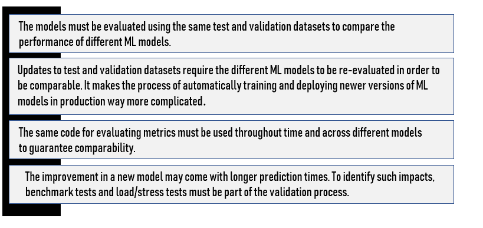
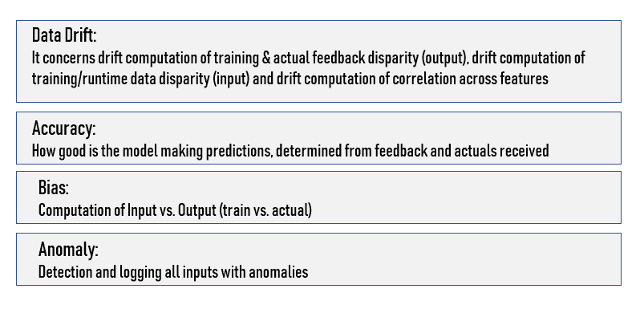

# 为什么机器学习部署很困难？

> 原文：[`www.kdnuggets.com/2019/10/machine-learning-deployment-hard.html`](https://www.kdnuggets.com/2019/10/machine-learning-deployment-hard.html)

评论

**作者 [亚历山大·贡法洛涅里](https://www.linkedin.com/in/agonfalonieri9/)，AI 顾问**。

经过几个 AI 项目，我意识到，在大规模部署机器学习（ML）模型是那些希望通过 AI 创造价值的公司面临的最重要挑战之一，随着模型变得越来越复杂，这一挑战也在不断增加。

根据我的顾问经验，只有极少数的机器学习项目能够投入生产。AI 项目可能因为很多原因失败，其中之一就是部署。每个决策者都需要完全理解部署的工作原理，以及在这一关键步骤中如何降低失败的风险。

> *一个已部署的模型可以定义为任何无缝集成到生产环境中的代码单元，能够接收输入并返回输出。*

我发现，为了将工作投入生产，数据科学家通常必须将其数据模型移交给工程团队进行实施。而在这个步骤中，一些最常见的数据科学问题出现了。

### 挑战

机器学习具有一些独特的特点，使得在大规模部署时更具挑战性。这些是我们正在处理的一些问题（**其他问题也存在**）：

***管理数据科学语言***

如你所知，机器学习应用通常由不同的**编程语言**编写的元素组成，这些元素之间并不总是能够良好互动。我多次看到过一个机器学习管道，从 R 开始，继续在 Python 中，然后在另一种语言中结束。

通常，Python 和 R 是目前最受欢迎的机器学习应用语言，但我注意到，由于速度等各种原因，生产模型很少使用这些语言。将 Python 或 R 模型移植到 C++ 或 Java 等生产语言中是复杂的，并且通常会导致原始模型的性能（速度、准确性等）下降。

R 包在软件新版本发布时可能会出错。此外，R 的速度较慢，无法高效处理大数据。

这是一个很好的原型设计语言，因为它允许轻松的互动和问题解决，但它需要被转换为 Python、C++ 或 Java 以用于生产。

容器化技术，如 Docker，可以解决由各种工具引入的不兼容性和可移植性问题。然而，自动依赖检查、错误检查、测试和构建工具无法跨越语言障碍解决问题。

可重现性也是一个挑战。确实，数据科学家可能会构建多个模型版本，每个版本使用不同的编程语言、库或相同库的不同版本。**手动跟踪这些依赖项非常困难。**为了解决这些挑战，需要一个 ML 生命周期工具，能够在训练阶段自动跟踪和记录这些依赖项，并将它们与训练后的模型一起打包成一个可以部署的工件。

我建议你依赖一个可以即时将代码从一种语言翻译成另一种语言的工具或平台，或者允许你的数据科学团队将模型部署到 API 后面，以便可以在任何地方集成。

***计算能力和 GPU***

神经网络通常非常深，这意味着训练和使用它们进行推断需要大量的计算能力。通常，我们希望我们的算法能为许多用户快速运行，这可能成为一个障碍。

此外，许多生产中的 ML 今天依赖于 GPU。然而，它们稀缺且昂贵，这容易为扩展 ML 任务增加另一层复杂性。

***可移植性***

模型部署的另一个有趣挑战是缺乏可移植性。我注意到这通常是遗留分析系统中的一个问题。由于缺乏将软件组件轻松迁移到另一个主机环境并在那里运行的能力，组织可能会被锁定在特定平台上。这可能为数据科学家在创建和部署模型时带来障碍。

***可扩展性***

可扩展性是许多 AI 项目中的一个真实问题。确实，你需要确保你的模型能够扩展并满足生产中性能和应用需求的增加。在项目开始时，我们通常依赖于相对静态的数据，规模也较易管理。随着模型进入生产阶段，它通常会暴露于更大体积的数据和数据传输模式。你的团队将需要多个工具来监控和解决随着时间推移而出现的性能和可扩展性挑战。

**我**相信，通过采用一致的、基于微服务的生产分析方法，可以解决可扩展性问题。团队应该能够通过简单的配置更改，快速将模型从批处理迁移到按需处理或流处理。类似地，团队应该有选项来扩展计算和内存的使用，以支持更复杂的工作负载。

***机器学习计算工作呈峰值状态***

一旦你的算法被训练完成，它们并不总是会被使用——你的用户只会在需要时调用它们。

这可能意味着你在早上 8:00 仅支持 100 次 API 调用，但在早上 8:30 支持 10,000 次。

**根据经验，我可以告诉你，扩展和缩减同时确保不为不需要的服务器付费是一个挑战。**

由于所有这些原因，只有少数数据科学项目最终会投入生产系统。

### 强化以实现操作化

我们总是花费大量时间使我们的模型准备就绪。增强模型的鲁棒性包括将原型准备好，以便它能够实际服务于所需的用户数量，这通常需要大量工作。

在许多情况下，整个模型需要用适合当前架构的语言重新编码。仅这一点就往往是大规模且痛苦的工作源，导致部署延迟数月。完成后，它必须集成到公司的 IT 架构中，并处理之前讨论的所有库问题。此外，访问生产中的数据通常是一项艰巨的任务，往往受到技术和/或组织数据孤岛的困扰。

### 更多挑战

在我的项目中，我还注意到以下问题：

+   如果我们改变了输入特征，那么其余特征的重要性、权重或使用方式可能会发生变化，也可能不会。机器学习系统必须设计得使特征工程和选择的变化能够轻松追踪。

+   当模型不断迭代和微调时，跟踪配置更新，同时保持配置的清晰性和灵活性，变成了额外的负担。

+   一些数据输入可能会随着时间变化。我们需要一种方法来理解和跟踪这些变化，以便能全面理解我们的系统。

+   机器学习应用中可能出现多种问题，这些问题不会被传统的单元/集成测试识别。部署错误版本的模型、遗漏特征以及在过时的数据集上训练只是一些例子。

### 测试与验证问题

正如你可能已经知道的那样，模型由于数据变化、新方法等而不断演变。因此，每次发生这样的变化时，我们必须重新验证模型性能。这些验证步骤带来了几个挑战：

除了离线测试中的模型验证外，评估生产中模型的性能非常重要。**通常，我们在部署策略和监控部分进行规划。**

> *机器学习模型需要比普通软件应用程序更频繁地更新。*

***自动化机器学习平台***

你们中的一些人可能听说过自动化机器学习平台。这可能是更快生成模型的好解决方案。此外，该平台可以支持多个模型的开发和比较，以便业务可以选择最符合其预测准确性、延迟和计算资源要求的模型。

> ***多达 90%的企业机器学习模型可以自动开发。数据科学家可以与业务人员合作，开发目前自动化无法达到的小部分模型。***

许多模型会经历漂移（性能随时间下降）。因此，已部署的模型需要被监控。每个已部署的模型应记录所有输入、输出和异常。模型部署平台需要提供日志存储和模型性能可视化功能。密切关注模型性能是有效管理机器学习模型生命周期的关键。

需要通过部署平台监控的关键要素。

### 发布策略

探索多种部署软件的方法（[这是一个很棒的长篇文章](https://medium.com/@copyconstruct/monitoring-in-the-time-of-cloud-native-c87c7a5bfa3e)），其中“影子模式”和“金丝雀”部署对于机器学习应用特别有用。在“影子模式”中，你可以捕捉新模型在生产环境中的输入和预测，而不实际提供这些预测。相反，你可以自由分析结果，如果发现错误，不会有重大后果。

随着架构的成熟，考虑启用渐进式或“金丝雀”发布。这种做法是将发布范围限制在少数客户中，而不是“全有或全无”。这需要更成熟的工具，但当发生错误时，它可以最小化影响。

### 结论

机器学习仍处于早期阶段。实际上，软件和硬件组件都在不断发展，以满足当前机器学习的需求。

Docker/Kubernetes 和微服务架构可以用来解决异质性和基础设施挑战。现有工具可以在某些方面大大解决问题。我相信，将所有这些工具结合起来实现机器学习的运作是今天面临的最大挑战。

部署机器学习是且将继续是一个困难的过程，这是组织必须面对的现实。不过，值得庆幸的是，一些新架构和产品正在帮助数据科学家。此外，随着越来越多的公司扩展数据科学操作，他们也在实施使模型部署更容易的工具。

[原文](https://towardsdatascience.com/why-is-machine-learning-deployment-hard-443af67493cd)。转载自许可。

**个人简介：**[亚历山大·贡法隆内里](https://twitter.com/AGonfalonieri)是一位人工智能顾问，并广泛撰写有关人工智能的文章。

**相关内容：**

+   [如何轻松使用 Flask 部署机器学习模型](https://www.kdnuggets.com/2019/10/easily-deploy-machine-learning-models-using-flask.html)

+   [生产环境中部署机器学习模型的不同方法概述](https://www.kdnuggets.com/2019/06/approaches-deploying-machine-learning-production.html)

+   [为什么组织在扩展人工智能和机器学习时失败](https://www.kdnuggets.com/2019/05/why-organizations-fail-scaling-ai-machine-learning.html)

* * *

## 我们的前三大课程推荐

 1\. [Google 网络安全证书](https://www.kdnuggets.com/google-cybersecurity) - 快速进入网络安全职业生涯

 2\. [Google 数据分析专业证书](https://www.kdnuggets.com/google-data-analytics) - 提升你的数据分析技能

 3\. [Google IT 支持专业证书](https://www.kdnuggets.com/google-itsupport) - 支持你的组织的 IT

* * *

### 更多相关话题

+   [停止学习数据科学以寻找目标，寻找目标以…](https://www.kdnuggets.com/2021/12/stop-learning-data-science-find-purpose.html)

+   [学习数据科学统计学的最佳资源](https://www.kdnuggets.com/2021/12/springboard-top-resources-learn-data-science-statistics.html)

+   [一个 90 亿美元的 AI 失败，剖析](https://www.kdnuggets.com/2021/12/9b-ai-failure-examined.html)

+   [成功的数据科学家的五大特征](https://www.kdnuggets.com/2021/12/5-characteristics-successful-data-scientist.html)

+   [是什么使 Python 成为初创公司的理想编程语言](https://www.kdnuggets.com/2021/12/makes-python-ideal-programming-language-startups.html)

+   [每个数据科学家都应该知道的三个 R 库（即使你使用 Python）](https://www.kdnuggets.com/2021/12/three-r-libraries-every-data-scientist-know-even-python.html)
