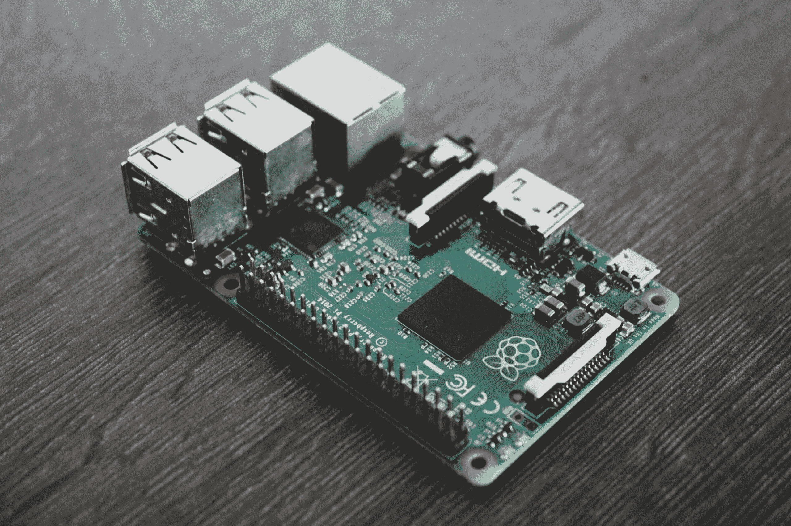

# 边缘上的机器学习

> 原文：[`www.kdnuggets.com/2022/10/machine-learning-edge.html`](https://www.kdnuggets.com/2022/10/machine-learning-edge.html)

照片由 [Alessandro Oliverio](https://www.pexels.com/photo/silver-and-green-circuit-board-1472443/) 提供

在过去的十年里，许多公司已经转向云端来存储、管理和处理数据。这似乎是一个更有前景的机器学习解决方案领域。通过在云端部署 ML 模型，你可以使用大量由第三方维护的强大服务器。你可以在最新的图形处理单元（GPUs）、张量处理单元（TPUs）和视觉处理单元（VPUs）上生成预测，而不必担心初始设置成本、可扩展性或硬件维护。此外，云解决方案提供了强大的服务器，这些服务器可以比本地服务器更快地进行推断（生成预测的过程）。

* * *

## 我们的前三个课程推荐

 1\. [谷歌网络安全证书](https://www.kdnuggets.com/google-cybersecurity) - 快速入门网络安全职业。

 2\. [谷歌数据分析专业证书](https://www.kdnuggets.com/google-data-analytics) - 提升你的数据分析技能

 3\. [谷歌 IT 支持专业证书](https://www.kdnuggets.com/google-itsupport) - 支持你组织的 IT

* * *

可能有人会认为在云端部署 ML 模型更便宜。毕竟，你不需要构建基础设施或维护所有内部系统。你只需为服务器使用的时间付费。然而，这种看法远非真实。云成本逐年上涨，大多数组织很难控制这些成本。Gartner 最近的报告预测，到 2022 年，终端用户在公共云服务上的支出将接近 5000 亿美元 [1]。

像 Netflix、Snapchat、Tik Tok 和 Pinterest 这样的巨大公司每年在云端账单上的支出已经达到数亿美元 [2, 3]。即便是小型和中型企业（SMBs），这笔费用也平均在一百万左右。机器学习工作负载需要大量计算，这在云端的成本很高。尽管云解决方案提供了管理 ML 应用程序的简便方法，但边缘 ML 最近也开始迅速发展。

来源：[Flexera 2022 年云计算现状报告](https://resources.flexera.com/web/pdf/Flexera-State-of-the-Cloud-Report-2022.pdf)

# 从云端 ML 到边缘 ML

为了控制运行成本，公司开始寻找将尽可能多的计算推送到终端用户设备上的方法。这意味着将机器学习模型放在消费者设备上，这些设备可以独立进行推断，无需互联网连接，实时进行，而且没有额外成本。例如，亚马逊的 Alexa 和 Echo 是一个语音控制的虚拟助手，使用机器学习为你执行各种任务。在 2020 年 9 月，亚马逊发布了 AZ1 Neural Edge 处理器，使 Alexa 能够在设备上进行推断，而不是与云端交互。通过将计算移到边缘设备，Echo 能够以两倍的速度运行，同时由于数据在本地处理，也提供了隐私保护[4]。

## 性能

你可以构建一个精确度最高的最先进的机器学习模型，但如果响应时间多了几毫秒，用户可能会离开。尽管将机器学习模型部署到云端可以访问高性能的硬件，但这并不一定意味着你的应用程序的延迟会减少。通过网络传输数据通常比用特殊硬件加速模型性能的开销要大。你可以将深度学习模型的性能提高几毫秒，但网络传输的数据可能需要几秒钟。

## 离线推断

云计算要求你的应用程序有稳定的互联网连接，以进行持续的数据传输。而边缘计算允许你的应用程序在没有互联网连接的情况下运行。这在网络连接不可靠但应用程序严重依赖计算的区域尤为有益。例如，一款心脏监测应用可能需要实时推断以预测患者心脏的健康状况。即使互联网连接中断，模型也应在边缘设备上生成推断。

## 数据隐私

边缘计算提供了数据隐私的好处。用户的个人数据在靠近用户的地方处理，而不是在公司数据中心积累。这也使得数据更不容易被网络拦截。事实上，对于许多使用场景来说，边缘计算是遵守隐私合规的唯一途径。智能手机制造商越来越多地将面部识别系统集成到用户的手机解锁功能中。用户不希望他们深度个人化的数据被转移或存储在云端。

## 成本

可能最吸引人转向边缘机器学习的理由是你不需要支付云端计算的重复成本。如果你的模型保留在用户的设备上，所有计算都由该设备承担。模型利用消费者设备的处理能力，而不是支付云端计算费用。

# 边缘机器学习的当前局限性

到目前为止，你已经看到边缘机器学习如何让你获得竞争优势。然而，当前机器学习基础设施的现状表明，还需要大量的工作来有效利用这种优势。最先进的深度学习模型 notoriously 大，而在边缘设备上部署这些模型是另一个挑战。边缘设备涵盖了从智能手机到嵌入式处理器和物联网设备等各种任意硬件。真正的挑战在于如何将机器学习模型编译以优化的方式在异构硬件平台上运行。这是一个不断增长的研究领域，公司正在投入数十亿美元以领先于机器学习硬件竞赛[5]。包括 NVIDIA、苹果和特斯拉在内的大公司已经在开发自己的 AI 芯片，以优化运行特定的机器学习模型。

## 参考资料

1.  “Gartner 预测 2022 年全球公共云终端用户支出将接近 5000 亿美元，”2022 年 4 月 19 日，Gartner，[`www.gartner.com/en/newsroom/press-releases/2022-04-19-gartner-forecasts-wordwide-public-cloud-end-user-spending-to-reach-nearly-500-billion-in-2022`](https://www.gartner.com/en/newsroom/press-releases/2022-04-19-gartner-forecasts-worldwide-public-cloud-end-user-spending-to-reach-nearly-500-billion-in-2022)

1.  马修·古丁（Matthew Gooding），“三分之一的云计算支出浪费掉了，”2022 年 3 月 21 日，Tech Monitor [`techmonitor.ai/technology/cloud/cloud-spending-wasted-oracle-computing-aws-azure`](https://techmonitor.ai/technology/cloud/cloud-spending-wasted-oracle-computing-aws-azure)

1.  阿米尔·埃夫拉提（Amir Efrati），凯文·麦克劳克林（Kevin McLaughlin），“随着 AWS 使用量的激增，公司对云账单感到惊讶，”2019 年 2 月 25 日，《信息报》（The Information）[`www.theinformation.com/articles/as-aws-use-soars-companies-surprised-by-cloud-bills`](https://www.theinformation.com/articles/as-aws-use-soars-companies-surprised-by-cloud-bills)

1.  拉里·迪根（Larry Dignan），“亚马逊的 Alexa 在 Echo 上获得了新大脑，通过人工智能变得更聪明并旨在营造氛围，”2020 年 9 月 25 日，ZDNet，[`www.zdnet.com/article/amazons-alexa-gets-a-new-brain-on-echo-becomes-smarter-via-ai-and-aims-for-ambience/`](https://www.zdnet.com/article/amazons-alexa-gets-a-new-brain-on-echo-becomes-smarter-via-ai-and-aims-for-ambience/)

1.  奇普·惠恩（Chip Huyen），“机器学习编译器和优化器的友好介绍，”2021 年 9 月 7 日，[`huyenchip.com/2021/09/07/a-friendly-introduction-to-machine-learning-compilers-and-optimizers.html`](https://huyenchip.com/2021/09/07/a-friendly-introduction-to-machine-learning-compilers-and-optimizers.html)

**[Najia Gul](https://www.linkedin.com/in/najiagul/)** 是 IBM 的数据科学家，专注于构建、建模、部署和维护机器学习模型。她还是数据和人工智能公司的开发者倡导者，帮助他们制作面向技术受众的内容。可以在[她的个人网站](https://najiagul.com/)找到她。

### 更多相关内容

+   [推出 TPU v4：谷歌为大型语言模型打造的尖端超级计算机](https://www.kdnuggets.com/2023/04/introducing-tpu-v4-googles-cutting-edge-supercomputer-large-language-models.html)

+   [最大化边缘 AI 应用中的性能](https://www.kdnuggets.com/maximize-performance-in-edge-ai-applications)

+   [Snapdragon 上的 Windows 将混合 AI 引入边缘应用](https://www.kdnuggets.com/qualcomm-windows-on-snapdragon-brings-hybrid-ai-to-apps-at-the-edge)

+   [边缘 AI 的承诺及有效采用的方法](https://www.kdnuggets.com/the-promise-of-edge-ai-and-approaches-for-effective-adoption)

+   [每个机器学习工程师都应该掌握的 5 项机器学习技能](https://www.kdnuggets.com/2023/03/5-machine-learning-skills-every-machine-learning-engineer-know-2023.html)

+   [KDnuggets 新闻，12 月 14 日：3 门免费的机器学习课程](https://www.kdnuggets.com/2022/n48.html)
