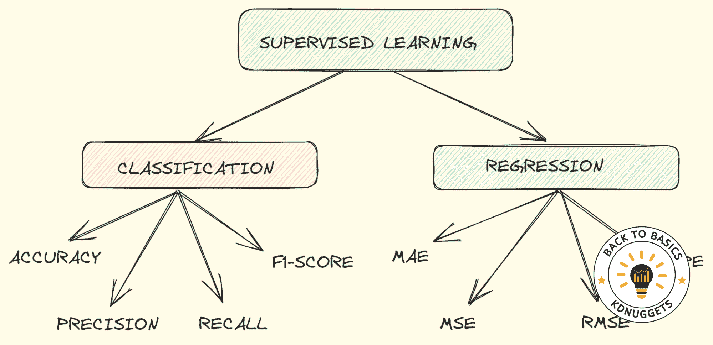
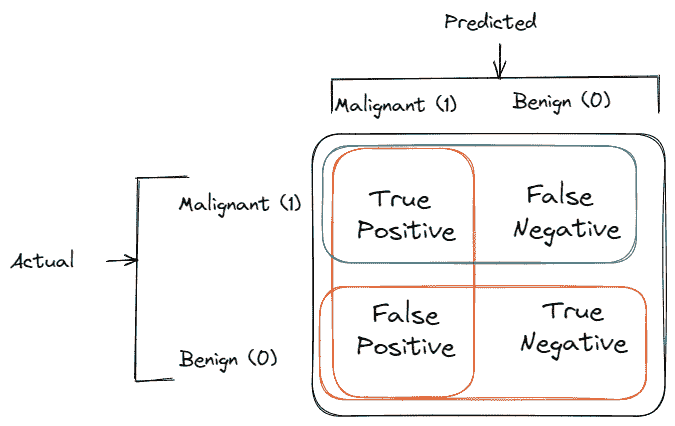
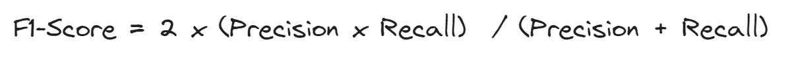
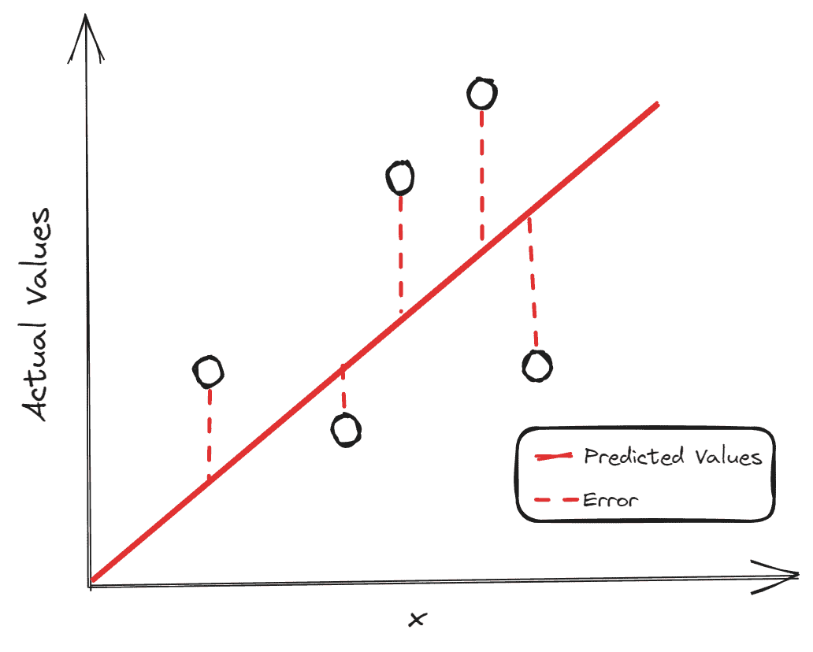

# 机器学习评估指标：理论与概述

> 原文：[`www.kdnuggets.com/machine-learning-evaluation-metrics-theory-and-overview`](https://www.kdnuggets.com/machine-learning-evaluation-metrics-theory-and-overview)

作者插图

构建一个在新数据上表现良好的机器学习模型是非常具有挑战性的。需要对其进行评估，以了解模型是否足够好，或者是否需要一些修改来提高性能。

* * *

## 我们的前三大课程推荐

 1\. [谷歌网络安全证书](https://www.kdnuggets.com/google-cybersecurity) - 快速进入网络安全职业生涯

 2\. [谷歌数据分析专业证书](https://www.kdnuggets.com/google-data-analytics) - 提升你的数据分析技能

 3\. [谷歌 IT 支持专业证书](https://www.kdnuggets.com/google-itsupport) - 支持您的组织的 IT 需求

* * *

如果模型没有从训练集中学习到足够的模式，它将在训练集和测试集上表现不佳。这就是所谓的欠拟合问题。

对训练数据的模式，包括噪声，过度学习会导致模型在训练集上表现非常好，但在测试集上表现不佳。这种情况称为过拟合。如果训练集和测试集上的表现相似，可以获得模型的泛化能力。

在本文中，我们将探讨分类和回归问题中最重要的评估指标，这些指标将帮助验证模型是否能够很好地捕捉训练样本中的模式，并在未知数据上表现良好。让我们开始吧！

# 分类

当我们的目标是分类时，我们就面对一个分类问题。最合适的指标选择取决于不同的方面，比如数据集的特征、是否不平衡以及分析的目标。

在展示评估指标之前，有一个重要的表格需要解释，叫做混淆矩阵，它很好地总结了分类模型的表现。

假设我们想训练一个模型来从超声图像中检测乳腺癌。我们只有两类：恶性和良性。

+   **真正例**：预测为恶性癌症的终末期病人数量

+   **真负例**：预测为良性癌症的健康人数量

+   **假正例**：预测为恶性癌症的健康人数量

+   **假负例**：预测为良性癌症的终末期病人数量

混淆矩阵示例。作者插图。

## 准确度

准确度是评估分类模型最著名和最受欢迎的指标之一。它是正确预测的分数除以样本数量。

当我们知道数据集是平衡的时，使用准确度。因此，输出变量的每个类别有相同数量的观察值。

使用准确度，我们可以回答问题：“模型是否正确预测了所有类别？”因此，我们有正类（恶性癌症）和负类（良性癌症）的正确预测。

## 精确度

与准确度不同，精确度是用于类别不平衡时的分类评估指标。

精确度回答以下问题：“恶性癌症识别的比例实际上是正确的吗？”它是通过真正阳性和正预测之间的比率计算的。

如果我们担心假阳性并希望将其最小化，我们会使用精确度。最好避免因恶性癌症的虚假信息而影响健康人的生活。

假阳性数量越少，精确度越高。

## 召回率

召回率与精确度一起，是应用于输出变量类别观察数量不同的另一种指标。召回率回答以下问题：“我能识别出多少比例的恶性癌症患者？”。

如果我们的关注点集中在假阴性上，我们就关心召回率。假阴性指的是患者实际患有恶性癌症，但我们未能识别出来。然后，应该监控召回率和精确度，以在未知数据上获得理想的表现。

## F1-分数

同时监控精确度和召回率可能会很麻烦，因此最好有一个可以总结这两个指标的度量。这可以通过 F1-分数来实现，F1-分数定义为精确度和召回率的调和平均数。

高 F1-分数是因为精确度和召回率都具有高值。如果召回率或精确度值较低，F1-分数将受到惩罚，结果也会较低。

# 回归

作者插图

当输出变量是数值时，我们处理的是回归问题。与分类问题一样，根据分析的目的选择评估回归模型的指标至关重要。

回归问题最常见的例子是房价预测。我们是否关注准确预测房价？还是只关心最小化总体误差？

在所有这些指标中，构建块是残差，即预测值与实际值之间的差异。

## MAE

*均绝对误差计算的是平均绝对残差。*

它没有像其他评估指标那样对高误差进行惩罚。每个误差都被同等对待，即使是异常值的误差，所以这个指标对异常值具有鲁棒性。此外，差异的绝对值忽略了误差的方向。

## MSE

*均方误差计算的是平均平方残差。*

*由于预测值与实际值之间的差异被平方，它对较大的误差赋予了更多的权重，*

*因此，当大的误差不可接受时，它可能比最小化总体误差更有用。*

## RMSE

*均方根误差计算的是* ***平方根*** *的平均平方残差。*

当你理解了 MSE 后，稍作停留即可掌握均方根误差，它只是 MSE 的平方根。

RMSE 的优点在于它更容易解释，因为该指标的尺度与目标变量的尺度一致。除了形状外，它与 MSE 非常相似：它总是对较大的差异赋予更多的权重。

## MAPE

*均绝对百分比误差计算的是预测值与实际值之间的平均绝对百分比差异。*

像 MAE 一样，它忽略了误差的方向，理想的最佳值是 0。

例如，如果我们在预测房价时得到一个 MAPE 值为 0.3，这意味着平均而言，预测值低于实际值 30%。

# 结束语

我希望你喜欢这次评估指标的概述。我只涵盖了评估分类和回归模型性能的最重要的度量标准。如果你发现了其他对解决问题非常有帮助但没有在此提及的关键指标，请在评论中告诉我。

**[尤金尼亚·安内洛](https://www.linkedin.com/in/eugenia-anello/)** 目前是意大利帕多瓦大学信息工程系的研究员。她的研究项目集中在持续学习与异常检测的结合上。

### 更多相关主题

+   [更多分类问题的性能评估指标…](https://www.kdnuggets.com/2020/04/performance-evaluation-metrics-classification.html)

+   [理解监督学习：理论与概述](https://www.kdnuggets.com/understanding-supervised-learning-theory-and-overview)

+   [数据科学中的统计学：理论与概述](https://www.kdnuggets.com/statistics-in-data-science-theory-and-overview)

+   [数据可视化：理论与技术](https://www.kdnuggets.com/data-visualization-theory-and-techniques)

+   [从理论到实践：构建一个 k-最近邻分类器](https://www.kdnuggets.com/2023/06/theory-practice-building-knearest-neighbors-classifier.html)

+   [如何利用图论进行足球侦察](https://www.kdnuggets.com/2022/11/graph-theory-scout-soccer.html)
