# 机器学习实验跟踪

> 原文：[`www.kdnuggets.com/2020/06/machine-learning-experiment-tracking.html`](https://www.kdnuggets.com/2020/06/machine-learning-experiment-tracking.html)

评论

**由 [Lukas Biewald](https://twitter.com/l2k)，Weights and Biases 的创始人/首席执行官**。

初看，构建和部署机器学习模型看起来很像编写代码。但有一些关键的区别使得机器学习更具挑战性：

1.  机器学习项目有比典型软件项目更多的分支和实验。

1.  机器学习代码通常不会抛出错误，只会表现不佳，使得调试变得格外困难和耗时。

1.  训练数据、训练代码或超参数中的一个小变化可能会极大地改变模型的性能，因此重现早期工作通常需要完全匹配之前的设置。

1.  运行机器学习实验可能非常耗时，仅计算成本也可能变得昂贵。

以有组织的方式跟踪实验有助于解决这些核心问题。Weights and Biases（wandb）是一个简单的工具，帮助个人跟踪他们的实验——我与几位不同规模团队的机器学习领导者讨论了他们如何使用 wandb 来跟踪实验。

### **开始使用 wandb 进行实验跟踪**

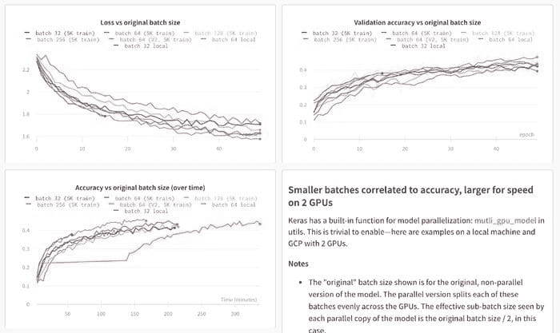

查看 [实时仪表板](https://app.wandb.ai/stacey/estuary/reports/Distributed-Training--Vmlldzo1MjEw)

在 ML 项目中，进展的基本单元是实验，因此大多数人会以某种方式跟踪他们的工作——通常我看到从业者开始使用电子表格或文本文件来记录他们的工作。

电子表格和文档非常灵活——这种方法有什么问题？

这是我几年前用于一个项目的 Google 文档：

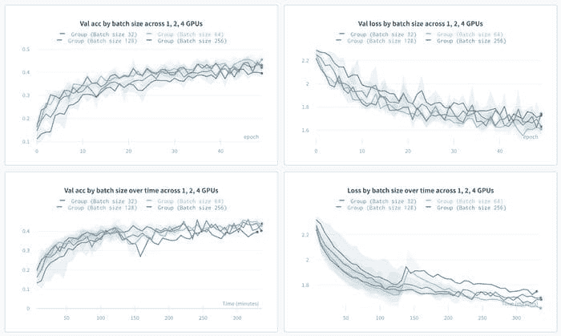

我确定这些笔记在当时很重要，但现在我不知道这些笔记的含义。

Weights and Biases 使得自动记录所有超参数（输入）和指标（输出）变得非常简单。

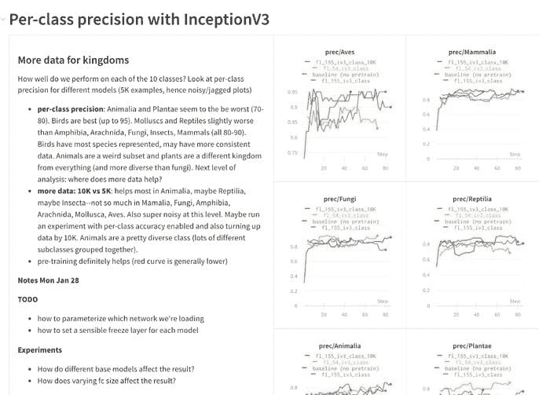

在 [wandb](http://app.wandb.ai/l2k2/l2k) 中的一个典型项目。

这就是你如何在 [pytorch 中设置 wandb](https://docs.wandb.com/library/frameworks/pytorch)（你可以在 [文档](https://docs.wandb.com/library/frameworks) 中找到其他常见的 ML 框架）。

```py
**import wandb****wandb.init(config=args)** # track hyperparameters
**wandb.watch(model)** # track model metricsmodel.train()
for batch_idx, (data, target) in enumerate(train_loader):
  output = model(data)
  loss = F.nll_loss(output, target)
  loss.backward()
  optimizer.step()  **wandb.log({“loss”: loss})** # track a specific metric
```

一旦设置完成，Weights and Biases 默认会监控很多内容。任何命令行参数都会变成保存的超参数。任何由 pytorch 提供的值都会成为一个指标。实验可以自动链接到最新的 git 提交或训练代码的确切状态。被动收集信息真的很重要，因为几乎不可能始终如一地记录你可能关心的所有事项。

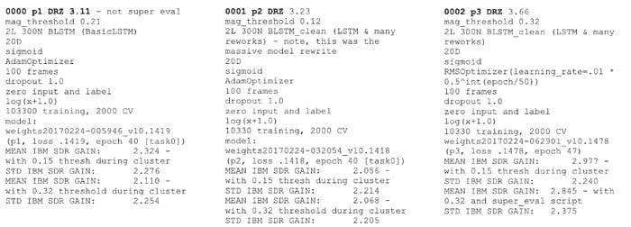

[实验概述](https://app.wandb.ai/l2k2/l2k/runs/nv641wyz/overview) 在 Weights & Biases 中

记录关于你构建的模型的定性笔记也极为重要，以便以后参考。在 Weights and Biases 中，你可以创建报告来跟踪笔记和模型指标，并与团队分享你的发现和进展。

**在后台收集系统指标**是一个很好的例子。Wandb 在后台收集系统使用指标——例如 GPU 内存分配、网络流量和磁盘使用情况。大多数时候你不需要查看所有这些信息，但当你不再使用大部分 GPU 内存并且很难追踪到这个变化时，情况会变得复杂。如果你 [用 wandb 监控你的训练代码](https://docs.wandb.com/quickstart) 一次，你将能够回顾所有实验并查看使用情况的变化。

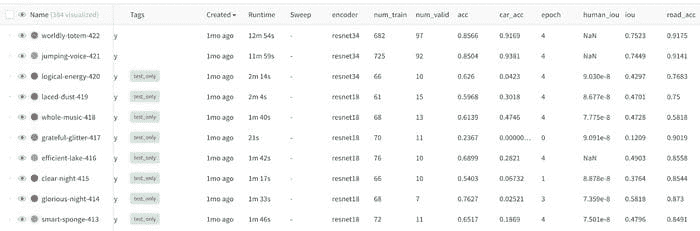

在 [实时仪表盘](https://app.wandb.ai/l2k2/examples-prod_monitor)查看

### **使用实验跟踪来比较实验结果**

典型的机器学习工作流程涉及运行大量实验。我们发现，将结果 [放在其他结果的背景下](https://app.wandb.ai/sweep/simpsons)查看，比单独查看某个实验要有意义得多。

同时查看大量实验会迅速变得混乱。有很多输入变化和不同的可能输出。一些运行不可避免地会提前失败。

不同的实验风格会导致不同的工作流程，但我们发现，记录你可能关注的每一个指标，并用几个对你有意义的标签标记实验，可以使后续工作更加有序。

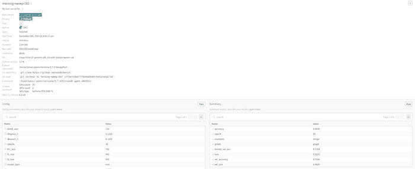

在 [实时仪表盘](https://app.wandb.ai/stacey/estuary/table)查看。

一旦你记录了大量模型，你就有了更多的维度可以检查，而这些维度无法一眼看完。我们发现的一个强大的可视化工具是平行坐标图。

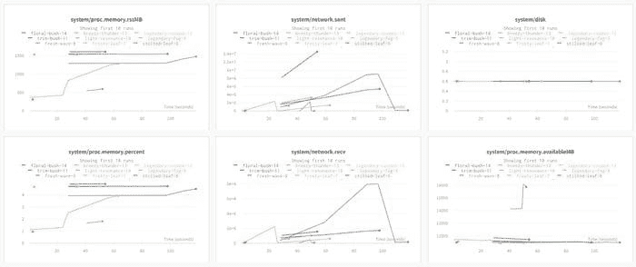

在 [实时仪表盘](https://app.wandb.ai/sweep/simpsons)查看

在这里，每一行是一个独立的实验，每一列是一个输入超参数或输出指标。我已经突出了准确率最高的运行，结果很清楚地显示，在我选择的所有实验中，高准确率来自低 dropout 值。

跨实验查看如此重要，以至于 wandb 允许你构建工作区，你可以选择图形分组进行可视化，如散点图，然后立即查看所选运行的比较。

### **查看具体示例**

聚合指标很重要，但查看具体的示例也至关重要。函数 [wandb.log()](https://docs.wandb.com/library/log) 可以处理各种数据类型并自动可视化它们。

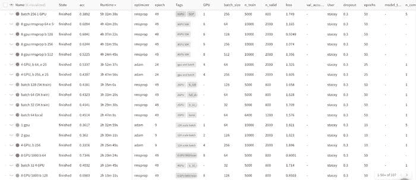

查看 [实时报告](https://app.wandb.ai/stacey/deep-drive/reports/The-View-from-the-Driver's-Seat--Vmlldzo1MTg5NQ)

### **记录图像**

[记录图像](https://docs.wandb.com/library/log#logging-images) 对于许多应用非常重要，并且可以跨多个运行查看图像。这些是构建 GAN 的不同方法及其在各种尺度和时间步长下的结果。


### **记录 Matplotlib 图表**

通常代码已经在 matplotlib 中跟踪了内容——如果你 [记录图表](https://docs.wandb.com/library/log#logging-plots)，它将被永久保存，并且容易检索。实际上，你可以为训练代码的每个步骤记录一个独特的图表。

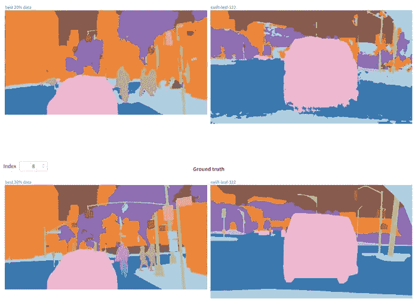

### **使用实验跟踪来管理分布式训练**

在进行 [分布式训练](https://app.wandb.ai/stacey/estuary/reports/Distributed-Training--Vmlldzo1MjEw) 时，甚至只是可视化结果也变得更加困难。

在多台机器上的分布式运行中，每个实例都可以调用 wandb init 并像这样设置 group 和 job_type：

```py
wandb.init(group=”first-run”, job_type=”train”)
```

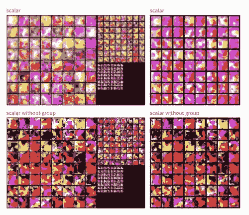

查看 [实时仪表盘](https://app.wandb.ai/stacey/estuary/reports/Distributed-Training--Vmlldzo1MjEw)

Wandb 会显示组内所有运行的指标汇总，但也可以进入并查看单个过程，了解它们的表现如何。

### **使用实验跟踪报告来管理团队协作**

随着团队的发展，跟踪一切变得越来越重要。Wandb 允许你构建 [静态报告](https://app.wandb.ai/stacey/deep-drive/reports/The-View-from-the-Driver's-Seat--Vmlldzo1MTg5NQ)，准确展示你运行的实验、汇总统计数据以及深入挖掘的能力。

在 OpenAI 机器人团队中，wandb 报告是机器学习从业人员记录他们所做工作的地方，并与同事分享。这对于可视化何时更改可能会无意中阻碍进展至关重要。

在 Latent Space，每个团队项目会议都以审查最新的 wandb 实验报告开始，并讨论当前方法的有效性以及下一步应尝试的实验。

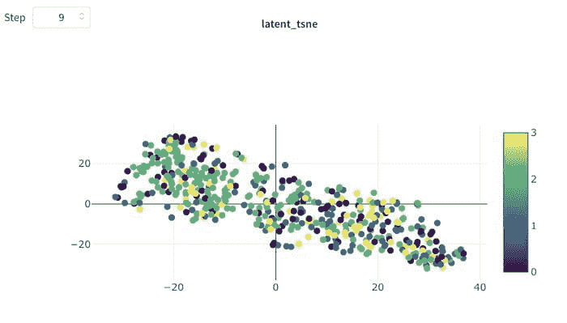

查看 [实时报告](https://app.wandb.ai/stacey/curr_learn/reports/Layout%3A-Classify-Species--Vmlldzo0MDQ2NA)

### **使用实验跟踪作为模型的记录系统**

随着团队的扩展和模型的投入生产，记录发生的一切变得越来越重要。在丰田研究所，wandb 实验链接被用作每个构建的机器学习模型的官方记录。如果模型构建后发生了问题，他们可以追溯到 wandb 训练运行。通过一组实验生成报告意味着有一个永久记录工作的文档，团队可以轻松地回顾发生了什么。

**简介：[Lukas Biewald](https://twitter.com/l2k)** 是 Weights & Biases 的创始人，之前是 Figure Eight（前身为 CrowdFlower）的创始人。

[原文](https://towardsdatascience.com/machine-learning-experiment-tracking-93b796e501b0)。经许可转载。

**相关内容：**

+   为什么机器学习项目如此难以管理？

+   互动式机器学习实验

+   机器学习中的模型评估指标

* * *

## 我们的三大课程推荐

 1\. [Google 网络安全证书](https://www.kdnuggets.com/google-cybersecurity) - 快速进入网络安全职业生涯

 2\. [Google 数据分析专业证书](https://www.kdnuggets.com/google-data-analytics) - 提升你的数据分析技能

 3\. [Google IT 支持专业证书](https://www.kdnuggets.com/google-itsupport) - 支持你的组织中的 IT 事务

* * *

### 更多相关话题

+   [机器学习实验跟踪的 7 个最佳工具](https://www.kdnuggets.com/2023/02/7-best-tools-machine-learning-experiment-tracking.html)

+   [版本控制机器学习实验与跟踪它们](https://www.kdnuggets.com/2021/12/versioning-machine-learning-experiments-tracking.html)

+   [开发分析跟踪的开放标准](https://www.kdnuggets.com/2022/07/developing-open-standard-analytics-tracking.html)

+   [数据科学中实验设计的重要性](https://www.kdnuggets.com/2022/08/importance-experiment-design-data-science.html)

+   [每个机器学习工程师都应该具备的 5 项机器学习技能……](https://www.kdnuggets.com/2023/03/5-machine-learning-skills-every-machine-learning-engineer-know-2023.html)

+   [KDnuggets 新闻，12 月 14 日：3 个免费的机器学习课程……](https://www.kdnuggets.com/2022/n48.html)
