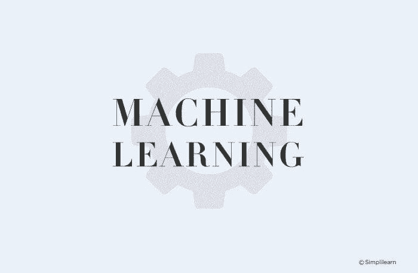

# 机器学习可解释性与可理解性：两个概念可能有助于恢复对 AI 的信任

> 原文：[`www.kdnuggets.com/2018/12/machine-learning-explainability-interpretability-ai.html`](https://www.kdnuggets.com/2018/12/machine-learning-explainability-interpretability-ai.html)

评论

**由 [Richard Gall](https://www.linkedin.com/in/richard-gall-5a6a235a/?originalSubdomain=uk)，Packt**

不需要数据科学家来发现，内置于自动化和人工智能系统中的机器和深度学习算法缺乏透明性。也不需要太多侦探工作就能看到，这些系统中包含了开发这些系统的工程师无意识偏见的印记。

* * *

## 我们的前三大课程推荐

 1\. [Google 网络安全证书](https://www.kdnuggets.com/google-cybersecurity) - 快速进入网络安全职业生涯。

 2\. [Google 数据分析专业证书](https://www.kdnuggets.com/google-data-analytics) - 提升你的数据分析技能

 3\. [Google IT 支持专业证书](https://www.kdnuggets.com/google-itsupport) - 支持你的组织的 IT

* * *

可以说，在《经济学人》所称的[*技术反弹*](https://www.economist.com/international/2017/08/10/internet-firms-face-a-global-techlash)的背景下，这种不透明性（具有讽刺意味地）变得更加明显。尽管许多导致技术反弹的事件既是公司自身利益与令人担忧的治理和问责缺失的混合问题，但不可否认的是，数据科学和机器学习工程的实践自然地与今年最大的一些商业和政治故事紧密相关。

在这种背景下，可解释性和可理解性的概念[变得更加紧迫](https://hub.packtpub.com/improve-interpretability-machine-learning-systems/)。由于对人工智能伦理的讨论持续进行，它们在 2019 年可能会变得更加重要。

但是，什么是可解释性和可理解性？它们对我们这些从事数据挖掘、分析、科学的人在 2019 年究竟意味着什么？

### 机器学习可解释性与可理解性之间的区别

在机器学习和人工智能的背景下，可解释性和可理解性通常被交替使用。虽然它们非常密切相关，但值得探讨它们之间的区别，至少可以看到深入了解机器学习系统后事情可能会变得多么复杂。

可解释性是指在系统中观察因果关系的程度。换句话说，就是在输入或算法参数发生变化时，你能够*预测*会发生什么的程度。它就是能够看着一个算法，*嗯，我可以看到这里发生了什么。*

同时，可解释性是指机器或深度学习系统的内部机制可以用人类术语解释的程度。理解这个细微的差别可能很困难，但可以这样考虑：可解释性是能够辨别机制而不一定知道原因。可解释性则是能够字面上解释发生了什么。

可以这样理解：假设你在学校做科学实验。实验可能在你看到自己在做什么时是可以解释的，但只有当你深入了解你所看到的化学反应时，它才真正具备可解释性。

这可能有点粗略，但它仍然是思考这两个概念之间关系的一个很好的起点。

### 为什么在人工智能和机器学习中，可解释性和可理解性如此重要？

如果 2018 年的技术反弹教会了我们什么，那就是尽管技术确实可以被用于可疑的用途，但它也有很多方式可能产生不良 - 歧视性 - 结果，而这些结果并非有意造成伤害。

随着医疗保健等领域希望部署人工智能和深度学习系统，其中问责制和透明度的问题尤其重要，如果我们无法在算法中妥善提升可解释性，最终实现可解释性，我们将严重限制人工智能的潜在影响。这将是非常可惜的。

除了需要考虑的法律和专业问题外，还有一个论点认为，在更平凡的商业场景中，提高可解释性和可理解性同样重要。了解算法的实际工作方式可以帮助更好地将数据科学家和分析师的活动与[他们组织的关键问题和需求](https://hub.packtpub.com/ux-designers-can-teach-machine-learning-engineers-start-model-interpretability/)对齐。

### 提高机器学习可解释性的方法和技巧

尽管透明性和伦理的问题对实际工作中的数据科学家来说可能显得抽象，但实际上有许多实用的方法可以用来提高算法的可解释性和可理解性。

#### 算法的泛化

第一点是提高泛化能力。这听起来简单，但实际上并不容易。当你认为大多数机器学习工程是在以非常具体的方式应用算法以揭示某个期望结果时，模型本身可能会显得是一个次要元素——它只是实现目标的手段。然而，通过转变这种态度，考虑算法的整体健康状况及其运行的数据，你可以开始为改善可解释性奠定坚实的基础。

#### 注意特征的重要性

这应该是显而易见的，但很容易被忽视。仔细查看算法中各种特征的设置方式，是实际解决从业务对齐到伦理等各种问题的有效方法。对每个特征如何设置进行辩论和讨论可能会有些耗时，但尽管如此，意识到不同特征以某种方式被设置仍然是朝着可解释性和透明性迈出的重要一步。

#### LIME：局部可解释模型无关解释

虽然上述技术提供了数据科学家可以采取的实际步骤，但 LIME 是由研究人员开发的一种实际方法，用于获得对算法内部发生的事情的更大透明度。研究人员解释说，LIME 可以以“可解释且忠实的方式解释任何分类器的预测，通过在预测周围局部学习一个可解释的模型”。

实际上，这意味着 LIME 模型通过测试来开发模型的近似值，以查看当模型中的某些方面发生变化时会发生什么。本质上，这就是通过实验过程尝试从相同的输入重现输出。

#### DeepLIFT（深度学习重要特征）

DeepLIFT 是一个在深度学习领域特别棘手的情况中非常有用的模型。它通过一种反向传播形式工作：它获取输出，然后尝试通过“读取”形成该原始输出的各种神经元来分解它。

实质上，这是一种深入挖掘算法内部特征选择的方法（正如名称所示）。

#### 层级相关传播

层级相关传播类似于 DeepLIFT，它从输出向后工作，识别神经网络中的最相关神经元，直到你回到输入（例如，一张图片）。如果你想了解更多关于这一概念背后的数学知识，[Dan Shiebler 的这篇文章是一个很好的起点](http://danshiebler.com/2017-04-16-deep-taylor-lrp/)。

### 增加复杂性以应对复杂性：这能提高透明度吗？

可解释性和透明性的核心问题在于，你在开发过程中增加了一个额外的步骤。实际上，你可能还添加了多个步骤。从某种角度看，这就像是试图用更大的复杂性来应对复杂性。

在某种程度上，这确实是对的。实际上，这意味着如果我们要真正认真对待解释性和可解释性，就需要在数据科学和工程的方式，以及人们*相信*它应该如何进行的文化上，进行更广泛的变革。

这或许才是最具挑战性的部分。

**个人简介**： [理查德·加尔](https://www.linkedin.com/in/richard-gall-5a6a235a/?originalSubdomain=uk) 是 Packt 的编辑内容产品经理。通过优质的信息传递，专注于 Packt 帮助的社区和客户的需求，理查德致力于推动直接和入站收入的增长，并提高 Packt 品牌在当今技术领域的影响力和相关性。

**资源：**

+   [在线和基于网络：分析、数据挖掘、数据科学、机器学习教育](https://www.kdnuggets.com/education/online.html)

+   [分析、数据科学、数据挖掘和机器学习的软件](https://www.kdnuggets.com/software/index.html)

**相关：**

+   [解释 AI 和机器学习的四种方法](https://www.kdnuggets.com/2018/12/four-approaches-ai-machine-learning.html)

+   [解释性对信任 AI 和机器学习至关重要](https://www.kdnuggets.com/2018/11/interpretability-trust-ai-machine-learning.html)

+   [使用不确定性来解释你的模型](https://www.kdnuggets.com/2018/11/using-uncertainty-interpret-model.html)

### 更多相关话题

+   [关于可信赖的图神经网络的全面调查：…](https://www.kdnuggets.com/2022/05/comprehensive-survey-trustworthy-graph-neural-networks-privacy-robustness-fairness-explainability.html)

+   [机器学习模型解释性如何加速 AI 采用过程](https://www.kdnuggets.com/2022/07/ml-model-explainability-accelerates-ai-adoption-journey-financial-services.html)

+   [你不知道的低代码工具的 7 种用途](https://www.kdnuggets.com/2022/09/7-things-didnt-know-could-low-code-tool.html)

+   [可能影响数据分析准确性的 3 个错误](https://www.kdnuggets.com/2023/03/3-mistakes-could-affecting-accuracy-data-analytics.html)

+   [使用 SHAP 值进行机器学习模型解释性分析](https://www.kdnuggets.com/2023/08/shap-values-model-interpretability-machine-learning.html)

+   [使用 Python 和 Scikit-learn 简化决策树解释性](https://www.kdnuggets.com/2017/05/simplifying-decision-tree-interpretation-decision-rules-python.html)
